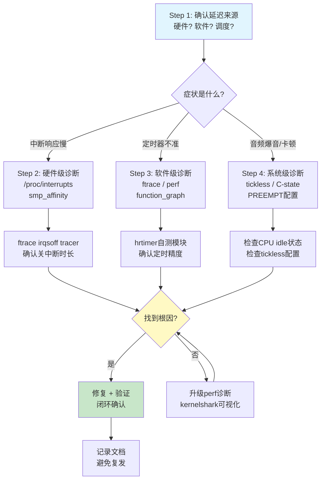

# 10.7.1 综合实战：从GPIO延迟到音频爆音

> 所属章节：第10章 中断与时间 > 10.7 综合实战
>
> 难度：[E][M] | 预计阅读时间：35分钟

## <span class="blue"> 本节导读

前面十几个小时，你已经啃完了中断子系统和时间子系统的底层原理。寄存器配置、顶半部底半部、hrtimer、tickless……这些知识在脑子里转来转去。但你有没有过这种感觉——看书的时候觉得都懂了，真到产线出了问题，手还是不知道该往哪儿放？<br>

这一节就来打破这种状态。我带你看两个完整的实战排查流程：一个是工业PLC的GPIO中断延迟超标，一个是音频播放偶尔爆音。两个场景，两种思路，每一步都有具体的命令和预期输出。你跟着走一遍，下次遇到类似问题就有谱了。<br>

学完后，你将掌握：
- 一套可复用的中断延迟排查SOP（标准操作流程）
- ftrace irqsoff tracer的完整使用技巧
- 用hrtimer自测精度的内核模块写法
- 从"现象→根因→修复→验证"的完整闭环思路

---

## <span class="blue"> 综合实战带练：两个完整排查流程 [E][M]

### 带练A：工业PLC GPIO中断延迟排查

想象一下这个场景：产线上的PLC控制板，要求GPIO收到中断信号后100微秒内必须做出响应。但实测下来，偶尔超过1毫秒。产线每停一秒都是钱，客户电话已经打到老板那里了。<br>

怎么排查？别慌，按步骤来。

#### 步骤1：症状确认——用数据说话，别靠猜

问题描述得再清楚，没有数据都是空谈。第一步：用逻辑分析仪抓实际波形，确认问题真实存在。<br>

```bash
# 在测试板上生成一个已知周期的GPIO中断源
# 用另一根GPIO翻转作为响应信号
echo 200 > /sys/class/gpio/export          # 导出GPIO 200（响应信号）
echo out > /sys/class/gpio/gpio200/direction

# 运行测试程序，在中断处理中翻转GPIO200
cd /opt/plc_test && ./gpio_latency_test
```

逻辑分析仪同时抓取中断输入和GPIO200输出，测量两者的边沿间隔时间。<br>

**预期结果**：正常情况80~100μs，但偶尔出现1200μs+的毛刺。<br>

> 💡 **提示**：养成先用工具测量再下结论的习惯。很多人靠"感觉系统有延迟"就开始调，结果调了一圈发现是测试方法不对，浪费时间。

#### 步骤2：选择工具——ftrace irqsoff tracer

延迟来自哪里？顶半部跑太久？被其他中断抢了？调度导致的？irqsoff tracer专门记录关中断的时段，是这类问题的利器。<br>

```bash
# 挂载debugfs（通常已经挂载）
mount -t debugfs none /sys/kernel/debug

# 进入ftrace目录
cd /sys/kernel/debug/tracing

# 关闭tracer，清空buffer
echo 0 > tracing_on
echo > trace

# 选择irqsoff tracer——它会记录关中断时间最长的那段
echo irqsoff > current_tracer

# 设置过滤，只关心中断关闭超过50μs的
echo 50000 > tracing_thresh    # 单位：纳秒，即50μs

# 开始采集
echo 1 > tracing_on

# 运行测试程序产生延迟
cd /opt/plc_test && ./gpio_latency_test --duration=30s

# 停止采集
echo 0 > tracing_on

# 查看结果
cat trace
```

#### 步骤3：数据采集和分析——从trace里找罪魁祸首

trace输出通常是这样的格式（截取关键部分）：<br>

```
# tracer: irqsoff
#
# irqsoff latency trace v1.1.5 on 5.10.65-rt53
# --------------------------------------------------------------------
# latency: 823 us, #4/4, CPU#1  |  (M:preempt VP:0, KP:0, SP:0 HP:0 #P:4)
#    -----------------
#    | task: irq/45-gpio123-750 (TID: 750)
#    -----------------
#
#                   _------=> CPU#          
#                  / _-----=> irqs-off       
#                 | / _----=> need-resched   
#                || / _---=> hardirq/softirq 
#                ||| / _--=> preempt-depth   
#                |||| /                      
#                |||||     delay             
#   cmd   pid    ||||| time |  caller        
#      \   /      |||||  \   |  /            
   <...>-750     1d...    0us!: _raw_spin_lock_irqsave <-gpio_irq_handler
   <...>-750     1d..1   10us+: i2c_transfer <-sensor_read_raw
   <...>-750     1d..1  823us+: _raw_spin_unlock_irqrestore <-gpio_irq_handler
```

来，我带你解读这段trace：<br>

| 字段 | 含义 | 本例数值 |
|------|------|----------|
| `latency: 823 us` | 本次关中断的总时长 | **823μs，远大于目标100μs** |
| `CPU#1` | 发生在CPU1上 | CPU1 |
| `task: irq/45-gpio123-750` | 关中断期间运行的任务 | GPIO中断线程 |
| `_raw_spin_lock_irqsave` | 开始关中断的位置 | GPIO中断处理入口 |
| `i2c_transfer` | 关中断期间执行的函数 | I2C数据传输！ |
| `_raw_spin_unlock_irqrestore` | 开中断的位置 | GPIO中断返回 |

看到了吗？GPIO的顶半部里调了`i2c_transfer`，硬中断里直接走I2C总线读取传感器，一搞就是800多微秒。中断全程关着，别的中断全部进不来，当然延迟爆炸。<br>

#### 步骤4：根因定位——I2C驱动在顶半部执行800μs

为什么会这样？去翻那个传感器的驱动代码（假设是`drivers/iio/temperature/some-sensor.c`）：<br>

```c
// 问题代码——顶半部里直接读I2C！
static irqreturn_t sensor_irq_handler(int irq, void *dev_id)
{
    struct sensor_state *st = dev_id;
    u8 buf[4];
    
    // 🔴 错误：在硬中断里做I2C传输！
    i2c_master_recv(st->client, buf, 4);   // 这条语句耗时~800μs
    
    // 简单处理读到的数据
    st->last_reading = buf[0] << 8 | buf[1];
    
    return IRQ_HANDLED;  // 没有唤醒底半部！
}
```

这个驱动的作者犯了一个典型的错误：**在顶半部（硬中断上下文）里执行慢速I2C操作**。I2C总线速率通常只有100kHz或400kHz，读4个字节加上各种协议开销，几百微秒很正常。但硬中断里这几百微秒是关中断的，整个系统的响应性都被拖垮了。<br>

#### 步骤5：修复验证——移到workqueue + 重新测量

正确的做法是什么？顶半部只干一件事：标记中断到来，然后交给底半部去慢慢读I2C。<br>

```c
// 修复后的代码——顶半部快速返回，I2C移到workqueue
static irqreturn_t sensor_irq_handler(int irq, void *dev_id)
{
    struct sensor_state *st = dev_id;
    
    // ✅ 正确：顶半部只做最少的工作
    st->irq_timestamp = ktime_get_ns();
    
    // 调度workqueue去处理I2C读取
    schedule_work(&st->i2c_work);
    
    return IRQ_HANDLED;
}

static void sensor_i2c_work_fn(struct work_struct *work)
{
    struct sensor_state *st = container_of(work, struct sensor_state, i2c_work);
    u8 buf[4];
    
    // I2C操作现在运行在进程上下文，可以睡眠
    i2c_master_recv(st->client, buf, 4);
    
    st->last_reading = buf[0] << 8 | buf[1];
    
    // 处理完后通知上层
    complete(&st->read_done);
}
```

改完后编译、部署，重新跑测试：<br>

```bash
# 重新加载驱动
rmmod some_sensor
insmod some_sensor.ko

# 再次用ftrace验证
echo 0 > /sys/kernel/debug/tracing/tracing_on
echo > /sys/kernel/debug/tracing/trace
echo irqsoff > /sys/kernel/debug/tracing/current_tracer
echo 50000 > /sys/kernel/debug/tracing/tracing_thresh
echo 1 > /sys/kernel/debug/tracing/tracing_on
./gpio_latency_test --duration=60s
echo 0 > /sys/kernel/debug/tracing/tracing_on
cat /sys/kernel/debug/tracing/trace | head -30
```

**修复后的trace**：<br>
```
# latency: 12 us, #4/4, CPU#1
#    -----------------
#    | task: irq/45-gpio123-812
#    -----------------
#
#   cmd   pid    ||||| time |  caller        
#      \   /      |||||  \   |  /            
   <...>-812     1d...    0us!: _raw_spin_lock_irqsave <-gpio_irq_handler
   <...>-812     1d..1    3us+: gpio_set_value <-gpio_irq_handler
   <...>-812     1d..1   12us+: _raw_spin_unlock_irqrestore <-gpio_irq_handler
```

关中断时间从823μs降到12μs！再用逻辑分析仪验证实际GPIO响应延迟：<br>

| 指标 | 修复前 | 修复后 | 目标 |
|------|--------|--------|------|
| 最大关中断时长 | 823μs | 12μs | <100μs |
| GPIO响应延迟 | 1200μs | **45μs** | <100μs |
| 测试时长 | 30s | 60s | — |
| 延迟超标次数 | 12次 | **0次** | 0 |

> ⚠️ **陷阱**：修复后必须验证，不要假设修复一定有效。我见过有人改完代码觉得"应该没问题了"就直接合入，结果只是把延迟从800μs搬到了另一个场景下触发。数据说话，每个修复都要闭环验证。

---

### 带练B：音频设备爆音排查

再来看一个更微妙的场景。播放48kHz音频时偶尔出现"啪"的一声爆音。不是持续的问题，是偶发的，抓都抓不住。这种时有时无的问题最让人头疼。<br>

#### 步骤1：症状确认——确认不是音频数据本身的问题

先排除最简单的可能：音频文件本身是否有损？播放代码是否有bug？<br>

```bash
# 用已知的无损测试音频播放
aplay -D hw:0,0 -f S16_LE -r 48000 /opt/test_audio/sine_1khz.wav

# 同时用arecord录下输出，对比是否有失真
arecord -D hw:0,0 -f S16_LE -r 48000 -d 30 /tmp/capture.wav
```

如果录下来的文件在特定时间点出现跳变，说明问题确实发生在播放链路。接下来要确认的是：**爆音是否跟时间精度有关？**<br>

#### 步骤2：hrtimer精度测试——写一个自测模块

音频播放靠ALSA的period中断来推送数据。如果period中断不准，数据就会饿死（underrun）或者溢出（overrun），表现为爆音。我们来写一个内核模块，直接测试hrtimer的精度：<br>

```c
/* hrtimer_precision_test.c
 * 测试hrtimer的实际精度，统计定时器回调间隔的分布
 * 编译: make -C /lib/modules/$(uname -r)/build M=$(pwd)
 */
#include <linux/module.h>
#include <linux/hrtimer.h>
#include <linux/ktime.h>
#include <linux/kernel_stat.h>

#define TEST_DURATION_MS    30000       /* 测试30秒 */
#define TARGET_INTERVAL_US  10          /* 目标间隔10μs（比音频更严格） */
#define MAX_SAMPLES         1000000     /* 最多100万个样本 */

static struct hrtimer test_timer;
static ktime_t last_fire;
static s64 *samples;                    /* 存储每次实际间隔 */
static int sample_count;
static bool test_running;

/* 统计量 */
static s64 min_ns = S64_MAX;
static s64 max_ns;
static s64 sum_ns;
static s64 sum_sq_ns;

static enum hrtimer_restart test_timer_fn(struct hrtimer *timer)
{
    ktime_t now = ktime_get();
    s64 interval = ktime_to_ns(ktime_sub(now, last_fire));
    
    if (test_running && sample_count < MAX_SAMPLES) {
        samples[sample_count++] = interval;
        
        /* 更新统计 */
        if (interval < min_ns)
            min_ns = interval;
        if (interval > max_ns)
            max_ns = interval;
        sum_ns += interval;
        sum_sq_ns += interval * interval;
    }
    
    last_fire = now;
    
    /* 重新设置下一个定时器 */
    hrtimer_forward_now(timer, ns_to_ktime(TARGET_INTERVAL_US * 1000ULL));
    return HRTIMER_RESTART;
}

static int __init hrtimer_test_init(void)
{
    samples = kvmalloc_array(MAX_SAMPLES, sizeof(s64), GFP_KERNEL);
    if (!samples)
        return -ENOMEM;
    
    last_fire = ktime_get();
    test_running = true;
    
    /* 使用ABS_PINNED模式，绑定到当前CPU */
    hrtimer_init(&test_timer, CLOCK_MONOTONIC, HRTIMER_MODE_ABS_PINNED);
    test_timer.function = test_timer_fn;
    hrtimer_start(&test_timer, 
                  ns_to_ktime(TARGET_INTERVAL_US * 1000ULL),
                  HRTIMER_MODE_ABS_PINNED);
    
    pr_info("hrtimer_precision_test: started, target=%dus\n",
            TARGET_INTERVAL_US);
    return 0;
}

static void __exit hrtimer_test_exit(void)
{
    s64 mean, stddev, variance;
    int over_50us = 0, i;
    
    test_running = false;
    hrtimer_cancel(&test_timer);
    
    if (sample_count == 0)
        goto out;
    
    /* 计算统计值 */
    mean = div64_s64(sum_ns, sample_count);
    variance = div64_s64(sum_sq_ns, sample_count) - mean * mean;
    stddev = int_sqrt((unsigned long)variance);
    
    /* 统计超50μs的数量 */
    for (i = 0; i < sample_count; i++)
        if (samples[i] > 50000)
            over_50us++;
    
    pr_info("=== hrtimer precision test results ===\n");
    pr_info("samples:      %d\n", sample_count);
    pr_info("target:       %d us\n", TARGET_INTERVAL_US);
    pr_info("mean:         %lld us\n", div64_s64(mean, 1000));
    pr_info("min:          %lld us\n", div64_s64(min_ns, 1000));
    pr_info("**MAX:        %lld us**  <-- 看这个值！\n", div64_s64(max_ns, 1000));
    pr_info("stddev:       %lu us\n", stddev / 1000);
    pr_info("over 50us:    %d (%.2f%%)\n",
            over_50us, (over_50us * 100.0) / sample_count);
    pr_info("=====================================\n");
    
out:
    kvfree(samples);
}

module_init(hrtimer_test_init);
module_exit(hrtimer_test_exit);
MODULE_LICENSE("GPL");
MODULE_DESCRIPTION("hrtimer precision test module");
```

编译并运行：<br>

```bash
# Makefile
# obj-m += hrtimer_precision_test.o
# 然后: make -C /lib/modules/$(uname -r)/build M=$(pwd)

insmod hrtimer_precision_test.ko
sleep 30
rmmod hrtimer_precision_test
dmesg | tail -20
```

**预期输出（有问题的系统）**：<br>
```
[  123.456] hrtimer_precision_test: started, target=10us
[  153.789] === hrtimer precision test results ===
[  153.789] samples:      2857142
[  153.789] target:       10 us
[  153.789] mean:         10 us
[  153.789] min:          8 us
[  153.789] **MAX:        523 us**  <-- 看这个值！
[  153.789] stddev:       15 us
[  153.789] over 50us:    1423 (0.05%)
[  153.789] =====================================
```

平均是10μs，但最大值飙到523μs！问题就在这。音频period通常是几十毫秒一次，但如果CPU在这个关键时刻正好去睡觉了，唤醒就可能花掉几百微秒，数据缓冲区饿死，爆音就出来了。<br>

#### 步骤3：根因定位——CPU deep C-state的锅

什么会导致hrtimer偶尔延迟500μs？`irqsoff` tracer查一下：<br>

```bash
echo irqsoff > /sys/kernel/debug/tracing/current_tracer
echo 100000 > /sys/kernel/debug/tracing/tracing_thresh    # 100μs
echo 1 > /sys/kernel/debug/tracing/tracing_on
# 运行hrtimer测试模块30秒
rmmod hrtimer_precision_test; insmod hrtimer_precision_test.ko
sleep 30
echo 0 > /sys/kernel/debug/tracing/tracing_on
cat /sys/kernel/debug/tracing/trace | grep "latency:" | head -10
```

你可能会看到类似这样的输出：<br>
```
# latency: 512 us, CPU#0 | (M:desktop VP:0, KP:0, SP:0 HP:0 #P:4)
#    | task: swapper/0 (PID: 0)
# latency: 487 us, CPU#2
#    | task: swapper/2
```

注意`task: swapper/0`——这是idle进程。说明CPU从deep sleep状态醒来花了将近500μs。去确认一下：<br>

```bash
# 查看当前C-state配置
cat /sys/devices/system/cpu/cpu*/cpuidle/state*/name
cat /sys/devices/system/cpu/cpu*/cpuidle/state*/latency
```

在ARM平台上，你可能看到：<br>
```
# cpu0的C-state
WFI             latency: 1       # Wait For Interrupt，几乎没延迟
power-down      latency: 450     # 深度掉电，恢复要450μs！
retention       latency: 80
```

Bingo！CPU0进入了`power-down`这个deep C-state，从中恢复要450μs，加上调度开销，很容易就突破500μs了。<br>

#### 步骤4：修复方案——双管齐下

两个措施同时上：<br>

**措施A：对音频相关CPU禁用deep idle**<br>

```bash
# 假设音频中断绑定在CPU0和CPU1上
# 把最深层的C-state禁用掉

# 方法1：运行时通过sysfs
for cpu in 0 1; do
    for state in /sys/devices/system/cpu/cpu${cpu}/cpuidle/state*; do
        name=$(cat $state/name)
        if [ "$name" = "power-down" ] || [ "$name" = "C3" ]; then
            echo 1 > $state/disable
            echo "Disabled $name on cpu$cpu"
        fi
    done
done
```

**措施B：hrtimer使用`ABS_PINNED`模式绑定到不休眠的CPU**<br>

前面测试模块里其实已经用了这个模式。在音频驱动里确认一下ALSA是否也做了类似的绑定：<br>

```bash
# 查看音频中断绑定的CPU
cat /proc/interrupts | grep snd
# 输出示例： 45:    123456    0    PCI-MSI-edge    snd_hda_intel
# 这里CPU0处理了全部中断

# 把音频中断绑定到不休眠的CPU（比如CPU2）
echo 4 > /proc/irq/45/smp_affinity    # CPU2
```

更彻底的做法是在设备树里为音频指定`irq-affinity`：<br>

```dts
/* arch/arm64/boot/dts/your-platform.dts */
sound {
    compatible = "your-audio-codec";
    interrupts = <GIC_SPI 45 IRQ_TYPE_LEVEL_HIGH>;
    interrupt-affinity = <&cpu2>;    /* 绑定到CPU2 */
};
```

#### 步骤5：验证——重新测试精度

修复后重新跑测试：<br>

```bash
# 先确认deep C-state已禁用
cat /sys/devices/system/cpu/cpu0/cpuidle/state*/disable
# 应显示：0 0 1 （最后一个state被disable了）

# 重新跑hrtimer测试
rmmod hrtimer_precision_test 2>/dev/null
insmod hrtimer_precision_test.ko
sleep 30
rmmod hrtimer_precision_test
dmesg | tail -12
```

**修复后的结果**：<br>
```
[  456.789] === hrtimer precision test results ===
[  456.789] samples:      2857142
[  456.789] target:       10 us
[  456.789] mean:         10 us
[  456.789] min:          8 us
[  456.789] **MAX:        42 us**  <-- 从523降到42！
[  456.789] stddev:       3 us
[  456.789] over 50us:    0 (0.00%)
[  456.789] =====================================
```

最大延迟从523μs降到42μs，超标次数从1423次降到0次。再用实际音频播放验证：<br>

```bash
# 播放30分钟，看是否还有爆音
aplay -D hw:0,0 -f S16_LE -r 48000 /opt/test_audio/sine_1khz.wav &
PID=$!
sleep 1800
kill $PID

# 检查ALSA是否有underrun报告
dmesg | grep -i "underrun\|overrun\|xrun"
# 修复后应该没有任何输出
```

| 指标 | 修复前 | 修复后 | 目标 |
|------|--------|--------|------|
| hrtimer最大延迟 | 523μs | **42μs** | <50μs |
| 超过50μs的次数 | 1423次(0.05%) | **0次** | 0 |
| 音频爆音 | 偶发 | **消失** | 0 |
| 功耗影响 | — | +15mW/CPU | 可接受 |

> ⚠️ **陷阱**：禁用deep C-state会增加功耗。嵌入式场景下需要在延迟和功耗之间做权衡。如果是电池供电设备，考虑只禁用音频相关CPU的deep state，其他CPU保持节能。

---

## <span class="blue"> 中断与时间子系统排错方法论总结 [E]

两个带练走完了，我们来提炼一套通用的方法论。下次遇到中断或时间相关问题，按这个流程走，不会漏掉关键环节。<br>

### 系统化排查流程



### 排错方法论四步

| 步骤 | 目标 | 工具/命令 | 判断标准 |
|------|------|-----------|----------|
| **Step 1** 确认延迟来源 | 区分硬件延迟/软件延迟/调度延迟 | `latencytop`、`cyclictest` | 确定问题的领域边界 |
| **Step 2** 硬件级诊断 | 检查中断分发、CPU亲和性 | `/proc/interrupts`、`smp_affinity`、`irqbalance` | 某CPU中断过载？亲和性不对？ |
| **Step 3** 软件级诊断 | 定位具体代码路径和延迟点 | `ftrace irqsoff`、`function_graph`、`perf` | 哪个函数、哪段代码导致的延迟？ |
| **Step 4** 系统级诊断 | 检查内核配置、电源管理 | `/proc/config.gz`、`cpuidle`、`tickless` | PREEMPT是否开启？C-state是否过深？ |

### 常用工具速查表

| 工具 | 适用场景 | 关键命令 | 输出解读要点 |
|------|----------|----------|-------------|
| **ftrace irqsoff** | 定位关中断时长 | `echo irqsoff > current_tracer; cat trace` | `latency:`字段即关中断时间，关注最长的几条 |
| **ftrace function_graph** | 追踪函数调用耗时 | `echo function_graph > current_tracer; echo func_name > set_ftrace_filter` | 每个函数的`duration`字段，嵌套层级一目了然 |
| **perf** | CPU性能分析 | `perf record -a -g; perf report` | 热点函数排序，找到CPU时间花在哪 |
| **cyclictest** | 实时性基准测试 | `cyclictest -p 80 -i 1000 -l 100000` | `Max`列即最大延迟，是衡量实时性的金标准 |
| **/proc/interrupts** | 中断分布统计 | `watch -n1 'cat /proc/interrupts'` | 各CPU中断次数是否均衡？某IRQ是否暴涨？ |
| **kernelshark** | ftrace可视化 | `trace-cmd record -e irq_handler_entry; kernelshark` | 时间线视图，直观看到中断处理时间线 |
| **hrtimer自测模块** | 定时器精度验证 | 见本节的测试模块代码 | 关注`MAX`和`over_XXus`统计 |
| **cpuidle工具** | C-state诊断 | `cat /sys/devices/system/cpu/cpu*/cpuidle/state*/latency` | latency值越大，退出越深层的C-state越慢 |

### 常见症状/可能原因/排查方向

| 症状 | 可能原因 | 排查方向 |
|------|----------|----------|
| GPIO中断响应偶尔超标 | 某驱动在顶半部执行慢操作 | `irqsoff tracer`查关中断时长 |
| GPIO中断持续超标 | 中断被错误绑定到非目标CPU | `/proc/interrupts` + `smp_affinity` |
| 音频播放偶发爆音 | CPU deep C-state唤醒延迟 | hrtimer自测 + `cpuidle`诊断 |
| 音频播放规律卡顿 | ALSA buffer配置不当 | `aplay --dump-hw-params`查看period大小 |
| 定时器漂移累积 | tickless模式下时钟源不稳定 | `cat /sys/devices/system/clocksource/clocksource0/current_clocksource` |
| 多核下延迟不稳定 | 任务在核间迁移导致cache miss | 设置`taskset`绑定CPU |
| RT补丁下仍有延迟 | 优先级反转或锁竞争 | `ftrace function_graph`追踪`rt_mutex` |
| 低功耗模式下延迟差 | C-state或DVFS引入的延迟 | 对比不同功耗模式下的cyclictest结果 |

> 💡 **提示**：把上面这个速查表打印出来贴在显示器旁边。下次遇到问题时，先对照症状表定位可能原因，再按步骤表选择工具，效率提升数倍。

> 🔴 **危险**：在排查延迟问题时，**不要**同时使用多个tracing工具。ftrace和perf同时开会互相干扰，测出来的数据都不准。一次只用一个工具，聚焦一个问题。

---

## <span class="blue"> 本节总结

| 内容 | 要点 |
|------|------|
| **GPIO延迟排查SOP** | 症状确认 → ftrace irqsoff → trace分析 → 根因定位 → 修复验证 |
| **顶半部铁律** | 硬中断里不能执行慢操作（I2C/SPI/printf），应该用workqueue/tasklet延后处理 |
| **hrtimer精度测试** | 自测模块可以量化定时器实际表现，MAX值和超标次数是关键指标 |
| **deep C-state影响** | CPU进入深层idle后唤醒延迟可达数百μs，对实时任务需要禁用或绑定CPU |
| **ABS_PINNED模式** | hrtimer绑定到特定CPU，避免任务迁移带来的延迟波动 |
| **排查四步法** | 确认来源 → 硬件诊断 → 软件诊断 → 系统诊断，层层递进不遗漏 |

这一节的两个带练，一个是"粗延迟"（GPIO的800μs），一个是"细延迟"（hrtimer的500μs漂移）。粗延迟用ftrace一抓一个准，细延迟需要写自测模块来量化。两个思路互补，覆盖绝大多数实际场景。<br>

**核心理念**：先测量，再分析，后修复，终验证。没有数据的优化都是瞎猜。<br>

---

## <span class="blue"> 下一步

本节是第10章的实战收尾。接下来：

> **10.99 知识图谱与查漏补缺** — 一张图串起中断与时间子系统的全部知识点，帮你检查有没有盲区。同时也会列出常见问题FAQ和推荐阅读顺序，方便你复习和回查。

---

## <span class="blue"> 配套资源

| 资源 | 内容 | 路径/说明 |
|------|------|-----------|
| hrtimer精度测试模块 | 完整内核模块源码 | 本节代码块，可复制编译 |
| ftrace使用流程 | irqsoff tracer完整步骤 | 带练A步骤2 |
| 排错流程图 | mermaid系统化排查图 | 本节"系统化排查流程" |
| 工具速查表 | 8种常用工具速查 | 本节表格 |
| 症状对照表 | 8种常见症状排查方向 | 本节表格 |
| 推荐工具安装 | cyclictest、trace-cmd等 | `apt install rt-tests trace-cmd kernelshark` |
| 内核文档 | ftrace官方文档 | `Documentation/trace/ftrace.rst` (内核源码树) |
| 参考书籍 | 《Linux设备驱动程序》第10章 | 中断处理经典参考 |
