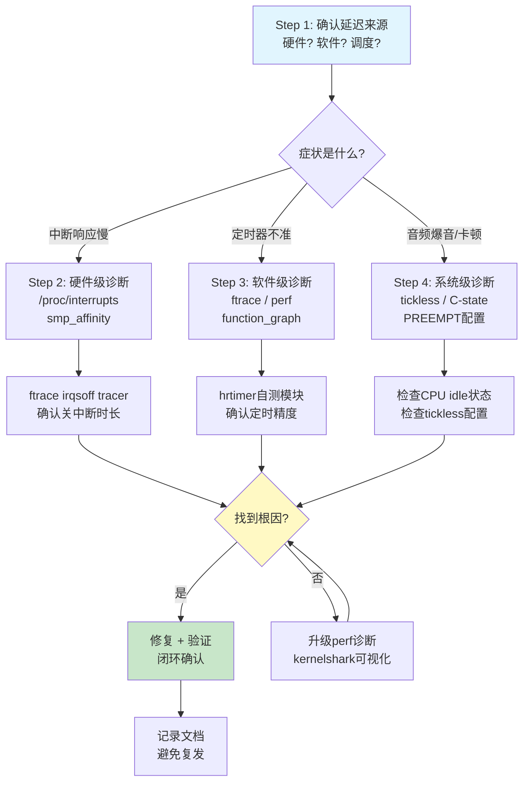

# 10.7.1 综合实战：从GPIO延迟到音频爆音

> 所属章节：第10章 中断与时间 > 10.7 综合实战
>
> 难度：[E→M] | 预计阅读时间：25分钟

## <span class="blue"> 本节导读

本节覆盖：两个完整的实战排查流程——工业 PLC 的 GPIO 中断延迟超标（粗延迟，用 ftrace 直接抓）和音频播放偶发爆音（细延迟，需要自测模块量化），以及从中提炼的中断与时间子系统通用排错方法论。每个步骤给出具体命令和预期输出，最终得到一套可复用的排查闭环：现象确认 → 工具采集 → 根因定位 → 修复 → 数据验证。

---

## <span class="blue"> 综合实战带练：两个完整排查流程 [E→M]

### 带练A：工业PLC GPIO中断延迟排查

场景：产线上的 PLC 控制板，要求 GPIO 收到中断信号后 100 微秒内必须响应，实测偶尔超过 1 毫秒。响应超时会造成产线误动作，必须定位到根因。<br>

按下面的步骤排查。

#### 步骤1：症状确认——用数据说话，别靠猜

问题描述得再清楚，没有数据都是空谈。第一步：用逻辑分析仪抓实际波形，确认问题真实存在。<br>

```bash
# 在测试板上生成一个已知周期的GPIO中断源
# 用另一根GPIO翻转作为响应信号
echo 200 > /sys/class/gpio/export          # 导出GPIO 200（响应信号）
echo out > /sys/class/gpio/gpio200/direction

# 运行测试程序，在中断处理中翻转GPIO200
cd /opt/plc_test && ./gpio_latency_test
```

逻辑分析仪同时抓取中断输入和GPIO200输出，测量两者的边沿间隔时间。<br>

**预期结果**：正常情况80~100μs，但偶尔出现1200μs+的毛刺。<br>

> 💡 先用工具测量再下结论。凭"感觉系统有延迟"就开始调，调了一圈发现是测试方法不对的情况很常见。

#### 步骤2：选择工具——ftrace irqsoff tracer

延迟来自哪里？顶半部跑太久？被其他中断抢了？调度导致的？irqsoff tracer专门记录关中断的时段，是这类问题的利器。<br>

```bash
# 挂载debugfs（通常已经挂载）
mount -t debugfs none /sys/kernel/debug

# 进入ftrace目录
cd /sys/kernel/debug/tracing

# 关闭tracer，清空buffer
echo 0 > tracing_on
echo > trace

# 选择irqsoff tracer——它会记录关中断时间最长的那段
echo irqsoff > current_tracer

# 设置过滤，只关心中断关闭超过50μs的
echo 50000 > tracing_thresh    # 单位：纳秒，即50μs

# 开始采集
echo 1 > tracing_on

# 运行测试程序产生延迟
cd /opt/plc_test && ./gpio_latency_test --duration=30s

# 停止采集
echo 0 > tracing_on

# 查看结果
cat trace
```

#### 步骤3：数据采集和分析——从trace里找罪魁祸首

trace输出通常是这样的格式（截取关键部分）：<br>

```
# tracer: irqsoff
#
# irqsoff latency trace v1.1.5 on 5.10.65-rt53
# --------------------------------------------------------------------
# latency: 823 us, #4/4, CPU#1  |  (M:preempt VP:0, KP:0, SP:0 HP:0 #P:4)
#    -----------------
#    | task: irq/45-gpio123-750 (TID: 750)
#    -----------------
#
#                   _------=> CPU#          
#                  / _-----=> irqs-off       
#                 | / _----=> need-resched   
#                || / _---=> hardirq/softirq 
#                ||| / _--=> preempt-depth   
#                |||| /                      
#                |||||     delay             
#   cmd   pid    ||||| time |  caller        
#      \   /      |||||  \   |  /            
   <...>-750     1d...    0us!: _raw_spin_lock_irqsave <-gpio_irq_handler
   <...>-750     1d..1   10us+: i2c_transfer <-sensor_read_raw
   <...>-750     1d..1  823us+: _raw_spin_unlock_irqrestore <-gpio_irq_handler
```

这段 trace 的解读：<br>

| 字段 | 含义 | 本例数值 |
|------|------|----------|
| `latency: 823 us` | 本次关中断的总时长 | **823μs，远大于目标100μs** |
| `CPU#1` | 发生在CPU1上 | CPU1 |
| `task: irq/45-gpio123-750` | 关中断期间运行的任务 | GPIO中断线程 |
| `_raw_spin_lock_irqsave` | 开始关中断的位置 | GPIO中断处理入口 |
| `i2c_transfer` | 关中断期间执行的函数 | I2C数据传输！ |
| `_raw_spin_unlock_irqrestore` | 开中断的位置 | GPIO中断返回 |

问题清楚：GPIO 的顶半部里调了 `i2c_transfer`，硬中断里直接走 I2C 总线读传感器，一次就是 800 多微秒。这期间本地中断关闭，其他中断全部进不来，延迟超标是必然结果。<br>

#### 步骤4：根因定位——I2C驱动在顶半部执行800μs

为什么会这样？去翻那个传感器的驱动代码（假设是`drivers/iio/temperature/some-sensor.c`）：<br>

```c
// 问题代码——顶半部里直接读I2C！
static irqreturn_t sensor_irq_handler(int irq, void *dev_id)
{
    struct sensor_state *st = dev_id;
    u8 buf[4];
    
    // 🔴 错误：在硬中断里做I2C传输！
    i2c_master_recv(st->client, buf, 4);   // 这条语句耗时~800μs
    
    // 简单处理读到的数据
    st->last_reading = buf[0] << 8 | buf[1];
    
    return IRQ_HANDLED;  // 没有唤醒底半部！
}
```

这个驱动的作者犯了一个典型的错误：**在顶半部（硬中断上下文）里执行慢速I2C操作**。I2C总线速率通常只有100kHz或400kHz，读4个字节加上各种协议开销，几百微秒很正常。但硬中断里这几百微秒是关中断的，整个系统的响应性都被拖垮了。<br>

#### 步骤5：修复验证——移到workqueue + 重新测量

正确的做法是什么？顶半部只干一件事：标记中断到来，然后交给底半部去慢慢读I2C。<br>

```c
// 修复后的代码——顶半部快速返回，I2C移到workqueue
static irqreturn_t sensor_irq_handler(int irq, void *dev_id)
{
    struct sensor_state *st = dev_id;
    
    // ✅ 正确：顶半部只做最少的工作
    st->irq_timestamp = ktime_get_ns();
    
    // 调度workqueue去处理I2C读取
    schedule_work(&st->i2c_work);
    
    return IRQ_HANDLED;
}

static void sensor_i2c_work_fn(struct work_struct *work)
{
    struct sensor_state *st = container_of(work, struct sensor_state, i2c_work);
    u8 buf[4];
    
    // I2C操作现在运行在进程上下文，可以睡眠
    i2c_master_recv(st->client, buf, 4);
    
    st->last_reading = buf[0] << 8 | buf[1];
    
    // 处理完后通知上层
    complete(&st->read_done);
}
```

改完后编译、部署，重新跑测试：<br>

```bash
# 重新加载驱动
rmmod some_sensor
insmod some_sensor.ko

# 再次用ftrace验证
echo 0 > /sys/kernel/debug/tracing/tracing_on
echo > /sys/kernel/debug/tracing/trace
echo irqsoff > /sys/kernel/debug/tracing/current_tracer
echo 50000 > /sys/kernel/debug/tracing/tracing_thresh
echo 1 > /sys/kernel/debug/tracing/tracing_on
./gpio_latency_test --duration=60s
echo 0 > /sys/kernel/debug/tracing/tracing_on
cat /sys/kernel/debug/tracing/trace | head -30
```

**修复后的trace**：<br>
```
# latency: 12 us, #4/4, CPU#1
#    -----------------
#    | task: irq/45-gpio123-812
#    -----------------
#
#   cmd   pid    ||||| time |  caller        
#      \   /      |||||  \   |  /            
   <...>-812     1d...    0us!: _raw_spin_lock_irqsave <-gpio_irq_handler
   <...>-812     1d..1    3us+: gpio_set_value <-gpio_irq_handler
   <...>-812     1d..1   12us+: _raw_spin_unlock_irqrestore <-gpio_irq_handler
```

关中断时间从823μs降到12μs！再用逻辑分析仪验证实际GPIO响应延迟：<br>

| 指标 | 修复前 | 修复后 | 目标 |
|------|--------|--------|------|
| 最大关中断时长 | 823μs | 12μs | <100μs |
| GPIO响应延迟 | 1200μs | **45μs** | <100μs |
| 测试时长 | 30s | 60s | — |
| 延迟超标次数 | 12次 | **0次** | 0 |

> ⚠️ 修复后必须用数据验证，不要假设修复一定有效。只改不测的常见结局是：延迟从 800μs 搬到了另一个触发场景。每个修复都要闭环验证。

---

### 带练B：音频设备爆音排查

再看一个偶发问题：播放 48kHz 音频时偶尔出现"啪"的一声爆音。不持续、难复现，高负载压力测试反而测不出来。

> 💡 这个案例的根因机制——深 C-state 唤醒延迟如何拖垮 hrtimer 精度——以及完整的 hrtimer 精度测试模块代码都在 10.5.5，本节不重复，聚焦"拿到一个偶发爆音问题，排查动作怎么排"的流程本身。

#### 步骤1：症状确认——排除音频数据本身的问题

先排除最简单的可能：音频文件有损？播放代码有 bug？<br>

```bash
# 用已知的无损测试音频播放
aplay -D hw:0,0 -f S16_LE -r 48000 /opt/test_audio/sine_1khz.wav

# 同时用arecord录下输出，对比是否有失真
arecord -D hw:0,0 -f S16_LE -r 48000 -d 30 /tmp/capture.wav
```

录音在特定时间点出现跳变，说明问题确实发生在播放链路。接下来要确认的是：爆音是否跟定时精度有关。<br>

#### 步骤2：hrtimer精度测试——量化定时器表现

音频播放靠周期性定时推送数据，定时器不准，缓冲区就会欠载（underrun），表现为爆音。加载 10.5.5 的 hrtimer 精度测试模块（`hrtimer_precision_test.c`，完整代码与编译方法见该节），跑 30 秒：<br>

```bash
insmod hrtimer_precision_test.ko
sleep 30
rmmod hrtimer_precision_test
dmesg | tail -8
```

**有问题的系统输出**：<br>

```
[  153.789] === hrtimer Precision Test ===
[  153.789] Target: 10 us, samples: 2857142
[  153.789] Min: 8 us (-2 us)
[  153.789] Max: 523 us (+513 us)    ← 看这个值
[  153.789] Avg: 10 us, stddev: 15 us
```

平均 10μs，最大值却到 523μs——偶发的大延迟与偶发的爆音在统计特征上吻合。定时器大部分时间很准，偶尔迟到几百微秒，音频缓冲区就在迟到的窗口里耗空。<br>

#### 步骤3：根因定位——CPU深层C-state的唤醒延迟

谁让 hrtimer 偶尔迟到 500μs？先用 irqsoff tracer 排除"有人长时间关中断"：<br>

```bash
echo irqsoff > /sys/kernel/debug/tracing/current_tracer
echo 100000 > /sys/kernel/debug/tracing/tracing_thresh    # 100μs
echo 1 > /sys/kernel/debug/tracing/tracing_on
insmod hrtimer_precision_test.ko
sleep 30
rmmod hrtimer_precision_test
echo 0 > /sys/kernel/debug/tracing/tracing_on
cat /sys/kernel/debug/tracing/trace | grep -A1 "latency:" | head -10
```

典型输出：<br>

```
# latency: 512 us, CPU#0 | (M:desktop VP:0, KP:0, SP:0 HP:0 #P:4)
#    | task: swapper/0 (PID: 0)
```

关键信息是 `task: swapper/0`——idle 进程。延迟不是某个驱动关中断造成的，而是 CPU 从深睡唤醒本身就要花这么久。确认 C-state 配置：<br>

```bash
cat /sys/devices/system/cpu/cpu0/cpuidle/state*/name
cat /sys/devices/system/cpu/cpu0/cpuidle/state*/latency
```

```
WFI          latency: 1
retention    latency: 80
power-down   latency: 450     ← 深层掉电，恢复要450μs
```

CPU 进入 `power-down` 后唤醒需要 450μs，叠加调度开销后与步骤 2 的 Max 值（523μs）吻合。时钟门控、唤醒路径等机制原理见 10.5.5。<br>

#### 步骤4：修复——禁用深C-state + 中断绑核

两项措施同时上。先禁用音频相关 CPU 的深层 C-state（逐 state 查看与禁用的完整命令、systemd 持久化写法见 10.5.5 方案一）：<br>

```bash
# 禁用唤醒延迟 450μs 的那个 state（编号以实际设备为准）
echo 1 > /sys/devices/system/cpu/cpu0/cpuidle/state2/disable
```

再把音频中断绑到被保护的 CPU 上：<br>

```bash
# 查看音频中断号与当前 CPU 分布
cat /proc/interrupts | grep snd

# 绑定到 CPU2（掩码 4 = 1<<2）
echo 4 > /proc/irq/45/smp_affinity
```

设备树里也可以静态指定 `interrupt-affinity`：<br>

```dts
sound {
    compatible = "your-audio-codec";
    interrupts = <GIC_SPI 45 IRQ_TYPE_LEVEL_HIGH>;
    interrupt-affinity = <&cpu2>;
};
```

#### 步骤5：验证——重测精度 + 实际播放

```bash
# 确认深层 C-state 已禁用
cat /sys/devices/system/cpu/cpu0/cpuidle/state*/disable

# 重跑精度测试
insmod hrtimer_precision_test.ko
sleep 30
rmmod hrtimer_precision_test
dmesg | tail -5
```

**修复后的结果**：<br>

```
[  456.789] Max: 42 us (+32 us)     ← 从523μs降到42μs
```

再做实际播放验证，30 分钟连续播放并检查 ALSA 欠载报告：<br>

```bash
aplay -D hw:0,0 -f S16_LE -r 48000 /opt/test_audio/sine_1khz.wav
dmesg | grep -i "underrun\|overrun\|xrun"
# 修复后应无输出
```

| 指标 | 修复前 | 修复后 | 目标 |
|------|--------|--------|------|
| hrtimer最大延迟 | 523μs | **42μs** | <50μs |
| 音频爆音 | 偶发 | **消失** | 0 |
| 功耗影响 | — | +15mW/CPU | 可接受 |

> ⚠️ 禁用深 C-state 会增加功耗。电池供电设备只禁用音频相关 CPU 的深层 state，其余 CPU 保持节能策略。
---

## <span class="blue"> 中断与时间子系统排错方法论总结 [E]

两个带练走完了，我们来提炼一套通用的方法论。下次遇到中断或时间相关问题，按这个流程走，不会漏掉关键环节。<br>

### 系统化排查流程



### 排错方法论四步

| 步骤 | 目标 | 工具/命令 | 判断标准 |
|------|------|-----------|----------|
| **Step 1** 确认延迟来源 | 区分硬件延迟/软件延迟/调度延迟 | `latencytop`、`cyclictest` | 确定问题的领域边界 |
| **Step 2** 硬件级诊断 | 检查中断分发、CPU亲和性 | `/proc/interrupts`、`smp_affinity`、`irqbalance` | 某CPU中断过载？亲和性不对？ |
| **Step 3** 软件级诊断 | 定位具体代码路径和延迟点 | `ftrace irqsoff`、`function_graph`、`perf` | 哪个函数、哪段代码导致的延迟？ |
| **Step 4** 系统级诊断 | 检查内核配置、电源管理 | `/proc/config.gz`、`cpuidle`、`tickless` | PREEMPT是否开启？C-state是否过深？ |

### 常用工具速查表

| 工具 | 适用场景 | 关键命令 | 输出解读要点 |
|------|----------|----------|-------------|
| **ftrace irqsoff** | 定位关中断时长 | `echo irqsoff > current_tracer; cat trace` | `latency:`字段即关中断时间，关注最长的几条 |
| **ftrace function_graph** | 追踪函数调用耗时 | `echo function_graph > current_tracer; echo func_name > set_ftrace_filter` | 每个函数的`duration`字段，嵌套层级一目了然 |
| **perf** | CPU性能分析 | `perf record -a -g; perf report` | 热点函数排序，找到CPU时间花在哪 |
| **cyclictest** | 实时性基准测试 | `cyclictest -p 80 -i 1000 -l 100000` | `Max`列即最大延迟，是衡量实时性的金标准 |
| **/proc/interrupts** | 中断分布统计 | `watch -n1 'cat /proc/interrupts'` | 各CPU中断次数是否均衡？某IRQ是否暴涨？ |
| **kernelshark** | ftrace可视化 | `trace-cmd record -e irq_handler_entry; kernelshark` | 时间线视图，直观看到中断处理时间线 |
| **hrtimer自测模块** | 定时器精度验证 | 见 10.5.5 的测试模块代码与实验步骤 | 关注`Max`与目标间隔的偏离程度 |
| **cpuidle工具** | C-state诊断 | `cat /sys/devices/system/cpu/cpu*/cpuidle/state*/latency` | latency值越大，退出越深层的C-state越慢 |

### 常见症状/可能原因/排查方向

| 症状 | 可能原因 | 排查方向 |
|------|----------|----------|
| GPIO中断响应偶尔超标 | 某驱动在顶半部执行慢操作 | `irqsoff tracer`查关中断时长 |
| GPIO中断持续超标 | 中断被错误绑定到非目标CPU | `/proc/interrupts` + `smp_affinity` |
| 音频播放偶发爆音 | CPU deep C-state唤醒延迟 | hrtimer自测 + `cpuidle`诊断 |
| 音频播放规律卡顿 | ALSA buffer配置不当 | `aplay --dump-hw-params`查看period大小 |
| 定时器漂移累积 | tickless模式下时钟源不稳定 | `cat /sys/devices/system/clocksource/clocksource0/current_clocksource` |
| 多核下延迟不稳定 | 任务在核间迁移导致cache miss | 设置`taskset`绑定CPU |
| RT补丁下仍有延迟 | 优先级反转或锁竞争 | `ftrace function_graph`追踪`rt_mutex` |
| 低功耗模式下延迟差 | C-state或DVFS引入的延迟 | 对比不同功耗模式下的cyclictest结果 |

> 💡 这个速查表值得放在手边。遇到问题时先对照症状表定位可能原因，再按步骤表选择工具，比凭直觉翻快得多。

> 🔴 排查延迟问题时不要同时开多个 tracing 工具。ftrace 和 perf 同时运行会互相干扰，测出来的数据都不可信。一次只用一个工具，聚焦一个问题。

---

## <span class="blue"> 本节总结

| 内容 | 要点 |
|------|------|
| **GPIO延迟排查SOP** | 症状确认 → ftrace irqsoff → trace分析 → 根因定位 → 修复验证 |
| **顶半部铁律** | 硬中断里不能执行慢操作（I2C/SPI/printf），应移到 workqueue 或线程化中断的 thread_fn 里延后处理 |
| **hrtimer精度测试** | 精度测试模块（10.5.5）可以量化定时器实际表现，Max 值与 Avg 的偏离是关键指标 |
| **deep C-state影响** | CPU进入深层idle后唤醒延迟可达数百μs，对实时任务需要禁用或绑定CPU |
| **ABS_PINNED模式** | hrtimer绑定到特定CPU，避免任务迁移带来的延迟波动 |
| **排查四步法** | 确认来源 → 硬件诊断 → 软件诊断 → 系统诊断，层层递进不遗漏 |

这一节的两个带练，一个是"粗延迟"（GPIO 的 800μs），一个是"细延迟"（hrtimer 的 500μs 偶发迟到）。粗延迟用 ftrace 一抓一个准，细延迟需要用精度测试模块来量化。两个思路互补，覆盖绝大多数实际场景。<br>

**核心理念**：先测量，再分析，后修复，终验证。没有数据的优化都是瞎猜。<br>

---

## <span class="blue"> 下一步

本节是第10章的实战收尾。接下来：

> **10.99 知识图谱与查漏补缺** — 一张图串起中断与时间子系统的全部知识点，帮你检查有没有盲区。同时也会列出常见问题FAQ和推荐阅读顺序，方便你复习和回查。

---

## <span class="blue"> 配套资源

| 资源 | 内容 | 路径/说明 |
|------|------|-----------|
| hrtimer精度测试模块 | 完整内核模块源码与实验步骤 | 见 10.5.5 |
| ftrace使用流程 | irqsoff tracer完整步骤 | 带练A步骤2 |
| 排错流程图 | mermaid系统化排查图 | 本节"系统化排查流程" |
| 工具速查表 | 8种常用工具速查 | 本节表格 |
| 症状对照表 | 8种常见症状排查方向 | 本节表格 |
| 推荐工具安装 | cyclictest、trace-cmd等 | `apt install rt-tests trace-cmd kernelshark` |
| 内核文档 | ftrace官方文档 | `Documentation/trace/ftrace.rst` (内核源码树) |
| 参考书籍 | 《Linux设备驱动程序》第10章 | 中断处理经典参考 |
