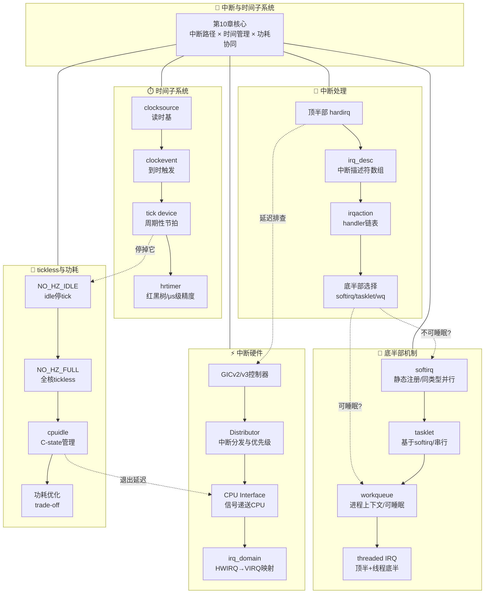

**知识图谱 [I]**

把第10章的知识点串成一张图，能让你在面试前或问题排查时快速定位该看什么。下面这张图从中断与时间子系统出发，五条主干分叉出去，覆盖了全章内容。

每条分支的深度不一样——硬件那支偏理解（面试常考），底半部那支偏实践（编码必会），tickless那支偏调优（性能敏感场景才深入）。你不需要一次性全部吃透，这张图的作用是让你知道"某个问题该往哪个分支去找"。

---

**知识点速查表 [I]**

| 知识点 | 是什么（一句话） | 为什么重要 | 关键文件/命令 | 常见错误 |
|--------|-----------------|-----------|-------------|---------|
| GICv2/v3 | ARM的中断控制器，v3支持更多中断和LPI | 理解中断分发是一切优化的基础 | `drivers/irqchip/gic.c` | 把v2和v3的寄存器混着读 |
| Distributor | GIC中负责中断分发和优先级仲裁的组件 | 中断Affinity配置生效的地方 | `GICD_*`寄存器 | 改了affinity但Distributor没使能 |
| CPU Interface | GIC中把中断信号递送给具体CPU的接口 | 决定哪颗CPU响应中断 | `GICC_*` / `GICR_*` | 忽略了SGI只在组内广播 |
| irq_domain | 内核中HWIRQ到Linux VIRQ的映射层 | 设备树中断解析的核心机制 | `kernel/irq/irqdomain.c` | 同一个HWIRQ重复映射导致VIRQ冲突 |
| 异常向量表 | CPU收到中断后跳转的入口地址表 | 理解中断入口的第一站 | `arch/arm64/kernel/entry.S` | 混淆IRQ/SError/FIQ的入口 |
| handle_arch_irq | 架构相关中断处理的统一入口函数 | 所有中断必经之路，加trace的好地方 | `kernel/irq/handle.c` | 在此处加printk导致死循环 |
| irq_desc | 内核中描述单个中断的结构体数组 | 中断管理的核心数据结构 | `kernel/irq/irqdesc.c` | 越界访问NR_IRQS之外的desc |
| irqaction | 挂在irq_desc上的handler链表节点 | 共享中断靠它链式挂载多个handler | `include/linux/interrupt.h` | 返回IRQ_HANDLED但还有handler没执行 |
| request_irq | 驱动注册中断的标准接口 | 99%的驱动都从这里开始 | `request_irq/free_irq` | 卸载驱动时忘了free_irq |
| 顶半部约束 | hardirq上下文不能睡眠、栈小、要快 | 违反任意一条都可能oops或丢失中断 | `in_interrupt()`判断 | 在顶半部调用kmalloc(GFP_KERNEL) |
| softirq | 静态注册的底半部，同类型可在多CPU并行 | 网络收发包的核心路径 | `kernel/softirq.c` | 在softirq里睡眠直接触发BUG() |
| tasklet | 基于softirq的底半部，同实例串行执行 | 比softirq更安全，比wq更轻量 | `include/linux/interrupt.h` | 同一个tasklet在多个地方schedule |
| workqueue | 在进程上下文执行的底半部，可睡眠 | 需要阻塞操作时的唯一选择 | `kernel/workqueue.c` | 用了system_wq导致长任务拖慢全局 |
| threaded IRQ | 把底半部放到独立内核线程执行 | 顶半部只做mask+唤醒，延迟极低 | `request_threaded_irq()` | thread_fn里忘了处理IRQ_WAKE_THREAD |
| clocksource | 内核读取时间的硬件抽象（如arch_timer） | 一切时间计量的根基 | `drivers/clocksource/` | 选了不稳定的clocksource导致时间漂移 |
| clockevent | 到时触发中断的硬件抽象 | tick和hrtimer都靠它驱动 | `kernel/time/clockevents.c` | 没处理shutdown状态导致定时器停不掉 |
| tick device | 把clockevent包装成周期性/oneshot节拍源 | NO_HZ的核心操作对象 | `kernel/time/tick-*` | 模式切换时漏了reprogram |
| hrtimer | 基于红黑树的高精度定时器，μs级 | 替代旧timer_list的主流方案 | `kernel/time/hrtimer.c` | 在hrtimer回调里加长时间操作破坏精度 |
| NO_HZ_IDLE | idle CPU停掉周期性tick以省电 | 手机/嵌入式待机功耗优化核心 | `CONFIG_NO_HZ_IDLE` | tick停掉后jiffies不更新，依赖它的代码挂住 |
| NO_HZ_FULL | 全核（或指定核）进入tickless模式 | HPC场景减少内核干扰 | `CONFIG_NO_HZ_FULL` | 与rcu_nocbs搭配没配好导致RCU stall |
| cpuidle | 管理CPU C-state进出的框架 | 和NO_HZ协同实现深度睡眠 | `drivers/cpuidle/` | C-state退出延迟比预期长，丢中断 |
| /proc/interrupts | 查看各中断在各CPU上触发次数的接口 | 排查"中断去哪了"的首选工具 | `cat /proc/interrupts` | 只看了总数没看各核分布 |
| irqsoff tracer | 追踪内核中关闭中断最长时间的tracer | 定位"中断延迟"的神器 | `echo irqsoff > current_tracer` | 没开ftrace或tracefs没挂载 |
| smp_affinity | 把中断绑定到指定CPU的接口 | 多核中断负载均衡的基础操作 | `/proc/irq/N/smp_affinity` |  affinity值写错了格式（应该用位掩码） |

---

**查漏补缺清单 [I]**

画勾之前先老实回答自己：这个我能不能在5分钟内给别人讲清楚？讲不清就回去翻对应小节。

**GIC硬件**

- [ ] **知识点63 [I]** GICv2的双组件架构：Distributor负责什么，CPU Interface负责什么
- [ ] **知识点64 [I][M]** ARM异常级别EL0-EL3的区别，EL3跑固件、EL1跑内核、EL0跑应用
- [ ] **知识点65 [I]** 异常向量表的布局：4种异常类型×4种来源，16个入口
- [ ] **知识点66 [I][M]** GICv2与GICv3的关键差异：v3多了Redistributor、支持LPI、支持更多中断
- [ ] **知识点67 [I]** GICv2的中断优先级机制：数值越小优先级越高，优先级分组决定抢占
- [ ] **知识点68 [I][M]** SPI（共享外设中断）、PPI（私有外设中断）、SGI（软件生成中断）的区别和用途
- [ ] **知识点69 [I]** GICv3的Redistributor作用：每个CPU一个，管PPI和LPI
- [ ] **知识点70 [I]** LPI（Locality-specific Peripheral Interrupt）基于ITS的中断翻译机制
- [ ] **知识点71 [I]** irq_domain的三种映射方式：linear map、tree map、no map，各适用什么场景
- [ ] **知识点72 [I][M]** 设备树中interrupts属性的解析流程：irq_domain匹配→HWIRQ→VIRQ映射
- [ ] **知识点73 [I]** irq_domain_ops中的xlate和map回调各自在什么时候被调用
- [ ] **知识点74 [I]** /proc/interrupts各列含义：中断号、计数、设备名、CPU分布
- [ ] **知识点75 [I]** smp_affinity的原理和用法：位掩码写法、echo写入、irqbalance对比
- [ ] **知识点76 [I][M]** 中断亲和性设置失败时的排查步骤：irqbalance冲突、CPU离线、不支持
- [ ] **知识点77 [I]** GIC中断配置寄存器的保护机制：某些寄存器只能在安全态访问

**中断入口与处理**

- [ ] **知识点78 [I][M]** 从电信号到handler的完整路径：GPIO→GIC→CPU→entry.S→handle_arch_irq→irq_desc
- [ ] **知识点79 [I]** request_irq与request_threaded_irq的区别和选用场景
- [ ] **知识点80 [I][M]** free_irq的安全时机：必须在中断不会再触发后调用，否则可能踩空指针
- [ ] **知识点81 [I]** irq_desc结构体的核心字段：irq_data、action、status、depth
- [ ] **知识点82 [I][M]** handle_level_irq与handle_edge_irq的区别：电平触发要清源，边沿触发不hold
- [ ] **知识点83 [I]** 共享中断的匹配机制：dev_id必须唯一，用于区分同一IRQ上的多个handler
- [ ] **知识点84 [I][M]** irqsoff tracer的使用方法：开启、复现、读取、解读trace输出
- [ ] **知识点85 [I]** function tracer与function_graph tracer的配合定位
- [ ] **知识点86 [I]** 中断屏蔽时间的常见罪魁祸首：spin_lock_irqsave、local_irq_disable、长临界区

**顶半部与拆分决策**

- [ ] **知识点87 [I]** 不拆分顶半部的惨痛教训：执行过长导致丢中断、其他中断饿死
- [ ] **知识点88 [E][M]** hardirq上下文不能睡眠的根本原因：没有进程上下文、没有可切换的task_struct
- [ ] **知识点89 [E]** hardirq栈的限制：中断栈通常只有一页（16KB on arm64），不能爆栈
- [ ] **知识点90 [E][M]** 顶半部只做"最小必要工作"原则：ack中断、读状态、唤醒底半部
- [ ] **知识点91 [I]** 执行过长的量化判断：超过几十个微秒就要考虑拆分

**底半部三大机制**

- [ ] **知识点92 [E][M]** softirq的注册方式：静态声明在枚举中，open_code注册，runtime不可新增
- [ ] **知识点93 [E]** softirq的触发与执行路径：raise_softirq→ksoftirqd / 中断退出时检查
- [ ] **知识点94 [I][M]** softirq/tasklet/workqueue三者的选择决策树：能否睡眠？是否需要并行？是否常驻？
- [ ] **知识点95 [I]** 选错底半部的典型翻车：该用wq的用了tasklet导致睡眠oops，该用softirq的用了wq导致延迟大
- [ ] **知识点96 [E]** 底半部三大经典翻车：在softirq里睡眠、tasklet重入、wq用错队列
- [ ] **知识点97 [I]** 底半部调试三板斧：trace_softirq、perf、在handler里加tracepoint
- [ ] **知识点98 [I]** tasklet的已废弃声明：新代码应该用workqueue或threaded IRQ替代
- [ ] **知识点99 [I]** ksoftirqd内核线程的作用和优先级：用于退化的softirq执行，避免用户态饿死

**线程化IRQ**

- [ ] **知识点100 [E][M]** request_threaded_irq的两阶段模型：primary handler（顶半）+ thread_fn（线程底半）
- [ ] **知识点101 [E]** 不传thread_fn时的退化行为：退化为传统request_irq
- [ ] **知识点102 [E][M]** irq_thread的调度策略与优先级调整：SCHED_FIFO默认，可改prio
- [ ] **知识点103 [E]** irq_thread优先级设置实践建议：根据延迟要求定，别盲目拉到最高
- [ ] **知识点104 [I]** threaded IRQ的甜头：顶半部极简、延迟可控、底半部可睡眠
- [ ] **知识点105 [I]** threaded IRQ的适用场景：慢速外设、需要阻塞操作、延迟不敏感路径
- [ ] **知识点106 [E]** IRQF_ONESHOT标志的含义和必要性：level触发时必须等thread结束才reenable

**时间子系统**

- [ ] **知识点107 [I]** clocksource的注册与rating机制：多个source竞争，rating高的被选为timekeeper
- [ ] **知识点108 [I]** timekeeper的职责：维护xtime、提供gettimeofday的根基
- [ ] **知识点109 [I]** jiffies的精度局限：依赖HZ，典型1ms~10ms粒度，不适合精细定时
- [ ] **知识点110 [E][M]** 时间子系统四层架构：clocksource→clockevent→tick device→hrtimer
- [ ] **知识点111 [E]** 分层设计的意义：硬件无关层在上、硬件相关层在下、便于移植
- [ ] **知识点112 [E]** clockevent的states_idle和states_shutdown含义
- [ ] **知识点113 [E]** tick_device的两种模式：TICKDEV_MODE_PERIODIC和TICKDEV_MODE_ONESHOT
- [ ] **知识点114 [E][M]** hrtimer红黑树机制：按到期时间排序，最近到期的在最左边
- [ ] **知识点115 [I]** hrtimer的精度保证：高分辨率模式下绕过jiffies，直接靠clockevent
- [ ] **知识点116 [I][M]** hrtimer_base的per-CPU设计：每个CPU有自己的红黑树，避免全局锁
- [ ] **知识点117 [I]** timer_migration的作用和开销：hrtimer跨CPU迁移的场景
- [ ] **知识点118 [E]** hrtimer_init和hrtimer_start的用法：注意clock参数选CLOCK_MONOTONIC还是REALTIME
- [ ] **知识点119 [I]** hrtimer_cancel与hrtimer_try_to_cancel的区别：后者不阻塞
- [ ] **知识点120 [I][M]** 低分辨率模式vs高分辨率模式的切换条件和触发路径
- [ ] **知识点121 [I]** tick_broadcast的角色：深睡眠CPU由其他CPU代为发送tick

**tickless与功耗**

- [ ] **知识点122 [E][M]** NO_HZ_IDLE的实现：idle时停tick，下次事件前通过clockevent唤醒
- [ ] **知识点123 [I]** NO_HZ_IDLE的配置与验证：CONFIG_NO_HZ_IDLE、/proc/timer_list查看
- [ ] **知识点124 [E]** NO_HZ_FULL的设计目标：让指定CPU完全不被内核tick打断
- [ ] **知识点125 [I]** NO_HZ_FULL与rcu_nocbs的配套关系：tickless核需要offload RCU回调
- [ ] **知识点126 [I][M]** tickless与cpuidle的深度协同：tick停掉→进C-state→事件来→退C-state→恢复tick
- [ ] **知识点127 [I]** 保留"热CPU"的平衡策略：不是所有核都适合tickless，需要trade-off
- [ ] **知识点128 [I]** tickless场景下jiffies的维护策略：由下一个即将到时的CPU负责推进
- [ ] **知识点129 [I]** sched_clock与timekeeping的区别和联系：前者调度用（单调），后者墙上时间

**综合排查**

- [ ] **知识点84 [I][M]** irqsoff tracer实战：找到关中断太久的代码段
- [ ] **知识点74 [I]** /proc/interrupts实战：看中断分布是否均匀、是否有中断风暴
- [ ] **知识点75 [I]** smp_affinity实战手动绑核：解决单核软中断飙高的问题
- [ ] **知识点97 [I]** ftrace event:irq/irq_handler_entry和exit的使用

---

> 这份清单不是用来"一次性画满勾"的。正经的用法是：遇到中断相关的问题时，从头到尾扫一遍，把感觉模糊的画出来，然后针对性地回去翻对应小节。画完一轮再画一轮，三轮下来这些就真成你的了。
