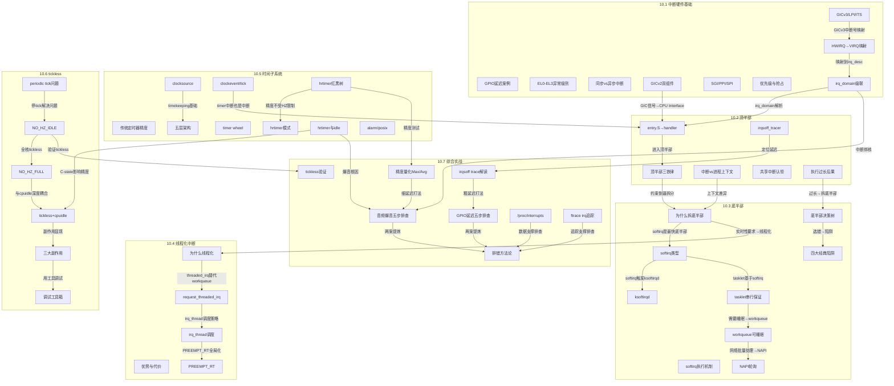
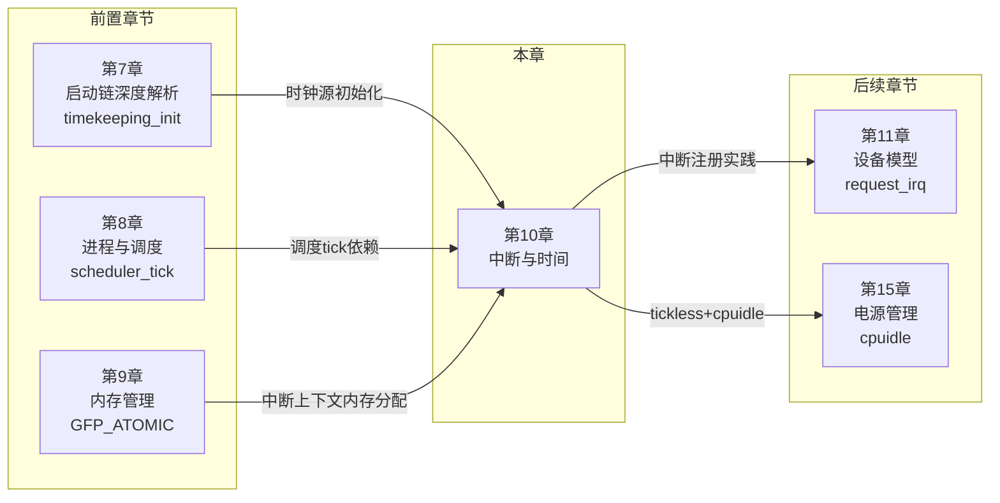

# 10.99 知识图谱与查漏补缺

> 所属章节：第10章 中断与时间 > 10.99 知识图谱与查漏补缺
>
> 难度：[I] | 预计阅读时间：30分钟

## 本节导读

本节覆盖：第 10 章 52 个要点的关联图（看清硬件基础、顶半部、底半部、线程化中断、时间子系统、tickless 之间的依赖关系）、每个要点的一句话速查、10 道自测题（5 选择 + 5 简答，附答案解析）、本章与前后章节的衔接关系，以及一份逐条打勾的查漏补缺清单。

---

## 本章要点关联图 [I]

第 10 章的内容不是孤立的。硬件基础支撑顶半部，顶半部的约束倒逼底半部的设计，底半部的选择影响线程化中断的决策，时间子系统依赖中断驱动，tickless 又反过来改变中断行为。

看懂这张图，就理解了整个子系统的结构。

> 💡 跨节箭头是本章的核心关联：GIC 决定中断怎么进内核，顶半部的约束倒逼底半部设计，hrtimer 精度又和 tickless、CPU idle 纠缠在一起，最后全部汇入 10.7 的两个实战案例。

---

## 核心概念速查：52 个要点一句话总结 [I]

| 要点 | 一句话总结 | 关键文件/命令 |
|------|-----------|--------------|
| **10.1 中断硬件基础** |||
| GPIO 延迟案例 | 工业 PLC 的 GPIO 中断延迟排查，引出中断路径全章路线图 | `gpio-keys.c` |
| EL0-EL3 异常级别 | ARM64 四级异常级别：EL0 应用、EL1 内核、EL2 虚拟化、EL3 固件 | `arch/arm64/kernel/entry.S` |
| 同步 vs 异步中断 | 同步异常由当前执行的指令触发（缺页、系统调用），异步中断由外设在任意时刻触发 | `ESR_ELx` 寄存器 |
| GICv2 双组件 | Distributor 负责分发仲裁，CPU Interface 负责递送 CPU | `drivers/irqchip/gic.c` |
| SGI/PPI/SPI | SGI 是 CPU 间通信、PPI 是 CPU 私有、SPI 是外设共享中断 | `GICD_TYPER` |
| 优先级与抢占 | GIC 数值越小优先级越高，优先级分组决定是否能抢占 | `GICC_PMR` |
| GICv3/LPI/ITS | GICv3 引入 Redistributor 和 LPI，ITS 实现 MSI 中断翻译 | `drivers/irqchip/gic-v3*` |
| HWIRQ→VIRQ 映射 | 硬件中断号经 irq_domain 映射为 Linux 虚拟 IRQ 号 | `kernel/irq/irqdomain.c` |
| irq_domain 级联 | 级联中断控制器通过父 domain 逐层解析中断号 | `irq_domain_add_*()` |
| **10.2 顶半部** |||
| 顶半部三铁律 | hardirq 不能睡眠、栈小（16KB）、必须尽快结束 | `in_interrupt()` |
| 中断 vs 进程上下文 | 中断上下文没有 task_struct 可切换，所以不能睡眠调度 | `struct pt_regs` |
| entry.S→handler | 七步链路：entry.S→handle_arch_irq→irq_desc→irqaction→handler | `handle_irq_event()` |
| 共享中断认领 | 多个设备共享同一 IRQ，dev_id 唯一标识，handler 返回 IRQ_HANDLED/IRQ_NONE | `IRQF_SHARED` |
| 执行过长后果 | 丢中断、其他中断饿死、实时任务抖动，超几十微秒就该拆分 | `irqsoff tracer` |
| irqsoff_tracer | ftrace 的 irqsoff tracer 定位内核关中断过长的代码段 | `/sys/kernel/tracing/` |
| **10.3 底半部** |||
| 为什么拆底半部 | 顶半部关中断执行，耗时操作必须延后到可调度的上下文 | 见 10.3.1 |
| softirq 类型 | 静态注册的底半部（10 种），同类型可在多 CPU 并行，网络收发包核心路径 | `kernel/softirq.c` |
| softirq 执行机制 | raise_softirq 标记位，中断退出时检查执行，过长退给 ksoftirqd | `do_softirq()` |
| ksoftirqd | 每个 CPU 一个的 softirq 退化线程，避免用户态饿死，优先级最低 | `ksoftirqd/n` |
| tasklet 串行保证 | 基于 HI_SOFTIRQ/TASKLET_SOFTIRQ，同实例串行不同实例并行；新代码不推荐再用 | `tasklet_schedule()` |
| workqueue 可睡眠 | 在进程上下文执行的底半部，可阻塞睡眠，用 wq 要选择合适队列 | `schedule_work()` |
| NAPI 轮询 | 网络驱动的中断+轮询混合模式，忙时轮询、闲时中断，减少开销 | `napi_schedule()` |
| 底半部决策树 | 能否睡眠→workqueue；要并行→softirq；简单安全→tasklet | 见 10.3.6 |
| 四大经典陷阱 | softirq 里睡眠、tasklet 重入、wq 用错队列、在底半部里再次关中断 | 见 10.3.7 |
| **10.4 线程化中断** |||
| 为什么线程化 | 传统中断打断高优先级任务，线程化让中断可调度可抢占 | PREEMPT_RT 需求 |
| request_threaded_irq | 两阶段模型：primary handler（顶半）+ thread_fn（线程底半） | `request_threaded_irq()` |
| irq_thread 调度 | 默认 SCHED_FIFO，优先级可调，延迟可控 | `irq_thread` 进程 |
| 优势与代价 | 延迟变低、可睡眠，但多一次上下文切换、吞吐量略降 | 延迟 vs 吞吐量权衡 |
| PREEMPT_RT | threadirqs 启动参数全局强制线程化，6.12 起完整合入主线 | `threadirqs` |
| **10.5 时间子系统** |||
| 传统定时器精度 | timer_list 站在 tick 上，精度天花板 1/HZ；setitimer 等用户态接口早已迁到 hrtimer | `jiffies` |
| 五层架构 | clocksource→timekeeping→clockevent→tick device→hrtimer，硬件无关层在上 | 见 10.5.2 |
| clocksource | 提供读时基硬件抽象，rating 机制竞争选出 timekeeper | `clocksource_register()` |
| clockevent/tick | clockevent 到时触发中断，tick device 包装成周期性/oneshot 节拍 | `tick_setup_device()` |
| timer wheel | 8 层×64 桶扁平数组+位图（4.8 重写后），优化的是数量不是精度 | `__run_timers()` |
| hrtimer 红黑树 | timerqueue 按到期时间排序，最左缓存 O(1) 取顶，μs 级精度 | `kernel/time/hrtimer.c` |
| hrtimer 模式 | 基于 clockevent oneshot 精确编程到期时刻；默认 hard 类跑硬中断上下文 | `HRTIMER_MODE_ABS/REL/PINNED/SOFT` |
| hrtimer 与 idle | CPU 进深 C-state 唤醒需数百 μs，hrtimer 回调随之迟到，音频场景易爆音 | `cpuidle` 协同 |
| alarm/posix | Alarm Timer 支持 suspend 唤醒，POSIX Timer 给用户空间高精度定时 | `timer_create()` |
| **10.6 tickless** |||
| periodic tick 问题 | 周期性 tick 在 idle 时空转，每秒数百上千次唤醒却无事可做，浪费电 | `CONFIG_HZ` |
| NO_HZ_IDLE | idle CPU 停掉 tick，按最近到期事件编程 clockevent 精准唤醒 | `CONFIG_NO_HZ_IDLE` |
| NO_HZ_FULL | 指定 CPU 只剩一个任务时也停 tick，配合 isolcpus 给实时任务独占环境 | `CONFIG_NO_HZ_FULL` |
| tickless+cpuidle | tick 是 C-state 的天花板，停了 governor 才敢送深层 | `tick_nohz_*()` |
| 三大副作用 | CPU 使用率统计失真、jiffies 精度不可依赖、RCU grace period 延迟 | `/proc/stat` 偏差 |
| 调试工具箱 | /proc/timer_list 验模式、tick_stop 事件找依赖、perf 交叉验证 | `/proc/timer_list` |
| **10.7 综合实战** |||
| GPIO 延迟五步排查 | 粗延迟标准打法：逻辑分析仪确认→irqsoff 采集→trace 定位→修复→数据验证 | `irqsoff tracer` |
| 关中断窗口慢操作 | I2C/SPI 等会睡眠的慢操作在关中断窗口里跑 800μs 是粗延迟首犯，归宿在 thread_fn/workqueue | `i2c_transfer` 反面教材 |
| irqsoff trace 解读 | latency 字段给总时长、task 字段给责任方、tracing_thresh 过滤噪音 | `/sys/kernel/tracing/` |
| 音频爆音五步排查 | 细延迟打法：排除数据→精度量化→排除关中断→确认 C-state→修复验证 | hrtimer 精度模块 |
| hrtimer 精度量化 | Max 与 Avg 的偏离是关键指标，数百 μs 级 Max 指向深 C-state | `hrtimer_precision_test.ko` |
| 禁深 C-state+绑核 | 音频类实时修复组合拳：disable 深层 state + smp_affinity/interrupt-affinity | `/proc/irq/N/smp_affinity` |
| 排错四步法 | 确认来源→硬件诊断→软件诊断→系统诊断，层层递进 | 见 10.7.2 |
| 工具与症状对照 | 八件工具的适用场景与九类症状的排查方向，放手边随查 | 见 10.7.2 |

---

## 自测题：你真的学会了吗？ [I]

下面 10 道题覆盖了本章关键概念。选择题侧重辨析，简答题侧重理解。建议先闭卷做，再对照答案。

### 选择题（5 道）

**Q1. GICv3 相比 GICv2 最大的架构变化是什么？**

A. 增加了更多的 SPI 中断号
B. 引入了 Redistributor 组件，支持 LPI 和 ITS 中断翻译
C. 把 Distributor 和 CPU Interface 合并了
D. 取消了中断优先级机制

**Q2. 顶半部（hardirq）不能睡眠的根本原因是？**

A. 中断处理函数里禁止了内存分配
B. 中断上下文没有与之绑定的 task_struct，调度器无法切换
C. 硬件会自动屏蔽所有中断，睡眠也无法被唤醒
D. 中断栈只有 4KB，放不下睡眠所需的上下文

**Q3. 你的驱动需要在中断底半部里调用 `msleep(10)`，应该选哪种底半部机制？**

A. softirq，因为它执行最快
B. tasklet，因为它比 softirq 更安全
C. workqueue，因为它在进程上下文中可以睡眠
D. 直接放在顶半部里做，不用拆分

**Q4. hrtimer 在高分辨率模式下精度不受 HZ 限制，它依赖的核心机制是？**

A. 直接操作 jiffies 变量
B. 增加内核 HZ 到 10000
C. 绕过 tick 周期，直接对 clockevent 硬件编程精确的到期时刻
D. 使用忙等待（busy-wait）来保证精度

**Q5. 启用 NO_HZ_IDLE 后，下面哪个副作用最值得关注？**

A. 内核崩溃概率增加
B. 用户态程序无法创建定时器
C. 依赖 jiffies 均匀更新的代码可能感知不到时间按预期推进
D. 网络吞吐量降低 50%

---

### 简答题（5 道）

**Q6. 请画出"收到中断信号→handler 执行"的七步链路，并说明哪一步与 irq_domain 相关。**

**Q7. 解释为什么 softirq 里调用 `kmalloc(GFP_KERNEL)` 会导致死锁，而 workqueue 里同样调用却没问题。**

**Q8. request_threaded_irq() 的两阶段模型中，如果 primary handler 返回 IRQ_WAKE_THREAD 但 thread_fn 执行了很长时间，会有什么风险？如何处理？**

**Q9. hrtimer 精度在 CPU 进入深 C-state 时会变差，请解释这个因果关系链。**

**Q10. NO_HZ_IDLE 和 NO_HZ_FULL 的核心区别是什么？为什么后者需要搭配 `rcu_nocbs` 使用？**

---

### 答案与解析

**A1. 答案：B**

> GICv3 最大的架构演进是引入了 Redistributor（每个 CPU 一个，管理 PPI 和 LPI）和 ITS（Interrupt Translation Service，把 DeviceID→EventID 翻译为 LPI 中断号）。A 只提到数量增加不是"架构变化"；C 说合并了是错的，实际是拆得更细；D 说取消优先级更是错的。

**A2. 答案：B**

> 中断上下文借用的是被中断进程的上下文，没有独立的 task_struct。睡眠需要把当前任务切出并挂入等待队列，但中断上下文里没有这个"当前任务"可切。A 错在 `kmalloc(GFP_ATOMIC)` 是允许的；C 错在睡眠与中断是否屏蔽无关；D 错在 ARM64 中断栈是 16KB 不是 4KB。

**A3. 答案：C**

> `msleep()` 会调用调度器让出 CPU，这只有在进程上下文才能做。workqueue 的工作函数运行在 worker 内核线程的进程上下文中，所以可以安全睡眠。A 和 B 都运行在中断上下文（softirq/tasklet），睡眠会触发 BUG()。D 违反顶半部三铁律。

**A4. 答案：C**

> hrtimer 高分辨率模式下直接对 clockevent 编程，设定精确的到期时刻，到点产生一次中断，绕开了固定周期 tick 的限制。A 的 jiffies 是传统 timer 的方式；B 提高 HZ 只能改善 tick 粒度，不是 hrtimer 的做法；D 忙等待是错误的，hrtimer 靠中断唤醒。

**A5. 答案：C**

> NO_HZ_IDLE 在 CPU idle 时停掉了 tick，jiffies 不再按固定周期更新，而是由仍承担计时职责的 CPU（`tick_do_timer_cpu`）在自己的 tick 中推进。依赖 jiffies 均匀走时的老代码会感知到时间判断失准。A 错在内核不会因此崩溃；B 错在用户态定时器不受影响；D 错在网络吞吐与此无直接关联。

**A6. 参考答案：**

> 七步链路：① 外设发出电信号 → ② GIC 接收并仲裁 → ③ GIC 通过 CPU Interface 发送给 CPU → ④ CPU 跳转到异常向量表（entry.S）→ ⑤ `handle_arch_irq()` 架构统一入口 → ⑥ 查找 `irq_desc[irq]` 获取中断描述符 → ⑦ 遍历 irqaction 链表调用 handler。
>
> 与 irq_domain 相关的是第②→③步的映射过程：GIC 的硬件中断号（HWIRQ）通过 irq_domain 映射为 Linux 的虚拟 IRQ 号（VIRQ），`irq_domain` 的 xlate 函数解析设备树 `interrupts` 属性，map 函数建立 HWIRQ→VIRQ 的映射关系。

**A7. 参考答案：**

> `kmalloc(GFP_KERNEL)` 在内存不足时会触发直接回收（direct reclaim），这个过程需要等待 IO 完成，也就是睡眠等待。softirq 运行在中断上下文，没有可切换的 task_struct，一旦试图睡眠就会触发 `BUG_ON(in_interrupt())` 导致 oops。而 workqueue 运行在 worker 内核线程的进程上下文中，有完整的 task_struct，调度器可以正常将其切出等待，所以 `kmalloc(GFP_KERNEL)` 是安全的。

**A8. 参考答案：**

> 风险：如果 thread_fn 执行很长时间（比如几十毫秒），对于 level 触发的中断，由于 IRQF_ONESHOT 标志的作用，中断线在整个 thread_fn 执行期间保持禁用状态，其他设备共享该中断线时也会被阻塞。如果是边沿触发则风险较小。
>
> 处理方法：① 缩短 thread_fn 中的工作量，只做最小必要操作；② 如果必须长操作，在 thread_fn 里用 workqueue 再递延一层；③ 如果不是共享中断，可以考虑不加 IRQF_ONESHOT（level 触发必须加）；④ 调整 irq_thread 的优先级确保不被饿死。

**A9. 参考答案：**

> 因果链：CPU 进深 C-state（如 C3/C6）→ 唤醒路径上的时钟与电源需要恢复 → CPU 退出 C-state 需要数十到数百微秒（exit latency）→ hrtimer 到期信号发出后，回调要等 CPU 醒完才能执行 → 延迟与音频 period 同量级时，缓冲区在迟到窗口里耗空，出现爆音。
>
> 解决方案：① 用 cpuidle 的 sysfs 接口禁用深层 C-state（x86 上也可用 `processor.max_cstate` 启动参数，ARM 走 `/sys/.../cpuidle/state*/disable`）；② 对延迟敏感任务绑到不进入深 C-state 的 CPU；③ 用 `/dev/cpu_dma_latency`（PM QoS）按任务动态约束唤醒延迟；④ 换 `teo` 这类延迟敏感的 cpuidle governor。

**A10. 参考答案：**

> NO_HZ_IDLE：只在 CPU 进入 idle 状态时停掉周期性 tick，有任务运行时 tick 正常。解决的是 idle 时的功耗浪费。
>
> NO_HZ_FULL：在只剩一个任务运行时**也**停掉 tick，目标 CPU 完全不被内核 tick 打断。解决的是 HPC、实时专用核场景下 tick 对计算任务的干扰。
>
> 需要 `rcu_nocbs` 的原因：NO_HZ_FULL 的 CPU 长时间不经过 quiescent state，RCU 回调排不上执行。`rcu_nocbs` 把 RCU callback 转移到其他 CPU 上执行，避免 grace period 无限延长导致 RCU stall。

---

## 与前后章关联 [I]

第 10 章不是一座孤岛。理解这些关联，排查问题时才知道往哪个方向延伸。

| 方向 | 章节 | 关联点 | 为什么重要 |
|------|------|--------|-----------|
| ← 前置 | 第7章 启动链深度解析 | `timekeeping_init()` 在 start_kernel() 中初始化时钟源 | 第 10 章的 clocksource 注册依赖于第 7 章的初始化流程，timekeeping 从哪个 clocksource 启动决定了系统启动后的时间精度 |
| ← 前置 | 第8章 进程与调度 | `scheduler_tick()` 在每个 tick 中更新 vruntime，CFS 调度依赖 tick | 第 10 章的 NO_HZ 直接影响调度器的 tick 更新频率，PREEMPT_RT 与线程化中断在 10.4 深度耦合 |
| ← 前置 | 第9章 内存管理 | 中断中的 `kmalloc` 必须用 `GFP_ATOMIC` | 第 9 章讲的 slab 分配器在中断上下文有特殊约束，第 10 章的顶半部正是这一约束的典型场景 |
| → 后续 | 第11章 设备模型 | 驱动通过 `request_irq()`/`request_threaded_irq()` 注册中断 | 第 10 章是整个中断子系统的原理铺垫，第 11 章把这些原理放进设备模型框架里落地 |
| → 后续 | 第15章 电源管理 | tickless 与 cpuidle 深度耦合，C-state 进出影响中断延迟 | 第 10 章的 NO_HZ 是第 15 章 cpuidle 框架的"上游"，两者共同决定设备待机功耗 |

> ⚠️ 学中断只盯着 `request_irq()` 的用法，会漏掉两条暗线：第 7 章的 `timekeeping_init()` 决定时间子系统从哪起跑，第 9 章的 `GFP_ATOMIC` 约束决定中断里能怎么分配内存。在驱动里的中断上下文调用 `kmalloc(GFP_KERNEL)` 导致 oops，就是踩了后一条。

---

## 查漏补缺清单

画勾之前问自己：这个要点我能不能在 3 分钟内给别人讲清楚？

- [ ] GPIO 延迟案例 → 中断路径全章路线图
- [ ] EL0-EL3 异常级别体系
- [ ] 同步异常 vs 异步中断
- [ ] GICv2 Distributor + CPU Interface
- [ ] SGI/PPI/SPI 三种中断类型
- [ ] GIC 优先级与抢占机制
- [ ] GICv3 Redistributor + LPI + ITS
- [ ] HWIRQ → VIRQ 映射机制
- [ ] irq_domain 三种映射 + 级联中断
- [ ] 顶半部三铁律：不睡眠、栈小、要快
- [ ] 中断上下文 vs 进程上下文
- [ ] entry.S → handler 七步链路
- [ ] 共享中断与 handler 认领机制
- [ ] 顶半部执行过长的三个后果
- [ ] irqsoff_tracer 定位关中断真凶
- [ ] 为什么需要拆分底半部
- [ ] softirq 类型与静态定义
- [ ] softirq 执行机制与触发路径
- [ ] ksoftirqd 内核线程的作用
- [ ] tasklet 的本质与串行保证
- [ ] workqueue：能睡眠的底半部
- [ ] NAPI 中断+轮询混合模式
- [ ] 底半部选择决策树
- [ ] 底半部四大经典陷阱
- [ ] 为什么需要线程化中断
- [ ] request_threaded_irq 两阶段模型
- [ ] irq_thread 优先级与调度策略
- [ ] 线程化中断的优势与代价
- [ ] PREEMPT_RT 与 threadirqs
- [ ] 传统定时器精度问题（1/HZ 与 tick 量化实验）
- [ ] 时间子系统五层架构
- [ ] clocksource 与 rating 机制
- [ ] clockevent 与 tick device
- [ ] timer wheel 时间轮实现
- [ ] hrtimer 红黑树与最左缓存
- [ ] hrtimer 模式与 hard/soft 到期类
- [ ] hrtimer 精度与 CPU idle
- [ ] alarm_timer 与 posix_timer
- [ ] periodic tick 的功耗问题
- [ ] NO_HZ_IDLE 实现机制
- [ ] NO_HZ_FULL 设计目标
- [ ] tickless 与 cpuidle 协同
- [ ] tickless 三大副作用
- [ ] tickless 调试工具箱
- [ ] GPIO 延迟五步排查法
- [ ] 慢操作移出关中断窗口（thread_fn / workqueue）
- [ ] irqsoff trace 解读（latency / task / thresh）
- [ ] 音频爆音五步排查法
- [ ] hrtimer 精度量化（Max vs Avg）
- [ ] 禁深 C-state 与中断绑核
- [ ] 排错四步法
- [ ] 工具与症状对照表

> 这份清单的用法：从头到尾扫一遍，把感觉模糊的标出来，针对性地回去翻对应小节。过完一轮再来一轮，直到每条都能讲清楚为止。

---

## 本节总结

这一节本身就是复习工具，用法三种：面试前把 52 个要点过一遍，看到任意要点名称能说出它是什么、在哪节；问题排查时先在关联图上定位属于哪个分支，再精准翻到对应小节；写驱动前先看决策树（10.3.6）确定底半部选什么，再看 10.4.2 决定要不要用 threaded IRQ。自测题闭卷做对 8 道以上，本章就算过关。

---

## 下一步

第 11 章 设备模型——第 10 章学的 `request_irq()`、`request_threaded_irq()`、底半部选择策略，将在设备模型的框架里落地。
