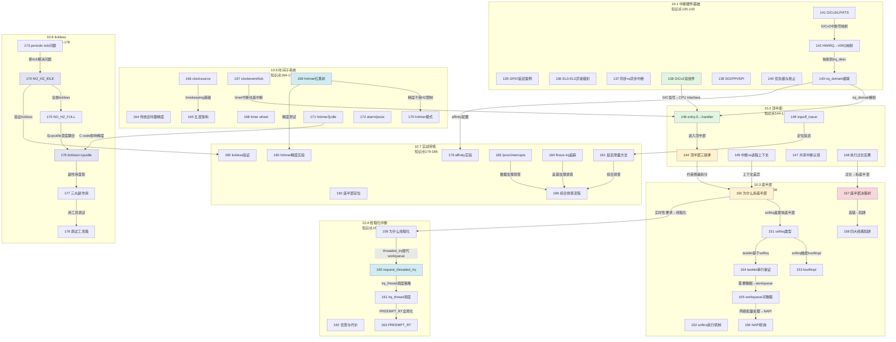
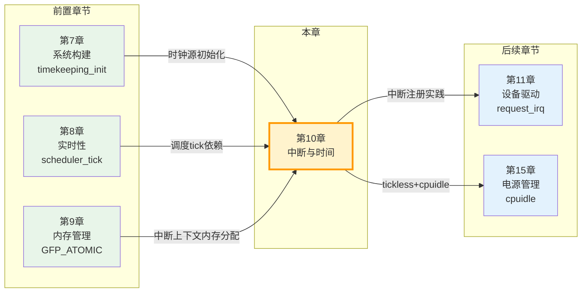

# 10.99 知识图谱与查漏补缺

> 所属章节：第10章 中断与时间 > 10.99 知识图谱与查漏补缺
>
> 难度：[I] | 预计阅读时间：30分钟

##  本节导读

学完一整章，脑子里是不是塞满了GIC、顶半部、softirq、hrtimer、NO_HZ这些概念？本节帮你做两件事： 
第一，把52个知识点（135-186）串成一张关联图，让你看到"这个知识和那个知识是怎么连起来的"； 
第二，用10道自测题帮你快速定位还有哪些盲区； 
第三，一张速查表，面试前或问题排查时5分钟过一遍。 
说白了，这就是你 Interrupt & Time 子系统的"作战地图"。

---

##  本章知识点关联图 [I]

第10章的52个知识点不是孤立存在的。硬件基础支撑顶半部，顶半部的约束倒逼底半部的设计，底半部的选择又影响线程化中断的决策，时间子系统则依赖中断来驱动，tickless反过来改变中断行为。看懂了这张图，你就理解了整个子系统的"血液循环"。

> 💡 **提示**：图中绿色节点是硬件基础，黄色是中断处理核心，红色是底半部选择决策，浅蓝色是线程化/时间子系统，紫色是tickless。跨节的虚线箭头是本节的核心关联——GIC决定了中断怎么进内核，顶半部的约束倒逼底半部设计，hrtimer精度又和tickless/CPU-idle纠缠在一起。

---

##  核心概念速查表：52个知识点一句话总结 [I]

| 编号 | 知识点 | 一句话总结 | 关键文件/命令 |
|------|--------|-----------|--------------|
| **10.1 中断硬件基础** ||||
| 135 | GPIO延迟案例 | 工业PLC的GPIO中断延迟谜案，引出中断路径全章路线图 | `gpio-keys.c` |
| 136 | EL0-EL3异常级别 | ARM64四级异常级别：EL0应用、EL1内核、EL2虚拟化、EL3固件 | `arch/arm64/kernel/entry.S` |
| 137 | 同步vs异步中断 | 同步异常是CPU自己"踩雷"，异步中断是外部设备"敲门" | `ESR_ELx`寄存器 |
| 138 | GICv2双组件 | Distributor负责分发仲裁，CPU Interface负责递送CPU | `drivers/irqchip/gic.c` |
| 139 | SGI/PPI/SPI | SGI是CPU间通信、PPI是CPU私有、SPI是外设共享中断 | `GICD_TYPER` |
| 140 | 优先级与抢占 | GIC数值越小优先级越高，优先级分组决定是否能抢占 | `GICC_PMR` |
| 141 | GICv3/LPI/ITS | GICv3引入Redistributor和LPI，ITS实现MSI中断翻译 | `drivers/irqchip/gic-v3*` |
| 142 | HWIRQ→VIRQ映射 | 硬件中断号经irq_domain映射为Linux虚拟IRQ号 | `kernel/irq/irqdomain.c` |
| 143 | irq_domain级联 | 级联中断控制器通过父domain逐层解析中断号 | `irq_domain_add_*()` |
| **10.2 顶半部** ||||
| 144 | 顶半部三铁律 | hardirq不能睡眠、栈小（16KB）、必须尽快结束 | `in_interrupt()` |
| 145 | 中断vs进程上下文 | 中断上下文没有task_struct可切换，所以不能睡眠调度 | `struct pt_regs` |
| 146 | entry.S→handler | 七步链路：entry.S→handle_arch_irq→irq_desc→irqaction→handler | `handle_irq_event()` |
| 147 | 共享中断认领 | 多个设备共享同一IRQ，dev_id唯一标识，handler返回IRQ_HANDLED/IRQ_NONE | `SA_SHIRQ` |
| 148 | 执行过长后果 | 丢中断、其他中断饿死、实时任务抖动，超几十微秒就该拆分 | `irqsoff tracer` |
| 149 | irqsoff_tracer | ftrace的irqsoff tracer定位内核关中断过长的代码段 | `/sys/kernel/tracing/` |
| **10.3 底半部** ||||
| 150 | 为什么拆底半部 | 顶半部霸占CPU不放，底半部把"重活"延后到更合适上下文执行 | "接诊要快，治疗可以等" |
| 151 | softirq类型 | 静态注册的底半部（10种），同类型可在多CPU并行，网络收发包核心路径 | `kernel/softirq.c` |
| 152 | softirq执行机制 | raise_softirq标记位，中断退出时检查执行，过长退给ksoftirqd | `do_softirq()` |
| 153 | ksoftirqd | 每个CPU一个的softirq退化线程，避免用户态饿死，优先级最低 | `ksoftirqd/n` |
| 154 | tasklet串行保证 | 基于HI_SOFTIRQ/TASKLET_SOFTIRQ，同实例串行不同实例并行 | `tasklet_schedule()` |
| 155 | workqueue可睡眠 | 在进程上下文执行的底半部，可阻塞睡眠，用wq要选择合适队列 | `schedule_work()` |
| 156 | NAPI轮询 | 网络驱动的中断+轮询混合模式，忙时轮询、闲时中断，减少开销 | `napi_schedule()` |
| 157 | 底半部决策树 | 能否睡眠→workqueue；要并行→softirq；简单安全→tasklet | 决策树流程图 |
| 158 | 四大经典陷阱 | softirq里睡眠、tasklet重入、wq用错队列、在底半部里再次关中断 | BUG()/oops |
| **10.4 线程化中断** ||||
| 159 | 为什么线程化 | 传统中断打断高优先级任务，线程化让中断可调度可抢占 | PREEMPT_RT需求 |
| 160 | request_threaded_irq | 两阶段模型：primary handler（顶半）+ thread_fn（线程底半） | `request_threaded_irq()` |
| 161 | irq_thread调度 | 默认SCHED_FIFO，优先级可调，延迟可控 | `irq_thread`进程 |
| 162 | 优势与代价 | 延迟变低、可睡眠，但多一次上下文切换、吞吐量略降 | 延迟vs吞吐量权衡 |
| 163 | PREEMPT_RT | threadirqs启动参数全局强制线程化，RT补丁的核心改动 | `threadirqs` |
| **10.5 时间子系统** ||||
| 164 | 传统定时器精度 | 旧timer_list精度受HZ限制，典型1ms~10ms，不适合精细定时 | `jiffies`精度局限 |
| 165 | 五层架构 | clocksource→timekeeping→clockevent→tick device→hrtimer，硬件无关层在上 | 分层架构图 |
| 166 | clocksource | 提供读时基硬件抽象，rating机制竞争选出timekeeper | `clocksource_register()` |
| 167 | clockevent/tick | clockevent到时触发中断，tick device包装成周期性/oneshot节拍 | `tick_setup_device()` |
| 168 | timer wheel | 5级级联数组管理传统定时器，到期批量处理降低开销 | `__run_timers()` |
| 169 | hrtimer红黑树 | 按到期时间排序，最近到期在最左节点，μs级精度 | `kernel/time/hrtimer.c` |
| 170 | hrtimer模式 | 低分辨率模式经timer wheel，高分辨率模式绕过jiffies直接靠clockevent | `hrtimer_switch_to_hres()` |
| 171 | hrtimer与idle | CPU进C-state时钟门控，退出延迟破坏hrtimer精度，音频场景易爆音 | `cpuidle`协同 |
| 172 | alarm/posix | Alarm Timer支持Suspend唤醒，POSIX Timer给用户空间高精度定时 | `timer_create()` |
| **10.6 tickless** ||||
| 173 | periodic tick问题 | 周期性tick在idle时空转，1000次/秒醒来查无可调度任务，浪费电 | `CONFIG_HZ` |
| 174 | NO_HZ_IDLE | idle CPU停掉tick，下次事件前通过clockevent精准唤醒 | `CONFIG_NO_HZ_IDLE` |
| 175 | NO_HZ_FULL | 指定CPU运行态也停tick，完全不被内核打断，HPC场景利器 | `CONFIG_NO_HZ_FULL` |
| 176 | tickless+cpuidle | tick停掉→进深C-state→事件来→退C-state→恢复tick，深度协同 | `tick_nohz_*()` |
| 177 | 三大副作用 | CPU使用率统计失真、jiffies不更新、RCU grace period延长 | `/proc/stat`偏差 |
| 178 | 调试工具箱 | timer_list、stat、sched_debug、ftrace event综合定位tickless问题 | `/proc/timer_list` |
| **10.7 实战带练** ||||
| 179 | affinity实验 | 通过smp_affinity把中断绑到指定CPU，解决单核软中断飙高 | `/proc/irq/N/smp_affinity` |
| 180 | hrtimer精度实验 | 用cyclictest或自写模块测量hrtimer实际精度，验证C-state影响 | `cyclictest` |
| 181 | 延迟测量方法 | 从中断触发到handler执行的延迟测量：gpio+示波器或ftrace | `hwlatdetect` |
| 182 | 底半部定位 | 三板斧：trace_softirq、perf、在handler里加tracepoint | `perf record` |
| 183 | /proc/interrupts | 看中断分布是否均匀、是否有中断风暴、各CPU负载平衡 | `cat /proc/interrupts` |
| 184 | ftrace irq追踪 | `irq_handler_entry/exit`、`irqsoff`、` preemptoff`事件追踪 | `/sys/kernel/tracing/events/irq/` |
| 185 | tickless验证 | 5步验证：确认配置→检查timer_list→对比功耗→测延迟→看RCU | `powertop` |
| 186 | 综合排查流程 | 中断问题五步排查：现象确认→中断分布→延迟分析→底半部审查→关联子系统 | 系统化思维 |

---

##  自测题：你真的学会了吗？ [I]

下面10道题覆盖了本章关键概念。选择题侧重辨析，简答题侧重理解。建议先闭卷做，再对照答案。

### 选择题（5道）

**Q1. GICv3相比GICv2最大的架构变化是什么？**

A. 增加了更多的SPI中断号 
B. 引入了Redistributor组件，支持LPI和ITS中断翻译 
C. 把Distributor和CPU Interface合并了 
D. 取消了中断优先级机制

**Q2. 顶半部（hardirq）不能睡眠的根本原因是？**

A. 中断处理函数里禁止了内存分配 
B. 中断上下文没有与之绑定的task_struct，调度器无法切换 
C. 硬件会自动屏蔽所有中断，睡眠也无法被唤醒 
D. 中断栈只有4KB，放不下睡眠所需的上下文

**Q3. 你的驱动需要在中断底半部里调用 `msleep(10)`，应该选哪种底半部机制？**

A. softirq，因为它执行最快 
B. tasklet，因为它比softirq更安全 
C. workqueue，因为它在进程上下文中可以睡眠 
D. 直接放在顶半部里做，不用拆分

**Q4. hrtimer在高分辨率模式下精度不受HZ限制，它依赖的核心机制是？**

A. 直接操作jiffies变量 
C. 绕过timer wheel，直接通过clockevent硬件编程到期时间 
B. 增加内核HZ到10000 
D. 使用忙等待（busy-wait）来保证精度

**Q5. 启用NO_HZ_IDLE后，下面哪个副作用最值得关注？**

A. 内核崩溃概率增加 
B. 用户态程序无法创建定时器 
C. 依赖jiffies更新的代码可能感知不到时间推进 
D. 网络吞吐量降低50%

---

### 简答题（5道）

**Q6. 请画出"收到中断信号→handler执行"的七步链路，并说明哪一步与irq_domain相关。**

**Q7. 解释为什么softirq里调用`kmalloc(GFP_KERNEL)`会导致死锁，而workqueue里同样调用却没问题。**

**Q8. request_threaded_irq()的两阶段模型中，如果primary handler返回IRQ_WAKE_THREAD但thread_fn执行了很长时间，会有什么风险？如何处理？**

**Q9. hrtimer精度在CPU进入深C-state时会变差，请解释这个因果关系链。**

**Q10. NO_HZ_IDLE和NO_HZ_FULL的核心区别是什么？为什么后者需要搭配`rcu_nocbs`使用？**

---

### 答案与解析

**A1. 答案：B**

> GICv3最大的架构演进是引入了Redistributor（每个CPU一个，管理PPI和LPI）和ITS（Interrupt Translation Service，把DeviceID→EventID翻译为LPI中断号）。A只提到数量增加不是"架构变化"；C说合并了是错的，实际是拆得更细；D说取消优先级更是错的。

**A2. 答案：B**

> 中断上下文是" borrowed "的当前进程的上下文，没有独立的task_struct。睡眠需要把当前任务切出等待队列，但中断上下文没有这个"当前任务"。A错在kmalloc(GFP_ATOMIC)是可以的；C错在睡眠不依赖中断是否屏蔽；D错在arm64中断栈是16KB不是4KB。

**A3. 答案：C**

> `msleep()`会调用调度器让出CPU，这只有在进程上下文才能做。workqueue的工作函数运行在worker内核线程的进程上下文中，所以可以安全睡眠。A和B都运行在中断上下文（softirq/tasklet），睡眠会触发BUG()。D违反顶半部三铁律。

**A4. 答案：C**

> hrtimer高分辨率模式下直接对clockevent编程，设置精确的到期时间，绕过了传统的jiffies/tick机制。A说jiffies是传统timer的方式；B说增加HZ虽然能提升精度但不是hrtimer的做法；D说忙等待是错误的，hrtimer靠中断唤醒。

**A5. 答案：C**

> NO_HZ_IDLE在CPU idle时停掉了tick，jiffies不再每个tick更新，而是由下一个即将到时的CPU负责推进。依赖jiffies做超时的老代码会感知不到时间推进。A错在内核不会崩溃；B错在用户态定时器不受影响；D错在网络吞吐无直接关联。

**A6. 参考答案：**

> 七步链路：① 外设发出电信号 → ② GIC接收并仲裁 → ③ GIC通过CPU Interface发送给CPU → ④ CPU跳转到异常向量表（entry.S）→ ⑤ `handle_arch_irq()` 架构统一入口 → ⑥ 查找`irq_desc[irq]`获取中断描述符 → ⑦ 遍历irqaction链表调用handler。
>
> 与irq_domain相关的是第②→③步的映射过程：GIC的硬件中断号（HWIRQ）通过irq_domain映射为Linux的虚拟IRQ号（VIRQ），`irq_domain`的xlate函数解析设备树`interrupts`属性，map函数建立HWIRQ→VIRQ的映射关系。

**A7. 参考答案：**

> `kmalloc(GFP_KERNEL)`在内存不足时会触发直接回收（direct reclaim），这个过程需要等待IO完成，也就是睡眠等待。softirq运行在中断上下文，没有可切换的task_struct，一旦试图睡眠就会触发`BUG_ON(in_interrupt())`导致oops。而workqueue运行在worker内核线程的进程上下文中，有完整的task_struct，调度器可以正常将其切出等待，所以`kmalloc(GFP_KERNEL)`是安全的。

**A8. 参考答案：**

> 风险：如果thread_fn执行很长时间（比如几十毫秒），对于level触发的中断，由于IRQF_ONESHOT标志的作用，中断线在整个thread_fn执行期间保持禁用状态，其他设备共享该中断线时也会被阻塞。如果是边沿触发则风险较小。
>
> 处理方法：① 缩短thread_fn中的工作量，只做最小必要操作；② 如果必须长操作，在thread_fn里用workqueue再递延一层；③ 如果不是共享中断，可以考虑不加IRQF_ONESHOT（level触发必须加）；④ 调整irq_thread的优先级确保不被饿死。

**A9. 参考答案：**

> 因果链：CPU进深C-state（如C3/C6）→ 系统总线时钟被门控（clock gating）→ hrtimer依赖的clockevent硬件也停止计数或精度降低 → 外部事件到来唤醒CPU → CPU退出C-state需要时间（exit latency，几十到几百微秒）→ 这段时间内hrtimer无法被处理 → 音频等实时场景出现爆音或时序偏差。
>
> 解决方案：① 限制最大C-state（`processor.max_cstate=1`）；② 对延迟敏感任务绑到不进入深C-state的CPU；③ 使用`sched_setscheduler()`+`SCHED_FIFO`保障调度；④ 使用`cpuidle` governor调优。

**A10. 参考答案：**

> NO_HZ_IDLE：只在CPU进入idle状态时停掉周期性tick，有任务运行时tick正常。解决的是idle时的功耗浪费。
>
> NO_HZ_FULL：在有任务运行时**也**停掉tick，目标CPU完全不被内核tick打断。解决的是HPC等场景下tick对计算任务的干扰。
>
> 需要`rcu_nocbs`的原因：NO_HZ_FULL的CPU长时间不进入内核态，无法执行RCU回调（RCU需要 periodically quiescent state）。`rcu_nocbs`把RCU callback offload到其他CPU上执行，避免RCU grace period无限延长导致RCU stall。

---

##  与前后章关联 [I]

第10章不是一座孤岛。理解这些关联，能让你在排查问题时"左右逢源"。

| 方向 | 章节 | 关联点 | 为什么重要 |
|------|------|--------|-----------|
| ← 前置 | 第7章 系统构建 | `timekeeping_init()`在start_kernel()中初始化时钟源 | 第10章的clocksource注册依赖于第7章的初始化流程，timekeeping从哪个clocksource启动决定了系统启动后时间精度 |
| ← 前置 | 第8章 实时性 | `scheduler_tick()`在每个tick中更新vruntime，CFS调度依赖tick | 第10章的NO_HZ直接影响调度器的tick更新频率，PREEMPT_RT与线程化中断在第10.4节深度耦合 |
| ← 前置 | 第9章 内存管理 | 中断中的`kmalloc`必须用`GFP_ATOMIC` | 第9章讲的slab分配器在中断上下文有特殊约束，第10章的顶半部正是这一约束的典型场景 |
| → 后续 | 第11章 设备驱动 | 驱动通过`request_irq()`/`request_threaded_irq()`注册中断 | 第10章是整个中断子系统的原理铺垫，第11章把这些原理付诸驱动实践 |
| → 后续 | 第15章 电源管理 | tickless与cpuidle深度耦合，C-state进出影响中断延迟 | 第10章的NO_HZ是第15章cpuidle框架的"上游"，两者共同决定设备待机功耗 |

> ⚠️ **陷阱**：很多人学中断时只顾着看`request_irq()`怎么用，忽略了第7章的timekeeping_init和第9章的GFP_ATOMIC约束。等你真写到驱动里在中断里调用`kmalloc(GFP_KERNEL)`导致oops，才想起来翻第9章——那时候已经踩坑了。

---

##  本节总结

| 模块 | 核心要点 | 自测标准 |
|------|---------|---------|
| 知识图谱 | 52个知识点分7节，硬件→顶半部→底半部→线程化→时间→tickless→实战，形成完整链路 | 能不看图口述出任意两个知识点之间的关联 |
| 速查表 | 每知识点一句话+关键文件，面试前5分钟过一遍 | 看到任意知识点编号能说出它是什么 |
| 自测题 | 5选择+5简答，覆盖GIC、顶半部约束、底半部选择、hrtimer精度、tickless副作用 | 10道题闭卷做对8道以上 |
| 前后关联 | 前接第7/8/9章的初始化/调度/内存，后续第11/15章的驱动/电源 | 能说出第10章和第8章在PREEMPT_RT上的交汇点 |

---

##  下一步

这张知识图谱不是让你"背下来"的。正经用法有三种： 
① **面试前**：把速查表过一遍，重点看标记了[M]的知识点； 
② **问题排查**：遇到中断延迟或定时器不准，先在关联图上定位属于哪个分支，再精准翻到对应小节； 
③ **写驱动前**：先看决策树（知识点157）确定底半部选什么，再看知识点160决定要不要用threaded IRQ。 

下一章是第11章——设备驱动。你在第10章学的`request_irq()`、`request_threaded_irq()`、底半部选择策略，都将在真实的驱动代码中落地。

---

##  配套资源

| 资源 | 位置/命令 | 用途 |
|------|----------|------|
| 知识点关联图 | 本节mermaid图 | 全章52个知识点的关系总览 |
| 52知识点速查表 | 上表 | 面试前快速复习 |
| 自测题+答案 | 本节10道题 | 检验掌握程度 |
| 前后章关联图 | 本节mermaid图 | 理解第10章在全书中的位置 |
| 查漏补缺清单 | 见下方 | 逐条打勾确认 |

**52知识点查漏补缺清单**

画勾之前问自己：这个知识点我能不能在3分钟内给别人讲清楚？

- [ ] **135** GPIO延迟案例 → 中断路径全章路线图 
- [ ] **136** EL0-EL3异常级别体系 
- [ ] **137** 同步异常 vs 异步中断 
- [ ] **138** GICv2 Distributor + CPU Interface 
- [ ] **139** SGI/PPI/SPI三种中断类型 
- [ ] **140** GIC优先级与抢占机制 
- [ ] **141** GICv3 Redistributor + LPI + ITS 
- [ ] **142** HWIRQ → VIRQ映射机制 
- [ ] **143** irq_domain三种映射 + 级联中断 
- [ ] **144** 顶半部三铁律：不睡眠、栈小、要快 
- [ ] **145** 中断上下文 vs 进程上下文 
- [ ] **146** entry.S → handler 七步链路 
- [ ] **147** 共享中断与handler认领机制 
- [ ] **148** 顶半部执行过长的三个后果 
- [ ] **149** irqsoff_tracer定位关中断真凶 
- [ ] **150** 为什么需要拆分底半部 
- [ ] **151** softirq类型与静态定义 
- [ ] **152** softirq执行机制与触发路径 
- [ ] **153** ksoftirqd内核线程的作用 
- [ ] **154** tasklet的本质与串行保证 
- [ ] **155** workqueue：能睡眠的底半部 
- [ ] **156** NAPI中断+轮询混合模式 
- [ ] **157** 底半部选择决策树 
- [ ] **158** 底半部四大经典陷阱 
- [ ] **159** 为什么需要线程化中断 
- [ ] **160** request_threaded_irq两阶段模型 
- [ ] **161** irq_thread优先级与调度策略 
- [ ] **162** 线程化中断的优势与代价 
- [ ] **163** PREEMPT_RT与threadirqs 
- [ ] **164** 传统定时器精度问题 
- [ ] **165** 时间子系统五层架构 
- [ ] **166** clocksource与rating机制 
- [ ] **167** clockevent与tick device 
- [ ] **168** timer wheel级联实现 
- [ ] **169** hrtimer红黑树机制 
- [ ] **170** hrtimer两种模式切换 
- [ ] **171** hrtimer精度与CPU idle 
- [ ] **172** alarm_timer与posix_timer 
- [ ] **173** periodic tick的功耗问题 
- [ ] **174** NO_HZ_IDLE实现机制 
- [ ] **175** NO_HZ_FULL设计目标 
- [ ] **176** tickless与cpuidle协同 
- [ ] **177** tickless三大副作用 
- [ ] **178** tickless调试工具箱 
- [ ] **179** 中断亲和性配置实验 
- [ ] **180** hrtimer精度测试实验 
- [ ] **181** 中断延迟测量方法 
- [ ] **182** 底半部问题定位技巧 
- [ ] **183** /proc/interrupts解读 
- [ ] **184** ftrace irq事件追踪 
- [ ] **185** tickless验证实验 
- [ ] **186** 综合排查流程 

> 这份清单的正经用法是：从头到尾扫一遍，把感觉模糊的画出来，然后针对性地回去翻对应小节。画完一轮再画一轮，三轮下来这些就真成你的了。
