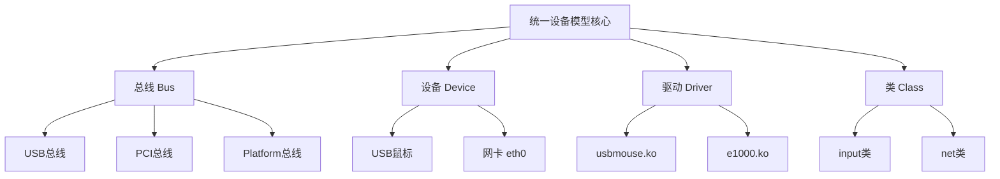

# 11.1.1 为什么需要设备模型

> 所属章节：第11章 驱动架构与设备模型 > 11.1 设备模型初识
> 难度：[I] | 预计阅读时间：8分钟

## 本节导读

本节带你回顾Linux内核设备模型的来龙去脉——为什么2.6版本要花大力气搞出一套"设备模型"？没有它之前，驱动程序是怎么写硬件的？学完后，你能说清楚早期驱动的痛点，并理解设备模型到底解决了什么问题。

---

## 知识点130：没有设备模型的年代——驱动各自为政 [I] ~800字

### 把早期驱动比作"各占山头的土匪"

想象你住在一个**没有物业、没有门牌号的小区**里 [图1：无物业小区类比图]。每户人家（驱动）想怎么盖房就怎么盖房，A户把水管接在了B户的电线上，C户占了公共通道当自家院子。没有统一的规划，没有登记备案，谁拳头硬谁先用——这就是早期Linux驱动的真实写照。

在2.6版本之前（以及很多嵌入式系统的裸机程序），驱动程序操作硬件的方式非常"原始"：直接硬编码I/O地址，想读就读，想写就写，互不通报。

```c
// 代码1：早期驱动的典型写法——硬编码一切
#define MY_IO_PORT  0x3F8
#define MY_IRQ      4

static int old_driver_init(void)
{
    // 直接申请，不检查冲突
    request_region(MY_IO_PORT, 8, "my_driver");
    request_irq(MY_IRQ, my_handler, 0, "my_irq", NULL);
    // 注册完毕，开始干活
    return 0;
}
```

这种写法的问题在于：**每个驱动都活在自己的世界里**。A驱动用了`0x3F8`这组端口，B驱动根本不知道，也能来申请同一组——冲突就这样发生了。

### 四大痛点：没有设备模型的世界有多乱

| 问题 | 具体表现 | 后果 |
|------|---------|------|
| 资源冲突 | 两个驱动申请同一I/O端口或IRQ | 系统崩溃、数据错乱、调试 nightmare |
| 驱动各自为政 | 没有统一框架，每家自己管理生命周期 | 代码重复、维护困难、内核越来越臃肿 |
| 无法热插拔 | 硬件插拔时内核毫无感知 | U盘插上没反应，拔掉可能直接挂 |
| 没有 sysfs | 用户态看不到设备状态和层次关系 | `ls /sys` 空空如也，排查问题全靠猜 |

🔴 **危险**：资源冲突不是理论上的风险，而是真实发生过的惨案。Linux 2.4时代，串口驱动和某个调制解调器驱动竞争`0x3F8`端口，导致系统启动时随机死锁——问题排查了两周，最后发现是两个驱动在抢同一个资源。

### 2.6 的破局：统一设备模型登场

2003年底发布的Linux 2.6内核做了一件大事：引入**统一设备模型**（Unified Device Model）。核心思想很简单：把所有设备、驱动、总线纳入一个统一的数据结构树中，让内核"知道"硬件长什么样、谁在用哪个资源、设备之间是什么关系。



[图2：统一设备模型的四大核心组件关系图]

这套模型的直接产物就是`/sys`文件系统。你现在可以在任何Linux系统上执行：

```bash
# 代码2：通过 sysfs 查看设备的层次结构
$ ls /sys/devices/
breakpoint  LNXSYSTM:00  pci0000:00  platform  system  virtual

# 代码3：查看某个具体设备的资源和驱动绑定情况
$ ls /sys/bus/usb/devices/1-1/
authorized  bDeviceClass  bDeviceProtocol  driver  ep_00  idProduct  idVendor  manufacturer
```

💡 **提示**：`/sys`目录下的内容不是存储在磁盘上的普通文件，而是内核数据结构的可视化投影。每个目录、每个文件都对应内核里一个`kobject`对象——这是设备模型的"原子单位"。

⚠️ **陷阱**：很多初学者把`/sys`和`/proc`搞混。记住这个区别：`/proc`主要是进程信息和运行时参数（偏软件），`/sys`主要是设备模型和硬件层次（偏硬件）。2.6之后，硬件相关的内容逐渐从`/proc`迁移到了`/sys`。

### 设备模型到底带来了什么

有了设备模型之后，内核终于能回答这几个关键问题了：

- **这台机器上有哪些设备？** → 遍历设备树就知道了
- **这个设备用的是哪个驱动？** → 查设备节点下的`driver`软链接
- **这个驱动支持哪些设备？** → 查驱动目录下的`devices`列表
- **热插拔时怎么办？** → 总线通知机制，设备来了自动匹配驱动

这些能力看起来理所当然，但在2.4及更早版本的内核中，几乎是无法实现的。设备模型的引入，标志着Linux从一个"能跑的服务器系统"真正成长为一个"能管得好硬件的工业级操作系统"。

---

## 本节总结

| 概念 | 核心要点 | 自查操作 |
|------|---------|---------|
| 早期驱动 | 硬编码I/O地址，各自管理资源，容易引发冲突 | 想象没有物业的小区 |
| 资源冲突 | 多个驱动竞争同一端口/IRQ/内存区域 | 查看内核日志中的"resource busy" |
| 设备模型 | 2.6引入的统一框架，用总线-设备-驱动-类描述硬件 | 理解`struct bus_type`、`struct device`等核心结构 |
| sysfs | 设备模型的用户态投影，`/sys`下能看到硬件全貌 | `ls /sys/bus` 查看系统有哪些总线 |

---

## 下一步

你已经知道了"为什么需要设备模型"——没有它，驱动就是一盘散沙，资源冲突、热插拔都无从谈起。下一节（11.1.2）我们将深入设备模型的核心数据结构，看看内核代码里是怎么用`struct device`、`struct driver`把这些概念落到实处的。

---

## 配套资源

### 表格清单
- 表1：没有设备模型的四大痛点及后果
- 表2：本节总结自查表

### 图示清单
- 图1：无物业小区类比图 [配图说明：一片杂乱的自建房区域，各户抢占公共空间，没有统一规划，电线水管交错混乱]
- 图2：统一设备模型的四大核心组件关系图 [mermaid图]

### 代码清单
- 代码1：早期驱动的典型写法——硬编码I/O地址和IRQ
- 代码2：通过 sysfs 查看设备的层次结构（`ls /sys/devices/`）
- 代码3：查看USB设备的驱动绑定情况（`ls /sys/bus/usb/devices/1-1/`）
