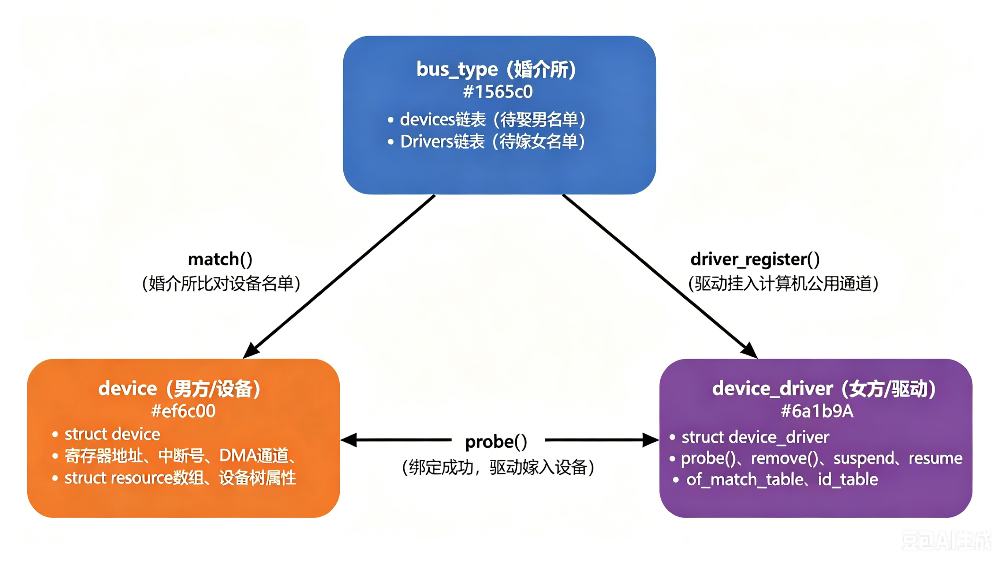

# 11.1.2 总线-设备-驱动三角关系

> 所属：第11章 设备模型 > 11.1 总线-设备-驱动模型
> 
> 难度：[I] | 预计阅读时间：13分钟

## <span class="blue"> 本节导读

「设备从设备树节点到 probe 成功」这条主线的第一步，是认清参与配对的三个角色：`bus_type`、`device`、`device_driver`。设备持有硬件资源，驱动持有操作函数，总线负责把两边配成对——所有驱动的加载与绑定，都是这三者交互的结果。本节把这套静态结构讲清楚，为 11.1.3 的动态调用链打底。<BR>
本节覆盖：三个核心结构体的关键字段与分工、配对的双向触发机制、不同总线的 match 对比规则、三角关系在 sysfs 中的可见形态。

---

## <span class="blue"> 三个结构体：一条总线、一台设备、一个驱动 [I]

### 先立三个定义

三个结构体都定义在 `<linux/device.h>` 体系中，对应用层工程师来说可以先建立一句话认知：

- **`struct bus_type`**：描述一类总线（platform、i2c、pci、usb……）的内核对象，持有一份设备链表、一份驱动链表，以及一套配对规则（`match()`）。
- **`struct device`**：内核中代表一台硬件设备的对象。它本身不存寄存器地址和中断号，但持有指向资源描述的入口（设备树节点 `of_node`、板级数据 `platform_data`）。
- **`struct device_driver`**：内核中代表一个驱动程序的对象，持有 `probe()`、`remove()` 等回调函数和描述「支持哪些设备」的匹配表。

### 关键字段

日常驱动开发不需要记住全部字段，但下面这些必须眼熟：

```c
/* 以下均为精简示意，只保留理解配对逻辑所需的字段 */

/* 总线：维护设备与驱动两条链表，定义配对规则 */
struct bus_type {
    const char  *name;            /* 总线名，如 "platform"、"i2c" */
    int (*match)(struct device *dev, struct device_driver *drv);
    struct subsys_private *p;     /* 内部结构：设备链表、驱动链表都在这里 */
};

/* 设备：代表一台硬件，持有资源描述入口 */
struct device {
    struct device        *parent;         /* 父设备，构成层次结构 */
    struct bus_type      *bus;            /* 挂在哪条总线 */
    struct device_driver *driver;         /* 配对成功后指向驱动 */
    struct device_node   *of_node;        /* 对应的设备树节点 */
    void                 *platform_data;  /* 板级私有数据（非设备树方式） */
    struct kobject        kobj;           /* 内嵌的内核对象，11.1.4 展开 */
};

/* 驱动：代表一段软件实现，持有操作函数与匹配表 */
struct device_driver {
    const char          *name;
    struct bus_type     *bus;             /* 要注册到哪条总线 */
    int (*probe)(struct device *dev);     /* 配对成功后由内核调用 */
    int (*remove)(struct device *dev);
    const struct of_device_id *of_match_table;  /* 设备树匹配表 */
};
```

> 💡 硬件资源（I/O 内存地址、中断号）不在 `struct device` 里，而在包装它的具体设备结构体中。<br>以 platform 设备为例：`struct platform_device` 内嵌一个 `struct device`，外加 `struct resource *resource` 数组和 `num_resources`。驱动在 probe 里通过 `platform_get_resource()` 取资源，而不是直接访问 `struct device`。


### 配对是双向触发的

总线维护两条链表：`klist_devices`（已注册设备）和 `klist_drivers`（已注册驱动）。配对在两个方向上都会发生：

- **设备注册时**：`device_add()` 把设备挂到总线，随后遍历总线的驱动链表，逐个调用 `match()`，命中则执行该驱动的 `probe()`。
- **驱动注册时**：`driver_register()` 把驱动挂到总线，随后遍历总线的设备链表，逐个调用 `match()`，命中则执行 `probe()`。

因此设备和驱动的注册顺序不影响最终结果：先到的一方挂在链表上等待，后到的一方注册时完成配对。一个驱动可以依次匹配多台设备（同一型号的串口可以有多路），一台设备同一时间只绑定一个驱动。

* 路径 A：设备先到，驱动后到
```
device_add(dev)
    ├── bus_add_device(dev)          // ← 挂进 klist_devices : 单纯挂链表，没做匹配
    └── bus_probe_device(dev)        // ← 尝试给这个设备找驱动 : 触发遍历对方链表
          └── device_attach(dev)
                └── bus_for_each_drv(bus, NULL, dev, __device_attach) // ← 遍历总线上已注册的驱动/设备
                      // 遍历 klist_drivers 里的每一个驱动
                      └── __device_attach(dev, drv)
                            ├── driver_match_device(drv, dev) // ← 加锁后调用 bus->match()，返回 1 表示匹配成功 
                            │         └── bus->match(dev, drv)   // ← match()
                            └── driver_probe_device(drv, dev)      // match 返回 1 才走这里
                                  └── really_probe(dev, drv)  // 内核里真正干活的函数：调用 drv->probe()，处理 devlink、电源管理、绑定 sysfs 等
                                        └── drv->probe(dev)        // ← probe()
```

* 路径 B：驱动先到，设备后到
```
driver_register(drv)
    ├── bus_add_driver(drv)          // ← 挂进 klist_drivers : 单纯挂链表，没做匹配
    └── driver_attach(drv)           // ← 尝试给这个驱动找设备 : 触发遍历对方链表
          └── bus_for_each_dev(bus, NULL, drv, __driver_attach) // ← 遍历总线上已注册的驱动/设备
                // 遍历 klist_devices 里的每一个设备
                └── __driver_attach(dev, drv)
                      ├── driver_match_device(drv, dev)
                      │         └── bus->match(dev, drv)         // ← 同样的 match()
                      └── driver_probe_device(drv, dev)
                            └── really_probe(dev, drv)
                                  └── drv->probe(dev)              // ← 同样的 probe()
```

**关键结论**：两条路径在 `driver_match_device()` 之后完全重合，后面走的是同一套 `really_probe()`。
<!--  -->

### 不同总线的 match 规则

`match()` 由各总线自己实现，对比内容取决于总线枚举设备的方式：

| 总线 | match 对比内容 | 典型来源 |
|------|---------------|---------|
| platform | 设备树 `compatible` vs `of_match_table`，退化到 `id_table`、设备名 | 设备树节点 |
| i2c / spi | 设备树 `compatible` vs `of_match_table`，退化到 `id_table` 名字 | 设备树节点或板级声明 |
| usb | `idVendor` + `idProduct` vs `usb_device_id` 表 | 设备插入时协议枚举 |
| pci | vendor/device ID、class 码 vs `pci_device_id` 表 | 总线扫描枚举 |

platform 总线的实际实现（`drivers/base/platform.c` 中的 `platform_match()`）优先级为：OF（设备树 compatible）> `id_table` > 设备名字符串。<br>现代 ARM 嵌入式开发以 OF 匹配为主，`id_table` 与名字匹配用于非设备树平台。


```c
// drivers/base/platform.c
static int platform_match(struct device *dev, struct device_driver *drv)
{
    struct platform_device *pdev = to_platform_device(dev);
    struct platform_driver *pdrv = to_platform_driver(drv);

    /* 1. OF 匹配：设备树 compatible vs of_match_table */
    if (of_driver_match_device(dev, drv))
        return 1;

    /* 2. id_table 匹配 */
    if (pdrv->id_table)
        return platform_match_id(pdrv->id_table, pdev) != NULL;

    /* 3. 退化到名字字符串匹配 */
    return (strcmp(pdev->name, drv->name) == 0);
}
```

这个 `platform_match()` 就是 `bus_type` 结构体里的 `match` 函数指针。内核在 `driver_match_device()` 里调用它：

```c
// drivers/base/dd.c
static inline int driver_match_device(struct device_driver *drv,
                                      struct device *dev)
{
    return drv->bus->match ? drv->bus->match(dev, drv) : 1;
}
```

所以 `match()` 的返回值决定了是否进入 `probe()`：
- 返回 **1** → 匹配成功 → 继续走 `driver_probe_device()` → `really_probe()` → `drv->probe()`
- 返回 **0** → 匹配失败 → 跳过，继续遍历下一个

> 💡 各类总线驱动写法差别很大，但匹配表的结构是统一的：设备树节点的 `compatible` 字符串与驱动 `of_match_table` 中的条目做精确字符串比对，一个字符不一致就匹配失败，且内核不打印任何日志。

### 三者职责对比

| 角色 | 核心数据 | 关键回调 | 驱动开发中主要做什么 |
|------|---------|---------|---------------------|
| bus_type | 设备链表、驱动链表 | `match()` | 很少直接涉及，`platform_bus_type` 等已由内核实现 |
| device | `of_node`、`resource` | 无（被动等待驱动） | 在设备树中描述硬件，或手工填充 `platform_device` |
| device_driver | `of_match_table`、`id_table` | `probe()`、`remove()` | **主要工作**：实现回调、填写匹配表 |

### 三角关系在 sysfs 中是可见的

三个结构体都内嵌或关联 `kobject`（内核对象基础设施，负责命名、层次和引用计数，11.1.4 展开），因此配对状态直接投影在 `/sys` 下：

```
/sys/bus/platform/
├── devices/                    <- 挂在 platform 总线上的设备
│   └── ff000000.serial -> ../../../devices/platform/...
└── drivers/                    <- 挂在 platform 总线上的驱动
    └── my_serial/
        └── ff000000.serial -> ../../../devices/...   <- 绑定关系的符号链接
```

设备目录下的 `driver` 符号链接指向其绑定的驱动，驱动目录下的设备符号链接列出它管理的所有设备。内核日志里的 `probe`、`bind` 打印，对应的就是这两条链表上发生的配对动作。

---

## <span class="blue"> 本节总结

| 概念 | 核心要点 | 自查操作 |
|------|---------|---------|
| bus_type | 总线维护设备/驱动两条链表，定义 match 规则 | `ls /sys/bus/` 查看系统注册的总线 |
| device | 代表硬件，资源在 platform_device 的 resource 数组中 | `ls /sys/bus/platform/devices/` |
| device_driver | 代表软件实现，持有 probe/remove 与匹配表 | `ls /sys/bus/platform/drivers/` |
| 双向配对 | 设备或驱动任一方注册都会触发遍历匹配，顺序不影响结果 | 读设备目录下的 `driver` 符号链接 |
| match 规则 | platform 以 of_match_table 比对 compatible 为主 | 对比设备树 compatible 与驱动匹配表 |

---

## <span class="blue"> 下一步

三个角色的静态结构已经清楚，但它们之间的调用是动态发生的：`driver_register()` 之后内核经过哪些函数、在哪一步调用 `match()`、又在哪一步进入 `probe()`，下一节（11.1.3）逐层拆解这条调用链，并给出 probe 未执行时的排查顺序。

---
