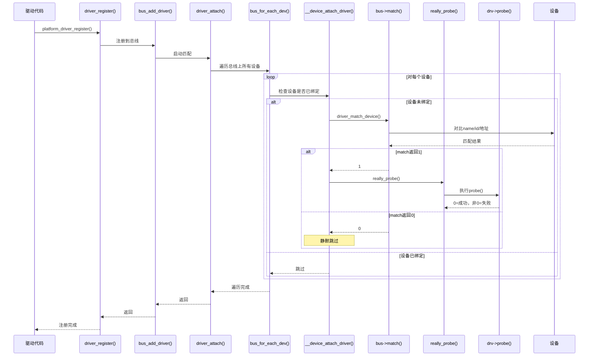

# 11.1.3 match()与probe()的调用链

> 所属章节：第11章 Linux驱动模型与设备树 > 11.1 总线-设备-驱动模型
> 难度：[I→M] | 预计阅读时间：12分钟

## 本节导读
前面两节你已经认识了总线、设备、驱动这三兄弟，知道了它们各自的数据结构和注册函数。本节要回答一个最关键的问题：**当一个驱动调用`driver_register()`之后，内核到底是怎么找到匹配的设备，并最终调用`probe()`的？** 搞懂这条调用链，以后遇到"注册了驱动但probe没执行"这类问题时，你就不会抓瞎了。

---

## 知识点133：driver_register()到probe()的完整调用链 [I][M] ~1000字

### 把调用链比作"相亲流程"

想象驱动注册就是去**婚介所登记**。小明（driver）去婚介所（bus）填资料，婚介所录入数据库，然后逐个翻档案库里的候选人（device），安排见面，看对眼了（match返回1）就正式交往（probe），看不中就沉默地翻下一份，全程不通知你被拒了。

整个代码流程如下，建议对着源码`drivers/base/driver.c`和`drivers/base/bus.c`看：

```
driver_register(struct device_driver *drv)
  └─> bus_add_driver(struct device_driver *drv)
        └─> driver_attach(struct device_driver *drv)
              └─> bus_for_each_dev(struct bus_type *bus, ...)
                    └─> __device_attach_driver(struct device_driver *drv, struct device *dev)
                          └─> driver_match_device(drv, dev)     // 调用bus->match()
                                |-- 返回1：匹配成功
                                |       └─> really_probe()
                                |             └─> dev->bus->probe(dev) 或 drv->probe(dev)
                                |-- 返回0：不匹配，继续下一个设备
```

### 逐层拆解

**第1层：`driver_register()` —— "我要登记"**

驱动的入口。`platform_driver_register()`、`i2c_add_driver()`等封装最终都走到这里。核心任务是把`device_driver`挂到总线的`klist_drivers`链表上。注意：到这里还**没有**开始匹配设备。

**第2层：`bus_add_driver()` —— "录入数据库"**

给driver在sysfs创建目录（如`/sys/bus/platform/drivers/my_led`），然后把驱动节点挂到总线的驱动链表上，接着调用`driver_attach()`启动匹配。

**第3层：`driver_attach()` —— "开始翻简历"**

转折点。源码很简洁：

```c
// 代码1：driver_attach()核心逻辑
int driver_attach(struct device_driver *drv)
{
    return bus_for_each_dev(drv->bus, NULL, drv, __device_attach_driver);
}
```

它把活派给`bus_for_each_dev()`，第四个参数`__device_attach_driver`是对每个设备要执行的回调函数。

**第4层：`bus_for_each_dev()` —— "逐个安排见面"**

遍历该总线上已注册的所有设备，对每个设备调用回调。总线上有10个设备，回调就执行10次。遍历的是`bus->p->klist_devices`链表——如果设备还没注册，这里根本看不到。

```c
// 代码2：bus_for_each_dev遍历逻辑示意
int bus_for_each_dev(struct bus_type *bus, ...)
{
    klist_iter_init_node(&bus->p->klist_devices, &i, ...);
    while ((dev = next_device(&i))) {
        ret = fn(dev, data);  // fn就是__device_attach_driver
        if (ret) break;       // 非0则提前结束
    }
}
```

💡 **提示**：回调返回非0会提前终止遍历，但`__device_attach_driver`匹配成功时返回0，所以**一个驱动可以匹配多个设备**。

**第5层：`__device_attach_driver()` —— "检查对方是否单身"**

做匹配前的检查：

```c
// 代码3：__device_attach_driver核心逻辑
static int __device_attach_driver(struct device_driver *drv, void *data)
{
    struct device *dev = data;
    if (dev->driver)
        return 0;  // 已有主人，跳过
    return driver_match_device(drv, dev);
}
```

一个设备同一时间只能绑定一个驱动，`dev->driver`非空就直接跳过。

**第6层：`driver_match_device()` → `bus->match()` —— "看对眼"**

总线-specific的匹配逻辑：

| 总线 | match对比什么 | 常见坑 |
|------|-------------|--------|
| platform | `device.name` vs `driver.id_table[].name` | 大小写、`_` vs `-` |
| i2c | 设备地址 vs `id_table`地址范围 | 地址写错 |
| spi | `modalias` vs id_table | modalias没设置 |
| usb | vendor ID + product ID vs id_table | ID填错 |

```c
// 代码4：match()的两种命运
static inline int driver_match_device(...)
{
    return drv->bus->match ? drv->bus->match(dev, drv) : 1;
    // 返回1 = "看上眼了"
    // 返回0 = "没感觉，下一个"
}
```

⚠️ **陷阱**：match返回0时内核**不打印任何日志**，silent fail。驱动注册了，设备也注册了，但什么都没发生——这是新手最痛的debug场景。

**第7层：`really_probe()` —— "正式交往"**

match返回1后才会走到这里。依次调用总线的probe（如果有）、驱动自己的probe，创建sysfs属性文件，发送uevent事件。你写的`platform_driver.probe`就是在这里被执行的。

### 完整序列图



[图1：driver_register到probe的完整调用链序列图]

---

## 知识点134：为什么probe()可能不被调用 [I] ~500字

### 驱动注册了，probe就是没执行

最经典的驱动调试困境。`platform_driver_register()`返回0，但`probe()`里的printk一条都没出。逐个排查：

**原因1：match()返回0 —— "名字对不上"**

最常见。platform总线上，驱动的`id_table[].name`跟设备的`name`不匹配。比如设备树里`compatible = "vendor,my-led"`，但驱动的`of_match_table`里写的是`{"vendor,my_led", ...}`（连字符变下划线）。match返回0，内核不报警告。

**原因2：设备根本不存在 —— "档案库里没这人"**

`bus_for_each_dev()`遍历的是已注册的设备。驱动先注册了，但设备还没注册（设备树解析晚、模块加载顺序反了），遍历时看不到，match一次都不会被调用。

💡 **提示**：先`insmod`设备模块再`insmod`驱动模块。通过`/sys/bus/platform/devices/`查看已注册设备，目录为空就是设备注册的问题。

**原因3：设备已被绑定 —— "名花有主"**

`__device_attach_driver()`第一行检查`dev->driver`。非空说明被别的驱动绑走了，直接跳过。排查：`cat /sys/bus/platform/devices/你的设备/driver`看绑了谁。

**原因4：probe确实被调了，但内部失败了 —— "看对眼了，家里反对"**

match返回1，probe也执行了，但内部`devm_kzalloc()`失败、`clk_get()`拿不到时钟等原因返回了非0。在probe入口加printk就能确认——只要打印出来了，就说明probe被调用了，问题在内部。

### 返回值与排查

| 函数 | 返回0 | 返回非0 |
|------|-------|--------|
| match() | 不匹配，静默跳过 | 总线match一般不设非0语义 |
| probe() | 成功，设备绑定完成 | 失败，撤销绑定释放资源 |

排查速查表：

| 现象 | 可能原因 | 排查方法 |
|------|---------|---------|
| 注册成功但probe没执行 | match失败 | 对比设备name和驱动的id_table |
| 注册成功但probe没执行 | 设备不存在 | 检查`/sys/bus/xxx/devices/` |
| 注册成功但probe没执行 | 设备已被绑定 | `cat .../devices/xxx/driver` |
| probe打印了但返回错误 | 资源不可用 | probe入口加printk逐步定位 |

⚠️ **陷阱**：`driver_register()`返回0只代表"驱动加入了总线队列"，**不代表设备被匹配或probe被调用**。probe没执行时，先看match，再看设备在不在，再看设备是不是被绑走了——按这个顺序排查，不会走弯路。

---

## 本节总结

| 概念 | 核心要点 | 自查操作 |
|------|---------|---------|
| 调用链 | driver_register→bus_add_driver→driver_attach→bus_for_each_dev→__device_attach_driver→match→really_probe→probe | 对照源码或ftrace抓调用栈 |
| match() | 1=匹配进probe，0=不匹配静默跳过 | 检查name/id/地址严格一致 |
| probe不执行 | ①match失败 ②设备不存在 ③设备已绑定 ④probe内部失败 | 查看`/sys/bus/xxx/devices/`和driver文件 |
| probe() | 0=成功绑定，非0=失败释放 | probe入口加printk追踪 |

---

## 下一步

你已经搞懂了从`driver_register()`到`probe()`的完整调用链。下一节（11.1.4）我们将动手实战——编写一个完整的platform driver，亲眼看着probe()被执行。

---

## 配套资源

### 表格清单
- 表1：不同总线的match对比内容
- 表2：match()返回值速查表
- 表3：probe()不执行排查速查表
- 表4：本节总结自查表

### 图示清单
- 图1：driver_register到probe的完整调用链序列图 [mermaid序列图]

### 代码清单
- 代码1：driver_attach()核心逻辑
- 代码2：bus_for_each_dev遍历逻辑
- 代码3：__device_attach_driver核心逻辑
- 代码4：match()的两种命运
