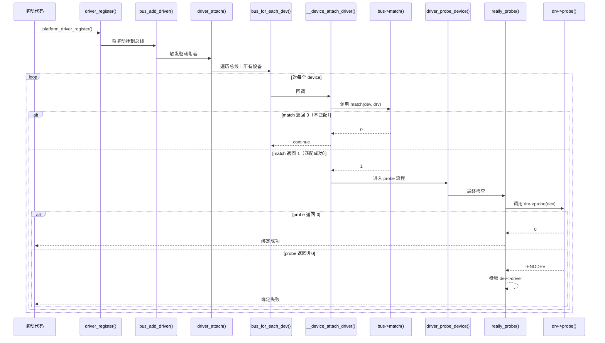

# 11.1.3 match()与probe()的调用链

## 本节导读

本节追踪从 `driver_register()` 到驱动 `probe()` 被调用的完整内核路径。学完后，你能画出驱动注册到设备绑定的全景图，并搞懂为什么驱动明明加载了、`probe()` 却迟迟不被调用。**知识点136 [I][M]**

---

你写了一个 SPI 驱动，`insmod` 成功了，传感器却不工作，`probe()` 始终没执行。答案藏在从 `driver_register()` 到 `probe()` 的整条调用链里。

---

## 完整的调用链

驱动作者调用 `driver_register()`（或其封装如 `spi_register_driver()`），内核开始了一条精确的匹配之旅：

```
driver_register()
    └── bus_add_driver()
            └── driver_attach()
                    └── bus_for_each_dev()
                            └── __device_attach_driver()
                                    └── drv->bus->match(dev, drv)
                                            └── driver_probe_device()
                                                    └── really_probe()
                                                            └── drv->probe(dev)
```

### 挂载到总线

`driver_register()` 先把驱动挂到总线——`bus_add_driver()`。你在 `/sys/bus/xxx/drivers/` 下能看到驱动目录了。

⚠️ **陷阱**：看到 sysfs 目录就认为驱动"生效了"，这是常见误区。`match()` 和 `probe()` 的征程才刚刚开始。

### 遍历设备

`driver_attach()` 调用 `bus_for_each_dev()`，**遍历总线上当前已注册的所有设备**，对每个设备执行回调 `__device_attach_driver()`：

```c
int driver_attach(struct device_driver *drv)
{
    return bus_for_each_dev(drv->bus, NULL, drv, __device_attach_driver);
}
```

💡 **提示**：关键词是"当前已注册"。如果设备在驱动之后才 `device_register()`，设备注册时也会反向遍历所有驱动（`device_attach()`）。内核做了**双向保险**，无论谁先谁后都不错过匹配。

### match()——总线的"看门人"

`__device_attach_driver()` 先调用总线的 `match()`：

```c
static int __device_attach_driver(struct device_driver *drv, void *data)
{
    struct device *dev = data;

    if (!driver_match_device(drv, dev))
        return 0;   /* 不匹配，pass */

    return driver_probe_device(drv, dev);  /* 匹配，走 probe */
}
```

`match()` 返回值约定：

| 返回值 | 含义 |
|--------|------|
| 1 | 匹配成功，继续走向 `probe()` |
| 0 | 不匹配，设备和驱动无缘 |

不同总线的 `match()` 逻辑各异：platform 比对 `name`，SPI 比对 `modalias`，USB 比对 vendor/product ID。`match()` 是总线级"初筛"，通过才调用 `probe()` 做深度初始化。

### really_probe()——最终执行者

`match()` 过关后，经 `driver_probe_device()` 到达 `really_probe()`，这是调用 `probe()` 前的最后一站：

```c
static int really_probe(struct device *dev, struct device_driver *drv)
{
    dev->driver = drv;        /* 先绑定 */

    if (dev->bus->probe)
        ret = dev->bus->probe(dev);
    else if (drv->probe)
        ret = drv->probe(dev);

    if (ret) {
        dev->driver = NULL;   /* probe 失败，解绑 */
    }
}
```

`probe()` 返回值：

| 返回值 | 含义 |
|--------|------|
| 0 | 成功，设备与驱动绑定完成 |
| 非0 | 失败，内核撤销绑定 |

🔴 **危险**：`probe()` 失败后内核会撤销 `dev->driver` 的赋值，但**不会帮你回收 `probe()` 内部已申请的内存、GPIO、中断等资源**。资源泄漏是驱动作者自己的责任。

---

## 完整调用链序列图



---

## probe() 为什么可能不被调用？

搞懂了调用链，这三个"坑"就很好理解了：

**1. match() 返回 0——设备与驱动不匹配**

最常见的原因。platform 设备的 `name` 和驱动的 `id_table` 对不上，`compatible` 不匹配，或 SPI `modalias` 写错——都在 `match()` 被筛掉。排查：加打印看 `match()` 返回值。

**2. 设备压根没注册**

驱动先 `insmod` 了，但设备还没注册（Device Tree 节点被注释、外部模块延迟加载）。`bus_for_each_dev()` 遍历时找不到设备，自然走不到 `probe()`。排查方法：`ls /sys/bus/xxx/devices/` 确认设备是否存在。

**3. 资源不可用——依赖子系统未初始化**

驱动依赖 regulator、clock、pinmux 等子系统，但这些子系统尚未初始化。较新版本内核引入了 `deferred probe` 机制——`probe()` 返回 `-EPROBE_DEFER`，内核把设备放入延迟队列稍后重试。

💡 **提示**：看到 `deferred probe` 日志是正常行为，但如果出现循环依赖（A 等 B、B 等 A），设备就永远无法绑定了。

---

## 本节总结

| 要点 | 内容 |
|------|------|
| 调用链起点 | `driver_register()` → `bus_add_driver()` |
| 遍历设备 | `driver_attach()` → `bus_for_each_dev()` 遍历所有已注册设备 |
| 匹配检查 | `__device_attach_driver()` → `match()`，返回 1=匹配，0=不匹配 |
| 最终调用 | `driver_probe_device()` → `really_probe()` → `probe()` |
| `probe()` 返回值 | 0=成功绑定，非0=失败解绑 |
| probe 不执行的三大原因 | ① match 失败 ② 设备未注册 ③ 依赖未就绪（延迟 probe） |
| 关键风险 | `probe()` 失败时的资源泄漏；延迟 probe 的循环依赖 |

---

## 下一步

我们搞懂了从 `driver_register()` 到 `probe()` 的"高速公路"。但设备的生命不只有开始——11.1.4 节将讨论 `remove()` 的调用时机和驱动卸载的完整流程，以及 `probe()` 与 `remove()` 之间必须遵守的资源管理对称性。
