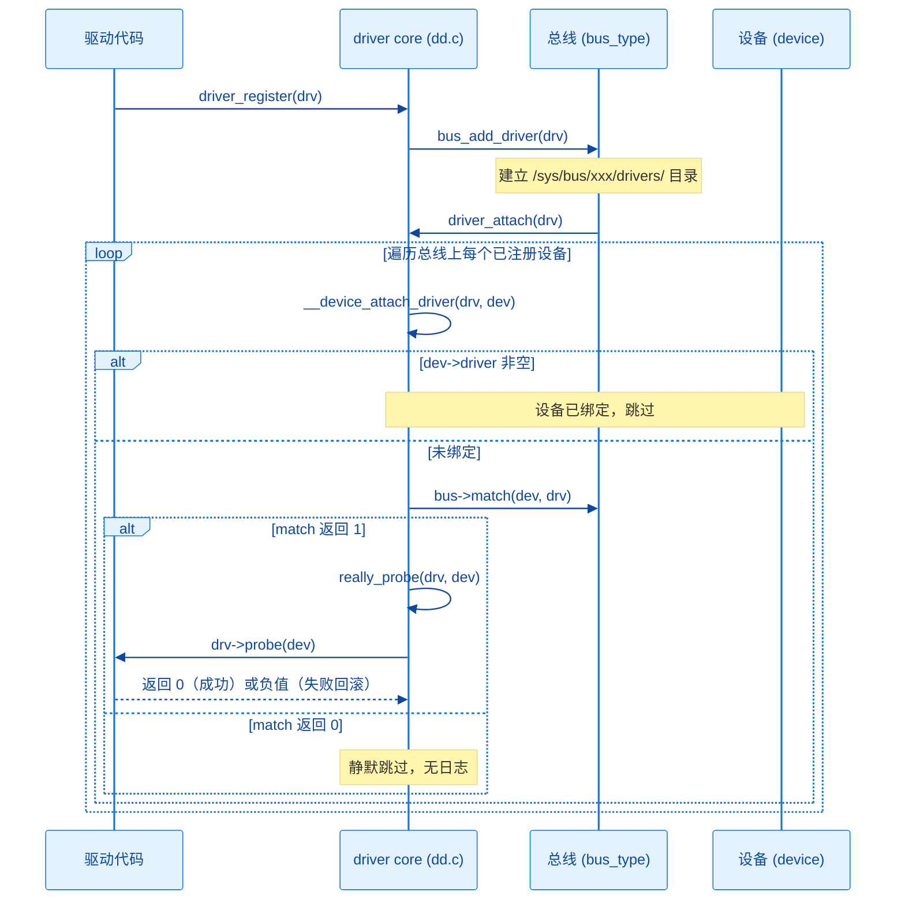
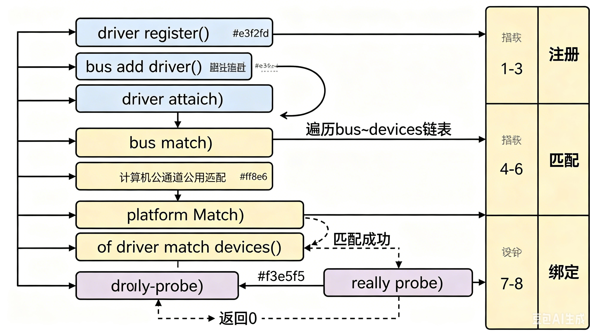

# 11.1.3 match()与probe()的调用链

> 所属：第11章 设备模型 > 11.1 总线-设备-驱动模型
> 
> 难度：[I→E] | 预计阅读时间：14分钟

## <span class="blue"> 本节导读

11.1.2 给出了 `bus_type`、`device`、`device_driver` 的静态结构，本节回答动态问题：驱动调用 `driver_register()` 之后，内核经过哪些函数、在哪一步比对 `match()`、又在哪一步进入 `probe()`。这是「设备从设备树节点到 probe 成功」主线中最核心的动态路径，也是「驱动注册了但 probe 没执行」这类问题的定位依据。<BR>
本节覆盖：`driver_register()` 到 `probe()` 的完整调用链逐层拆解、match 失败的静默特性、probe 不执行的四种原因与排查顺序。

---

## <span class="blue"> 从 driver_register 到 probe 的调用链 [I]

### 调用链全貌

整条链路的骨架如下，建议对照源码 `drivers/base/driver.c`、`drivers/base/bus.c` 和 `drivers/base/dd.c` 阅读：

```
driver_register(struct device_driver *drv)            drivers/base/driver.c
  └─> bus_add_driver(drv)                             drivers/base/bus.c
        ├─> 创建 /sys/bus/<bus>/drivers/<name> 目录
        └─> driver_attach(drv)                        drivers/base/dd.c
              └─> bus_for_each_dev(bus, NULL, drv, __device_attach_driver)
                    └─> __device_attach_driver(drv, dev)   ← 对总线上每个设备执行一次
                          ├─> driver_match_device(drv, dev)  ← 即 bus->match()
                          │     ├─ 返回 1：匹配成功 → driver_probe_device() → really_probe()
                          │     │                                     └─> drv->probe(dev)
                          │     └─ 返回 0：不匹配，静默检查下一个设备
                          └─> 设备已绑定其他驱动：跳过
```

反向路径对称存在：设备注册时 `device_add()` 会触发 `bus_probe_device()`，遍历总线的驱动链表做同样的 match→probe 流程。因此链路上有两个入口，殊途同归。

### 逐层拆解

**第 1 层：`driver_register()`，注册入口**

所有总线封装的注册函数（`platform_driver_register()`、`i2c_add_driver()` 等）最终都走到这里。返回值只代表驱动成功挂到总线的驱动链表上，与是否匹配到设备无关。

**第 2 层：`bus_add_driver()`，建立驱动在内核中的存在**

为驱动创建 sysfs 目录（如 `/sys/bus/platform/drivers/my_led`）、挂接私有数据结构，然后调用 `driver_attach()` 启动匹配。

**第 3 层：`driver_attach()`，匹配起点**

```c
int driver_attach(struct device_driver *drv)
{
    return bus_for_each_dev(drv->bus, NULL, drv, __device_attach_driver);
}
```

把工作委托给 `bus_for_each_dev()`，第四个参数是对每个设备要执行的回调。

**第 4 层：`bus_for_each_dev()`，遍历设备链表**

遍历 `bus->p->klist_devices`，对每个设备调用一次回调。回调返回非 0 会提前终止遍历，而 `__device_attach_driver` 正常返回 0，所以一个驱动可以依次匹配多台设备。

**第 5 层：`__device_attach_driver()`，逐设备尝试配对**

```c
/* 逻辑简化示意（非逐行源码）：绑定检查 + 匹配 + 进入 probe */
static int __device_attach_driver(struct device_driver *drv, void *data)
{
    struct device *dev = data;

    if (dev->driver)                    /* 设备已绑定其他驱动，跳过 */
        return 0;

    ret = driver_match_device(drv, dev);        /* 即调用 bus->match() */
    if (ret == 0)
        return 0;                       /* 不匹配，继续下一个设备 */
    if (ret == -EPROBE_DEFER) {
        driver_deferred_probe_add(dev); /* 依赖未就绪，推迟到以后再试 */
        return 0;
    }

    return driver_probe_device(drv, dev);       /* 匹配成功，进入 probe */
}
```

`dev->driver` 非空即跳过，保证一台设备同一时间只绑定一个驱动。`-EPROBE_DEFER` 是内核的推迟探测机制：驱动依赖的资源（时钟、regulator 等）尚未就绪时返回该值，内核把设备挂到延迟队列，等依赖就绪后自动重试 probe。

**第 6 层：`driver_match_device()` → `bus->match()`，配对裁决**

```c
static inline int driver_match_device(struct device_driver *drv,
                                      struct device *dev)
{
    return drv->bus->match ? drv->bus->match(dev, drv) : 1;
}
```

总线未实现 `match()` 时默认返回 1（全部匹配），实际总线都有自己的实现：

| 总线 | match 对比内容 | 常见不匹配原因 |
|------|---------------|---------------|
| platform | 设备树 `compatible` vs `of_match_table`，退化到 `id_table`、设备名 | compatible 拼写不一致、连字符与下划线混淆 |
| i2c | `compatible` / 设备名 vs `of_match_table`、`i2c_device_id` | id_table 名字与设备名不一致 |
| spi | `modalias`（来自 compatible 或板级声明）vs `spi_device_id` | modalias 未设置或拼写不一致 |
| usb | `idVendor` + `idProduct` vs `usb_device_id` | VID/PID 填错 |
| pci | vendor/device ID、class 码 vs `pci_device_id` | ID 或 class 掩码写错 |

> ⚠️ match 返回 0 时内核不打印任何日志，属于静默跳过：驱动注册成功，设备也存在，但没有任何绑定发生。这是驱动调试中最常见的卡点，定位思路见后文排查表。

**第 7 层：`really_probe()`，进入驱动自己的代码**

match 命中后经 `driver_probe_device()` 进入 `really_probe()`：设置 `dev->driver`、完成电源域挂接，然后调用 `drv->probe(dev)`——驱动代码第一次被内核执行。probe 返回 0 表示绑定成功，内核补建 sysfs 绑定符号链接并发出 `KOBJ_BIND` 类型的 uevent；返回负值则回滚全部绑定状态，dmesg 中会出现 `probe of ... failed with error -N` 形式的日志。

### 时序视角





---

## <span class="blue"> probe() 没有执行：按固定顺序排查 [I→E]

`platform_driver_register()` 返回 0，但 probe 里的打印一条都没出现。按下面四种原因逐个排除，覆盖绝大多数场景。

### 原因一：match 返回 0，匹配根本没发生

最常见的原因。设备树的 `compatible = "vendor,my-led"` 与驱动 `of_match_table` 中的条目必须逐字符一致，`{"vendor,my_led"}`（下划线）与 `{"vendor,my-led"}`（连字符）互不匹配，且失败时无任何日志。

排查方法：`cat /sys/firmware/devicetree/base/.../compatible` 读出内核实际看到的字符串，与驱动源码中的匹配表逐字符对比。

### 原因二：设备从未注册进总线

`bus_for_each_dev()` 遍历的是已注册设备。如果设备树节点被写成 `status = "disabled"`、节点所在总线未就绪、或设备树根本没烧进板子，设备就不在链表上，match 一次都不会被调用。

排查方法：`ls /sys/bus/platform/devices/` 确认设备目录存在。目录里没有目标设备，问题在设备注册一侧，与驱动无关。

> 💡 注册顺序不是这类问题的成因：驱动先注册时只是暂时匹配不到，设备随后注册会触发反向匹配，probe 仍会执行。需要排查的是设备「始终没有注册」，而不是「注册晚了」。

### 原因三：设备已被其他驱动绑定

一台设备只绑定一个驱动。设备目录下的 `driver` 符号链接显示当前绑定者：

```bash
ls -l /sys/bus/platform/devices/ff000000.serial/driver
```

若指向的不是预期驱动，检查是否存在匹配表重叠（两个驱动声明了同一个 compatible），先注册的驱动会赢下绑定。

### 原因四：probe 被调用了，但内部失败

probe 入口的打印出现了，但函数返回负值：常见的是 `devm_kzalloc()` 分配失败、`clk_get()` 拿不到时钟、`gpiod_get()` 申请不到 GPIO。此时绑定被回滚，dmesg 中有 `probe of ... failed with error -N`，设备最终仍处于未绑定状态，表象与「probe 没执行」一致。

排查方法：probe 入口加打印确认函数被调用，然后逐步定位返回负值的位置，按错误码查对应子系统。

### 排查速查表

| 现象 | 可能原因 | 排查方法 |
|------|---------|---------|
| 注册成功，probe 无打印 | match 失败 | 对比设备 compatible 与驱动匹配表 |
| 注册成功，probe 无打印 | 设备未注册 | `ls /sys/bus/platform/devices/` |
| 注册成功，probe 无打印 | 设备已被绑定 | 看设备目录下 `driver` 符号链接指向 |
| probe 有入口打印但绑定失败 | probe 内部返回负值 | dmesg 找 `failed with error`，按错误码定位 |

> ⚠️ `driver_register()` 返回 0 只代表驱动挂上了总线的驱动链表，不代表任何设备被匹配。排查顺序固定为：先查 match，再查设备是否存在，再查设备是否被绑走，最后查 probe 内部。

---

## <span class="blue"> 本节总结

| 概念 | 核心要点 | 自查操作 |
|------|---------|---------|
| 调用链 | driver_register → bus_add_driver → driver_attach → bus_for_each_dev → __device_attach_driver → match → really_probe → probe | 对照 `drivers/base/dd.c` 源码走读 |
| match() | 返回 1 进入 probe，返回 0 静默跳过 | 逐字符对比 compatible 与匹配表 |
| -EPROBE_DEFER | 依赖未就绪时推迟 probe，依赖就绪后自动重试 | dmesg 找 `deferred probe` 相关打印 |
| probe 未执行 | 四种原因：match 失败、设备未注册、已被绑定、probe 内部失败 | 按速查表顺序排除 |

---

## <span class="blue"> 下一步

调用链的每一层都发生在 kobject 组织的对象树之上：`bus_add_driver()` 创建的 sysfs 目录、`really_probe()` 发出的 uevent，都来自这套基础设施。下一节（11.1.4）展开 kobject/kset 与 sysfs 的映射机制，解释 `/sys` 下的目录树是如何自动生成的。

---
