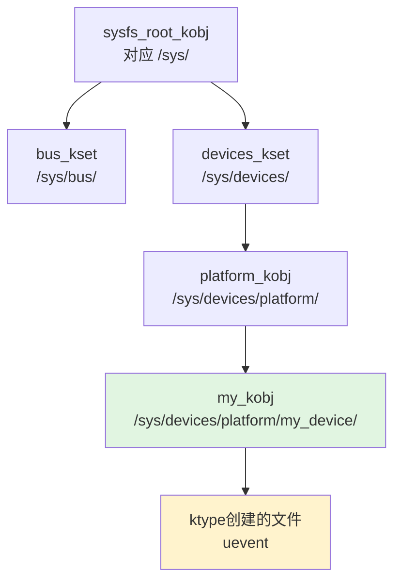

# 11.1.4 kobject/kset与sysfs映射

> 所属章节：第11章 设备驱动模型 > 11.1 总线/设备/驱动基础架构
> 难度：[I] | 预计阅读时间：10分钟

## 本节导读
/sys/下面那些目录和文件不是凭空冒出来的。本节带你看看"面子"（sysfs）的里子——kobject。搞清楚这个设备模型的"原子积木"，你就明白/sys/的生成逻辑了。

---

## 知识点135：kobject——设备模型的"原子积木" [I] ~800字

### 每个目录背后都有一个kobject

看看你的开发板/sys/下面长什么样：

```bash
# 代码1：查看/sys顶层目录
$ ls /sys/
block  bus  class  dev  devices  firmware  fs  kernel  module  power
```

这些目录不是谁用手`mkdir`出来的，而是内核里C结构体自动映射的。**kobject**就是负责映射的最小单元。

打个比方：kobject像**户籍卡**。每张卡上写着名字（`name`），贴着"我爸是谁"（`parent`指针）。户籍卡按父子关系叠成家族树，往/sys/一投影，就成了你看到的目录结构 [图1：kobject层次树→sysfs目录映射图]。

### kobject的"三件套"

```c
// 代码2：kobject核心字段（简化版）
struct kobject {
    const char       *name;     // 目录名
    struct kobject   *parent;   // 父对象，决定目录层级
    struct kobj_type *ktype;    // 属性文件操作表
    struct kset      *kset;     // 所属集合
    struct list_head  entry;    // kset链表节点
};
```

| 字段 | 作用 | 映射到sysfs的什么 |
|------|------|----------------|
| `name` | 对象名称 | 目录名 |
| `parent` | 指向父kobject | 父目录 |
| `ktype` | 属性文件的读写回调 | 目录里的`uevent`等文件 |
| `kset` | 所属集合 | 挂在哪个集合下 |

🔴 **危险**：`parent`指错位置，设备就会出现在/sys/奇怪的地方。比如本该在`/sys/devices/platform/`下的设备，如果`parent`设成NULL，会直挂到`/sys/`根下，跟`block`、`bus`平起平坐——能用，但乱了套。

### kset：kobject的"文件夹"+uevent广播站

**kset**是一组kobject的集合，干两件事：

1. **归类**：把同类kobject放一起。比如所有PCI设备都挂到`pci_bus_kset`下面。
2. **播报uevent**：kobject增减时，kset发`uevent`事件通知用户空间。udev就是靠这个信号来创建`/dev/`节点的。

```c
// 代码3：创建kobject并挂到sysfs
struct kobject *my_kobj;
struct kobject *parent_kobj = &platform_bus->dev.kobj;

my_kobj = kzalloc(sizeof(*my_kobj), GFP_KERNEL);

int ret = kobject_init_and_add(my_kobj, &my_ktype, 
                               parent_kobj, "my_device");
if (ret) {
    kobject_put(my_kobj);
    return ret;
}
```

执行完，你就能在`/sys/devices/platform/my_device/`下看到这个目录——`kobject_init_and_add()`帮你全部搞定，不需要手动`mkdir`。

💡 **提示**：插U盘时内核创建kobject、kset发`add`类型uevent，systemd/udev收到就知道"有新硬件到了"，于是加载驱动、创建设备节点、甚至自动挂载。

⚠️ **陷阱**：`kobject_init_and_add()`内部会分配内存、操作sysfs，**必须在能睡眠的上下文调用**。别在中断里直接调用，否则可能死锁。

### kobject层次树→sysfs目录映射



[图1：kobject层次树→sysfs目录映射图]

图中绿色节点是代码3创建的kobject，黄色是它`ktype`导出的属性文件。内核里搭好kobject父子关系，sysfs目录就自动长出来了——这就是"设备模型驱动sysfs"的本质。

---

## 本节总结

| 概念 | 核心要点 | 自查操作 |
|------|---------|---------|
| kobject | 设备模型最小单元，name+parent构成层次树 | 遍历/sys/猜想每个目录对应哪个kobject |
| kset | kobject集合，含uevent操作钩子 | `udevadm monitor`插拔设备看uevent |
| sysfs映射 | kobject父子树自动投影为/sys/目录结构 | `ls -R /sys/devices/` |
| uevent | 内核通知用户空间设备变更的机制 | `cat /sys/.../uevent` |

---

## 下一步
现在你知道了kobject是设备模型的"原子"，也知道了/sys/下面的目录怎么自动冒出来的。但光有原子还不行，设备模型还需要**device**（设备实例）、**driver**（驱动实例）和**bus**（总线类型）这三驾马车。下一节（11.1.5）我们从kobject往上走一层，看这三者怎么配合工作。

---

## 配套资源

### 表格清单
- 表1：kobject核心字段及对应的sysfs映射
- 表2：本节总结自查表

### 图示清单
- 图1：kobject层次树→sysfs目录映射图 [mermaid图]
- 图2：kobject户籍卡类比图 [配图说明：一叠户籍卡片，每张有名字和父节点箭头，叠成树状，右侧投影为/sys目录结构]

### 代码清单
- 代码1：查看/sys顶层目录（`ls /sys/`）
- 代码2：kobject核心字段简化定义
- 代码3：kobject_init_and_add()使用示例
