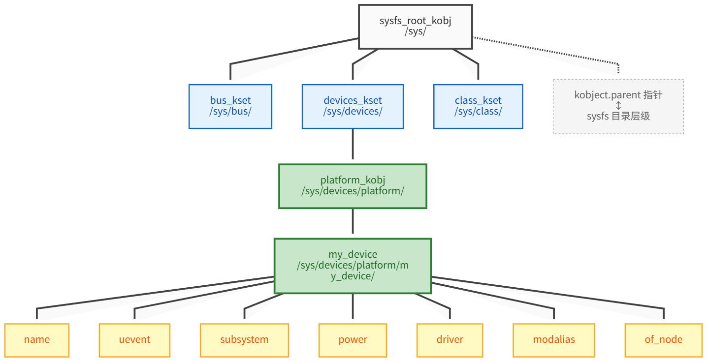
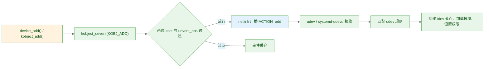

# 11.1.4 kobject/kset与sysfs映射

> 所属：第11章 设备模型 > 11.1 总线-设备-驱动模型
> 
> 难度：[I→E] | 预计阅读时间：13分钟

## <span class="blue"> 本节导读

「设备从设备树节点到 probe 成功」之后还有一环：设备的状态与拓扑要暴露给用户空间，出口就是 `/sys`。`/sys` 下的目录和文件不是手工创建的，而是内核中 kobject 树的自动投影——前面三节出现的 `bus_type`、`device`、`device_driver`，全部建立在 kobject 之上。本节作为 11.1 的收尾，把这套基础设施讲透。<BR>
本节覆盖：kobject 的字段与生命周期、kobj_type 与 release 语义、kset 的归类与 uevent 过滤、sysfs 映射机制、`kobject_init_and_add()` 代码走读、uevent 到设备节点的用户空间路径。

---

## <span class="blue"> kobject：设备模型对象的公共基座 [I]

### 每个 /sys 目录背后都有一个 kobject

对应用层工程师来说，kobject 可以先这样理解：**内核为「需要名字、需要层次关系、需要引用计数」的对象抽象出的基础结构体**。`struct device`、`struct device_driver` 等都内嵌一个 kobject，从而获得统一的生命周期管理和 sysfs 入口。

```bash
ls /sys/
block  bus  class  dev  devices  firmware  fs  kernel  module  power
```

这些顶层目录不是 `mkdir` 创建的，每一个都对应内核里的一个 kobject；目录的嵌套关系对应 kobject 的父子关系，目录里的普通文件对应 kobject 的属性。

### 关键字段

```c
/* 精简示意：理解映射机制所需的核心字段 */
struct kobject {
    const char          *name;     /* 对象名，即 sysfs 目录名 */
    struct kobject      *parent;   /* 父对象，决定目录层级 */
    struct kset         *kset;     /* 所属集合 */
    struct kobj_type    *ktype;    /* 类型描述：release 回调与默认属性 */
    struct list_head     entry;    /* 挂入 kset 链表的节点 */
    struct kref          kref;     /* 引用计数 */
};
```

| 字段 | 作用 | 映射到 sysfs 的什么 |
|------|------|--------------------|
| `name` | 对象名称 | 目录名 |
| `parent` | 父 kobject | 父目录 |
| `ktype` | 属性文件的读写操作与默认属性 | 目录里的 `uevent` 等文件 |
| `kset` | 所属集合 | 父指针缺省时归入集合目录 |
| `kref` | 引用计数 | 不直接映射，决定对象何时销毁 |

`struct kobj_type` 是 kobject 的「类型说明」：同一类 kobject 共享一份 kobj_type，其中最关键的是 `release()` 回调（引用计数归零时执行真正的内存释放）和默认属性组（决定这类对象在 sysfs 中自带哪些文件）。

### 生命周期与释放语义

kobject 的使用分四步：`kobject_init()` 初始化、`kobject_add()` 注册进层次并出现在 sysfs、使用中用 `kobject_get()`/`kobject_put()` 增减引用计数、计数归零时由内核调用 `ktype->release()` 完成释放。

释放语义有一个硬约束：**kobject 占用的内存只能在 `release()` 里释放**。因为只要还有引用存在，就可能有代码正在访问这个对象。这也是 kobject 几乎总是内嵌在更大结构体（如 `struct device`）中的原因——`release()` 里通过 `container_of()` 从 kobject 指针反推出外层结构体，再释放整体。

> 🔴 kobject 的父指针缺省时有一套回退规则：`parent` 为 NULL 但指定了 `kset`，就挂到该 kset 的目录下；两者都未指定，则直接出现在 `/sys` 根目录，与 `block`、`bus` 平级。设备出现在 `/sys` 中意料之外的位置，通常就是 `parent` 设置错误，排查时先核对 parent 与 kset 的赋值。

---

## <span class="blue"> kset：归类与 uevent 事件出口 [I]

**kset 是同类型 kobject 的集合**，自身内嵌一个 kobject，所以在 sysfs 中也是一个目录。它承担两个职责：

1. **归类**：把同类 kobject 组织在一起。`devices_kset` 对应 `/sys/devices/`，`bus_kset` 对应 `/sys/bus/`，加入集合即自动出现在对应目录下。
2. **uevent 过滤**：kset 上挂有 `uevent_ops`，决定该类对象的事件是否发送、以什么事件名发送。

uevent 是内核向用户空间广播设备变更消息的机制：设备添加、移除、绑定驱动时，内核通过 netlink 套接字发出一条包含环境变量的文本消息（如 `ACTION=add`、`DEVPATH=...`），由用户空间的 udev 或 systemd-udevd 接收处理。事件的实际发送函数是 `kobject_uevent()`，它会沿 kobject 找到所属 kset，经 `uevent_ops` 过滤后广播。

```c
/* 精简示意 */
struct kset {
    struct list_head    list;        /* 集合内所有 kobject 的链表 */
    spinlock_t          list_lock;
    struct kobject      kobj;        /* 内嵌 kobject，代表集合自身 */
    const struct kset_uevent_ops *uevent_ops;  /* uevent 过滤与命名 */
};
```

---

## <span class="blue"> 注册一个 kobject：代码走读 [I→E]

下面这段代码在内核中创建一个独立的 kobject 并挂到 platform 总线目录下：

```c
struct kobject *my_kobj;
int ret;

my_kobj = kzalloc(sizeof(*my_kobj), GFP_KERNEL);
if (!my_kobj)
    return -ENOMEM;

ret = kobject_init_and_add(my_kobj, &my_ktype,
                           &platform_bus->dev.kobj, "my_device");
if (ret) {
    kobject_put(my_kobj);   /* 失败也必须走 put，释放已初始化的内部状态 */
    return ret;
}

kobject_uevent(my_kobj, KOBJ_ADD);   /* 主动向用户空间广播 add 事件 */
```

逐行看：

- `kobject_init_and_add()` 一步完成初始化与注册：设置 ktype、parent，把对象挂入层次，并在 sysfs 创建目录 `/sys/devices/platform/my_device/` 及 ktype 声明的默认属性文件。
- 失败路径必须调用 `kobject_put()` 而不是直接 `kfree()`，原因正是前面说的释放语义：对象的内存由 `ktype->release()` 负责，`put` 触发计数归零才会走到 `release()`。
- 最后一个参数是可变格式化字符串，作为 kobject 的名字，即 sysfs 目录名。

> ⚠️ `kobject_init_and_add()` 内部要分配内存、操作 sysfs 文件系统，可能睡眠，**只能在进程上下文调用**。中断处理函数或持有自旋锁的临界区内调用它，可能直接导致死锁。



映射关系是完全自动的：注册 kobject 就多一个目录，为 ktype 声明一组 `struct attribute` 就多几个可读写的文件。读 sysfs 文件实际是内核调用属性的 `show()` 方法现场生成内容，写文件对应 `store()` 方法——`/sys` 不占磁盘，它是内存对象树的实时投影。

---

## <span class="blue"> uevent：从内核事件到 /dev 节点 [I→E]

kobject 状态变化产生 uevent，用户空间接收后完成设备节点创建等动作。完整路径：



在运行中的系统上可以直接观察这条链路：

```bash
# 监听内核 uevent 与 udev 处理结果，插拔一个 USB 设备看输出
udevadm monitor --kernel --udev

# 查看某个设备最近一次 add 事件携带的环境变量
udevadm info /sys/bus/usb/devices/1-1
```

> 💡 每个设备 kobject 的目录下都有一个只读的 `uevent` 属性文件，`cat` 它可以看到该设备最近一次事件的环境变量内容；往它写入 `add` 可以让内核重放一次该设备的 add 事件，常用于调试 udev 规则而无需重新插拔硬件。

---

## <span class="blue"> 本节总结

| 概念 | 核心要点 | 自查操作 |
|------|---------|---------|
| kobject | 设备模型对象的公共基座：名字、层次、引用计数 | `ls /sys/devices/` 对照目录理解层次 |
| kobj_type | 类型说明：release 回调 + 默认属性组 | 理解释放必须走 release 的原因 |
| kset | kobject 集合：归类 + uevent 过滤 | `ls /sys/bus/` 与 `bus_kset` 对应 |
| sysfs 映射 | kobject 树自动投影为 /sys 目录树，不占磁盘 | 读写属性文件验证 show/store |
| uevent | 内核经 netlink 广播设备变更，udev 接收处理 | `udevadm monitor` 插拔设备观察 |

---

## <span class="blue"> 下一步

11.1 的四节完成了设备模型的理论底座：为什么需要它（11.1.1）、三个核心角色（11.1.2）、配对调用链（11.1.3）、底层基础设施（本节）。下一节（11.2.1）进入 platform 总线实战，看设备树节点如何在内核启动时被解析、展开并注册为 `platform_device`——理论落地为代码的第一步。

---
