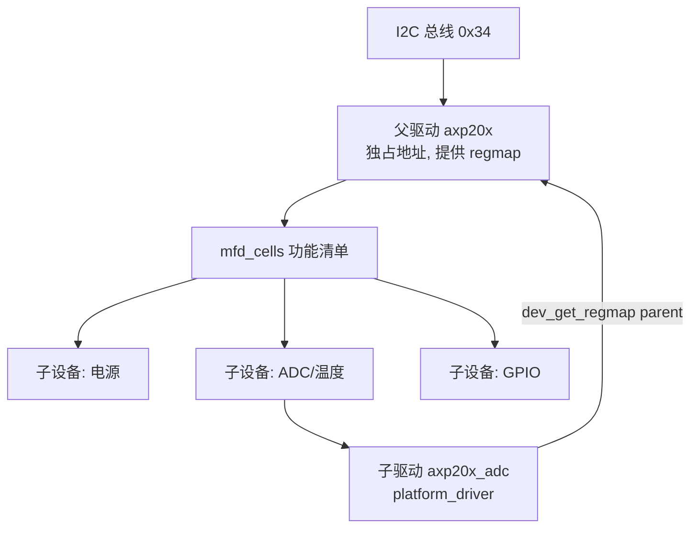

# 11.1.5 模式⑤ MFD 复合型：PMIC 子功能驱动

> 所属章节：第11章 设备模型 > 11.1 其然台阶·六种写法
>
> 难度：[I→E] | 预计阅读时间：30分钟 | 验证分级：**B级（可编译 + 设计剖析，不要求上板验证）**

> 💡 本节验证分级为 B 级：子设备驱动代码可真实编译，但上板验证依赖一颗"父驱动愿意加载你自定义子功能"的 PMIC，这不现实——验证环节改为对全志 AXP 系列 PMIC 真实代码的走读。骨架代码本身在任何内核树都能 `make` 通过。

## <span class="blue"> 本节导读

本节覆盖：

- 六种写法中的第五种：**MFD（Multi-Function Device）复合型**——当温度采集只是 PMIC 大芯片的一个子功能时，驱动不独立面对总线，而是作为"子设备"借父设备的 regmap 工作
- 一个可编译的 MFD 子驱动骨架
- 用全志 AXP 系列 PMIC 的真实结构走读 MFD 三方关系：父设备、mfd_cells、子驱动

## <span class="blue"> 场景一句话 [B]

你的电池温度采集功能不是一颗独立芯片，而是 PMIC（电源管理芯片）内置 ADC 的一个通道——这颗 PMIC 同时还管着十几路电源、RTC、电量计，它们共用同一组 I2C 寄存器，谁也不该独占总线。

## <span class="blue"> 为什么需要 MFD [I]

模式②的写法在这里会失效：如果你给"温度功能"单独写一个 `i2c_driver` 去绑定 PMIC 的 I2C 地址，电源功能也想绑同一个地址——一个地址只能绑一个驱动，功能之间打起来了。

MFD 的解法是分两层：**父驱动**（如 `axp20x`）独占 I2C 地址，把寄存器读写封装成 `regmap`；然后按功能清单（`mfd_cells`）为每个子功能创建一个 **platform 子设备**；**子驱动**（电池、ADC、GPIO）写成普通的 `platform_driver`，probe 时从父设备手里"借"regmap 用。



## <span class="blue"> 子驱动骨架 mypmic_adc.c [I]

```c
// SPDX-License-Identifier: GPL-2.0
/*
 * mypmic_adc.c - MFD 子驱动骨架：PMIC 内置 ADC 温度通道
 * 编译无依赖问题；运行需要父 MFD 驱动通过 mfd_cells 创建本设备
 */
#include <linux/module.h>
#include <linux/platform_device.h>
#include <linux/mfd/core.h>        // mfd_cell
#include <linux/regmap.h>          // 父设备提供的寄存器抽象

/* 假设的寄存器（真实驱动按 PMIC 数据手册填写） */
#define ADC_TEMP_REG_H		0x5e
#define ADC_TEMP_REG_L		0x5f

static int mypmic_adc_read_temp(struct regmap *map, int *millic)
{
	unsigned int hi, lo, raw;
	int ret;

	/* 通过父设备的 regmap 读寄存器：缓存、总线锁都由 regmap 处理 */
	ret = regmap_read(map, ADC_TEMP_REG_H, &hi);
	if (ret)
		return ret;
	ret = regmap_read(map, ADC_TEMP_REG_L, &lo);
	if (ret)
		return ret;

	raw = (hi << 4) | (lo & 0xf);       /* 12 位 ADC 拼接（示例格式） */
	*millic = raw * 1100 / 4095 * 1000; /* 按手册公式换算，示例简化 */
	return 0;
}

static int mypmic_adc_probe(struct platform_device *pdev)
{
	struct regmap *map;
	int millic;

	/* MFD 子驱动的标志性一步：向父设备借 regmap，而不是自己开总线 */
	map = dev_get_regmap(pdev->dev.parent, NULL);
	if (!map)
		return dev_err_probe(&pdev->dev, -ENODEV,
				     "no regmap from parent MFD\n");

	if (!mypmic_adc_read_temp(map, &millic))
		dev_info(&pdev->dev, "probe success, battery temp %d millic\n",
			 millic);

	dev_info(&pdev->dev, "using parent regmap\n");
	return 0;
}

static struct platform_driver mypmic_adc_driver = {
	.probe  = mypmic_adc_probe,
	.driver = {
		.name = "mypmic-adc",    /* 名字必须与父驱动 mfd_cells 中的 name 一致 */
	},
};
module_platform_driver(mypmic_adc_driver);

MODULE_LICENSE("GPL");
MODULE_DESCRIPTION("MFD child driver skeleton for PMIC ADC temperature");
```

注意骨架里两个 MFD 的标志性特征：

1. **`.name` 不是随便起的**：它必须等于父驱动 `mfd_cells[]` 里登记的字符串，父子靠这个名字配对
2. **没有设备树匹配表**：子设备由父驱动的代码创建，不来自设备树解析；设备树里只有 PMIC 本身一个节点

## <span class="blue"> 真实代码走读：全志 AXP 系列 [I]

全志 AXP 电源芯片（AXP209/AXP221/AXP717 等）是 MFD 的教科书实例，主线内核可见（`drivers/mfd/axp20x.c`）。它的父驱动结构压缩后长这样：

```c
static const struct mfd_cell axp20x_cells[] = {
	{ .name = "axp20x-regulator" },   /* 电源子功能 */
	{ .name = "axp20x-adc" },         /* ADC/电池温度子功能 */
	{ .name = "axp20x-battery-power-supply" },
	{ .name = "axp20x-gpio" },
	/* ... */
};
```

父驱动 probe 时注册 regmap，然后调用 `devm_mfd_add_devices()`，内核为清单中每一项创建一个 platform 子设备。`axp20x-adc` 对应的子驱动（`drivers/iio/adc/axp20x_adc.c`）正是用 `dev_get_regmap(pdev->dev.parent, NULL)` 拿到 regmap，把电池温度等通道注册成 IIO 设备——用户在 `/sys/bus/iio/` 下读到电池温度。

整条链路和模式②对照着看：**I2C 地址只有父驱动碰，子驱动之间共享 regmap 的缓存和锁，多颗"虚拟芯片"在同一颗物理芯片上和平共处**。

> 💡 如果你的板子是 RK3568，可以当场看到同款结构：`ls /sys/bus/platform/devices/ | grep rk809`——RK809 PMIC 的 RTC、regulator 等子设备全是 MFD 父驱动创建的。

## <span class="blue"> 工程取舍 [I]

MFD 写法结构最复杂，但它是多功能芯片唯一正确的组织方式：总线独占、寄存器缓存、中断共享全由父驱动和 regmap 层解决。判断标准很简单——你的驱动需要和"别人的驱动"共享同一组寄存器吗？需要，就该长成 MFD 的样子。

## <span class="blue"> 引出的问题

MFD 父驱动用代码创建子设备，绕过了设备树——**所以"设备"这个对象在内核里根本不依赖设备树存在，设备树只是创建设备的方式之一。** 那"设备"和"驱动"这两个对象的内核本质是什么？谁规定了它们配对的规则？这是 11.2 的第一块基石。下一节先看最后一种写法：连内核都不进，用户空间直接操作。

## 本节总结

| 要件 | 要点 |
|------|------|
| 写法定位 | PMIC/音频 Codec 等多功能芯片的子功能 |
| 三方关系 | 父驱动（占总线、供 regmap）→ mfd_cells → 子驱动（platform_driver） |
| 配对方式 | 子驱动 `.name` == mfd_cells 的 `name`，无设备树匹配表 |
| 资源共享 | 全部经父设备 regmap，自带缓存与锁 |

## 下一步

下一节（11.1.6）进入模式⑥：用户空间型——一个内核模块都不写，用 `/dev/i2c-1` 直接读 LM75，以及什么时候这是正确答案。

---
