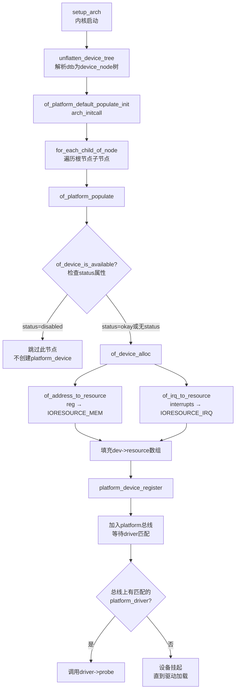

# 11.2.1 设备树到 platform_device

## 本节导读

设备树（Device Tree）只是一份躺在内存里的结构化数据。要让内核驱动程序能"看到"硬件，必须先把这些节点转换成内核熟悉的数据结构——`platform_device`。这个过程由 `of_platform_populate()` 主导，它是嵌入式驱动绑定流程的第一道关卡。学完本节，你将能解释为什么设备树节点写了但没触发 `probe`、为什么 `status = "disabled"` 会让设备消失，以及设备树里的 `reg` 和 `interrupts` 属性最终如何变成驱动里调用的 `platform_get_resource()`。

---

## 从.dtb到platform_device的旅程

假设你的板级设备树已经编译进内核镜像，或者由 bootloader 通过 `__atags_pointer` 传给内核。这时，内核手里有一份已经解析好的 `device_node` 树。问题来了——这些节点怎么变成驱动能操作的 `platform_device`？

### 触发点：of_platform_populate()

ARM 架构的内核在初始化后期会调用 `of_platform_populate()`（早期内核版本里是 `of_platform_bus_probe()`，当前主流内核统一为前者）。来看这个函数的简化调用链：

```c
/* arch/arm/kernel/setup.c 或 init/main.c 的初始化路径 */
void __init setup_arch(char **cmdline)
{
    ...
    unflatten_device_tree();      /* ① 把.dtb解析成device_node链表 */
    ...
}

static int __init of_platform_default_populate_init(void)
{
    struct device_node *node;

    /* ② 对根节点下所有子节点执行populate */
    for_each_child_of_node(of_root, node) {
        of_platform_populate(node, NULL, NULL, NULL);
    }
    return 0;
}
arch_initcall_sync(of_platform_default_populate_init);
```

`of_platform_populate()` 的核心逻辑就是一个**递归遍历**：对每个 `device_node` 子节点，检查条件、创建 `platform_device`、然后递归处理孙节点。

### 为什么status="disabled"会跳过？

这是新手最容易踩的坑。来看 `of_platform_populate()` 里的关键判断（`drivers/of/platform.c`）：

```c
static int of_platform_bus_create(struct device_node *bus,
                                  const struct of_device_id *matches,
                                  ...)
{
    struct platform_device *dev;
    const char *bus_id;

    /* 核心检查：status是否为"disabled" */
    if (of_device_is_available(bus) == false)
        return -ENODEV;

    dev = of_platform_device_create_pdata(bus, bus_id, ...);
    ...
    /* 递归遍历子节点 */
    for_each_child_of_node(bus, child) {
        of_platform_bus_create(child, matches, ...);
    }
    return 0;
}
```

`of_device_is_available()` 的实现很直白：

```c
bool of_device_is_available(const struct device_node *device)
{
    const char *status;
    int statlen;

    status = of_get_property(device, "status", &statlen);
    if (status == NULL)
        return true;           /* 无status属性 → 默认可用 */

    if (statlen > 0) {
        if (!strcmp(status, "okay") || !strcmp(status, "ok"))
            return true;       /* status="okay" 或 "ok" → 可用 */
    }
    return false;              /* status="disabled" 或其他 → 不可用 */
}
```

⚠️ **陷阱**：设备树里写了节点、驱动也注册了，但 `probe` 就是不执行？先查 `status` 属性。很多厂商的参考设备树会把用不到的设备节点设成 `status = "disabled"`，忘记改成 `"okay"` 是调试阶段的头号时间杀手。

说白了，内核的态度很明确：**不声明等于默认可用，显式声明 disabled 就等于不存在**。

### platform_device 是怎么创建的？

当 `of_device_is_available()` 返回 true 后，内核调用 `of_platform_device_create_pdata()`，进而调用 `of_device_alloc()` 来完成真正的创建工作。这个过程中最关键的步骤是**资源填充**。

```c
struct platform_device *of_device_alloc(struct device_node *np,
                                        const char *bus_id,
                                        struct device *parent)
{
    struct platform_device *dev;
    int rc, i, num_reg = 0, num_irq;
    struct resource *res;

    dev = platform_device_alloc("", PLATFORM_DEVID_NONE);
    ...
    /* ① 统计reg属性的region数量 */
    while (of_address_to_resource(np, num_reg, &res_temp) == 0)
        num_reg++;

    /* ② 统计interrupts属性的irq数量 */
    num_irq = of_irq_count(np);

    /* ③ 一次性分配resource数组 */
    res = kcalloc(num_reg + num_irq, sizeof(*res), GFP_KERNEL);

    /* ④ 填充IORESOURCE_MEM */
    for (i = 0; i < num_reg; i++) {
        rc = of_address_to_resource(np, i, &res[i]);
        res[i].flags |= IORESOURCE_MEM;
    }

    /* ⑤ 填充IORESOURCE_IRQ */
    for (i = 0; i < num_irq; i++) {
        rc = of_irq_to_resource(np, i, &res[num_reg + i]);
        res[num_reg + i].flags |= IORESOURCE_IRQ;
    }

    dev->num_resources = num_reg + num_irq;
    dev->resource = res;
    dev->dev.of_node = np;    /* ⑥ 绑定回device_node */
    return dev;
}
```

这段代码把设备树里两个最常用属性翻译成了驱动层的语言：

| 设备树属性 | 转换函数 | platform_resource类型 | 说明 |
|-----------|---------|----------------------|------|
| `reg` | `of_address_to_resource()` | `IORESOURCE_MEM` | 物理基址+长度，后续由`devm_ioremap_resource()`映射 |
| `interrupts` | `of_irq_to_resource()` | `IORESOURCE_IRQ` | 经中断控制器映射后的Linux IRQ号 |

💡 **提示**：`of_address_to_resource()` 底层会调用 `of_translate_address()` 来处理总线级联（比如 PCI→IOMMU→内存 或 简单的 ranges 属性），把设备树里的总线地址转换成 CPU 视角的物理地址。这个过程对驱动作者透明，但调试地址不对时要想到查这里。

### 完整调用流程



### 一个完整的设备树片段对照

假设你的设备树有这样的串口节点：

```dts
uart0: serial@fe001000 {
    compatible = "ns16550a";
    reg = <0x0 0xfe001000 0x0 0x100>;
    interrupts = <GIC_SPI 24 IRQ_TYPE_LEVEL_HIGH>;
    status = "okay";
};
```

经过 `of_platform_populate()` 处理后，驱动在 `probe` 里拿到的资源：

```c
static int my_uart_probe(struct platform_device *pdev)
{
    struct resource *res_mem, *res_irq;

    res_mem = platform_get_resource(pdev, IORESOURCE_MEM, 0);
    /* res_mem->start = 0xfe001000, res_mem->end = 0xfe0010ff */

    res_irq = platform_get_resource(pdev, IORESOURCE_IRQ, 0);
    /* res_irq->start = 映射后的Linux IRQ号, 比如 44 */

    void __iomem *base = devm_ioremap_resource(&pdev->dev, res_mem);
    int irq = res_irq->start;

    devm_request_irq(&pdev->dev, irq, my_uart_irq_handler, 0, "my_uart", NULL);
    ...
}
```

🔴 **危险**：不要直接用硬编码的物理地址或 IRQ 号！即便你"很清楚"这个平台的数值，也必须走 `platform_get_resource()` → `devm_ioremap_resource()` 的标准路径。直接 `ioremap(0xfe001000, 0x100)` 看起来省事，但一旦板级变更、设备树中的地址通过 `ranges` 被重新映射，这种硬编码就会访问到错误的物理地址，导致不可预测的后果。

---

## 本节总结

| 知识点 | 内容速查 |
|--------|---------|
| **知识点 132 [E][M]** | `of_platform_populate()` 遍历设备树节点，为 `status="okay"` 的节点创建 `platform_device`；`status="disabled"` 或无匹配的节点会被静默跳过 |
| 遍历入口 | `arch_initcall_sync(of_platform_default_populate_init)` → `of_platform_populate()` → 递归 `of_platform_bus_create()` |
| 可用性判断 | `of_device_is_available()`：无 status 属性 = 默认可用；`"okay"/"ok"` = 可用；`"disabled"` = 跳过 |
| 内存资源转换 | 设备树 `reg` → `of_address_to_resource()` → `IORESOURCE_MEM`（物理基址+长度） |
| 中断资源转换 | 设备树 `interrupts` → `of_irq_to_resource()` → `IORESOURCE_IRQ`（映射后的 Linux IRQ 号） |
| 绑定关系 | `platform_device.dev.of_node` 指向原始 `device_node`，后续可通过 `of_*` API 读取额外属性 |
| 调试要点 | `probe` 不执行时，依次检查：①status 是否 okay ②compatible 是否匹配 ③驱动是否已加载 |

---

## 下一步

`platform_device` 已经就绪，但光有设备没有驱动还是跑不起来。**11.2.2 节**我们将看另一个方向——`platform_driver` 的注册过程：驱动的 `probe` 函数是怎么被触发的？`of_match_table` 和设备树的 compatible 字符串之间究竟怎么匹配？理解了双向绑定，才算真正走通了设备模型这条路。
