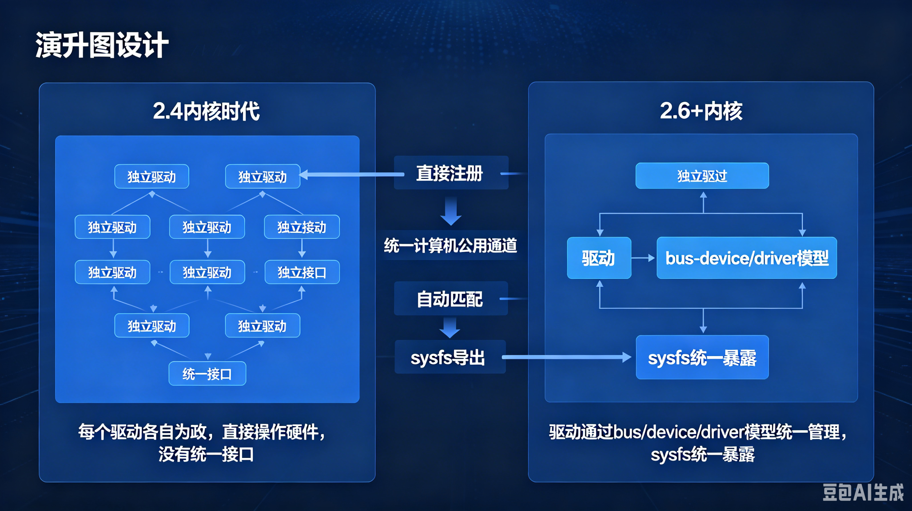

# 11.2.1 为什么需要设备模型

> 所属：第11章 设备模型 > 11.2 总线-设备-驱动模型
> 
> 难度：[I] | 预计阅读时间：12分钟

💡 你已经亲手写过驱动了：11.0 的最小平台驱动，11.1 的六种不同写法。<br>
它们形态天差地别——有的走设备树、有的硬编码；有的注册到内核总线、有的挂进厂商框架。

但内核不可能为每种写法单独发明一套管理逻辑，这背后一定有一个统一的抽象层：总线-设备-驱动三元模型。

从本节开始，我们从源码层面拆解这个模型，回答一个核心问题：**为什么 insmod 成功不等于 probe() 执行？**

## <span class="blue"> 本节导读

亲手写过驱动之后，回头回答一个问题：为什么内核里几乎每个子系统都要挂到"总线-设备-驱动"这套框架里，而不是各写各的？<BR>
答案在 2.6 之前的内核历史里——早期内核没有统一的设备管理，每个驱动自己探测硬件、自己申请资源、自己对用户空间暴露接口。

硬件种类少的时候这套做法能凑合，驱动数量一多，枚举、电源管理、热插拔、用户空间接口四个方面同时失控。<BR>
统一设备模型（Unified Device Model）是 2.6 给出的系统性解法，本章后面所有小节都建立在这套模型之上。

本节覆盖：

- 早期驱动的真实工作方式与四个结构性缺陷、
- 统一设备模型的核心设计、这
- 套模型带来的具体能力。

---

## <span class="blue"> 没有设备模型的内核是什么样 [I]

2.4 及更早的内核里，内核本身不维护"这台机器上有哪些硬件"的清单。<br>
硬件信息分散在各个驱动内部，每个驱动初始化时自己去发现设备——ISA 时代的"发现"就是按猜测的地址读写端口，根据返回值判断自己的硬件在不在。

一个典型的早期驱动初始化函数长这样：

```c
/* 早期驱动的典型写法：资源硬编码，初始化即探测 */
#define MY_IO_PORT  0x3F8
#define MY_IRQ      4

static int __init old_driver_init(void)
{
    if (!request_region(MY_IO_PORT, 8, "my_driver"))
        return -EBUSY;              /* 端口已被占用，只能失败退出 */
    if (request_irq(MY_IRQ, my_handler, 0, "my_irq", NULL)) {
        release_region(MY_IO_PORT, 8);
        return -EBUSY;
    }
    /* 初始化硬件…… */
    return 0;
}
```

这段代码暴露了早期模式的两个特征。<br>
第一，I/O 端口和中断号**硬编码在源码里**：换一块板子、改一组跳线，就要改代码重新编译。<br>
第二，驱动之间**互不知道对方的存在**：`request_region()` 的占用检查是唯一的协调手段，先注册的赢，后注册的失败退出，没有任何机制能表达"这两个驱动在争同一块硬件"。

### 四个结构性缺陷

硬编码和各自为政只是表象，往深处看是四个结构性缺陷：

| 缺陷 | 具体表现 | 后果 |
|------|---------|------|
| 无统一枚举 | 内核没有设备清单，驱动各自探测硬件 | 探测顺序由驱动链接顺序决定，脆弱且不可控 |
| 无统一电源管理 | APM 时代每个驱动自己处理挂起与恢复 | 挂起顺序无法保证：磁盘还没停转，它的控制器先掉了电 |
| 无热插拔机制 | 内核感知不到硬件插拔 | PCMCIA 只能靠用户态的 cardmgr 进程打补丁式支持 |
| 无统一用户接口 | 设备信息散落在 /proc 下各驱动自定义的文件里 | 用户空间无法回答"这个设备由哪个驱动管理" |

> 🔴 探测式发现硬件有实际的破坏力。<br>
> ISA 时代驱动按猜测顺序往端口写数据来唤醒自己的硬件，如果猜的地址属于别的设备，这次写入可能锁死总线或破坏那台设备的状态——症状是机器在启动阶段随机挂死，且没有任何日志可查。
<!-- -->
> 这类问题的根源不是某个驱动写错了，而是内核没有一张硬件清单可供查询，驱动只能瞎猜。

---

## <span class="blue"> 2.6 的答案：把所有硬件纳入一棵树 [I]

2003 年底发布的 2.6 内核引入统一设备模型，核心设计是把所有设备、驱动、总线组织成一棵内核对象树：每个硬件设备对应一个 `struct device`，每个驱动对应一个 `struct device_driver`，每种总线对应一个 `struct bus_type`，三者都建立在 `kobject` 这一基础设施之上，由 kobject 统一提供命名、引用计数和父子层次。

这套结构逐一解决了前面四个缺陷：

- **枚举**：设备注册进树之后内核就有了完整清单，驱动不再需要猜测式探测
- **电源管理**：树的父子关系定义了挂起/恢复顺序——挂起时先子后父，恢复时先父后子，磁盘一定先于它的控制器停转
- **热插拔**：设备注册和注销时内核发出 uevent 事件，用户空间收到事件后加载驱动、创建设备节点
- **用户接口**：kobject 树自动映射为 `/sys` 目录树，设备的层次、资源、驱动绑定关系全部可见




### /sys 就是设备模型的样子

设备模型不是抽象概念，它的投影就挂在每个运行中的 Linux 系统上：

```bash
# 按物理拓扑查看系统的设备树
ls /sys/devices/
breakpoint  LNXSYSTM:00  pci0000:00  platform  system  virtual

# 查看某个具体设备的属性和驱动绑定
ls /sys/bus/usb/devices/1-1/
authorized  bDeviceClass  bDeviceProtocol  driver  ep_00  idProduct  idVendor  manufacturer
```

> 💡 `/sys` 下的文件不占用磁盘，它是内存中 kobject 树的实时投影：每个目录对应一个 kobject，每个普通文件对应 kobject 的一个属性。<br>
> 读一个 sysfs 文件，实际是内核调用对应对象的 `show()` 方法现场生成内容。这套映射机制在 11.2.4 完整展开。
<!-- -->
> ⚠️ `/sys` 和 `/proc` 的分工经常被混淆：`/proc` 面向进程与内核运行时参数（偏软件状态），`/sys` 面向设备模型（偏硬件拓扑）。<br>
> 2.6 之后硬件相关的信息持续从 /proc 迁往 /sys，新写的驱动不要往 /proc 里放设备信息。

### 设备模型带来的四个能力

有了统一模型，内核第一次能系统性地回答四个问题：

- **这台机器上有哪些设备？** → 遍历 `/sys/devices`，或在内核里遍历 device 链表
- **这个设备由哪个驱动管理？** → 读设备目录下的 `driver` 符号链接
- **这个驱动在管理哪些设备？** → 看 `/sys/bus/<总线>/drivers/<驱动>/` 下的设备符号链接列表
- **硬件插入、拔出时怎么办？** → 总线产生事件，内核自动匹配驱动并通知用户空间

这些能力在今天看来理所当然，但在 2.4 时代都无法实现。<br>
设备模型的引入是 Linux 从"能跑起来的内核"变成"可管理的工业级操作系统"的分水岭，它也是本书从第 12 章（文件系统）到第 15 章（电源管理）反复出现的基础设施。

---

## <span class="blue"> 本节总结

| 概念 | 核心要点 | 自查操作 |
|------|---------|---------|
| 早期驱动模式 | 资源硬编码、各自探测、无统一协调 | 在老代码里找硬编码的 I/O 端口和 IRQ |
| 四个结构性缺陷 | 枚举、电源管理、热插拔、用户接口全面缺失 | 逐条对应到 2.6 的解法 |
| 统一设备模型 | bus_type / device / device_driver 建立在 kobject 之上 | `ls /sys/bus` 查看系统注册了哪些总线 |
| sysfs | kobject 树的用户空间投影，不占磁盘 | `ls /sys/devices` 看物理拓扑 |

---

## <span class="blue"> 下一步

本节回答了"为什么需要设备模型"，

下一节（11.2.2）进入模型本身：`bus_type`、`device`、`device_driver` 三个核心结构体各承担什么角色，三者靠什么机制连成三角关系。

---
