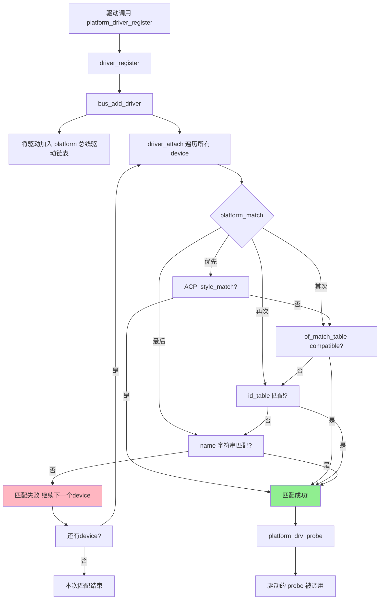

# 11.2.2 platform_driver注册与匹配

> 所属章节：第11章 设备驱动模型深入 > 11.2 platform设备驱动
> 难度：[E→M] | 预计阅读时间：15分钟

## 本节导读
本节带你走一遍platform_driver从注册到匹配成功的完整链路。搞明白这个流程，你就能自己跟代码了——从`platform_driver_register()`进去，一直跟到驱动的`probe()`被调用。学完后，你能画出注册流程图，也能说清楚三种匹配条件的优先级谁高谁低。

---

## 知识点138：platform_driver注册——从register到match的完整链路 [E][M] ~1200字

### 类比：驱动注册就像去人才市场挂牌

想象你（驱动）去人才市场（platform总线）挂牌求职。流程是这样的：你先填表注册（`platform_driver_register`），人才市场把你的简历挂到公告栏上（`bus_add_driver`挂到总线的驱动链表），然后每来一个企业（platform_device），工作人员就对照你的简历和企业需求做匹配（`platform_match`），匹配上了就安排面试（`probe`）。

内核里的流程一模一样，只是全是函数调用。

### 注册入口：platform_driver_register()

驱动代码里 typically 这么写：

```c
/* 代码1：platform_driver注册 */
static struct platform_driver my_driver = {
    .driver = {
        .name = "my_device",
        .of_match_table = my_of_match,
    },
    .probe  = my_probe,
    .remove = my_remove,
};

module_platform_driver(my_driver);  /* 宏展开就是 platform_driver_register() */
```

`module_platform_driver`这个宏最终会展开为`platform_driver_register()`调用。进去以后，调用链是这样的（记好了，面试常问）：

```
platform_driver_register()
  └── driver_register()
        └── bus_add_driver()
              ├── 把 driver 挂到 platform_bus_type->p->klist_drivers 链表
              └── driver_attach()  /* 遍历所有 device，尝试匹配 */
                    └── bus_for_each_dev()
                          └── __driver_attach()
                                └── driver_match_device()
                                      └── platform_bus_type.match() 
                                            └── platform_match()
```

🔴 **关键**：`bus_add_driver()`不只是"挂上去就完事"，它挂完之后立刻调用`driver_attach()`去主动匹配现有的所有device。这就是为什么有时候驱动比设备晚加载，也能匹配上的原因。

### 匹配函数：platform_match()的优先级逻辑

`platform_match()`是`platform_bus_type`的match函数，定义在`drivers/base/platform.c`。它里面有一串`if-else`，优先级从高到低：

**第一优先级：ACPI匹配（桌面/服务器场景）**
```c
if (acpi_driver_match_device(dev, drv))
    return 1;
```

**第二优先级：设备树of_match_table匹配（嵌入式最常用）**
```c
if (of_driver_match_device(dev, drv))
    return 1;
```

**第三优先级：id_table匹配（老式平台设备）**
```c
if (pdrv->id_table)
    return platform_match_id(pdrv->id_table, pdev) != NULL;
```

**第四优先级：name字符串匹配（最原始的方式）**
```c
if (pdev->name)
    return (strcmp(pdev->name, drv->name) == 0);
```

| 优先级 | 匹配方式 | 依赖的数据 | 适用场景 | 代码路径 |
|:------:|---------|-----------|---------|---------|
| 1 | ACPI style_match | ACPI设备描述 | x86服务器/笔记本 | `acpi_driver_match_device()` |
| 2 | OF/DTS compatible | `of_match_table` + 设备树 | **ARM/RISC-V嵌入式（主流）** | `of_driver_match_device()` |
| 3 | id_table | `platform_device_id`数组 | 老内核、无设备树的板级文件 | `platform_match_id()` |
| 4 | name字符串 | `pdev->name` vs `drv->name` | 最原始的方式，简单设备 | `strcmp()` |

💡 **经验**：做嵌入式ARM开发时，你几乎只关心第二优先级——设备树的`compatible`字符串是否跟驱动的`of_match_table`对得上。其他几种知道有这回事就行。

### 完整的注册→匹配流程图



[图1：platform_driver注册与匹配完整流程]

⚠️ **陷阱**：`of_match_table`里`compatible`字符串的顺序很重要吗？不重要！内核匹配时只关心"设备树里的compatible是否出现在驱动的of_match_table里"，不比较顺序。但设备树里`compatible`的第一个字符串是内核选设备的依据，这跟驱动匹配是两回事。

### 为什么有四种匹配方式？

这是历史包袱。Linux内核发展了二十多年，platform机制最早只有`name`匹配；后来有了板级文件的`id_table`；再后来设备树普及了，`of_match_table`成为主流；ACPI则是为了兼容x86生态。你现在写新驱动，直接上设备树+`of_match_table`就对了。

---

## 知识点139：匹配成功之后——probe是怎么被调用的 [E] ~600字

### 从match到probe的调用链

`platform_match()`返回1（匹配成功）后，调用链继续往下走：

```
__driver_attach()
  └── driver_probe_device()
        └── really_probe()
              ├── 绑 bus、绑 dev、绑 drv
              └── platform_drv_probe()  /* platform_bus的probe */
                    └── drv->probe(pdev)  /* 驱动自己写的probe! */
```

`platform_drv_probe()`是个中间层，定义在`drivers/base/platform.c`里。它的作用很简单：做一层统一封装，然后调用你驱动里注册的`.probe`函数。

### platform_driver结构体长什么样

```c
/* 代码2：platform_driver结构体定义 */
struct platform_driver {
    int (*probe)(struct platform_device *);      /* 匹配成功时调用 */
    int (*remove)(struct platform_device *);     /* 驱动卸载时调用 */
    void (*shutdown)(struct platform_device *);  /* 关机时调用 */
    int (*suspend)(struct platform_device *, pm_message_t state);
    int (*resume)(struct platform_device *);
    struct device_driver driver;                  /* 内嵌的通用driver */
    const struct platform_device_id *id_table;    /* 第三优先级匹配用 */
    bool prevent_deferred_probe;
};
```

注意：`.probe`传进来的是`struct platform_device *`，不是`struct device *`。`platform_device`里内嵌了`struct device dev`，同时带了资源信息（`resource`数组、`num_resources`），驱动在`probe`里可以拿到这些资源来申请IO内存、中断号等。

### 一个完整的驱动注册示例

```c
/* 代码3：platform_driver完整注册示例 */
#include <linux/platform_device.h>
#include <linux/of.h>

static const struct of_device_id my_of_match[] = {
    { .compatible = "myvendor,mydevice" },
    { .compatible = "myvendor,mydevice-v2" },
    {},  /* 必须以空表项结尾 */
};
MODULE_DEVICE_TABLE(of, my_of_match);

static int my_probe(struct platform_device *pdev)
{
    struct resource *res;
    
    /* 从pdev里取资源 */
    res = platform_get_resource(pdev, IORESOURCE_MEM, 0);
    if (!res)
        return -ENODEV;
    
    dev_info(&pdev->dev, "matched! res start=0x%llx\n", (u64)res->start);
    return 0;
}

static int my_remove(struct platform_device *pdev)
{
    dev_info(&pdev->dev, "removed\n");
    return 0;
}

static struct platform_driver my_driver = {
    .probe  = my_probe,
    .remove = my_remove,
    .driver = {
        .name = "my_device",           /* name匹配备用 */
        .of_match_table = my_of_match, /* 设备树匹配（优先） */
    },
};

module_platform_driver(my_driver);  /* 一键注册 */

MODULE_LICENSE("GPL");
```

🔴 **重点**：`MODULE_DEVICE_TABLE(of, my_of_match)`这个宏不是摆设。它把`of_device_id`表放进`.modinfo`段，这样当驱动编译为模块时，`depmod`工具能提取设备树兼容信息，实现自动加载（modprobe根据设备树compatible自动找到对应模块）。不加这行，设备树匹配能工作，但模块自动加载会失效。

### 老代码里常见的id_table写法

如果你在维护老内核代码，可能会碰到不用设备树、用`id_table`的情况：

```c
/* 代码4：id_table匹配方式（老式，了解一下） */
static const struct platform_device_id my_ids[] = {
    { "mydevice",   KERNEL_VERSION(1, 0, 0) },
    { "mydevice-v2", KERNEL_VERSION(2, 0, 0) },
    {},
};

static struct platform_driver my_driver = {
    .id_table = my_ids,   /* 第三优先级 */
    .probe    = my_probe,
    .driver   = {
        .name = "my_device",
    },
};
```

现在新写驱动别这么干，直接上设备树。但读老代码时要能看懂。

---

## 本节总结

| 概念 | 核心要点 | 自查方法 |
|------|---------|---------|
| 注册入口 | `platform_driver_register()` → `driver_register()` → `bus_add_driver()` | 跟代码看调用链 |
| match函数 | `platform_match()`，四种匹配按优先级逐个尝试 | 读`drivers/base/platform.c` |
| 优先级顺序 | ACPI → of_match_table → id_table → name | 记住这个顺序，面试常问 |
| probe调用 | 匹配成功 → `platform_drv_probe()` → 驱动的`.probe()` | 在probe里加printk确认 |
| 关键结构体 | `platform_driver`内嵌`device_driver`，带`probe/remove/id_table` | 对照代码2 |
| MODULE_DEVICE_TABLE | 让modprobe能根据设备树自动加载模块 | 不加的话模块不会自动加载 |

---

## 下一步

你已经知道了platform_driver怎么注册、怎么匹配、匹配成功后怎么调到probe。但platform_device又是怎么来的呢？下一节（11.2.3）我们讲platform_device的两种来源——设备树解析和手动注册，以及`platform_device_register()`的流程。两边都搞懂了，platform总线的全貌就清晰了。

---

## 配套资源

### 表格清单
- 表1：platform_match四种匹配条件优先级对比
- 表2：本节总结自查表

### 图示清单
- 图1：platform_driver注册与匹配完整流程 [mermaid图]

### 代码清单
- 代码1：platform_driver注册（`module_platform_driver`宏展开）
- 代码2：platform_driver结构体定义
- 代码3：platform_driver完整注册示例（含of_match_table和probe）
- 代码4：id_table匹配方式（老式写法）
