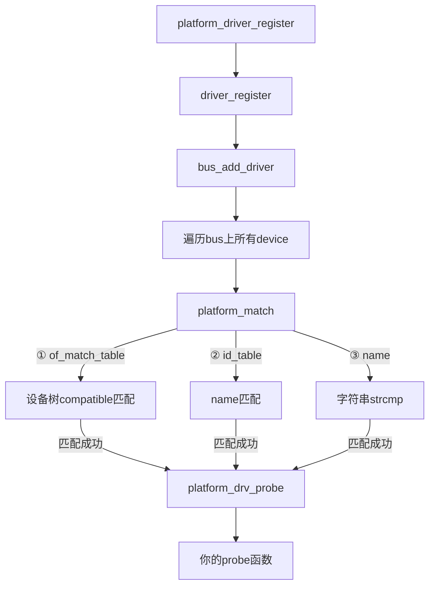

## 11.2.2 platform_driver注册与匹配

**知识点138 [E][M]**

### 本节导读

上一节我们搞清楚了`platform_device`是怎么来的——无论是设备树解析还是手动注册，本质上都是往platform总线上挂设备。那驱动呢？驱动又是怎么"找上门"的？本节我们一起走一遍`platform_driver`从注册到匹配触发的完整流程。看完这一节，你会明白：为什么设备树时代我们只需要填好`of_match_table`就能自动匹配，内核在背后帮你串起了哪些调用链。

---

### platform_driver结构体长什么样

在追踪注册流程之前，先来看看驱动的"身份证"。`platform_driver`结构体定义在`include/linux/platform_device.h`中：

```c
struct platform_driver {
    int (*probe)(struct platform_device *);
    int (*remove)(struct platform_device *);
    void (*shutdown)(struct platform_device *);
    int (*suspend)(struct platform_device *, pm_message_t state);
    int (*resume)(struct platform_device *);
    struct device_driver driver;        /* 内嵌基类 */
    const struct platform_device_id *id_table;
};
```

注意里面内嵌了一个`struct device_driver`。这很关键——platform驱动本质上也是"设备驱动"这个基类的派生。`driver`成员里有两个匹配相关的字段你需要重点关注：

- `driver.name`：传统字符串匹配的名字
- `driver.of_match_table`：设备树匹配表（设备树时代最常用）

### 注册入口：platform_driver_register()

注册一个platform驱动的代码你肯定见过：

```c
static int __init my_driver_init(void)
{
    return platform_driver_register(&my_driver);
}
module_init(my_driver_init);
```

但`platform_driver_register()`背后到底干了什么？跟进去，调用链是这样的：

```
platform_driver_register(drv)
  └── __platform_driver_register(drv, THIS_MODULE)
        └── drv->driver.bus = &platform_bus_type;   /* 绑定总线 */
        └── driver_register(&drv->driver);
              └── bus_add_driver(drv);
                    └── driver_attach(drv);
                          └── bus_for_each_dev(drv->bus, ...);
```

说白了，`driver_register()`只做两件事：**把你挂到总线上**，然后**遍历总线上已有的设备**，逐个尝试匹配。

💡 **提示**：如果你的驱动加载比设备晚，`bus_add_driver()`会主动遍历已有设备去匹配；反过来，如果设备后加载，`device_add()`也会遍历已有驱动。双向都有机会，不怕错过。

### 匹配的核心：platform_match()

匹配逻辑在`platform_bus_type`的结构体里指定：

```c
struct bus_type platform_bus_type = {
    .name       = "platform",
    .dev_groups = platform_dev_groups,
    .match      = platform_match,       /* ← 匹配函数 */
    .probe      = platform_drv_probe,
    .remove     = platform_drv_remove,
    ...
};
```

`platform_match()`的源码逻辑非常清晰，匹配条件按**优先级降序**排列：

```c
static int platform_match(struct device *dev, struct device_driver *drv)
{
    struct platform_device *pdev = to_platform_device(dev);
    struct platform_driver *pdrv = to_platform_driver(drv);

    /* 1. 设备树匹配（of_match_table），优先级最高 */
    if (of_driver_match_device(dev, drv))
        return 1;

    /* 2. ACPI匹配 */
    if (acpi_driver_match_device(dev, drv))
        return 1;

    /* 3. id_table匹配 */
    if (pdrv->id_table)
        return platform_match_id(pdrv->id_table, pdev) != NULL;

    /* 4. name匹配，最原始的字符串比对 */
    return (strcmp(pdev->name, drv->name) == 0);
}
```

逐层解读这四条规则：

**① of_match_table（设备树匹配）**

设备树时代最常用。驱动里填好`of_device_id`数组，内核会自动拿设备的`compatible`属性来比对。

```c
static const struct of_device_id my_of_match[] = {
    { .compatible = "myvendor,mydevice" },
    { },
};
MODULE_DEVICE_TABLE(of, my_of_match);

static struct platform_driver my_driver = {
    .driver = {
        .name = "my_driver",
        .of_match_table = my_of_match,  /* ← 关键 */
    },
    .probe = my_probe,
    .remove = my_remove,
};
```

只要设备节点的`compatible = "myvendor,mydevice"`，就能匹配上。这是最推荐的方式。

**② id_table匹配**

传统方式，通过`platform_device_id`数组来匹配。platform_device的`name`字段跟id_table里的`name`比对：

```c
static const struct platform_device_id my_ids[] = {
    { "my_device_v1", (kernel_ulong_t)&config_v1 },
    { "my_device_v2", (kernel_ulong_t)&config_v2 },
    { },
};
```

**③ name匹配**

最原始的方式——直接比较`pdev->name`和`drv->driver.name`的字符串。早期内核没有设备树的时候，这就是唯一的匹配手段。

⚠️ **陷阱**：很多新手在设备树环境下只填了`driver.name`却忘了填`of_match_table`，结果发现设备怎么都匹配不上。记住：设备树匹配只看`compatible`和`of_match_table`，跟`driver.name**没关系**。

### 匹配成功之后：probe的调用链

一旦`platform_match()`返回1，匹配成功，内核开始走probe流程：

```
driver_probe_device()
  └── really_probe()
        └── dev->bus->probe(dev)     /* 即 platform_drv_probe() */
              └── pdrv->probe(pdev)  /* 你写的probe()被调用 */
```

`platform_drv_probe()`是platform总线提供的统一包装函数，它负责调用你注册时填的`probe`回调。如果你的probe返回0，驱动就算成功绑定了。

整个流程可以用一张图概括：



### 一个完整示例

把上面学的串起来，看一个完整的platform驱动模板：

```c
#include <linux/module.h>
#include <linux/platform_device.h>
#include <linux/of.h>

static int my_probe(struct platform_device *pdev)
{
    pr_info("mydev: probe called!\n");
    /* 初始化硬件、申请资源 */
    return 0;
}

static int my_remove(struct platform_device *pdev)
{
    pr_info("mydev: remove called!\n");
    return 0;
}

static const struct of_device_id my_of_match[] = {
    { .compatible = "myvendor,mydev" },
    { }
};
MODULE_DEVICE_TABLE(of, my_of_match);

static struct platform_driver my_driver = {
    .probe  = my_probe,
    .remove = my_remove,
    .driver = {
        .name = "my_driver",
        .of_match_table = my_of_match,
    },
};
module_platform_driver(my_driver);  /* 注册宏，等价于module_init+platform_driver_register */

MODULE_LICENSE("GPL");
```

🔴 **危险**：`MODULE_DEVICE_TABLE(of, my_of_match)`这行很容易被漏掉。它的作用是把匹配信息写入驱动的模块元数据，让内核的模块自动加载机制（modprobe）能根据设备树的`compatible`找到对应的驱动。**漏了这行，设备树匹配功能本身还能工作，但模块自动加载会失效**。

---

### 本节总结

| 知识点 | 核心内容 |
|--------|----------|
| 注册入口 | `platform_driver_register()` → `driver_register()` → `bus_add_driver()` |
| 匹配函数 | `platform_bus_type.match = platform_match()` |
| 匹配优先级① | `of_match_table`：设备树`compatible`匹配（最常用） |
| 匹配优先级② | `id_table`：`platform_device_id`数组的`name`匹配 |
| 匹配优先级③ | `name匹配`：`pdev->name`与`drv->name`字符串比对 |
| probe调用链 | `really_probe()` → `platform_drv_probe()` → 驱动的`probe()` |
| 设备树匹配关键 | 必须填`of_match_table`，不能只靠`driver.name` |
| 自动加载关键 | 必须写`MODULE_DEVICE_TABLE(of, ...)` |

### 下一步

设备匹配上了，probe也进去了——但`probe`函数里你该怎么获取设备信息？设备树里的属性怎么读？那些`reg`、`interrupts`资源又是怎么转成内核资源的？下一节我们来拆解`probe()`函数里的资源获取流程。
