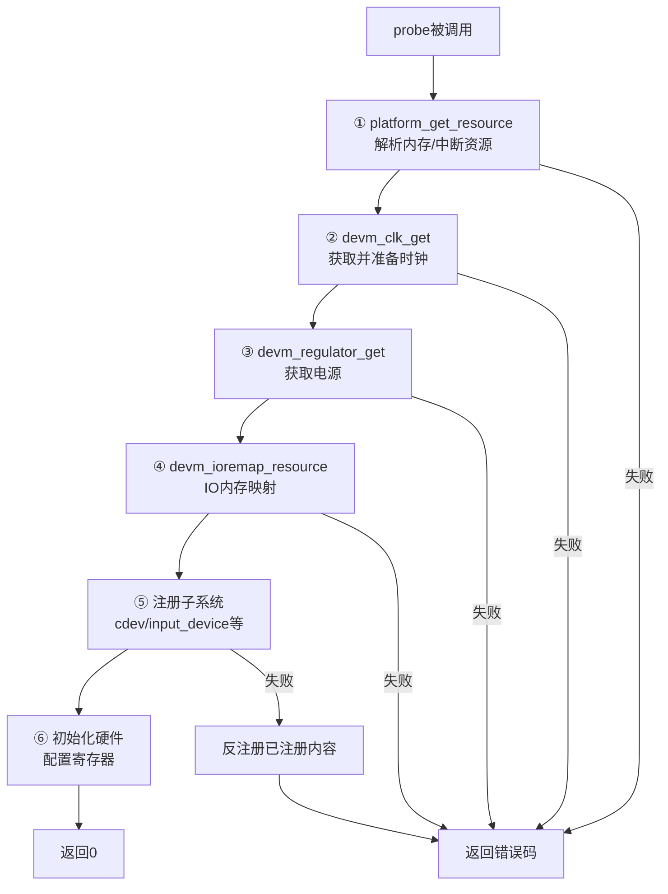

# 11.2.3 probe()函数内部

> 所属章节：第11章 设备驱动模型深入 > 11.2 platform设备驱动
> 难度：[E→M] | 预计阅读时间：20分钟

## 本节导读
上一节讲完了匹配流程，设备找到驱动后第一件干的事就是调用你的`probe()`。这一节我们钻进`probe()`肚子里，看看它到底怎么干活。现实中`probe()`写得好不好，直接决定你的驱动是"一次点亮"还是"反复跳电"。学完后，你能列出一个标准的probe函数必须做的六件事，也能看懂内核文档里那些`devm_`前缀的API是干嘛的。

---

## 知识点140：probe的六步典型流程——从"拿到资源"到"硬件跑起来" [E][M] ~1500字

### 先泼一盆冷水：probe是驱动里最容易踩坑的地方

很多新手写`probe()`有个坏习惯——资源获取不全就开始操作硬件，结果换块板子就崩。我见过最离谱的是有人在`probe()`里直接写寄存器，连时钟都没使能，然后问"为什么我读出来的值全是0"。

`probe()`的本质是**把设备树描述的资源变成驱动能用的软件对象**，然后初始化硬件。顺序不能乱，下面这六步是业界踩了无数次坑总结出来的标准流程。

### 六步流程一览



[图1：probe()六步标准流程图]

这六步的顺序不是随便排的，里面有依赖关系：没拿到内存资源就没法做IO映射；没使能时钟就读写寄存器等于白读；没配好电源硬件可能根本不响应。下面一步步拆开讲。

### 第一步：解析资源——platform_get_resource()

`probe()`进来第一件事是从`platform_device`里把资源掏出来。最常见的是内存资源和中断号：

```c
/* 代码1：获取内存和中断资源 */
res = platform_get_resource(pdev, IORESOURCE_MEM, 0);
if (!res) {
    dev_err(&pdev->dev, "failed to get memory resource\n");
    return -ENODEV;
}

irq = platform_get_irq(pdev, 0);
if (irq < 0) {
    dev_err(&pdev->dev, "failed to get IRQ: %d\n", irq);
    return irq;
}
```

注意`platform_get_irq()`返回的是正整数（中断号），失败返回负数错误码。很多人写成`if (!irq)`，结果中断号是0的时候逻辑就错了。

### 第二步：获取时钟——devm_clk_get()

现在几乎所有SoC外设都需要时钟，忘了这步硬件根本不动：

```c
/* 代码2：获取并使能时钟 */
clk = devm_clk_get(&pdev->dev, NULL);  /* NULL表示用默认时钟名 */
if (IS_ERR(clk)) {
    dev_err(&pdev->dev, "failed to get clock\n");
    return PTR_ERR(clk);
}

ret = clk_prepare_enable(clk);
if (ret) {
    dev_err(&pdev->dev, "failed to enable clock: %d\n", ret);
    return ret;
}
```

内核里时钟有两个阶段：`prepare`和`enable`。`clk_prepare_enable()`把两步合并了。`devm_`前缀的好处是——驱动卸载时内核自动帮你`disable`和`unprepare`，不用在`remove()`里手动写。这个设计救过无数人的命，尤其是项目紧的时候容易忘清理资源。

### 第三步：获取电源——devm_regulator_get()

如果你的外设需要独立供电（比如某个GPIO控制的LDO），或者需要查当前电压，就要走这一步：

```c
/* 代码3：获取regulator */
reg = devm_regulator_get(&pdev->dev, "power");
if (IS_ERR(reg)) {
    ret = PTR_ERR(reg);
    if (ret != -EPROBE_DEFER)  /* 重要：别漏掉这个判断 */
        dev_err(&pdev->dev, "failed to get regulator: %d\n", ret);
    return ret;
}

ret = regulator_enable(reg);
if (ret) {
    dev_err(&pdev->dev, "failed to enable regulator: %d\n", ret);
    return ret;
}
```

这里有个大坑：`-EPROBE_DEFER`。设备树的依赖关系没满足时（比如另一个驱动还没加载），`devm_regulator_get()`会返回这个特殊错误码。此时你的`probe()`必须把这个错误原样返回给内核，内核过段时间会重新调用你的`probe()`。如果你傻乎乎地把它当成普通错误处理掉，这个设备就再也探不到了。

### 第四步：IO映射——devm_ioremap_resource()

前面拿到的`res`是物理地址，CPU不能直接访问，必须映射到虚拟地址空间：

```c
/* 代码4：IO内存映射 */
base = devm_ioremap_resource(&pdev->dev, res);
if (IS_ERR(base)) {
    dev_err(&pdev->dev, "failed to remap I/O memory\n");
    return PTR_ERR(base);
}
```

**必须用`devm_ioremap_resource()`，不要用裸的`ioremap()`。** 前者会帮你做两件事：一是检查资源冲突（这块内存有没有被别的驱动占用了），二是自动做`request_mem_region()`标记占用。如果你偷偷用`ioremap()`绕过去，两个驱动映射了同一块物理地址，调试的时候能把人逼疯——读出来的值一会儿对一会儿错。

### 第五步：注册子系统

硬件资源都准备好了，接下来要让用户空间能看见你。根据驱动类型不同，注册方式各异：

```c
/* 代码5：注册字符设备 */
ret = alloc_chrdev_region(&devno, 0, 1, "myled");
if (ret) {
    dev_err(&pdev->dev, "failed to alloc chrdev: %d\n", ret);
    return ret;
}

cdev_init(&priv->cdev, &myled_fops);
priv->cdev.owner = THIS_MODULE;
ret = cdev_add(&priv->cdev, devno, 1);
if (ret) {
    dev_err(&pdev->dev, "failed to add cdev: %d\n", ret);
    unregister_chrdev_region(devno, 1);
    return ret;
}
```

这步最容易出问题的不是注册本身，而是**注册失败了怎么清理**。前面四步用的都是`devm_`系列，失败了直接返回就行，内核帮你收拾。但从第五步开始，你主动申请了内核资源（如`alloc_chrdev_region`），失败了就得自己手动释放。所以很多人把`devm_`资源叫做"托管资源"，而从这步开始是"非托管资源"，得自己记账。

### 第六步：初始化硬件

万事俱备，最后才碰硬件：

```c
/* 代码6：初始化硬件寄存器 */
writel(CFG_DEFAULT_VALUE, base + REG_CONFIG);
writel(CTRL_ENABLE, base + REG_CONTROL);
```

有个不成文的规矩：**写寄存器之前先读一遍reset值**，很多 datasheet 会告诉你 reset 后寄存器应该是什么值。如果你读出来的值和 datasheet 对不上，大概率是前面某步没做好（时钟没开、电源没给、地址映射错了）。别一上来就写，先读验证，能省三小时调试时间。

### 六步API与失败处理速查表

| 步骤 | 核心API | 失败返回值 | 处理方式 | 常见踩坑 |
|------|--------|-----------|---------|---------|
| ① 解析资源 | `platform_get_resource()` / `platform_get_irq()` | NULL / 负数 | 打印错误并返回`-ENODEV`或irq错误码 | `platform_get_irq`返回0是合法中断号，不能用`if (!irq)`判断 |
| ② 获取时钟 | `devm_clk_get()` | `ERR_PTR()` | `PTR_ERR()`取错误码返回 | 忘了`clk_prepare_enable()`，硬件不工作 |
| ③ 获取电源 | `devm_regulator_get()` | `ERR_PTR()` | 注意判断`-EPROBE_DEFER`，原样返回 | 把defer当普通错误处理，设备永久丢失 |
| ④ IO映射 | `devm_ioremap_resource()` | `ERR_PTR()` | `PTR_ERR()`取错误码返回 | 用裸`ioremap()`导致资源冲突 |
| ⑤ 注册子系统 | `alloc_chrdev_region()` / `cdev_add()`等 | 负数 | 手动释放已申请的资源 | 失败时漏了unregister，资源泄漏 |
| ⑥ 初始化硬件 | `readl()` / `writel()` | 无 | 前5步成功后才能执行 | 未验证reset值直接写，出问题难定位 |

### probe()的返回值到底什么意思

| 返回值 | 含义 | 内核行为 |
|--------|------|---------|
| 0 | 初始化成功 | 设备状态置为bound，匹配完成 |
| 负数（如`-ENOMEM`、`-EINVAL`） | 初始化失败，且本驱动确实搞不定这个设备 | 打印错误，驱动和设备解绑 |
| `-EPROBE_DEFER` | 依赖资源暂不可用（如 regulator、clock provider 还没加载） | 内核把设备放入defer链表，稍后重试 |

`-EPROBE_DEFER`是个好东西，它让驱动的加载顺序不再重要。比如你的LED驱动依赖某个GPIO控制器，但GPIO控制器的驱动还没加载。没有defer机制的话，LED驱动就直接报错了；有了defer，内核会记下来，等GPIO控制器注册好了再重试LED的probe。这个机制让设备树驱动的依赖关系自动处理，不需要你手动控制加载顺序。

---

## 知识点141：完整probe函数代码示例——一个简化LED驱动 [E] ~800字

### 看一个能跑的完整例子

光讲流程抽象，不如看一个完整的代码。下面是一个简化的platform LED驱动`probe()`函数，包含了前面讲的六步流程和完整的错误处理路径。这个例子在内核`drivers/leds/`目录下有大量真实版本，逻辑骨架基本一致。

```c
/* 代码7：简化LED驱动的完整probe函数 */
struct myled_priv {
    void __iomem       *base;
    struct clk         *clk;
    struct regulator   *reg;
    struct cdev        cdev;
    dev_t              devno;
    int                irq;
};

static int myled_probe(struct platform_device *pdev)
{
    struct myled_priv *priv;
    struct resource *res;
    int ret, irq;

    /* ---- 第零步：分配私有数据结构 ---- */
    priv = devm_kzalloc(&pdev->dev, sizeof(*priv), GFP_KERNEL);
    if (!priv)
        return -ENOMEM;

    /* ---- 第一步：获取内存和中断资源 ---- */
    res = platform_get_resource(pdev, IORESOURCE_MEM, 0);
    if (!res) {
        dev_err(&pdev->dev, "no memory resource\n");
        return -ENODEV;
    }

    irq = platform_get_irq(pdev, 0);
    if (irq < 0) {
        dev_err(&pdev->dev, "no irq resource: %d\n", irq);
        return irq;
    }
    priv->irq = irq;

    /* ---- 第二步：获取并使能时钟 ---- */
    priv->clk = devm_clk_get(&pdev->dev, "led");
    if (IS_ERR(priv->clk)) {
        ret = PTR_ERR(priv->clk);
        dev_err(&pdev->dev, "failed to get clock: %d\n", ret);
        return ret;
    }

    ret = clk_prepare_enable(priv->clk);
    if (ret) {
        dev_err(&pdev->dev, "failed to enable clock: %d\n", ret);
        return ret;
    }

    /* ---- 第三步：获取电源（可选，但代码要健壮）---- */
    priv->reg = devm_regulator_get_optional(&pdev->dev, "power");
    if (!IS_ERR(priv->reg)) {
        ret = regulator_enable(priv->reg);
        if (ret) {
            dev_err(&pdev->dev, "failed to enable regulator: %d\n", ret);
            goto err_disable_clk;
        }
    } else if (PTR_ERR(priv->reg) != -ENODEV) {
        /* 真的有regulator但获取失败了 */
        ret = PTR_ERR(priv->reg);
        dev_err(&pdev->dev, "failed to get regulator: %d\n", ret);
        goto err_disable_clk;
    }
    /* 如果返回-ENODEV说明设备树里没配，没关系，继续 */

    /* ---- 第四步：IO内存映射 ---- */
    priv->base = devm_ioremap_resource(&pdev->dev, res);
    if (IS_ERR(priv->base)) {
        ret = PTR_ERR(priv->base);
        dev_err(&pdev->dev, "failed to ioremap: %d\n", ret);
        goto err_disable_reg;
    }

    /* ---- 第五步：注册字符设备 ---- */
    ret = alloc_chrdev_region(&priv->devno, 0, 1, "myled");
    if (ret) {
        dev_err(&pdev->dev, "alloc chrdev failed: %d\n", ret);
        goto err_disable_reg;
    }

    cdev_init(&priv->cdev, &myled_fops);
    priv->cdev.owner = THIS_MODULE;
    ret = cdev_add(&priv->cdev, priv->devno, 1);
    if (ret) {
        dev_err(&pdev->dev, "cdev_add failed: %d\n", ret);
        goto err_unregister_chrdev;
    }

    /* ---- 第六步：初始化硬件 ---- */
    ret = devm_request_irq(&pdev->dev, priv->irq, myled_irq_handler,
                           0, "myled", priv);
    if (ret) {
        dev_err(&pdev->dev, "request_irq failed: %d\n", ret);
        goto err_del_cdev;
    }

    /* 验证reset值，再写配置 */
    dev_info(&pdev->dev, "reset value: 0x%08x\n", readl(priv->base + REG_ID));
    writel(LED_CFG_DEFAULT, priv->base + REG_CONFIG);
    writel(LED_CTRL_OFF, priv->base + REG_CONTROL);

    dev_info(&pdev->dev, "myled probed successfully\n");
    return 0;

/* ---- 错误处理路径：反向清理已分配资源 ---- */
err_del_cdev:
    cdev_del(&priv->cdev);
err_unregister_chrdev:
    unregister_chrdev_region(priv->devno, 1);
err_disable_reg:
    if (!IS_ERR_OR_NULL(priv->reg))
        regulator_disable(priv->reg);
err_disable_clk:
    clk_disable_unprepare(priv->clk);
    return ret;
}
```

### 重点看错误处理

这个代码最有价值的地方不是正常路径，而是`goto`错误处理链。内核代码里`goto`不是坏东西，用来做错误清理是标准做法。注意清理顺序：**按照申请资源的反方向清理**，先释放后申请的。

还有一个细节：`devm_regulator_get_optional()`比`devm_regulator_get()`更适合这个场景。前者在设备树没配regulator时返回`-ENODEV`，这是正常的，驱动可以继续工作；后者会把`-ENODEV`当成错误。用`optional`版本让你的驱动在有电源配置和没配置时都能跑。

⚠️ **陷阱**：很多人写`probe()`时，第五步或第六步出错了，只返回错误码，忘了前面已经`clk_prepare_enable()`过的时钟。结果是驱动卸载了，时钟还开着，硬件模块继续耗电发热。上面的例子中`err_disable_clk`标签就是为了解决这个问题。

---

## 本节总结

| 概念 | 核心要点 | 自查问题 |
|------|---------|---------|
| probe六步流程 | ①解析资源 → ②获取时钟 → ③获取电源 → ④IO映射 → ⑤注册子系统 → ⑥初始化硬件 | 你的probe函数顺序对吗？ |
| devm_前缀API | 内核托管的资源，失败时或remove时自动释放 | 哪些资源用了devm_，哪些没用到？ |
| -EPROBE_DEFER | 依赖未就绪时的特殊错误码，必须原样返回让内核重试 | 你的代码正确处理defer了吗？ |
| 错误处理 | 非devm资源（如cdev、chrdev_region）失败时手动清理 | probe中途失败会漏掉哪些资源？ |
| IO映射规范 | 必须用devm_ioremap_resource，禁止裸ioremap | 你的代码有没有资源冲突风险？ |

---

## 下一步

probe()里六步走完了，硬件初始化好了，用户空间也能看见设备节点了。但驱动还没完——用户空间怎么操作这个设备？下一节（11.2.4）我们讲`file_operations`，也就是用户态调用`open()`、`read()`、`write()`时，内核驱动里对应的回调函数是怎么被调用到的。这是"字符设备驱动"的核心骨架。

---

## 配套资源

### 表格清单
- 表1：probe六步API与失败处理速查表
- 表2：probe()返回值含义表
- 表3：本节总结自查表

### 图示清单
- 图1：probe()六步标准流程图 [mermaid图]

### 代码清单
- 代码1：获取内存和中断资源（`platform_get_resource()` / `platform_get_irq()`）
- 代码2：获取并使能时钟（`devm_clk_get()` / `clk_prepare_enable()`）
- 代码3：获取regulator（`devm_regulator_get()`）
- 代码4：IO内存映射（`devm_ioremap_resource()`）
- 代码5：注册字符设备（`alloc_chrdev_region()` / `cdev_add()`）
- 代码6：初始化硬件寄存器（`readl()` / `writel()`）
- 代码7：简化LED驱动的完整probe函数（含错误处理路径）
