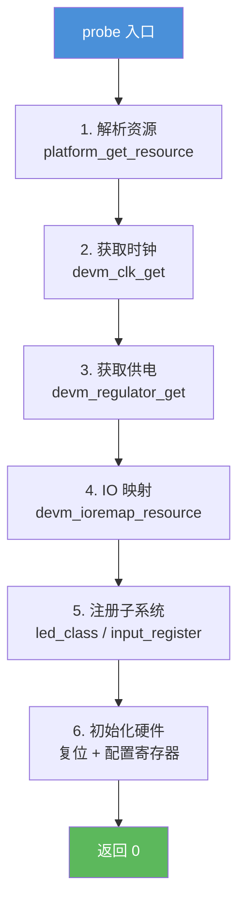

### 11.2.3 probe() 函数内部

**知识点 139 [E][M]**

---

**本节导读**

上一节我们搞清楚了总线匹配和 probe 的调用时机——现在到了最硬核的部分：probe 函数里面到底该写些什么？本节拆解一个典型 probe 的"六步标准流程"，从获取寄存器基地址到初始化硬件，一步步跟着代码走。学完本节，你能独立写出结构工整、资源管理完善的 probe 函数。

---

probe 是驱动与具体硬件设备"第一次握手"的地方。你可以把它想象成新房入住前的"验房 + 装修"流程：先确认水电煤（资源、时钟、供电）是否到位，再打通隔墙（IO 映射），然后挂上门牌号（注册子系统），最后通电试灯（初始化硬件）。顺序错了，后面步步踩坑。

下面这六步，是 Linux 内核驱动中 probe 函数的经典骨架：



#### 第 1 步：解析资源——找到寄存器在哪里

Platform 设备通过 `struct resource` 数组描述自己的硬件资源（寄存器基地址、IRQ 号、DMA 通道等）。probe 要做的第一件事就是把这些资源"捞"出来。

```c
struct resource *res;

res = platform_get_resource(pdev, IORESOURCE_MEM, 0);
if (!res) {
    dev_err(&pdev->dev, "Failed to get memory resource\n");
    return -ENODEV;
}
```

`IORESOURCE_MEM` 表示内存资源，第三个参数 `0` 是索引号。一个设备可能有多个内存区域（比如寄存器区 + FIFO 区），依次用 `0`、`1` 取。

⚠️ **陷阱**：有人习惯直接用 `pdev->resource` 访问——别这么做。`platform_get_resource()` 会帮你处理设备树和 platform 板级两种描述方式的统一抽象，硬编码数组索引在设备树迁移时很容易崩。

#### 第 2 步：获取时钟——没有 clk，芯片不会动

现代 SoC 的每个 IP 模块都有独立的门控时钟，probe 必须显式申请并使能它。

```c
struct clk *clk;

clk = devm_clk_get(&pdev->dev, NULL);
if (IS_ERR(clk))
    return PTR_ERR(clk);

ret = clk_prepare_enable(clk);
if (ret)
    return ret;
```

`devm_clk_get()` 的第一个参数是 `struct device *`，第二个是时钟名称。传 `NULL` 表示取设备的默认时钟。如果设备树里没定义这个时钟，这里会直接失败——驱动就跑不下去了。

💡 **提示**：`devm_` 前缀的资源在设备卸载时会自动释放，省掉繁琐的 cleanup 代码。内核从 3.5 版本开始大规模引入 devm 系列函数，现在已经成了驱动的标配写法。

#### 第 3 步：获取 Regulator——PMIC 供电管理

很多外设需要单独的供电轨（比如摄像头模组的 AVDD、DVDD），这些由 PMIC（电源管理 IC）控制。驱动需要通过 regulator 接口申请：

```c
struct regulator *power;

power = devm_regulator_get(&pdev->dev, "power");
if (IS_ERR(power))
    return PTR_ERR(power);

ret = regulator_enable(power);
if (ret)
    return ret;
```

`"power"` 这个名字对应设备树中 `regulator-names` 属性的条目。不是所有设备都需要这一步——如果你的外设直接从板级电源取电、不涉及 PMIC 控制，可以跳过。

#### 第 4 步：IO 映射——物理地址 → 虚拟地址

拿到第 1 步的 `struct resource` 后，还不能直接读写——需要建立虚拟地址映射：

```c
void __iomem *base;

base = devm_ioremap_resource(&pdev->dev, res);
if (IS_ERR(base))
    return PTR_ERR(base);
```

`devm_ioremap_resource()` 内部做了两件事：一是调用 `request_mem_region()` 向内核登记"这段物理地址归我用了"，二是调用 `ioremap()` 建立页表映射。相比裸调 `ioremap()`，这个封装版本会自动做冲突检测。

🔴 **危险**：**绝对禁止**绕过 `devm_ioremap_resource()` 直接硬编码物理地址做 `ioremap()`。同一段物理地址被两个驱动同时映射，写竞争可能导致无法预测的硬件状态损坏——调试时你会怀疑人生。

#### 第 5 步：注册子系统——让内核和用户空间认识你

硬件资源准备好了，现在要把设备"挂"进 Linux 的子系统框架里。不同的设备类型走不同的注册路径：

| 设备类型 | 注册函数 | 说明 |
|----------|----------|------|
| LED | `devm_led_classdev_register()` | 自动在 `/sys/class/leds/` 创建节点 |
| 按键 | `input_register_device()` | 接入 input 子系统 |
| PWM | `pwmchip_add()` | 注册为 PWM 控制器 |
| GPIO | `gpiochip_add_data()` | 注册为 GPIO 控制器 |
| I2C/SPI 控制器 | `i2c_add_adapter()` / `spi_register_master()` | 总线控制器 |

这一步决定了你的设备在用户空间"长什么样"。LED 注册后用户能看到 `/sys/class/leds/myled/brightness`；input 注册后能产生 `/dev/input/eventX`。

#### 第 6 步：初始化硬件——开始动真格的

子系统注册完毕，最后一步是给硬件"上电复位"：写配置寄存器、清中断标志、设置初始状态。顺序很关键——应该先确保前面 5 步都成功了再碰硬件。

```c
/* 软件复位 */
writel(CTRL_RST_BIT, base + REG_CTRL);
udelay(10);
writel(0, base + REG_CTRL);

/* 配置初始状态 */
writel(DEFAULT_CFG, base + REG_CONFIG);
```

这里用 `writel()` 而不是裸指针解引用，因为 `base` 是 `__iomem` 标记的 MMIO 地址，必须通过专用 IO 访问函数读写。

---

#### 完整示例：一个简化 LED 驱动的 probe

下面把六步流程串成一个完整的 probe 函数。这是一个基于 platform 驱动的简化 LED 控制器，核心逻辑一目了然：

```c
static int myled_probe(struct platform_device *pdev)
{
    struct device *dev = &pdev->dev;
    struct myled_priv *priv;
    struct resource *res;
    struct clk *clk;
    int ret;

    /* ---- 第 1 步：解析资源 ---- */
    res = platform_get_resource(pdev, IORESOURCE_MEM, 0);
    if (!res)
        return -ENODEV;

    /* ---- 第 2 步：获取时钟 ---- */
    clk = devm_clk_get(dev, NULL);
    if (IS_ERR(clk))
        return PTR_ERR(clk);

    ret = clk_prepare_enable(clk);
    if (ret)
        return ret;

    /* ---- 第 3 步：申请私有数据结构 ---- */
    priv = devm_kzalloc(dev, sizeof(*priv), GFP_KERNEL);
    if (!priv)
        return -ENOMEM;

    priv->clk = clk;
    platform_set_drvdata(pdev, priv);

    /* ---- 第 4 步：IO 映射 ---- */
    priv->base = devm_ioremap_resource(dev, res);
    if (IS_ERR(priv->base))
        return PTR_ERR(priv->base);

    /* ---- 第 5 步：注册 LED 子系统 ---- */
    priv->led.name = "myled";
    priv->led.brightness_set = myled_set;
    priv->led.max_brightness = 255;

    ret = devm_led_classdev_register(dev, &priv->led);
    if (ret)
        return ret;

    /* ---- 第 6 步：初始化硬件 ---- */
    writel(0x0, priv->base + REG_LED_CTRL);   /* 默认关闭 */
    writel(0x1, priv->base + REG_LED_ENABLE); /* 使能模块 */

    dev_info(dev, "myled probe ok, base=%p\n", priv->base);
    return 0;
}
```

这个 probe 用了 `devm_` 全家桶：`devm_clk_get()`、`devm_kzalloc()`、`devm_ioremap_resource()`、`devm_led_classdev_register()`。这意味着 probe 如果中途返回错误，已经申请的资源会被内核自动清理——你不需要写 remove 函数来逐个释放。

但注意，`clk_prepare_enable()` 和 `writel()` 这类"启动类操作"不在 devm 的自动管理范围内，它们需要在 `remove()` 中手动回退（`clk_disable_unprepare()`、关 LED 等）。devm 只管"内存/注册"层面的释放，不管硬件状态。

⚠️ **陷阱**：probe 中申请了 `clk_prepare_enable()`，却在 remove 里忘了 `clk_disable_unprepare()`——驱动卸载后时钟还在跑，轻则费电，重则影响后续驱动重新加载时的时钟状态。

---

#### probe 返回值：0 与非 0 的天壤之别

probe 函数的返回值决定了设备的生死：

| 返回值 | 含义 | 内核行为 |
|--------|------|----------|
| `0` | 成功 | 设备与驱动绑定成功，设备进入工作状态 |
| `-ENODEV` | 资源不存在 | 设备不绑定，驱动仍留在总线上 |
| `-ENOMEM` | 内存不足 | 设备不绑定，资源自动释放 |
| `-EBUSY` | 资源冲突 | 设备不绑定，通常有别的驱动占用了资源 |
| `-EPROBE_DEFER` | 依赖未就绪 | **特殊处理**：总线会推迟 probe，稍后重试 |

`-EPROBE_DEFER` 是一个值得细说的返回值。假设你的驱动依赖另一个设备的 regulator，但那个 regulator 驱动还没加载完。此时返回 `-EPROBE_DEFER`，内核会把你的设备放到延迟队列，等依赖的驱动就绪后自动重新调用 probe。这避免了驱动加载顺序的硬编码问题。

💡 **提示**：返回非 0 时，devm 系列函数会自动回滚已经申请的资源。比如你第 5 步注册 LED 失败，前面 4 步的时钟、IO 映射、内存都会自动释放——这就是 devm 的好处。但第 6 步如果写寄存器出错，硬件状态可能已经变了，需要手动回滚。

---

**本节总结**

| 知识点 | 内容 |
|--------|------|
| probe 六步流程 | ① 解析资源 ② 获取时钟 ③ 获取 regulator ④ IO 映射 ⑤ 注册子系统 ⑥ 初始化硬件 |
| 资源解析 | `platform_get_resource(pdev, IORESOURCE_MEM, index)`，索引从 0 开始 |
| 时钟申请 | `devm_clk_get(&pdev->dev, name)`，返回 `IS_ERR()` 需检查 |
| 供电申请 | `devm_regulator_get(&pdev->dev, name)`，可选步骤 |
| IO 映射 | `devm_ioremap_resource(&pdev->dev, res)`，禁止硬编码物理地址 |
| 子系统注册 | 根据设备类型选择 `led_classdev_register()` / `input_register_device()` 等 |
| 硬件初始化 | 复位 → 配置寄存器 → 设置初始状态，用 `writel()`/`readl()` 访问 |
| devm 机制 | `devm_` 前缀函数在 probe 失败时自动释放资源，但时钟使能等操作需手动回退 |
| 返回值 | `0`=成功绑定；`-EPROBE_DEFER`=延迟重试；其他非 0=失败，设备不绑定 |

**下一步**

probe 走通了，设备正常工作——但驱动卸载时怎么办？remove() 函数需要做哪些清理工作？ devm 资源会自动释放，那非 devm 资源呢？下一节 `11.2.4 remove() 函数与资源清理` 一起拆解。
