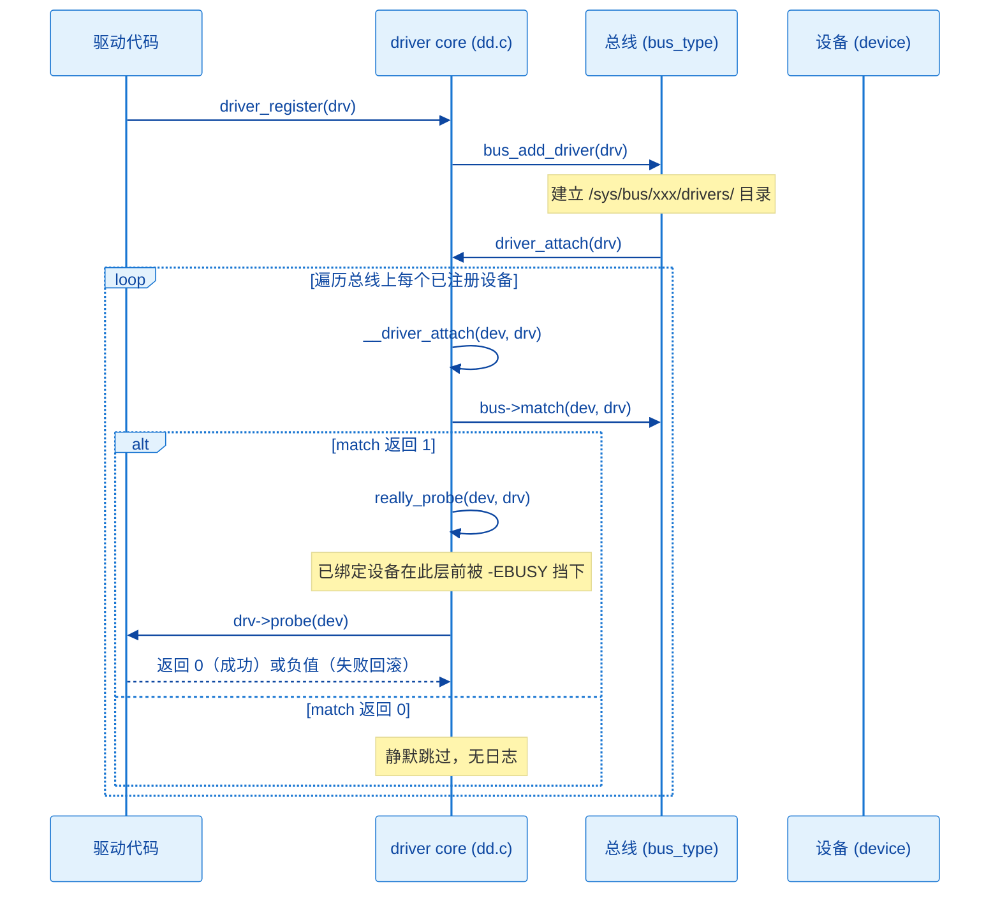

# 11.2.3 match()与probe()的调用链

> 所属：第11章 设备模型 > 11.2 总线-设备-驱动模型
> 
> 难度：[I→E] | 预计阅读时间：18分钟

## <span class="blue"> 本节导读

11.2.2 给出了 `bus_type`、`device`、`device_driver` 的静态结构，本节回答动态问题：驱动调用 `driver_register()` 之后，内核经过哪些函数、在哪一步比对 `match()`、又在哪一步进入 `probe()`。<br>
这是「设备从设备树节点到 probe 成功」主线中最核心的动态路径，也是「驱动注册了但 probe 没执行」这类问题的定位依据。<BR>
本节覆盖：`driver_register()` 到 `probe()` 的完整调用链逐层拆解（附精简源码）、match 失败的静默特性、probe 未执行的最小排查顺序。

---

## <span class="blue"> 从 driver_register 到 probe 的调用链 [I]

### 调用链全貌

整条链路的骨架如下，建议对照源码 `drivers/base/driver.c`、`drivers/base/bus.c` 和 `drivers/base/dd.c` 阅读：

```
driver_register(struct device_driver *drv)            drivers/base/driver.c
  └─> bus_add_driver(drv)                             drivers/base/bus.c
        ├─> 创建 /sys/bus/<bus>/drivers/<name> 目录
        └─> driver_attach(drv)                        drivers/base/dd.c:1231
              └─> bus_for_each_dev(bus, NULL, drv, __driver_attach)
                    └─> __driver_attach(dev, drv)        dd.c:1156 ← 对总线上每个设备执行一次
                          ├─> driver_match_device(drv, dev)  ← 即 bus->match()
                          │     ├─ 返回 1：匹配成功 → driver_probe_device() → really_probe()
                          │     │                                     └─> drv->probe(dev)
                          │     └─ 返回 0：不匹配，静默检查下一个设备
                          └─> （已绑定检查在 __driver_probe_device 里：dev->driver 非空返回 -EBUSY）
```

反向路径对称存在：设备注册时 `device_add()` 会触发 `bus_probe_device()`，遍历总线的驱动链表做同样的 match→probe 流程。因此链路上有两个入口，殊途同归。

### 逐层拆解

**第 1 层：`driver_register()`，注册入口**

所有总线封装的注册函数（`platform_driver_register()`、`i2c_add_driver()` 等）最终都走到这里。返回值只代表驱动成功挂到总线的驱动链表上，与是否匹配到设备无关。

```c
// drivers/base/driver.c
int driver_register(struct device_driver *drv)
{
    int ret;

    ret = bus_add_driver(drv);   // 挂到总线驱动链表 + 触发匹配
    if (ret)
        return ret;

    return 0;   // ★ 返回 0 只代表驱动上了链表，不代表匹配到设备
}
```

**第 2 层：`bus_add_driver()`，建立驱动在内核中的存在**

为驱动创建 sysfs 目录（如 `/sys/bus/platform/drivers/my_led`）、挂接私有数据结构，然后调用 `driver_attach()` 启动匹配。

```c
// drivers/base/bus.c
int bus_add_driver(struct device_driver *drv)
{
    struct bus_type *bus = drv->bus;
    struct driver_private *priv;
    int error = 0;

    // 创建 /sys/bus/<bus>/drivers/<name> 目录
    priv = kzalloc(sizeof(*priv), GFP_KERNEL);
    priv->driver = drv;
    klist_init(&priv->klist_devices, NULL, NULL);
    drv->p = priv;
    priv->kobj.kset = bus->p->drivers_kset;
    kobject_init_and_add(&priv->kobj, &driver_ktype, NULL, "%s", drv->name);

    // ★ 把驱动挂到总线的 klist_drivers 链表
    klist_add_tail(&priv->knode_bus, &bus->p->klist_drivers);

    // 如果总线开启了 autoprobe，立即尝试匹配
    if (drv->bus->p->drivers_autoprobe)
        error = driver_attach(drv);

    // 创建 sysfs 属性文件等...
    return error;
}
```

**第 3 层：`driver_attach()`，匹配起点**

把工作委托给 `bus_for_each_dev()`，第四个参数是对每个设备要执行的回调。

```c
// drivers/base/dd.c
int driver_attach(struct device_driver *drv)
{
    // ★ 遍历总线的 klist_devices，对每个设备执行 __device_attach_driver
    return bus_for_each_dev(drv->bus, NULL, drv, __device_attach_driver);
}
```

**第 4 层：`bus_for_each_dev()`，遍历设备链表**

遍历 `bus->p->klist_devices`，对每个设备调用一次回调。回调返回非 0 会提前终止遍历，而 `__driver_attach` 恒返回 0，所以一个驱动可以依次匹配多台设备。

```c
// drivers/base/bus.c
int bus_for_each_dev(struct bus_type *bus, struct device *start,
                     void *data, int (*fn)(struct device *, void *))
{
    struct klist_iter i;
    struct device *dev;
    int error = 0;

    // 从 klist_devices 链表头开始迭代
    klist_iter_init_node(&bus->p->klist_devices, &i,
                         (start ? &start->p->knode_bus : NULL));

    while ((dev = next_device(&i)) && !error)
        error = fn(dev, data);   // ★ fn 就是 __device_attach_driver

    klist_iter_exit(&i);
    return error;
}
```

> 注意：`error` 为 0 时不会 break，所以**一个驱动可以依次匹配多台设备**。

**第 5 层：`__driver_attach()`，逐设备尝试配对**

对总线上的每个设备，先调用总线的 `match()` 裁决，命中才进 probe。`-EPROBE_DEFER` 是内核的推迟探测机制：驱动依赖的资源（时钟、regulator 等）尚未就绪时返回该值，内核把设备挂到延迟队列，等依赖就绪后自动重试 probe。

```c
// drivers/base/dd.c:1156（逻辑简化示意，略去异步探测分支）
static int __driver_attach(struct device *dev, void *data)
{
    struct device_driver *drv = data;
    int ret;

    // ★ 1. 调用总线的 match()
    ret = driver_match_device(drv, dev);
    if (ret == 0)
        return 0;                    // 不匹配，静默返回，继续下一个设备
    if (ret == -EPROBE_DEFER) {
        driver_deferred_probe_add(dev);  // 依赖未就绪，加入延迟队列
        return 0;
    }

    // ★ 2. match 返回 1，进入 probe
    driver_probe_device(drv, dev);
    return 0;      // 恒返回 0：一个设备失败不影响遍历其余设备
}
```

「一台设备同一时间只绑定一个驱动」的排他检查不在这里，而在更下层的 `__driver_probe_device()`（dd.c:779）里：`dev->driver` 非空直接返回 `-EBUSY`（dd.c:786）。

**第 6 层：`driver_match_device()` → `bus->match()`，配对裁决**

总线未实现 `match()` 时默认返回 1（全部匹配），实际总线都有自己的实现：

```c
// drivers/base/base.h（旧版本在 drivers/base/dd.c）
static inline int driver_match_device(struct device_driver *drv,
                                      struct device *dev)
{
    // 如果总线没实现 match，默认全部匹配（返回 1）
    return drv->bus->match ? drv->bus->match(dev, drv) : 1;
}
```

| 总线 | match 对比内容 | 常见不匹配原因 |
|------|---------------|---------------|
| platform | 设备树 `compatible` vs `of_match_table`，退化到 `id_table`、设备名 | compatible 拼写不一致、连字符与下划线混淆 |
| i2c | `compatible` / 设备名 vs `of_match_table`、`i2c_device_id` | id_table 名字与设备名不一致 |
| spi | `modalias`（来自 compatible 或板级声明）vs `spi_device_id` | modalias 未设置或拼写不一致 |
| usb | `idVendor` + `idProduct` vs `usb_device_id` | VID/PID 填错 |
| pci | vendor/device ID、class 码 vs `pci_device_id` | ID 或 class 掩码写错 |

> ⚠️ match 返回 0 时内核不打印任何日志，属于静默跳过：驱动注册成功，设备也存在，但没有任何绑定发生。这是驱动调试中最常见的卡点，定位思路见后文排查表。

**第 7 层：`really_probe()`，进入驱动自己的代码**

match 命中后经 `driver_probe_device()`（dd.c:824）→ `__driver_probe_device()`（dd.c:779，已绑定设备在这里被 `-EBUSY` 挡下）进入 `really_probe()`（dd.c:603）：设置 `dev->driver`、完成电源域挂接，再经 `call_driver_probe()`（dd.c:572）调用到 probe——驱动代码第一次被内核执行。probe 返回 0 表示绑定成功，内核补建 sysfs 绑定符号链接并发出 `KOBJ_BIND` 类型的 uevent；返回负值则回滚全部绑定状态，dmesg 中会出现 `probe of ... failed with error -N` 形式的日志。

### 时序视角



```c
// drivers/base/dd.c，精简
static int really_probe(struct device *dev, struct device_driver *drv)
{
    int ret;

    // 电源域、devlink 初始化...

    // ★ 绑定！设置 dev->driver，一台设备同一时间只能有一个驱动
    dev->driver = drv;

    // pinctrl 绑定、sysfs 属性创建...

    ret = call_driver_probe(dev, drv);   // ★ 真正调用 probe 的地方在下一层
    if (ret) {
        // ★ probe 失败，回滚绑定
        dev->driver = NULL;
        // 清理 sysfs、devlink 等...
        return ret;
    }

    // 成功：创建 sysfs 绑定符号链接，发送 KOBJ_BIND uevent
    // ...
    return 0;
}

// drivers/base/dd.c:572
static int call_driver_probe(struct device *dev, struct device_driver *drv)
{
    int ret = 0;

    // 总线实现了 .probe 就优先走总线，platform 总线挂的是 platform_probe()
    if (dev->bus->probe)
        ret = dev->bus->probe(dev);
    else if (drv->probe)
        ret = drv->probe(dev);   // ★ 你的驱动代码第一次被执行

    return ret;
}
```

v6.6 中 platform 总线仍设置 `.probe = platform_probe`（platform.c:1487），因此 platform 设备的 probe 实际由 `platform_probe()`（platform.c:1379）经手：它完成时钟、电源域、pinmux 等公共准备后，才调用驱动自己的 `pdrv->probe()`。排查「probe 没执行」时，这一层是「内核框架代码」与「你的驱动代码」的分界线。

---

## <span class="blue"> 反向路径：设备先注册，驱动后到 [I]

当设备先于驱动注册时，流程对称：设备挂到 `klist_devices` 后遍历 `klist_drivers`。两条路径在 `driver_match_device()` 之后完全重合。

```c
// drivers/base/core.c:3506，精简
int device_add(struct device *dev)
{
    // ... kobject 初始化、parent 处理、创建 sysfs 目录等

    // ★ 把设备挂到总线的 klist_devices 链表
    bus_add_device(dev);                    // core.c:3581

    // 发 KOBJ_ADD uevent，用户态 mdev/udev 据此建 /dev 节点
    kobject_uevent(&dev->kobj, KOBJ_ADD);   // core.c:3605

    // ★ 尝试给这个设备找驱动
    bus_probe_device(dev);                  // core.c:3624
    return 0;
}

// drivers/base/bus.c:523
void bus_probe_device(struct device *dev)
{
    struct subsys_private *sp = bus_to_subsys(dev->bus);

    if (!sp)
        return;

    if (sp->drivers_autoprobe)
        device_initial_probe(dev);   // ★ 进入 dd.c
    ...
}

// drivers/base/dd.c:1077
void device_initial_probe(struct device *dev)
{
    __device_attach(dev, true);
}

// drivers/base/dd.c:1000，精简
static int __device_attach(struct device *dev, bool allow_async)
{
    device_lock(dev);
    if (dev->driver) {
        // 设备已有驱动归属（如手动 bind）：只做绑定收尾
        ret = device_bind_driver(dev);
    } else {
        // ★ 遍历总线的 klist_drivers，对每个驱动执行 __device_attach_driver
        ret = bus_for_each_drv(dev->bus, NULL, &data, __device_attach_driver);
    }
    device_unlock(dev);
    return ret;
}

// drivers/base/dd.c:921（逻辑简化示意，略去异步探测分支）
static int __device_attach_driver(struct device_driver *drv, void *_data)
{
    struct device *dev = data->dev;
    int ret;

    // 调用 match
    ret = driver_match_device(drv, dev);
    if (ret == 0)
        return 0;                    // 不匹配，继续下一个驱动
    if (ret == -EPROBE_DEFER) {
        driver_deferred_probe_add(dev);
        return ret;
    }

    // 匹配成功，进入 probe；失败返回 0 让下一个驱动继续尝试
    ret = driver_probe_device(drv, dev);
    if (ret < 0)
        return ret;
    return ret == 0;
}
```

注意两个回调的分工不要混淆：`__driver_attach()` 是**驱动侧路径**的回调（遍历设备，`bus_for_each_dev`），`__device_attach_driver()` 是**设备侧路径**的回调（遍历驱动，`bus_for_each_drv`）。名字相似，方向相反，grep 源码时以 `bus_for_each_dev` / `bus_for_each_drv` 为锚点就不会找错。

> 从这里开始，后面的 `driver_match_device()` → `really_probe()` → `drv->probe()` 和路径 A **完全重合**。

---

## <span class="blue"> 附：match 到底怎么比

platform 总线的 match 实现 `platform_match()` 已在 11.2.2 引用（OF > id_table > 名字三级），含 `driver_override` 旁路与 ACPI 级的完整四级优先级在 11.3.2 展开，本节不再重复。匹配规则的本质就一句话：设备树 `compatible` 字符串与驱动 `of_match_table` 条目做**精确字符串比对**，一个字符不一致就返回 0、静默跳过，内核不打印任何日志。

---

## <span class="blue"> probe() 没有执行：最小排查顺序 [I→E]

`platform_driver_register()` 返回 0 只代表驱动挂上了总线的驱动链表，不代表任何设备被匹配。probe 里的打印一条没出现时，按固定顺序排除四种原因：

1. **match 失败**：设备树 `compatible` 与驱动 `of_match_table` 必须逐字符一致，`"my-led"` 与 `"my_led"` 互不匹配且无任何日志。用 `cat /sys/firmware/devicetree/base/.../compatible` 读出内核实际看到的值，与驱动源码对比。
2. **设备未注册**：节点 `status = "disabled"`、dtb 未烧录或节点未解析，设备根本不在链表上。`ls /sys/bus/platform/devices/` 确认设备目录存在。
3. **设备已被其他驱动绑定**：一台设备只绑定一个驱动，看设备目录下 `driver` 符号链接指向谁；两个驱动声明同一 compatible 时先注册者赢。
4. **probe 被调用但内部失败**：入口打印出现但返回负值，绑定被回滚，dmesg 有 `probe of ... failed with error -N`，表象与"没执行"相同。

> 💡 想直接「看到」match/probe 过程，可打开 dd.c 的动态调试：`echo 'file dd.c +p' > /sys/kernel/debug/dynamic_debug/control`，之后 dmesg 会出现 `bus: 'platform': really_probe: probing driver ... with device ...`（dd.c:623）与 `... matched device ... with driver ...`（dd.c:789）两行日志，match 是否命中一目了然。

这四种原因覆盖最常见场景；系统化的五类失败现场、sysfs/dmesg/打印三级排查手段与 deferred probe 卡死的识别，在 11.3.5 完整展开。

---

## <span class="blue"> 本节总结

| 概念 | 核心要点 | 自查操作 |
|------|---------|---------|
| 调用链 | driver_register → bus_add_driver → driver_attach → bus_for_each_dev → __driver_attach → match → really_probe → call_driver_probe → probe | 对照 `drivers/base/dd.c` 源码走读 |
| match() | 返回 1 进入 probe，返回 0 静默跳过 | 逐字符对比 compatible 与匹配表 |
| -EPROBE_DEFER | 依赖未就绪时推迟 probe，依赖就绪后自动重试 | dmesg 找 `deferred probe` 相关打印 |
| probe 未执行 | 四种原因：match 失败、设备未注册、已被绑定、probe 内部失败 | 按最小排查顺序排除；系统化排查见 11.3.5 |

---

## <span class="blue"> 下一步

调用链的每一层都发生在 kobject 组织的对象树之上：`bus_add_driver()` 创建的 sysfs 目录、`really_probe()` 发出的 uevent，都来自这套基础设施。下一节（11.2.4）展开 kobject/kset 与 sysfs 的映射机制，解释 `/sys` 下的目录树是如何自动生成的。

---
