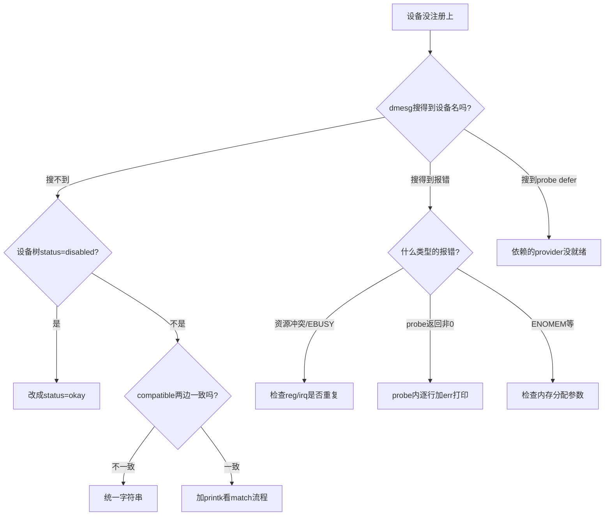

# 11.2.5 probe失败的排查

> 所属章节：第11章 设备驱动进阶话题 > 11.2 platform设备驱动实战
> 难度：[I→M] | 预计阅读时间：12分钟

## 本节导读
本节干一件所有驱动工程师都干过的事——排查probe为啥失败。你写了设备树节点、编了驱动、加了compatible，结果板子跑起来设备没注册上，/dev下空空如也。别慌，probe失败就那几种套路，本节给你一张"破案地图"，按图索骥大概率能找到真凶。

---

## 知识点144：probe失败的5种"案发现场" [I][M] ~1200字

### 把probe失败比作"快递送不到"

想象你（驱动代码）是个快递员，要到客户家（设备节点）送货（注册设备）。到了小区门口，门卫（内核的device/driver匹配机制）有一堆理由不让你进。本节总结5个最常见的"门卫拒收"原因，按出现频率从高到低排列。

### 原因1：设备树节点被disabled——"客户电话关机"

设备树里写了`status = "disabled"`，相当于客户留的电话关机了。内核代码里`of_device_is_available()`会返回false，匹配流程直接半路截断，你的probe函数根本不会被执行。

**典型症状**：驱动编译进去了，设备树节点也写了，但dmesg里搜不到任何该设备的影子。

```c
// 内核里的关键检查（drivers/of/platform.c）
if (!of_device_is_available(np))  // 看到这句话了吗？
    return -ENODEV;               // 直接走人，连招呼都不打
```

**排查**：`grep status arch/arm/boot/dts/你的板子.dts`，看是不是手滑写成了disabled，或者从别的板子复制过来忘了改。

### 原因2：compatible不匹配——"客户姓名对不上"

设备树里的compatible字符串和驱动里的`of_device_id`表对不上，相当于快递员喊客户名字"张三"，但身份证上写的是"张三丰"。`platform_match()`里一圈比较下来返回0，匹配失败。

**典型症状**：dmesg能看到设备节点被解析了，但报`No driver found`或者干脆静默跳过。设备树和驱动各玩各的。

**排查**：两边字符串逐字对比，注意大小写、下划线、连字符。常见翻车点：设备树写的是`"my-company,my-device"`，驱动里注册成了`"my-company,my_device"`（下划线vs连字符）。

### 原因3：资源冲突——"两个客户抢同一个门牌号"

两个设备节点申明了同样的`reg`地址或`irq`中断号，内核资源管理机制（`request_mem_region()`、`request_irq()`）不会让两个驱动同时占用同一块资源。第二个来申请的就报错。

**典型症状**：dmesg里能看到`request_irq failed: -EBUSY`或者`cannot reserve Memory region`之类的报错。

**排查**：`cat /proc/iomem`和`/proc/interrupts`看资源分配情况，检查设备树里有没有两个节点用了重复的地址范围。

### 原因4：依赖的provider还没准备好——"快递到了，但小区还没通电"

你的设备依赖clk、regulator、pinctrl这些东西，但它们对应的provider驱动还没probe完。你驱动里的`devm_clk_get()`返回`-EPROBE_DEFER`，内核会把你推到defer列表里重试，但如果那个provider根本不存在或者也probe失败了，你就永远等不到。

**典型症状**：dmesg里反复出现`probe defer`或者干脆没有任何关于你设备的消息，因为一直卡在外面等依赖。

**排查**：顺着依赖链往上查。需要哪个clk，就先确认clock provider（比如CRG/SCMI驱动）有没有正确加载。在probe里加打印，看`devm_clk_get()`返回什么。

### 原因5：probe函数自己返回了错误——"快递送到了，客户拒收"

前面都过了，匹配也成功了，资源也拿到了，但你的probe函数内部某个操作失败了——`ioremap()`返回NULL、`request_irq()`失败、分配dma buffer没成——你return了个非0值，内核就认为probe失败，把这个设备标记为dead。

**典型症状**：dmesg里有你驱动的错误打印，或者能看到`probe with <drvname> failed, error -16`这样的日志。

**排查**：在probe函数每个可能失败的点加`pr_err()`，把错误码和上下文打出来，逐行定位哪一步跪了。

### 排查决策树：一张图理清思路



[图1：probe失败排查决策树]

### 5种原因速查表

| 原因 | 核心症状 | 排查命令/方法 | 解决手段 |
|------|---------|-------------|---------|
| status="disabled" | dmesg完全没设备影子 | `grep status 设备树文件` | 改成`status = "okay"` |
| compatible不匹配 | 设备树节点有，但报no driver | 对比设备树compatible和驱动of_match_table | 统一字符串，逐字核对 |
| 资源冲突 | dmesg报-EBUSY、资源冲突 | `cat /proc/iomem`、`cat /proc/interrupts` | 修改设备树reg/irq，避免重叠 |
| 依赖未就绪 | 反复probe defer | 查provider驱动是否编译/加载 | 确保依赖驱动先编译进内核或先加载 |
| probe返回非0 | dmesg有probe failed报错 | probe内逐行加pr_err | 修复具体失败点（iomap、irq、dma等） |

🔴 **血泪教训**：第1种和第2种占probe失败的七成以上。遇到probe失败，先别急着翻内核源码，花30秒检查设备树的status和compatible，大概率直接破案。我见过太多人在probe函数里加了十几行printk，最后发现是设备树里compatible少了个逗号。

⚠️ **坑点**：有些SoC的时钟驱动、pinmux驱动本身就在编译选项里没打开，你依赖它们，它们连入口都没有。这时候`dmesg | grep defer`也看不到东西，因为provider根本不存在。遇到这种情况要去确认依赖项的Kconfig有没有选中。

---

## 知识点145：probe排查的"三板斧" [I] ~600字

### 第一板斧：看sysfs有没有你的设备

platform总线上的设备和驱动都在sysfs里挂了号，这是最直接的第一现场：

```bash
# 代码1：列出所有platform设备
$ ls /sys/bus/platform/devices/

# 代码2：列出所有已注册的platform驱动
$ ls /sys/bus/platform/drivers/

# 代码3：查看某个设备是否绑定了驱动
$ ls /sys/bus/platform/devices/你的设备名/driver
```

如果你的设备名出现在`devices`目录里，说明设备树节点至少被解析出来了；如果里面没有`driver`软链接，说明匹配没成或者probe失败了。如果连设备名都没有，问题大概率出在设备树这边（disabled、路径写错、没编译进dtb）。

### 第二板斧：dmesg里淘金

```bash
# 代码4：过滤dmesg中与你的设备相关的日志
$ dmesg | grep -i "你的设备名或驱动名"

# 代码5：重点查看probe defer相关的日志
$ dmesg | grep -i "defer"

# 代码6：查看所有platform驱动的注册情况
$ dmesg | grep "platform probe"
```

dmesg是内核留给你的第一手口供。匹配失败、probe返回值、资源冲突，大部分都会在这里留痕。但有些驱动代码本身打印太少，需要你自己加料。

### 第三板斧：probe里狂加printk

这是最直接也最有效的办法——在probe函数开头就丢一句`pr_info("%s: entered\n", __func__);`，然后每走两步加一句：

```c
static int my_drv_probe(struct platform_device *pdev)
{
    pr_info("my_drv: probe start!\n");

    res = platform_get_resource(pdev, IORESOURCE_MEM, 0);
    if (!res) {
        pr_err("my_drv: get mem resource failed!\n");
        return -ENODEV;
    }
    pr_info("my_drv: got mem resource @%llx\n", res->start);

    // ... 每走几步加一个

    pr_info("my_drv: probe success!\n");
    return 0;
}
```

### printk加了但没输出？——probe可能根本就没被调用

这是最让新手怀疑人生的情况：printk加了，重新编译加载，dmesg里却干干净净，啥都没有。

别怀疑自己眼花，**真相只有一个：probe函数根本没被执行**。原因通常是前面知识点144里讲的第1、2种——要么设备树status不对，`of_device_is_available()`直接把你拦在门外；要么compatible不匹配，`platform_match()`返回0，内核根本不知道你这个驱动的存在。

**验证方法**：在驱动的`.probe`指针赋值的地方也加一句printk，确认驱动注册代码至少被执行了：

```c
static struct platform_driver my_drv = {
    .probe = my_drv_probe,
    .driver = {
        .name = "my_drv",
        .of_match_table = my_of_match,
    },
};

static int __init my_drv_init(void)
{
    pr_info("my_drv: driver registering...\n");  // 加在这里
    return platform_driver_register(&my_drv);
}
```

如果这句打印出来了，但probe里的没出来，那就是匹配阶段出了问题。如果这句都没出来，检查驱动有没有被编译进内核（看.config或者`/lib/modules`下有没有对应的ko）。

💡 **经验之谈**：排查probe问题，心态要稳。先走一遍"设备树→匹配→probe执行→probe内部"这个链条，定位到哪一环断了，再针对性深挖。最怕的是在每个环节都猜一下，东改西改最后连自己改了什么都不记得。

---

## 本节总结

| 概念 | 核心要点 | 自查操作 |
|------|---------|---------|
| probe失败5大原因 | disabled、compatible错误、资源冲突、依赖未就绪、probe返回错误 | 按决策树逐步排查 |
| 匹配阶段问题 | 设备树或compatible出问题，probe根本不进 | `grep status` + 对比compatible字符串 |
| 依赖问题 | clk/regulator/pinctrl的provider没准备好 | `dmesg \| grep defer` + 确认provider已编译 |
| sysfs排查 | 设备和驱动是否出现在总线目录里 | `ls /sys/bus/platform/devices/` |
| printk没输出 | 大概率匹配失败，probe没被调用 | 驱动init里也加printk确认注册代码执行 |

---

## 下一步

你已经学会了probe失败的排查套路，下一节（11.2.6）我们来聊聊设备树里那些容易踩的坑——reg endian怎么写、interrupt-parent到底指向谁、phandle引用的常见翻车现场。设备树写不对，驱动写得再好也白搭。

---

## 配套资源

### 表格清单
- 表1：probe失败5种原因速查表（症状/排查/解决）
- 表2：本节总结自查表

### 图示清单
- 图1：probe失败排查决策树 [mermaid图]
- 图2：probe排查流程示意图 [配图说明：一张侦探风格的流程图，放大镜、脚印、问号元素，寓意"按图索骥排查probe失败"]

### 代码清单
- 代码1：列出所有platform设备（`ls /sys/bus/platform/devices/`）
- 代码2：列出所有已注册的platform驱动（`ls /sys/bus/platform/drivers/`）
- 代码3：查看设备是否绑定了驱动（`ls /sys/bus/platform/devices/设备名/driver`）
- 代码4：过滤dmesg中设备相关日志（`dmesg \| grep -i "设备名"`）
- 代码5：查看probe defer日志（`dmesg \| grep -i "defer"`）
- 代码6：probe函数内逐行加printk排查
