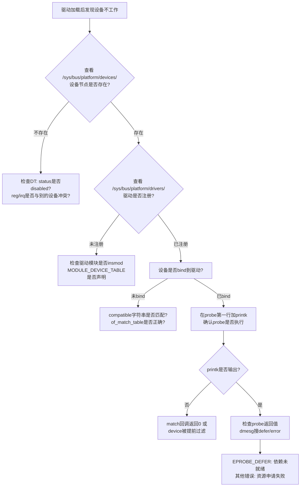

### 11.2.5 probe失败的排查

#### 本节导读

本节聚焦驱动开发中最令人头疼的问题之一——**probe()函数没有被调用，或者调用后设备仍无法工作**。学完本节，你将拥有一套系统化的排查思路：从设备树解析到驱动匹配，从资源冲突到依赖延迟，配合内核提供的`sysfs`接口和日志手段，快速定位probe失败的根因。

---

你写好了驱动，编译、加载、甚至看到内核日志里驱动模块已经`registered`，但设备就是不工作。`probe()`仿佛石沉大海——没被调用，或者调用了却悄无声息地失败了。这种场景，想必你也经历过。

probe失败的根因可以归纳为5类，排查时按顺序逐一验证。

**原因一：设备树节点被disabled**

设备树中`status = "disabled"`是最隐蔽的陷阱。内核解析设备树时，`of_device_is_available()`会检查该字段，返回false则直接跳过节点创建，设备根本不会出现在`sysfs`中。

```c
// drivers/of/base.c
bool of_device_is_available(const struct device_node *device)
{
    const char *status;
    int statlen;

    status = of_get_property(device, "status", &statlen);
    if (status == NULL)
        return true;          /* 默认enable */
    if (strcmp(status, "okay") == 0 || strcmp(status, "ok") == 0)
        return true;
    return false;             /* disabled → 设备不创建 */
}
```

💡 **提示**：搜索设备树时不仅要grep `compatible`，还要确认该节点的`status`字段。某些SoC厂商的默认dtsi中会把未使用的控制器标记为disabled。

**原因二：compatible字符串不匹配**

驱动里的`of_device_id`表和DT节点的`compatible`对不上——哪怕只差一个字母，`match()`也会返回0，probe自然不会触发。

```c
static const struct of_device_id my_driver_dt_ids[] = {
    { .compatible = "vendor,my-device-v2" },  /* 注意是v2 */
    { }
};
```

DT里写的却是`"vendor,my-device"`，匹配失败。建议在驱动`of_device_id`表中多放几个兼容字符串，覆盖不同版本的硬件。

⚠️ **陷阱**：`MODULE_DEVICE_TABLE(of, ...)`宏忘记写，会导致模块加载时DT匹配表未注册到内核，即使字符串完全匹配也找不到驱动。

**原因三：资源冲突——reg/irq被占用**

两个设备节点声明了重叠的`reg`范围，或同一个`interrupts`。先probe的设备抢占了资源，后到的设备在`platform_get_resource()`时返回NULL，probe失败。

排查方法很简单——看dmesg里的错误日志，通常会打印`"resource collision"`或类似的冲突提示。

**原因四：依赖子系统还没初始化**

这是最"合法"的失败原因。你的驱动依赖的`clk`、`regulator`、`pinctrl` provider还没probe完，驱动主动返回`-EPROBE_DEFER`（定义在`<linux/errno.h>`，值为-517）。内核会把这个设备放到延迟probe队列，稍后重试。

```c
static int my_probe(struct platform_device *pdev)
{
    struct clk *clk = devm_clk_get(&pdev->dev, NULL);
    if (IS_ERR(clk)) {
        if (PTR_ERR(clk) == -EPROBE_DEFER)
            dev_info(&pdev->dev, "defer: clk not ready yet\n");
        return PTR_ERR(clk);  /* -EPROBE_DEFER → 内核自动重试 */
    }
    /* ... */
}
```

💡 **提示**：在内核配置中开启`CONFIG_DEBUG_DRIVER=y`和`CONFIG_DYNAMIC_DEBUG=y`，可以看到完整的probe defer和重试日志。

**原因五：probe内部资源获取失败**

mem/irq/iommap/dma内存申请失败，`regmap`初始化出错，这些都会导致probe返回非0错误码。注意区分`-EPROBE_DEFER`（会重试）和其他错误码（不会重试，probe彻底失败）。

---

#### 排查流程

面对probe失败，按下面的流程逐步缩小范围：



#### 排查Checklist

| 检查项 | 命令/方法 | 预期结果 |
|:---|:---|:---|
| 驱动是否注册到总线 | `ls /sys/bus/platform/drivers/<drv_name>/` | 目录存在 |
| 设备是否在sysfs中 | `ls /sys/bus/platform/devices/<dev_name>/` | 目录存在 |
| DT节点是否被disable | `grep status arch/arm64/boot/dts/xxx.dts` | 值为`ok`或`okay` |
| compatible是否匹配 | 对比驱动的`of_device_id`和DT节点 | 字符串完全一致 |
| probe是否被执行 | 在`probe()`第一行加`pr_info("enter probe\n")` | dmesg能看到输出 |
| 是否有资源冲突 | `dmesg \| grep -i "collision\|conflict"` | 无相关报错 |
| 是否触发defer | `dmesg \| grep -i "defer"` | 可观察到重试序列 |
| probe返回什么错误 | `dmesg \| grep <drv_name>` | 有明确的错误码信息 |

⚠️ **陷阱**：`-EPROBE_DEFER`的日志级别通常是`dev_dbg()`，默认不打印。需要在启动参数里加`dyndbg="+p"`开启动态调试，或者在probe里自己加printk。

---

#### 本节总结

| 知识点 | 核心内容 |
|:---|:---|
| **知识点141 [I][M]** | probe失败5大原因及排查方法 |
| 原因1：disabled | `status="disabled"` → `of_device_is_available()`返回false，设备不创建 |
| 原因2：compatible不匹配 | `match()`返回0 → probe不被调用，需核对字符串和`MODULE_DEVICE_TABLE` |
| 原因3：资源冲突 | reg/irq重叠 → 后probe的设备获取资源失败 |
| 原因4：依赖未就绪 | clk/regulator/pinctrl provider未probe完 → 返回`-EPROBE_DEFER`重试 |
| 原因5：probe返回非0 | 资源申请失败，需区分defer（可恢复）和其他错误（不可恢复） |
| 排查工具 | `sysfs`路径检查 + `dmesg`日志 + `printk`打点 + `CONFIG_DEBUG_DRIVER` |

---

#### 下一步

probe只是起点。设备创建之后，驱动如何与内核框架对接、向用户空间暴露接口？11.3节开始，我们来探讨**驱动模型与sysfs的深层关系**，看看一个设备从`probe()`成功返回后，是如何一步步变成`/sys`和`/dev`下的可见节点的。
