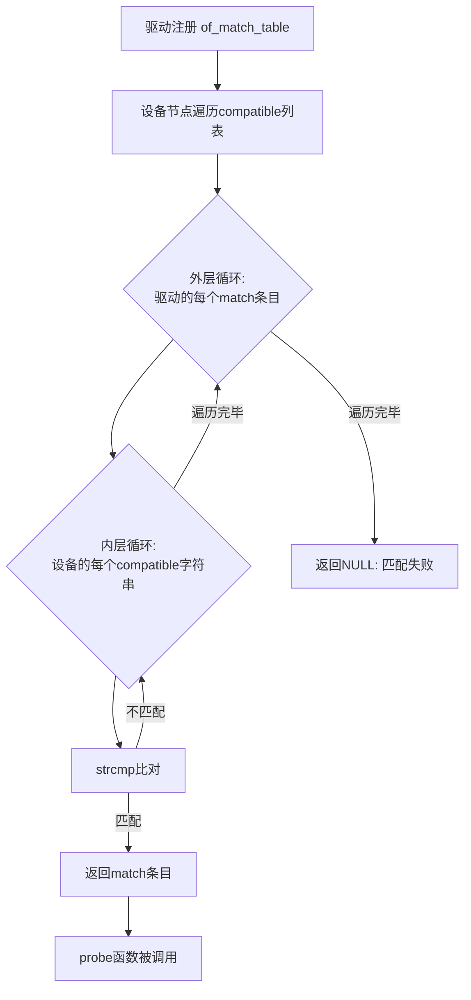

### 11.3.1 compatible匹配原理

**知识点133 [E][M]**

---

**本节导读**

compatible属性是设备树与驱动之间最核心的"纽带"。每当你看到驱动里的`of_match_table`和设备树节点里的`compatible = "..."`，本质上就是一场"双向选择"——设备树描述自己是什么，驱动声明自己能处理什么。本节我们一起拆开这个匹配过程的"黑盒子"：从compatible字符串列表的优先级策略，到内核中`__of_match_node()`的真实实现逻辑，再到通配符匹配的使用场景。读完这一节，你能独立分析任何一个设备树节点为什么（或为什么没有）被正确驱动绑定。

---

#### compatible的本质：一个有序的字符串列表

compatible属性在设备树规范中的定义很简单——它是一个**字符串列表**，从左到右排列的字符串代表了"从具体到通用"的兼容性描述。

来看一个典型的compatible声明：

```dts
// arch/arm64/boot/dts/rockchip/rk3568.dtsi
mmc: mmc@fe2b0000 {
    compatible = "rockchip,rk3568-dw-mshc",
                 "rockchip,rk3288-dw-mshc",
                 "snps,dw-mshc";
    reg = <0x0 0xfe2b0000 0x0 0x4000>;
    clocks = <&cru HCLK_SDMMC1>, <&cru CLK_SDMMC1>;
    /* ... */
};
```

这个节点的compatible列表传递了三层信息：

1. `"rockchip,rk3568-dw-mshc"` —— 最具体，精确对应RK3568芯片的DW Mobile Storage Host Controller
2. `"rockchip,rk3288-dw-mshc"` —— 较通用，表明与RK3288的MMC控制器兼容
3. `"snps,dw-mshc"` —— 最通用，表明这是Synopsys DesignWare的通用MMC IP核

💡 **提示**：把compatible列表想象成继承链——最左边是最精确的子类，越往右越靠近基类。驱动的`of_match_table`只要命中其中任意一个，就能完成匹配。

对应的驱动代码里，`of_match_table`会这样声明：

```c
// drivers/mmc/host/dw_mmc-rockchip.c
static const struct of_device_id dw_mci_rockchip_match[] = {
    { .compatible = "rockchip,rk3568-dw-mshc",
      .data = &rk3568_drv_data },
    { .compatible = "rockchip,rk3288-dw-mshc",
      .data = &rk3288_drv_data },
    { .compatible = "rockchip,rk3399-dw-mshc",
      .data = &rk3399_drv_data },
    { },  /* 哨兵，标记数组结束 */
};
MODULE_DEVICE_TABLE(of, dw_mci_rockchip_match);
```

这里有个关键的设计——每个match条目不仅包含compatible字符串，还可以通过`.data`字段携带**驱动私有数据**。这意味着驱动在probe阶段就能根据匹配到的具体型号，加载对应的配置参数。

---

#### 匹配过程：__of_match_node()的实现逻辑

当内核尝试为某个设备节点绑定驱动时，真正的匹配工作在`__of_match_node()`中完成（位于`drivers/of/base.c`）。我们来看它的核心逻辑：

```c
static
const struct of_device_id *__of_match_node(const struct of_device_id *matches,
                                           const struct device_node *node)
{
    /* 遍历驱动的of_match_table中每个条目 */
    for (; matches->name[0] || matches->type[0] ||
           matches->compatible[0]; matches++) {
        int match = 1;

        /* 检查name、type、compatible三个维度 */
        if (matches->name[0])
            match &= node->name
                  && !strcmp(matches->name, node->name);
        if (matches->type[0])
            match &= node->type
                  && !strcmp(matches->type, node->type);
        if (matches->compatible[0])
            match &= __of_device_is_compatible(node,
                              matches->compatible);
        if (match)
            return matches;  /* 命中，返回匹配条目 */
    }
    return NULL;  /* 无一命中 */
}
```

注意这个函数的三个匹配维度：

| 维度 | 对应设备树属性 | 说明 |
|------|--------------|------|
| `name` | 节点的`name`字段 | 早期OF规范使用，现代DT中已基本废弃 |
| `type` | 节点的`device_type`属性 | 同样较少使用 |
| `compatible` | 节点的`compatible`属性 | **现代驱动的绝对主力** |

实际匹配compatbile时，内核调用`__of_device_is_compatible()`。这个函数的实现才是本节的核心——**它会遍历设备节点compatible列表中的每一个字符串**，逐个与驱动提供的compatible进行比对，**只要有一个匹配成功，整个匹配流程就立即返回成功**。

```
设备节点的compatible列表:
  [0] "rockchip,rk3568-dw-mshc"  ← 先尝试这个
  [1] "rockchip,rk3288-dw-mshc"  ← 不匹配则尝试这个
  [2] "snps,dw-mshc"             ← 再不匹配则尝试这个

驱动的of_match_table:
  [0] { .compatible = "rockchip,rk3568-dw-mshc", ... }  ← 命中！
  [1] { .compatible = "rockchip,rk3288-dw-mshc", ... }

匹配顺序：外层遍历驱动table → 内层遍历设备节点compatible列表
```

⚠️ **陷阱**：很多新手会误认为内核"从左到右"优先使用设备树compatible列表的第一个字符串。实际上，匹配结果取决于**驱动of_match_table中条目的顺序和设备树compatible列表的交叉比对**。驱动在前、设备在后的双重遍历意味着——如果驱动table中有多个条目都能匹配，先被遍历到的那个会胜出。

---

#### 通配符匹配与精确匹配

compatible匹配默认是**精确字符串比较**（`strcmp`）。但内核也支持一种特殊写法——通配符匹配：

```c
static const struct of_device_id my_driver_match[] = {
    { .compatible = "vendor,specific-*" },  /* 通配符：匹配前缀 */
    { .compatible = "generic-device" },     /* 精确匹配 */
    { },
};
```

当驱动的compatible字符串以`*`结尾时，内核使用`of_compat_cmp()`进行通配符前缀匹配。这在处理一个系列中多个型号（如`"vendor,model-a"`、`"vendor,model-b"`等）时很方便。

不过说实话，通配符匹配在实际驱动代码中并不常见。大多数驱动工程师更倾向于**显式列出每一个compatible字符串**，因为这样做有几个好处：

- 每个条目可以绑定不同的`.data`私有数据
- 兼容性是**明确且可审计的**，不会因为通配符的"意外匹配"导致行为不可控
- 内核的`MODULE_DEVICE_TABLE(of, ...)`宏会把match table导出到模块元数据中，供`modprobe`等工具自动加载驱动——通配符在这里不起作用

🔴 **危险**：不要使用通配符来"偷懒"地覆盖一系列设备。如果某款新设备的硬件行为有差异，通配符匹配会让它在不知情的情况下被旧驱动绑定，可能导致难以调试的硬件故障。

---



---

**本节总结**

| 知识点 | 核心内容 |
|--------|---------|
| compatible本质 | 有序字符串列表，从具体到通用排列 |
| 匹配优先级 | 设备树compatible列表**从左到右**尝试；驱动table**从上到下**尝试 |
| 匹配函数 | `__of_match_node()` 遍历驱动table，内层调用`__of_device_is_compatible()`遍历设备compatible列表 |
| 匹配维度 | name / type / compatible 三维度，现代驱动几乎只用compatible |
| 精确匹配 | 默认行为，`strcmp`完全相等 |
| 通配符匹配 | 兼容字符串以`*`结尾时启用前缀匹配，但生产代码中不推荐 |
| `.data`字段 | match条目可携带私有数据，probe时根据匹配结果加载对应配置 |

**下一步**

compatible匹配只是设备树绑定驱动的一种途径。在11.3.2节中，我们将看看另一种常见场景——当设备树节点没有compatible属性时，内核如何通过`device_type`和节点名称来完成匹配，以及这背后的`of_platform_populate()`机制是如何工作的。
