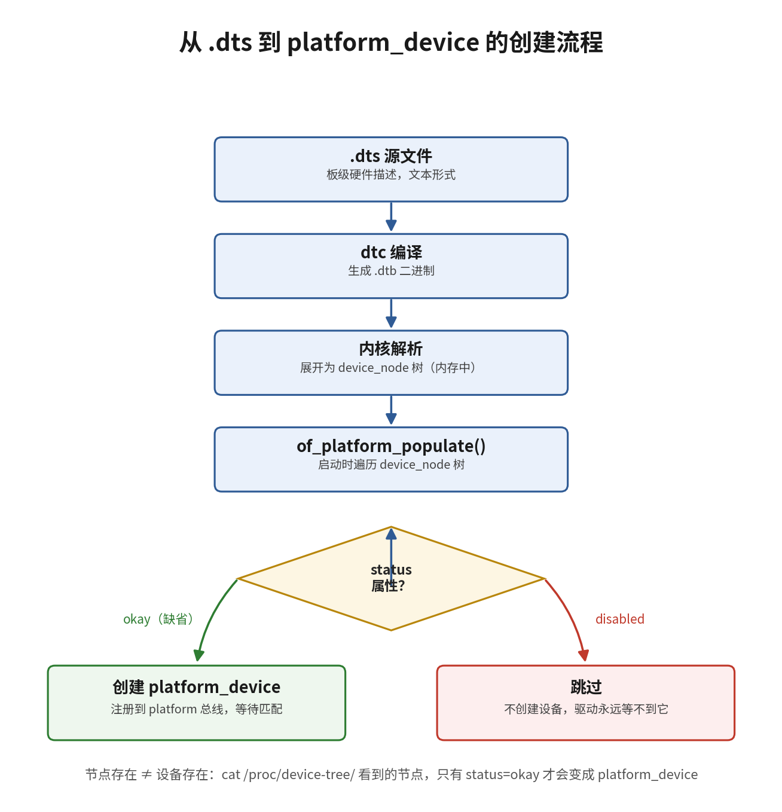

# 11.3.1 设备树到platform_device

> 所属：第11章 设备模型 > 11.3 platform设备与probe流程
> 
> 难度：[E] | 预计阅读时间：20分钟

## <span class="blue"> 本节导读

11.2 节建立了总线-设备-驱动三角：驱动要工作，总线上必须先有一个设备对象。挂在 platform 总线上的片内外设（UART、I2C 控制器、GPIO 控制器这类不通过标准枚举总线发现的设备），它的设备对象不是硬件扫描出来的，而是从设备树节点翻译出来的。<BR>
本节把这条翻译路径完整走一遍：从一个真实的串口节点出发，看它经过哪些函数、每个函数的真实代码长什么样、最终在 sysfs 里留下什么证据。<BR>
本节覆盖：device_node 与 platform_device 的分工、of_platform_populate 的遍历逻辑与真实调用点、status 属性的判定实现、reg 和 interrupts 到 resource 数组的翻译规则，结尾附完整调用链与动手练习。

---

## <span class="blue"> 先给锚点：一个串口节点启动后变成了什么 [E]

RK3568 的 SoC 级设备树（`arch/arm64/boot/dts/rockchip/rk3568.dtsi`，有删节）里，UART2 控制器节点长这样：

```dts
uart2: serial@fe660000 {
    compatible = "rockchip,rk3568-uart", "snps,dw-apb-uart"; /* 匹配凭据，从具体到通用排列 */
    reg = <0x0 0xfe660000 0x0 0x100>;              /* 寄存器基地址与长度（四格含义见后文） */
    interrupts = <GIC_SPI 118 IRQ_TYPE_LEVEL_HIGH>; /* 中断：类型、编号、触发方式 */
    clocks = <&cru SCLK_UART2>, <&cru PCLK_UART2>;  /* 波特率时钟与总线接口时钟 */
    clock-names = "baudclk", "apb_pclk";
    status = "disabled";                            /* SoC 级默认关闭，等板级 dts 打开 */
};
```

板级 dts 把这路串口打开：

```dts
&uart2 {
    status = "okay";    /* 引用 dtsi 里的 uart2 节点，只改这一个属性 */
};
```

系统启动后，这个节点在 sysfs 里的对应物：

```bash
# platform 总线上多了一个以"地址.节点名"命名的设备目录
ls -d /sys/bus/platform/devices/fe660000.serial
/sys/bus/platform/devices/fe660000.serial

# 设备目录下的 driver 符号链接指向已绑定的驱动
ls -l /sys/bus/platform/devices/fe660000.serial/driver
... -> ../../../bus/platform/drivers/dw-apb-uart
```

中间发生的事：内核把 `serial@fe660000` 这个设备树节点翻译成了一个名叫 `fe660000.serial` 的 platform_device，挂到 platform 总线上，随后与 `dw-apb-uart` 驱动匹配绑定。本节回答三个问题：翻译发生在什么时候、由哪段代码完成、节点的属性去了哪里。按启动的时间顺序走：先把 DTB 展成内存树，再看谁遍历这棵树把节点变成设备，最后看节点的属性落到哪里。uart2 这个例子会贯穿全节。

> 💡 为什么绑定的是 dw-apb-uart 而不是 rk3568-uart：符号链接显示的是**驱动的名字**，不是 compatible 字符串。内核里并没有一个叫 rk3568-uart 的驱动——`drivers/tty/serial/8250/8250_dw.c` 的 of_match_table 里登记的是 `snps,dw-apb-uart`。匹配时内核按 compatible 列表从前到后逐个尝试：先拿 `rockchip,rk3568-uart` 找驱动，找不到；再拿 `snps,dw-apb-uart`，命中 8250_dw 驱动。Rockchip 的 UART 兼容 Synopsys DesignWare 的设计，直接复用通用驱动，不用为每代 SoC 单写一个。compatible 多值的完整匹配规则在 11.4.1 展开。

---

## <span class="blue"> 翻译前：DTB 先展开成 device_node 树 [E]

内核拿到的 DTB 是扁平二进制数据。`setup_arch()` 阶段的 `unflatten_device_tree()`（7.4.2 已详述展开过程）把它变成内存中的树，每个节点是一个 `struct device_node`（`include/linux/of.h`，有删节）：

```c
struct device_node {
    const char *name;            /* 节点名，如 "serial" */
    phandle phandle;             /* 节点句柄，供 phandle 引用（&uart2 这类）解析 */
    const char *full_name;       /* 带单位地址的全名，如 "serial@fe660000" */
    struct property *properties; /* 属性链表：compatible、reg、interrupts…… */
    struct device_node *parent;  /* 父节点、子节点、兄弟节点，构成树 */
    struct device_node *child;
    struct device_node *sibling;
    unsigned long _flags;        /* 状态位，OF_POPULATED 等（翻译过程会用到） */
    /* 引用计数等字段从略 */
};
```

注意 device_node 不属于设备模型：没有 kobject，不进 sysfs，总线看不见它，驱动无法直接跟它绑定。驱动模型认的是 `struct device`。所以必须有一步翻译，把描述片内外设的节点转成挂在 platform 总线上的 `struct platform_device`（内嵌 struct device，并携带 resource 资源数组）。

---

## <span class="blue"> of_platform_populate：翻译动作的真实代码 [E]

翻译由 `drivers/of/platform.c` 的 `of_platform_populate()` 完成。真实实现（Linux 6.6，有删节）很短：

```c
int of_platform_populate(struct device_node *root,   /* 起始节点，NULL 表示从根开始 */
        const struct of_device_id *matches,
        const struct of_dev_auxdata *lookup,
        struct device *parent)
{
    struct device_node *child;
    int rc = 0;

    root = root ? of_node_get(root) : of_find_node_by_path("/"); /* NULL 则取设备树根 */
    if (!root)
        return -EINVAL;

    for_each_child_of_node(root, child) {   /* 逐个处理 root 的子节点 */
        rc = of_platform_bus_create(child, matches, lookup, parent, true);
        if (rc)
            break;
    }
    of_node_set_flag(root, OF_POPULATED_BUS);  /* 标记这棵子树已展开，防重复 */
    of_node_put(root);
    return rc;
}
```

逐节点的创建逻辑在 `of_platform_bus_create()`（同文件，有删节）：

```c
static int of_platform_bus_create(struct device_node *bus, ..., bool strict)
{
    struct platform_device *dev;
    struct device_node *child;

    /* 1. 没有 compatible 的节点直接跳过（纯容器节点不创建设备） */
    if (strict && (!of_get_property(bus, "compatible", NULL)))
        return 0;

    /* 2. 创建 platform_device；status 判定在创建函数内部第一行 */
    dev = of_platform_device_create_pdata(bus, bus_id, platform_data, parent);

    /* 3. 只有总线型节点（命中下文的默认总线表）才递归展开子节点 */
    if (dev && of_match_node(of_default_bus_match_table, bus)) {
        for_each_child_of_node(bus, child)
            of_platform_bus_create(child, matches, lookup, &dev->dev, strict);
    }
    ...
}
```

第 2 步的 `of_platform_device_create_pdata()`，开头两行（同文件）：

```c
/* 进入函数先挡两道：status 判定不可用，或节点已展开过（OF_POPULATED），直接放弃 */
if (!of_device_is_available(np) ||
    of_node_test_and_set_flag(np, OF_POPULATED))
    return NULL;
```

`of_device_is_available()` 是 status 判定，下一节展开。`OF_POPULATED` 标志保证一个节点只被翻译一次——这就是 device_node 里 `_flags` 字段的用途。

第 3 步的 `of_default_bus_match_table`（同文件）决定哪些节点算"总线"：

```c
// drivers/of/platform.c:26
const struct of_device_id of_default_bus_match_table[] = {
    { .compatible = "simple-bus", },    /* 最常见的片内总线容器 */
    { .compatible = "simple-mfd", },    /* 多功能复合设备容器 */
    { .compatible = "isa", },
#ifdef CONFIG_ARM_AMBA
    { .compatible = "arm,amba-bus", },  /* ARM AMBA 总线 */
#endif
    { }
};
```

`arm,primecell` 不在这张表里——v6.6 中它在 `of_platform_bus_create()` 里被单独识别，转交 `of_amba_device_create()` 创建 AMBA 设备，不走 platform_device 路径。

RK3568 的片内外设直接挂在根节点下、没有 `/soc` 容器，`of_platform_populate()` 从根节点遍历时，`serial@fe660000` 作为根的子节点被直接创建，不涉及递归。simple-bus 递归路径出现在用 `/soc` 容器组织外设的 SoC 上（i.MX、全志等厂商的 dtsi 常见这种写法）：`/soc` 节点写成 `compatible = "simple-bus"` 正是为了命中这张表——`/soc` 自己被创建成一个 platform_device，它的子节点也被逐个翻译。普通外设节点不递归——I2C 控制器下挂的 EEPROM 由 I2C 子系统负责创建，不归 platform 总线管。

### 翻译发生在什么时候

调用点（同文件，有删节）：

```c
static int __init of_platform_default_populate_init(void)
{
    if (!of_have_populated_dt())   /* 内核没拿到有效设备树（如 ACPI 系统）则直接退出 */
        return -ENODEV;

    /* /reserved-memory、/firmware 等特殊节点的处理从略 */

    /* Populate everything else. */
    of_platform_default_populate(NULL, NULL, NULL);  /* 从根节点翻译整棵树 */
    return 0;
}
arch_initcall_sync(of_platform_default_populate_init);  /* 注册为 arch 级 initcall，启动早期自动执行 */
```

`arch_initcall_sync` 把翻译动作钉在 7.5.3 讲过的 initcall 序列里：内核启动到 arch 级初始化末尾时，从根节点统一翻译整棵树。板级代码不参与——这就是 ARM64 不再需要 board 文件的原因。

---

## <span class="blue"> status 属性：判定函数只有几行 [E]

`of_device_is_available()`（`drivers/of/base.c`）的完整实现：

```c
bool of_device_is_available(const struct device_node *device)
{
    const char *status = of_get_property(device, "status", NULL);  /* 取出 status 属性 */

    if (!status)
        return true;                  /* 不写 status：默认可用 */

    if (!strcmp(status, "ok") || !strcmp(status, "okay"))
        return true;                  /* 两种拼写都认 */

    return false;                     /* disabled / fail / reserved 等一律不可用 */
}
```

规则只有三条：缺省可用，`"ok"`/`"okay"` 可用，其余一律不可用。判定不可用的节点在 `of_platform_device_create_pdata()` 的第一行就被挡掉，platform_device 根本不会创建。

这个设计的取舍：disabled 的语义是"SoC 有这块外设，本板没用它"。既然板子上等于没有这块硬件，内核就让它彻底不存在——不进设备模型、不占 sysfs 目录、不参与匹配。假如 disabled 节点也创建设备，sysfs 里会多出一批永远绑定不上驱动的空壳设备，干扰排查。这也是 SoC 厂商的惯用分工：.dtsi 把外设默认写成 disabled（rk3568.dtsi 的 uart2 就是），由各板的 .dts 按需 okay。

> 🔴 probe 始终不执行时，排查顺序建议：先查设备树 status 是否写成了 `"disabled"`（节点常从参考板 DTS 复制而来，原厂默认关闭），再查 compatible 字符串。设备树侧的问题占此类故障的大头。自查命令：`cat /proc/device-tree/serial@fe660000/status`（uart2 直接挂在根节点下；有 /soc 容器的平台路径为 `/proc/device-tree/soc/serial@...`）——`/proc/device-tree` 是 device_node 树的只读镜像，看到的就是内核实际采用的值。

整条翻译路径的全景：



---

## <span class="blue"> resource 数组：reg 和 interrupts 翻译成了什么 [E]

platform_device 创建出来，光有名字和 compatible 不够，驱动还需要知道寄存器在哪、中断号是多少。`of_platform_device_create_pdata()` 内部会把节点的硬件属性逐项翻译成 resource 数组，数组元素是 `struct resource`（`include/linux/ioport.h`）：

```c
struct resource {
    resource_size_t start;   /* 起始地址（MEM）或中断号（IRQ） */
    resource_size_t end;     /* 结束地址；中断资源 start == end */
    const char *name;        /* 来自 reg-names / interrupt-names */
    unsigned long flags;     /* 类型标志：IORESOURCE_MEM / IORESOURCE_IRQ 等 */
    /* 内部链表字段从略 */
};
```

### reg 的四格数字怎么读

uart2 的 `reg = <0x0 0xfe660000 0x0 0x100>` 是四格而不是两格，格式由父节点的两行声明决定。RK3568 的片内外设直接挂在根节点下（rk356x.dtsi 里没有 /soc 容器），所以 uart2 的父节点就是 `/`：

```dts
/ {
    compatible = "rockchip,rk3568";
    #address-cells = <2>;   /* 声明：子节点 reg 里地址占两格 */
    #size-cells = <2>;      /* 声明：长度占两格 */
    ...
};
```

四格因此被切成：地址 `0x0, 0xfe660000`（两格拼成 64 位地址）+ 长度 `0x0, 0x100`。翻译由 `of_address_to_resource()`（`drivers/of/address.c`）完成，写入 resource 数组的结果：

| resource 条目 | start | end | flags |
|:---:|---|---|---|
| 0 | `0xfe660000` | `0xfe6600ff` | `IORESOURCE_MEM` |

### interrupts 的三格怎么读

`interrupts = <GIC_SPI 118 IRQ_TYPE_LEVEL_HIGH>` 的三格格式由中断控制器节点（GIC）的 `#interrupt-cells = <3>` 定义：中断类型、编号、触发方式。GIC 的 SPI 中断从硬件中断号 32 起排，`GIC_SPI 118` 对应硬件中断号 150，再经 irq_domain 映射为内核 IRQ 号写入 resource：

| resource 条目 | start | end | flags |
|:---:|---|---|---|
| 1 | 内核 IRQ 号 | 同 start | `IORESOURCE_IRQ` |

其余属性的去向：

| 设备树属性 | 翻译路径 | 说明 |
|-----------|---------|------|
| `reg-names` / `interrupt-names` | 写入 resource.name | 配合 `platform_get_resource_byname()` / `platform_get_irq_byname()` 按名索引 |
| `dmas` / `dma-names` | 不进 resource 数组 | DMA 通道由 `dma_request_chan()` 向 DMA 子系统单独申请 |
| `clocks` / `pinctrl-*` | 不进 resource 数组 | 由 clk、pinctrl 子系统各自解析 |

条目顺序与设备树书写顺序一致：两个 reg 区间对应数组里两个 MEM 条目，`platform_get_resource(pdev, IORESOURCE_MEM, 0)` 取第一个、索引 1 取第二个。

### 驱动侧的标准取法

```c
static int my_probe(struct platform_device *pdev)
{
    struct resource *res;
    void __iomem *base;
    int irq;

    /* 从 resource 数组取第 0 个 MEM 条目（reg 翻译来的寄存器区间），没有则说明设备树缺 reg */
    res = platform_get_resource(pdev, IORESOURCE_MEM, 0);
    if (!res)
        return -ENODEV;

    /* 一次完成 request_mem_region（占坑防冲突）+ ioremap（建页表映射），并纳入 devm 托管 */
    base = devm_ioremap_resource(&pdev->dev, res);
    if (IS_ERR(base))
        return PTR_ERR(base);

    /* 取第 0 个 IRQ 条目：成功返回内核 IRQ 号，失败返回负错误码（含 -EPROBE_DEFER） */
    irq = platform_get_irq(pdev, 0);
    if (irq < 0)
        return irq;
    /* ... 注册中断、初始化硬件 */
}
```

`devm_ioremap_resource()` 内部先做 `request_mem_region()` 标记该区域被本驱动占用，再做 `ioremap()` 建立页表映射。若区域已被其他驱动占用，直接返回 `-EBUSY`——resource 数组因此不仅是信息载体，也是资源仲裁的凭据。

> ⚠️ 不要把中断号写成常量再直接用 `request_irq()` 申请。中断号属于板级信息，标准做法是从 platform_device 的 resource 数组里取（`platform_get_irq()`）。换板子只需改设备树，驱动代码不动。

---

## <span class="blue"> 完整调用链：从 DTB 到 probe [E]

至此，开头的三个问题都有了答案。把 uart2 的全旅程串起来收拢本节（右侧是它在每一环的具体形态）：

```
启动早期    unflatten_device_tree()            DTB ──► device_node 树
            （setup_arch 阶段，drivers/of/fdt.c）     serial@fe660000 是树上一个节点
                │
arch 级     of_platform_default_populate_init()
initcall        └── of_platform_default_populate()
                │       └── of_platform_populate()      从根节点遍历
                │             └── of_platform_bus_create(serial@fe660000)
                │                   （RK3568 外设直接挂在根节点下，无 /soc 层；
                │                     有 simple-bus 容器的 SoC 在此多一层递归）
                │                   └── of_platform_device_create_pdata()
                │                         ├── of_device_is_available() → true
                │                         ├── reg/interrupts → resource 数组
                │                         └── platform_device_add()
                │                               → /sys/bus/platform/devices/fe660000.serial
                │
驱动注册    8250_dw 驱动注册（initcall 或 insmod）
                │   platform_match()：节点 compatible "snps,dw-apb-uart"
                │   命中驱动 of_match_table
                └── really_probe() → dw8250_probe()     读 resource、ioremap、
                                                        申请 IRQ、注册串口设备
```

三个容易记混的时点：翻译（populate）发生在 **arch_initcall_sync**，早于绝大多数驱动注册；匹配由**设备注册或驱动注册**中后到的那一个触发；probe 发生在匹配成功的那一刻。驱动编成模块时这三个时点会被拉得很开，但顺序不变。

---

## <span class="blue"> 动手练习

本节的每个论断都有可验证的落点，三个练习把最关键的落点亲手过一遍：

1. 在自己的板子上找一路串口：`ls /sys/bus/platform/devices/ | grep serial`，再到 `/proc/device-tree` 里找到对应节点，读出它的 compatible、reg、status，对照本节验证三段映射（节点→platform_device→resource 数组）。
2. 把一路不用的外设 status 改成 `"disabled"`，重新编译烧录 dtb，确认它的目录从 `/sys/bus/platform/devices/` 消失；改回 `"okay"` 再确认恢复。这个实验同时验证了 `of_device_is_available()` 的三条规则。
3. 打开板子配套内核源码里的 `drivers/of/platform.c`，找到 `of_platform_device_create_pdata()`，确认 status 判定和 OF_POPULATED 标志就在函数开头——以后看任何版本的内核，先找这两行。

---

## <span class="blue"> 本节总结

| 概念 | 核心要点 | 自查操作 |
|------|---------|---------|
| device_node | DTB 展开的内存表示，不属于设备模型 | `ls /proc/device-tree/` |
| of_platform_populate | 为 status 可用且带 compatible 的节点创建 platform_device，源码在 `drivers/of/platform.c` | 对照本节摘录读源文件 |
| 递归条件 | 仅命中 of_default_bus_match_table（simple-bus 等）的节点递归展开 | 查 `/soc` 节点的 compatible |
| status 判定 | of_device_is_available：缺省/ok/okay 可用，其余跳过 | `cat /proc/device-tree/serial@fe660000/status` |
| 调用点 | of_platform_default_populate_init，arch_initcall_sync 阶段 | 对照 7.5.3 的 initcall 序列 |
| resource 数组 | reg→MEM、interrupts→IRQ，顺序与设备树书写一致 | `platform_get_resource()` 按类型和索引取 |
| 驱动名与 compatible | sysfs 显示驱动注册名；rk3568 复用 snps,dw-apb-uart 通用驱动 | `ls -l /sys/bus/platform/devices/*/driver` |

---

## <span class="blue"> 下一步

platform_device 已经挂到总线上，接下来看它的另一半：platform_driver 如何注册进总线、内核按什么规则把两者配对。下一节（11.3.2）讲 platform_driver 的注册链路和 `platform_match()` 的四级匹配优先级。
