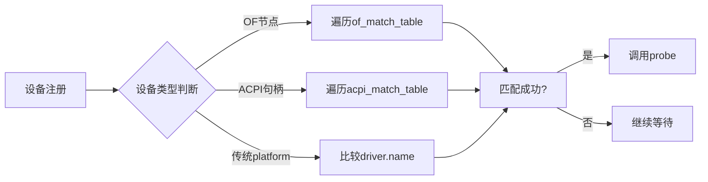

### 11.3.2 of_match_table的两种组织

**本节导读**

上一节我们写了设备树匹配的第一个驱动。细心的你可能已经注意到——`platform_driver` 里的 `of_match_table` 到底该怎么填？看似只是一个指针赋值，但内核其实提供了两种截然不同的组织方式。本节就来掰开揉碎讲清楚：纯设备树场景用哪种？需要同时兼容ACPI怎么办？MODULE_DEVICE_TABLE宏到底在编译时做了什么手脚？学完本节，你将能根据项目需求选择合适的匹配表组织方式，不再被内核中五花八门的驱动写法搞迷糊。

---

**知识点142 [E]** of_match_table的两种组织方式

在Linux内核驱动中，`of_match_table` 的组织主要有两种模式。第一种是纯设备树环境中最常见的 `of_device_id` 数组方式；第二种则是需要跨平台兼容时的多总线联合匹配方式。我们逐个来看。

#### 方式一：of_device_id数组（传统方式）

这是嵌入式开发中最常见的写法，90%以上的设备树驱动都这么干：

```c
static const struct of_device_id mydrv_match[] = {
    { .compatible = "vendor,specific" },
    { .compatible = "vendor,generic" },
    { .compatible = "vendor,legacy-v1", .data = (void *)&chip_v1 },
    { .compatible = "vendor,legacy-v2", .data = (void *)&chip_v2 },
    {}, /* 哨兵 —— 必须以全零条目结尾 */
};
MODULE_DEVICE_TABLE(of, mydrv_match);

static struct platform_driver mydrv = {
    .driver = {
        .name = "my-driver",
        .of_match_table = mydrv_match,
    },
    .probe = mydrv_probe,
    .remove = mydrv_remove,
};
```

`of_device_id` 结构体的定义在内核头文件 `include/linux/mod_devicetable.h` 中，核心字段就两个：`compatible` 字符串和可选的 `data` 指针。`data` 指针的妙用我们后面马上讲。

注意那个看似多余的空花括号 `{}`——它是数组的**哨兵（sentinel）**，内核遍历这个数组时会以全零条目作为终止条件。忘了它？编译可能不报错，但匹配时会越界踩到不该读的地方。

```c
/* include/linux/mod_devicetable.h */
struct of_device_id {
    char    name[32];
    char    type[32];
    char    compatible[128];
    const void *data;
};
```

💡 **提示**：`.data` 字段是驱动区分硬件版本的神器。假设你的芯片有v1和v2两个版本，寄存器布局略有不同，把不同版本的配置数据指针填进 `.data`，在 `probe` 里通过 `of_match_device()` 返回的 `of_device_id` 指针取出 `data`，一套代码就能兼容多个硬件版本。说白了——匹配表不只是用来匹配的，还能用来传参。

那 `MODULE_DEVICE_TABLE(of, mydrv_match)` 又是干嘛的？这东西在编译时会被处理成一个特殊的 `__mod_of_device_table` 段（section），记录了这个驱动支持的所有 `compatible` 字符串。当用户空间执行 `modprobe` 时，depmod生成的模块别名数据库（`/lib/modules/$(uname -r)/modules.alias`）里会有这样的条目：

```
alias of:N*T*Cvendor,specific* my_driver
alias of:N*T*Cvendor,generic* my_driver
```

内核通过uevent检测到新设备时，根据设备的 `compatible` 去这张表里查，命中就自动加载对应的 `.ko`。这就是设备树驱动能做到"即插即用"的核心机制之一。

⚠️ **陷阱**：`MODULE_DEVICE_TABLE` 一定要放在全局作用域，而且要紧邻 `of_device_id` 数组定义。如果放在函数内部，编译会报错；如果数组加了 `static` 却忘了这个宏，模块能编译通过，但 `depmod` 不会为其生成别名，导致 `modprobe` 无法自动加载。

#### 方式二：多总线联合匹配（兼容非设备树平台）

想象这样一个场景：你写的驱动要在ARM板上跑（用设备树），同时还得在x86平板上跑（用ACPI）。怎么办？难道维护两套代码？

内核的答案是——让驱动同时携带多张匹配表，平台总线自己挑合适的入口：

```c
#ifdef CONFIG_OF
static const struct of_device_id mydrv_of_match[] = {
    { .compatible = "vendor,mydev" },
    {},
};
MODULE_DEVICE_TABLE(of, mydrv_of_match);
#endif

#ifdef CONFIG_ACPI
static const struct acpi_device_id mydrv_acpi_match[] = {
    { "VNDR0001", 0 },
    { },
};
MODULE_DEVICE_TABLE(acpi, mydrv_acpi_match);
#endif

static struct platform_driver mydrv = {
    .driver = {
        .name = "my-driver",
        .of_match_table = of_match_ptr(mydrv_of_match),
        .acpi_match_table = ACPI_PTR(mydrv_acpi_match),
    },
    .probe  = mydrv_probe,
    .remove = mydrv_remove,
};
```

注意到两个关键宏了吗？`of_match_ptr()` 和 `ACPI_PTR()`。这两个宏的作用是——当内核没有编译对应总线支持时（比如裁剪了CONFIG_OF），把指针替换成NULL，避免编译错误。它们定义在 `include/linux/of.h` 和 `include/linux/acpi.h` 中：

```c
/* 简化示意 */
#ifdef CONFIG_OF
#define of_match_ptr(_ptr)  (_ptr)
#else
#define of_match_ptr(_ptr)  NULL
#endif
```

这种写法的精髓在于：**同一个platform_driver实例，根据编译配置自动选择有效的匹配入口**。内核在匹配设备时，会优先检查设备树（OF），然后是ACPI，最后是传统的name匹配。

#### 两种方式对比

| 维度 | 方式一：纯of_device_id数组 | 方式二：多总线联合匹配 |
|:---|:---|:---|
| **适用场景** | 纯设备树平台（ARM SoC等） | 需跨平台兼容（ARM+x86） |
| **代码复杂度** | 简单，一个数组搞定 | 稍复杂，需条件编译和多个宏 |
| **依赖CONFIG选项** | 仅需CONFIG_OF | 需CONFIG_OF、CONFIG_ACPI等 |
| **匹配优先级** | 设备树only | OF > ACPI > name |
| **维护成本** | 低 | 中（需维护多张表） |
| **自动加载支持** | ✅ 通过MODULE_DEVICE_TABLE(of) | ✅ OF和ACPI别名都生成 |



⚠️ **陷阱**：在方式二中，`of_match_ptr` 和 `ACPI_PTR` 这两个宏不能省。曾经有人直接在 `.of_match_table` 里写数组名，结果在裁剪了CONFIG_OF的内核配置下编译报未定义符号。用宏包装一下，看似多了一层间接，实则是防御式编程的好习惯。

🔴 **危险**：不要在 `of_device_id` 数组里用非ASCII字符或带空格的 `compatible` 字符串。设备树规范虽然允许某些Unicode，但内核的别名生成机制和uevent处理对这些字符的支持并不一致。出了问题，你甚至可能连dmesg里打出来的日志都对不齐——排查起来极其痛苦。

#### 深入：probe里怎么拿到匹配数据？

很多同学写了匹配表，却在 `probe` 里不知道怎么判断"当前匹配的是哪一条"。看这个例子：

```c
static int mydrv_probe(struct platform_device *pdev)
{
    const struct of_device_id *match;

    match = of_match_device(mydrv_match, &pdev->dev);
    if (!match)
        return -EINVAL;

    /* match->data 就是你在匹配表里塞的私有数据 */
    struct chip_info *info = (struct chip_info *)match->data;
    dev_info(&pdev->dev, "matched chip version: %s\n", info->version);

    /* 后续根据info来配置寄存器、初始化硬件... */
    return 0;
}
```

`of_match_device()` 这个函数会遍历你传入的 `of_match_table`，返回匹配到的那一条 `of_device_id` 指针。通过它，你不仅能知道是哪个 `compatible` 命中了，还能拿到 `.data` 里藏的版本信息。这招在驱动需要兼容多代硬件时特别管用——匹配表成了你的硬件版本分发器。

💡 **提示**：如果你的驱动同时支持OF和ACPI，在 `probe` 里可以用 `dev->of_node` 是否非空来判断当前是设备树设备还是ACPI设备，然后走不同的初始化路径。这是一种常见且有效的多平台兼容策略：

```c
static int mydrv_probe(struct platform_device *pdev)
{
    if (pdev->dev.of_node) {
        /* 设备树路径 */
        return mydrv_probe_of(pdev);
    } else if (ACPI_COMPANION(&pdev->dev)) {
        /* ACPI路径 */
        return mydrv_probe_acpi(pdev);
    }
    return -ENODEV;
}
```

---

**本节总结**

| 要点 | 说明 |
|:---|:---|
| of_device_id数组 | 最常用方式，`.compatible` + `.data`，末尾加哨兵 `{}` |
| MODULE_DEVICE_TABLE(of, ...) | 编译时生成模块别名，支撑modprobe自动加载 |
| 多总线联合匹配 | 通过`of_match_ptr`/`ACPI_PTR`宏同时支持OF+ACPI |
| of_match_device() | probe中用于获取当前命中的匹配条目及.data |
| .data字段妙用 | 传递版本信息，一套代码兼容多代硬件 |
| 哨兵{}不能忘 | 数组必须以全零条目结尾，否则遍历越界 |

---

**下一步**

匹配表的组织方式搞明白了，接下来我们看看匹配成功之后的事——设备树数据怎么从内核解析出来供驱动使用？11.3.3节，我们一起深入`of_property_read_xxx`系列API的内核实现，搞懂设备树属性读取的底层原理。
