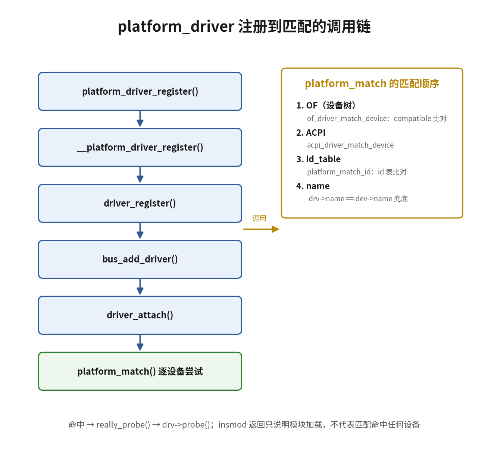

# 11.3.2 platform_driver注册与匹配

> 所属：第11章 设备模型 > 11.3 platform设备与probe流程
> 
> 难度：[E] | 预计阅读时间：20分钟

## <span class="blue"> 本节导读

上一节 uart2 节点被翻译成了 platform_device，并在启动后绑定了 dw-apb-uart 驱动——设备侧的故事讲完了，驱动侧只露了个名字。<br>
本节进入主线"设备树节点→platform_device→匹配→probe"的第二环：从驱动侧把这条绑定拆开。`module_platform_driver()` 一行背后是一条多层调用链，终点是总线的 match 函数 `platform_match()`；match 内部四种匹配方式有严格的优先级顺序，配置写错一级，驱动就永远等不到 probe。<BR>
本节覆盖：platform_driver 结构体、从注册到匹配的真实调用链、platform_match 的优先级规则与真实代码、匹配成功到 probe 被调用的路径、MODULE_DEVICE_TABLE 的真实作用，结尾附完整调用链与动手练习。uart2 与 dw-apb-uart 这对例子继续贯穿全节。

---

## <span class="blue"> 先看驱动侧的证据：dw-apb-uart 在 sysfs 里的样子 [E]

上一节从设备侧看到 `fe660000.serial` 目录下的 driver 符号链接指向 `dw-apb-uart`。同一绑定关系在驱动侧也留了一份：

```bash
# platform 总线的 drivers 目录下，每个已注册驱动一个目录
ls /sys/bus/platform/drivers/
... dw-apb-uart ...

# 驱动目录下的符号链接：它当前绑定着哪些设备
ls -l /sys/bus/platform/drivers/dw-apb-uart/fe660000.serial
... -> ../../../../devices/platform/fe660000.serial
```

目录名 `dw-apb-uart` 就是驱动的注册名，来自 `drivers/tty/serial/8250/8250_dw.c`（Linux 6.6，有删节）：

```c
static const struct of_device_id dw8250_of_match[] = {
    { .compatible = "snps,dw-apb-uart" },  /* 11.3.1 的 uart2 节点靠这一项命中 */
    { .compatible = "cavium,octeon-3860-uart" },
    /* 其余表项从略 */
    { /* 必须以空表项结尾 */ }
};

static struct platform_driver dw8250_platform_driver = {
    .driver = {
        .name = "dw-apb-uart",             /* 注册名：sysfs 目录名就是它 */
        .of_match_table = dw8250_of_match, /* OF 匹配凭据 */
    },
    .probe  = dw8250_probe,                /* 匹配成功后调用的入口 */
    .remove = dw8250_remove,
};

module_platform_driver(dw8250_platform_driver);  /* 模块加载时注册，卸载时注销 */
```

两个观察：`module_platform_driver()` 一行完成了驱动注册的全部动作；`.name` 和 `.of_match_table` 是匹配要用的两类凭据。本节从这一行出发，追到匹配发生的那一刻。

---

## <span class="blue"> 注册链路：从 platform_driver_register 到 driver_attach [E]

### platform_driver 是什么

platform_driver 是驱动在 platform 总线上的注册凭据，定义在 `include/linux/platform_device.h`：

```c
struct platform_driver {
    int (*probe)(struct platform_device *);      /* 匹配成功时调用 */
    int (*remove)(struct platform_device *);     /* 解绑/卸载时调用 */
    void (*shutdown)(struct platform_device *);  /* 关机时调用 */
    int (*suspend)(struct platform_device *, pm_message_t);  /* 电源管理回调 */
    int (*resume)(struct platform_device *, pm_message_t);
    struct device_driver driver;                 /* 内嵌的通用驱动对象 */
    const struct platform_device_id *id_table;   /* 第 3 级匹配用的 ID 表 */
    bool prevent_deferred_probe;                 /* 禁止 deferred probe 重试 */
};
```

内嵌的 `struct device_driver` 里放匹配信息：`name` 字段和 `of_match_table` 指针。注册一个自定义驱动的最小形态：

```c
static const struct of_device_id my_of_match[] = {
    { .compatible = "myvendor,mydevice" },
    { .compatible = "myvendor,mydevice-v2" },
    { }   /* 必须以空表项结尾，内核靠它判断表边界 */
};
MODULE_DEVICE_TABLE(of, my_of_match);

static struct platform_driver my_driver = {
    .probe  = my_probe,
    .remove = my_remove,
    .driver = {
        .name = "my_device",
        .of_match_table = my_of_match,
    },
};

module_platform_driver(my_driver);
```

### 一层层拨开注册封装

`module_platform_driver()` 是模块 init/exit 的一键封装（`include/linux/platform_device.h`）：

```c
/* 展开后：模块加载时调 platform_driver_register，卸载时调 platform_driver_unregister */
#define module_platform_driver(__platform_driver) \
    module_driver(__platform_driver, platform_driver_register, \
            platform_driver_unregister)
```

`platform_driver_register` 本身也是宏，真实入口是 `__platform_driver_register()`（`drivers/base/platform.c:861`，Linux 6.6 全文）：

```c
#define platform_driver_register(drv) \
    __platform_driver_register(drv, THIS_MODULE)

int __platform_driver_register(struct platform_driver *drv,
                struct module *owner)
{
    drv->driver.owner = owner;
    drv->driver.bus = &platform_bus_type;      /* 关键一行：声明挂在 platform 总线上 */

    return driver_register(&drv->driver);      /* 交给通用驱动核心 */
}
```

这段代码回答了两个容易忽略的问题：内核怎么知道这是 platform 总线的驱动——靠 `driver.bus = &platform_bus_type`；驱动的 `.probe` 由谁经手——**注册时不做任何装配**，匹配成功后由 platform 总线自己的 `platform_bus_type.probe`（即 `platform_probe()`）统一经手，做完公共准备再调驱动的 `.probe`（后文「匹配成功之后」展开）。

> 💡 维护 5.4 之前的老内核代码时，会在 `__platform_driver_register()` 里看到 `driver.probe = platform_drv_probe` 的装配写法。该机制已移除，v6.6 源码中 `platform_drv_probe` 这个函数不存在；probe 的经手点从"注册时装配到驱动"改成了"挂在总线上"。在新源码里找不到旧写法属正常现象。

### 注册调用链

```
platform_driver_register()          /* 宏，包一层 THIS_MODULE */
  └── __platform_driver_register()  /* 设置 owner 与 bus */
        └── driver_register()       /* 通用驱动核心，drivers/base/driver.c */
              └── bus_add_driver()  /* 挂到 platform 总线，drivers/base/bus.c */
                    ├── 挂接到总线驱动链表，创建 /sys/bus/platform/drivers/<name>/
                    └── driver_attach()   /* 立即扫描总线上所有设备 */
                          └── bus_for_each_dev(__driver_attach)
                                └── __driver_attach()
                                      ├── driver_match_device()
                                      │     └── platform_match()   /* 总线 match 函数 */
                                      └── driver_probe_device()    /* 匹配成功才走到这 */
```

链路上最关键的一环：`bus_add_driver()` 不只负责挂链表，挂完立刻调用 `driver_attach()` 主动扫描总线上已存在的全部设备。匹配动作在设备注册和驱动注册两个方向都会触发，这就是"驱动比设备晚加载也能正常绑定"的原因。链路的终点 `platform_match()` 决定匹配成败，下面把它拆开。

---

## <span class="blue"> platform_match：四级匹配的真实代码 [E]

`platform_match()`（`drivers/base/platform.c`，Linux 6.6）全文不长，四级优先级就是它的四个分支：

```c
static int platform_match(struct device *dev, struct device_driver *drv)
{
    struct platform_device *pdev = to_platform_device(dev);
    struct platform_driver *pdrv = to_platform_driver(drv);

    /* 特例：设备设了 driver_override 时，只按驱动名比较，四级匹配全部旁路 */
    if (pdev->driver_override)
        return !strcmp(pdev->driver_override, drv->name);

    /* 第 1 级：OF 设备树匹配——嵌入式主流 */
    if (of_driver_match_device(dev, drv))
        return 1;

    /* 第 2 级：ACPI 匹配——x86 服务器/桌面 */
    if (acpi_driver_match_device(dev, drv))
        return 1;

    /* 第 3 级：id_table 匹配——老式板级代码 */
    if (pdrv->id_table)
        return platform_match_id(pdrv->id_table, pdev) != NULL;

    /* 第 4 级：设备名与驱动名逐字节相等——最原始的兜底 */
    return (strcmp(pdev->name, drv->name) == 0);
}
```

对照优先级表：

| 优先级 | 匹配方式 | 依赖数据 | 适用场景 |
|:--:|---------|---------|---------|
| 1 | OF 设备树匹配 | 节点 compatible × `of_match_table` | ARM/RISC-V 嵌入式主流 |
| 2 | ACPI 匹配 | ACPI 设备描述 | x86 服务器/桌面 |
| 3 | id_table 匹配 | `platform_device_id` 数组 | 无设备树的老式板级代码 |
| 4 | name 字符串匹配 | `pdev->name` 与 `drv->name` 逐字节相等 | 最原始的兜底方式 |

嵌入式场景几乎只用第 1 级：`of_driver_match_device()` 拿设备节点的 compatible 列表去比驱动的 of_match_table。uart2 的匹配就发生在这一级：节点的第二个 compatible 值 `snps,dw-apb-uart` 命中 `dw8250_of_match` 的第一个表项。两点细节：

- 设备树 compatible 可以写多个值，约定从最具体到最通用排列，例如 `compatible = "myvendor,uart-v2", "myvendor,uart"`。匹配时任一值命中 of_match_table 即算成功；驱动表里多个表项都能命中时，由 `of_match_node()` 的计分规则选出最具体的那个——计分规则在 11.4.1 展开。
- of_match_table 数组内部的排列顺序不影响匹配结果。

> 💡 `MODULE_DEVICE_TABLE(of, my_of_match)` 不参与运行时匹配。它把 ID 表导出到模块的 modinfo，`depmod` 据此生成别名表，udev/modprobe 收到设备的 uevent 后才能自动加载对应模块。编译进内核的驱动不写这行，匹配照常工作；编成模块又不写，匹配仍然工作，但自动加载失效。

四种匹配并存是历史层积：name 匹配最早，id_table 服务于板级文件时代，设备树普及后 OF 匹配成为主流，ACPI 服务于 x86 生态。新写的嵌入式驱动直接配置 of_match_table 即可。driver_override 这个旁路特例的用途（两个驱动竞争同一设备时指定绑定）在 11.4.4 展开。



---

## <span class="blue"> 匹配成功之后：platform 在 probe 路径上的特化 [E]

match 返回 1 只是入场券。从匹配成功到 `.probe` 执行，走的是 11.2.3 逐层拆解过的通用链路：`driver_probe_device()` → `really_probe()` → `call_driver_probe()`。platform 总线在这条通用链上的特化只有一处——`call_driver_probe()` 里总线的 `.probe` 优先于驱动的 `.probe`，而 platform 总线挂的是 `platform_probe()`（`drivers/base/platform.c:1379`，Linux 6.6，有删节）：

```c
static int platform_probe(struct device *_dev)
{
    struct platform_driver *drv = to_platform_driver(_dev->driver);
    struct platform_device *dev = to_platform_device(_dev);
    int ret;

    ret = of_clk_set_defaults(_dev->of_node, false);  /* 应用设备树的时钟默认配置 */
    if (ret < 0)
        return ret;

    ret = dev_pm_domain_attach(_dev, true);           /* 挂接电源域并上电 */
    if (ret)
        goto out;

    if (drv->probe) {
        ret = drv->probe(dev);                        /* ★ 进入驱动自己的 probe */
        if (ret)
            dev_pm_domain_detach(_dev, true);         /* 失败则撤掉电源域 */
    }
    ...
}
```

`platform_probe()` 是内核框架与驱动代码的分界线：时钟默认配置、电源域挂接这类每个 platform 设备都要做的公共准备由它统一完成，驱动拿到的设备已经"上电就绪"，只管初始化自己的硬件。

注意传参类型：`.probe` 收到的是 `struct platform_device *`，不是 `struct device *`。platform_device 内嵌 `struct device dev`，并携带 resource 数组和 `num_resources`，probe 里取寄存器地址、中断号都从这里来——下一节展开 probe 内部。

反向动作在同一条链上：`remove()` 由设备注销（`platform_device_unregister()`）或驱动卸载触发，经驱动核心调到 `platform_remove()`（platform.c:1418），它先进入驱动的 `.remove`，返回后撤掉电源域。

维护老内核代码时偶见 id_table 写法，需要认得：

```c
/* id_table 匹配方式（老式写法，仅用于阅读老代码） */
static const struct platform_device_id my_ids[] = {
    { "mydevice",    0 },   /* 名字 + 私有数据 */
    { "mydevice-v2", 1 },
    { }
};

static struct platform_driver my_driver = {
    .id_table = my_ids,      /* 第 3 级匹配 */
    .probe    = my_probe,
    .driver   = { .name = "my_device" },
};
```

新驱动不采用这种写法，直接走设备树。

---

## <span class="blue"> 完整调用链：从模块加载到 probe [E]

至此，注册到 probe 的每一步都走完了。把 dw-apb-uart 与 uart2 的真实路径收拢成一张链：

```
模块加载    module_init（module_platform_driver 展开）
            └── platform_driver_register(&dw8250_platform_driver)
                  └── __platform_driver_register()
                        ├── driver.bus = &platform_bus_type
                        └── driver_register()
                              └── bus_add_driver()
                                    ├── 出现 /sys/bus/platform/drivers/dw-apb-uart/
                                    └── driver_attach()
                                          └── 遍历总线设备，遇到 fe660000.serial
                                                ├── driver_match_device()
                                                │     └── platform_match()
                                                │           └── of_driver_match_device()
                                                │                 "snps,dw-apb-uart" 命中 → 返回 1
                                                └── driver_probe_device()
                                                      └── really_probe()
                                                            └── call_driver_probe()
                                                                  └── platform_probe()      /* 总线的公共准备 */
                                                                        └── dw8250_probe(pdev)
                                                                              ├── 读 resource、ioremap
                                                                              ├── 申请 IRQ
                                                                              └── 注册串口设备
                                                      → 出现 drivers/dw-apb-uart/fe660000.serial 链接
```

与 11.3.1 的设备侧调用链拼在一起，就是一个设备从设备树节点到 probe 成功的完整双视角：populate 把节点变成设备（arch_initcall_sync 阶段），register 把驱动挂上总线并反向扫描（驱动加载时刻），两条链在 `platform_match()` 交汇。

---

## <span class="blue"> 动手练习

本节的每个论断都有可验证的落点，三个练习把最关键的落点亲手过一遍：

1. 在板子上验证驱动的双侧视角：`ls /sys/bus/platform/drivers/`，任选一个驱动目录看它绑定了哪些设备符号链接；再对照设备侧 `/sys/bus/platform/devices/*/driver`，确认同一绑定关系在两侧各有一份。
2. 如果板子上有编成模块的 platform 驱动，用 `modinfo <模块名> | grep alias` 查看 `MODULE_DEVICE_TABLE` 生成的 of 别名，再对照 `cat /sys/bus/platform/devices/<设备>/uevent` 里的 MODALIAS 字段——两者就是自动加载机制的接头。
3. 打开板子配套内核源码的 `drivers/base/platform.c`：先读 `platform_match()` 对照四级表，再读 `platform_probe()`，最后找到 `platform_bus_type` 定义里 `.probe = platform_probe` 那一行——驱动的 `.probe` 就是从这个挂载点进入调用链的。

---

## <span class="blue"> 本节总结

| 概念 | 核心要点 | 自查操作 |
|------|---------|---------|
| 注册封装链 | module_platform_driver → 宏 → `__platform_driver_register()` → `driver_register()` | 读 `drivers/base/platform.c` |
| 关键赋值 | `driver.bus = &platform_bus_type` 一行决定挂在 platform 总线 | 在 `__platform_driver_register` 里找这一行 |
| 双向触发 | 设备注册和驱动注册都会触发匹配，加载顺序不影响绑定 | 后加载驱动模块验证绑定 |
| 匹配优先级 | OF → ACPI → id_table → name，前一种命中即返回；driver_override 旁路全部 | 对照 `platform_match()` 四个分支 |
| probe 调用路径 | match 成功 → `really_probe()` → `call_driver_probe()` → `platform_probe()` → `.probe()` | 在 probe 入口加打印确认 |
| MODULE_DEVICE_TABLE | 供 depmod 生成别名，实现模块自动加载；不参与运行时匹配 | `modinfo` 查看模块别名 |
| sysfs 双侧视角 | 设备目录的 driver 链接与驱动目录的设备链接互为镜像 | 对照两侧 `ls -l` 输出 |

---

## <span class="blue"> 下一步

匹配成功，控制流进入 `.probe()`。下一节（11.3.3）拆开 probe 内部：一个标准 probe 要完成的六步动作、每步的 API 与失败处理，以及 `-EPROBE_DEFER` 这个特殊返回值的语义。
