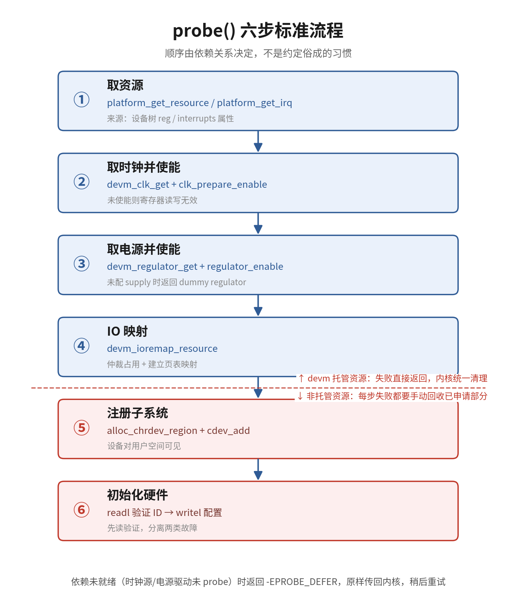

# 11.3.3 probe()函数内部

> 所属：第11章 设备模型 > 11.3 platform设备与probe流程
> 
> 难度：[E] | 预计阅读时间：25分钟

## <span class="blue"> 本节导读

11.3.2 的调用链终点是 `dw8250_probe()` 被调起来——主线"设备树节点→platform_device→匹配→probe"的第三环从这一刻开始。probe 的本质任务是把 platform_device 携带的资源（寄存器地址、中断号、时钟、电源）翻译成驱动可用的软件对象，再初始化硬件。这些动作之间有硬依赖：时钟没使能就读写寄存器，拿到的只是无意义值。<BR>
本节覆盖：probe 执行的可验证证据、六步标准流程及其依赖顺序、真实驱动 dw8250_probe 的骨架对照、返回值语义与 deferred probe 的真实实现、一个带完整错误清理路径的示例，结尾附完整调用链与动手练习。

---

## <span class="blue"> 先看证据：probe 跑过之后留下什么 [E]

uart2 与 dw-apb-uart 匹配成功（11.3.2 的结尾）之后，启动日志里多出一行：

```bash
dmesg | grep ttyS
[    0.847312] fe660000.serial: ttyS2 at MMIO 0xfe660000 (irq = 150, base_baud = 1500000) is a 16550A
```

用户空间同时多出一个设备节点：

```bash
ls -l /dev/ttyS2
crw------- 1 root root 4, 66 ... /dev/ttyS2
```

这条日志和这个数字，就是 `dw8250_probe()` 执行完留下的痕迹：`fe660000.serial` 是 11.3.1 里翻译出来的 platform_device 名字，`0xfe660000` 来自 resource 数组的第一个 MEM 条目，`ttyS2` 是 probe 向 8250 串口子系统注册的结果。probe 内部到底做了什么才换来这条日志？本节拆开看。

---

## <span class="blue"> probe 的六步标准流程 [E]

六步顺序不是约定俗成的习惯，而是依赖关系决定的：

① 取资源 → ② 取时钟并使能 → ③ 取电源并使能 → ④ IO 映射 → ⑤ 注册子系统 → ⑥ 初始化硬件

### 第一步：取资源

从 platform_device 的 resource 数组取出内存资源和中断号（resource 的来源见 11.3.1）：

```c
res = platform_get_resource(pdev, IORESOURCE_MEM, 0);  /* 取第 0 个 MEM 条目 */
if (!res)
    return -ENODEV;

irq = platform_get_irq(pdev, 0);   /* 取第 0 个 IRQ 条目 */
if (irq < 0)
    return irq;
```

`platform_get_irq()` 成功返回中断号、失败返回负错误码，判定条件写 `irq < 0`。不要写 `if (!irq)`：中断号 0 在部分平台上是合法值，这个写法会把"取失败"和"取到 0 号中断"混为一谈。

### 第二步：取时钟并使能

时钟框架（Common Clock Framework）统一管理 SoC 内部的时钟树，外设工作前必须拿到自己的时钟并打开：

```c
clk = devm_clk_get(&pdev->dev, NULL);   /* NULL 表示取设备树里第一个时钟 */
if (IS_ERR(clk))
    return dev_err_probe(&pdev->dev, PTR_ERR(clk), "failed to get clock\n");

ret = clk_prepare_enable(clk);          /* 使能：没这一步，寄存器读写无效 */
if (ret)
    return dev_err_probe(&pdev->dev, ret, "failed to enable clock\n");
```

两点边界要分清：

- `devm_clk_get()` 托管的只是**时钟引用**：驱动卸载时内核自动 `clk_put()`。enable/disable 属于运行时状态切换，不在 devm 托管范围内，必须在 remove 里配对 `clk_disable_unprepare()`（新版本内核可用 `devm_clk_get_enabled()` 一步合并）。
- 时钟源驱动（clock provider，如 CRU 控制器驱动）尚未就绪时，`devm_clk_get()` 返回 `-EPROBE_DEFER`，这个值必须原样传回内核。

### 第三步：取电源并使能

regulator 框架管理外设的供电轨（LDO、DC-DC）。外设有独立供电控制时需要这一步：

```c
reg = devm_regulator_get(&pdev->dev, "power");   /* "power" 对应设备树的 xxx-supply */
if (IS_ERR(reg))
    return dev_err_probe(&pdev->dev, PTR_ERR(reg), "failed to get regulator\n");

ret = regulator_enable(reg);
if (ret)
    return dev_err_probe(&pdev->dev, ret, "failed to enable regulator\n");
```

设备树未配置对应 supply 时行为分两种：`devm_regulator_get()` 会拿到内核提供的 dummy regulator（恒使能的占位实现），驱动照常往下走；`devm_regulator_get_optional()` 返回 `-ENODEV`，让驱动区分"真的没配电源"的场景。与时钟相同，enable 不在 devm 托管范围内，remove 里要配对 `regulator_disable()`。

### 第四步：IO 映射

resource 里存的是物理地址，CPU 访问前必须建立页表映射：

```c
base = devm_ioremap_resource(&pdev->dev, res);
if (IS_ERR(base))
    return dev_err_probe(&pdev->dev, PTR_ERR(base), "failed to ioremap\n");
```

这个函数一次完成三件事：`request_mem_region()` 仲裁占用、`ioremap()` 建立映射、纳入 devm 托管。不要用裸 `ioremap()` 绕过仲裁——两个驱动映射同一物理区域时寄存器读写互相干扰，故障现象不稳定且极难定位。

### 第五步：注册子系统

资源备齐后，让设备对用户空间可见。以字符设备为例：

```c
ret = alloc_chrdev_region(&priv->devno, 0, 1, "myled");  /* 申请主/次设备号 */
if (ret)
    return dev_err_probe(&pdev->dev, ret, "alloc chrdev failed\n");

cdev_init(&priv->cdev, &myled_fops);     /* 绑定 file_operations */
priv->cdev.owner = THIS_MODULE;
ret = cdev_add(&priv->cdev, priv->devno, 1);  /* 注册进内核，设备对用户空间可见 */
if (ret) {
    unregister_chrdev_region(priv->devno, 1);   /* 非托管资源，失败要自己回收 */
    return dev_err_probe(&pdev->dev, ret, "cdev_add failed\n");
}
```

这一步是托管资源与非托管资源的分界线：前四步的 devm 资源失败时直接返回即可，内核统一清理；从 `alloc_chrdev_region()` 开始申请的是非托管资源，后续每一步失败都要手动回收已申请的部分。

### 第六步：初始化硬件

```c
/* 先读 ID/复位寄存器验证，再写配置 */
dev_info(&pdev->dev, "chip id: 0x%08x\n", readl(base + REG_ID));
writel(CFG_DEFAULT, base + REG_CONFIG);
writel(CTRL_ENABLE, base + REG_CONTROL);
```

工程惯例是先读一遍 ID 寄存器或复位值与 datasheet 核对，再写配置。读回值与预期不符时，问题几乎总在前五步：时钟没开、电源没上、映射地址错。先读验证能把"硬件没起来"和"寄存器配置错"两类故障直接分开。



### 六步速查表

| 步骤 | 核心 API | 失败返回 | 处理方式 | 高频错误 |
|------|---------|---------|---------|---------|
| ① 取资源 | `platform_get_resource()` / `platform_get_irq()` | NULL / 负错误码 | 打印并返回 | 用 `if (!irq)` 误判 0 号中断 |
| ② 取时钟 | `devm_clk_get()` + `clk_prepare_enable()` | ERR_PTR / 负值 | `dev_err_probe` 返回 | 忘记 enable，寄存器读写无效 |
| ③ 取电源 | `devm_regulator_get()` + `regulator_enable()` | ERR_PTR / 负值 | `dev_err_probe` 返回 | 把 `-EPROBE_DEFER` 当普通错误吞掉 |
| ④ IO 映射 | `devm_ioremap_resource()` | ERR_PTR | `PTR_ERR` 取码返回 | 裸 `ioremap()` 绕过资源仲裁 |
| ⑤ 注册子系统 | `alloc_chrdev_region()` / `cdev_add()` | 负值 | 手动回收已申请部分 | 失败路径漏回收，资源泄漏 |
| ⑥ 初始化硬件 | `readl()` / `writel()` | — | 先读复位值验证再写 | 直接写配置，故障难定位 |

---

## <span class="blue"> 真实驱动对照：dw8250_probe 里的六步 [E]

六步是抽象骨架，真实驱动是不是真这么写？拿贯穿本章的 dw-apb-uart 驱动对照——`drivers/tty/serial/8250/8250_dw.c` 的 `dw8250_probe()`（Linux 6.6，有删节）：

```c
static int dw8250_probe(struct platform_device *pdev)
{
    struct uart_8250_port uart = {};
    struct dw8250_data *data;
    int err;

    /* ① 取资源：寄存器区间与中断号 */
    struct resource *regs = platform_get_resource(pdev, IORESOURCE_MEM, 0);
    if (!regs)
        return -ENODEV;
    uart.port.irq = platform_get_irq(pdev, 0);

    /* ② 取时钟并使能 */
    data->clk = devm_clk_get(&pdev->dev, NULL);
    if (IS_ERR(data->clk))
        return PTR_ERR(data->clk);
    clk_prepare_enable(data->clk);

    /* ④ 映射委托：不自己 ioremap，设 UPF_IOREMAP 让 8250 核心统一处理 */
    uart.port.mapbase = regs->start;
    uart.port.iotype  = UPIO_MEM;
    uart.port.flags   = UPF_BOOT_AUTOCONF | UPF_IOREMAP;

    /* ⑤ 注册子系统：向 8250 核心注册一个端口，ttyS2 由此诞生 */
    platform_set_drvdata(pdev, data);
    err = serial8250_register_8250_port(&uart);
    ...
}
```

骨架与六步一一对应，但有两处真实世界的变形，比骨架本身更有信息量：

- **映射委托**：8250_dw 不直接调 `ioremap()`，而是把物理地址填进 `port.mapbase` 并置 `UPF_IOREMAP` 标志，由 8250 核心注册端口时统一映射。骨架是原则，子系统框架有权接管其中某一步——判断依据是框架文档和源码，不是死记硬背。
- **没有 regulator 步**：串口控制器属于 SoC 片内 Always-On 电源域，设备树里没有独立 supply，这一步自然省略。六步是依赖清单，不是形式主义 checklist，依赖不存在就跳过。

---

## <span class="blue"> probe 返回值与 deferred probe 的真实实现 [E]

骨架的每一步都可能失败，失败返回什么值决定内核下一步动作：

| 返回值 | 含义 | 内核行为 |
|--------|------|---------|
| 0 | 初始化成功 | 设备与驱动完成绑定（bound） |
| 负错误码（`-ENOMEM` 等） | 确定性失败 | 解绑，打印错误，不再重试 |
| `-EPROBE_DEFER` | 依赖的 provider 尚未就绪 | 设备挂入 deferred probe 待处理链表，稍后自动重试 |

deferred probe（延迟探测）解决的是依赖顺序问题：外设驱动 probe 时，它依赖的 GPIO 控制器、时钟源可能还没注册。这不是文字约定，是 `drivers/base/dd.c` 里 `really_probe()` 的真实分支（有删节）：

```c
ret = call_driver_probe(dev, drv);   /* → platform_probe() → drv->probe，见 11.3.2 */

if (ret == -EPROBE_DEFER) {
    driver_deferred_probe_add(dev);  /* 挂到待处理链表：不报错，稍后重试 */
} else if (ret < 0) {
    /* 确定性失败：解除绑定关系，不再重试 */
    ...
}
/* ret == 0：绑定成功，设备出现在驱动目录下 */
```

每当有新驱动注册或 deferred 链表上的设备的依赖就位，链表中的设备被重新匹配、重新 probe。驱动加载顺序因此不再重要——这就是 11.3.2"双向触发"之外的第二层顺序无关保证。

`dev_err_probe()` 是配套工具（`drivers/base/core.c`）：传入真实错误码时按 error 级别打印；传入 `-EPROBE_DEFER` 时降为 debug 级别（避免重试期间刷屏），同时把失败原因记录到 `/sys/kernel/debug/devices_deferred`。它原样返回传入的错误码，因此惯用写法是 `return dev_err_probe(...)` 一行完成打印和返回。

> 💡 deferred 状态是可见的：`cat /sys/kernel/debug/devices_deferred`（需挂载 debugfs）列出所有待重试设备及其失败原因。probe 看似"没执行又没报错"时，先查这个文件。

---

## <span class="blue"> 完整示例：带错误清理路径的 probe [E]

把六步、错误码语义、清理纪律拼成一个可对照的完整函数（简化 LED 驱动，内核 `drivers/leds/` 下大量真实驱动遵循同一骨架）：

```c
struct myled_priv {
    void __iomem     *base;
    struct clk       *clk;
    struct regulator *reg;
    struct cdev      cdev;
    dev_t            devno;
    int              irq;
};

static int myled_probe(struct platform_device *pdev)
{
    struct myled_priv *priv;
    struct resource *res;
    int ret;

    /* 私有结构：devm 托管，失败/卸载自动释放 */
    priv = devm_kzalloc(&pdev->dev, sizeof(*priv), GFP_KERNEL);
    if (!priv)
        return -ENOMEM;

    /* ① 取资源 */
    res = platform_get_resource(pdev, IORESOURCE_MEM, 0);
    if (!res)
        return dev_err_probe(&pdev->dev, -ENODEV, "no memory resource\n");

    priv->irq = platform_get_irq(pdev, 0);
    if (priv->irq < 0)
        return dev_err_probe(&pdev->dev, priv->irq, "no irq resource\n");

    /* ② 取时钟并使能（enable 不托管，失败/卸载都要手动配对） */
    priv->clk = devm_clk_get(&pdev->dev, NULL);
    if (IS_ERR(priv->clk))
        return dev_err_probe(&pdev->dev, PTR_ERR(priv->clk), "no clock\n");

    ret = clk_prepare_enable(priv->clk);
    if (ret)
        return dev_err_probe(&pdev->dev, ret, "enable clock failed\n");

    /* ③ 取电源（可选）：设备树没配 supply 时返回 -ENODEV，属正常情况 */
    priv->reg = devm_regulator_get_optional(&pdev->dev, "power");
    if (IS_ERR(priv->reg)) {
        if (PTR_ERR(priv->reg) != -ENODEV) {
            ret = PTR_ERR(priv->reg);
            goto err_disable_clk;
        }
        priv->reg = NULL;
    } else {
        ret = regulator_enable(priv->reg);
        if (ret)
            goto err_disable_clk;
    }

    /* ④ IO 映射（devm 托管，不在清理链上） */
    priv->base = devm_ioremap_resource(&pdev->dev, res);
    if (IS_ERR(priv->base)) {
        ret = PTR_ERR(priv->base);
        goto err_disable_reg;
    }

    /* ⑤ 注册字符设备（非托管，从这里开始失败要自己回收） */
    ret = alloc_chrdev_region(&priv->devno, 0, 1, "myled");
    if (ret)
        goto err_disable_reg;

    cdev_init(&priv->cdev, &myled_fops);
    priv->cdev.owner = THIS_MODULE;
    ret = cdev_add(&priv->cdev, priv->devno, 1);
    if (ret)
        goto err_unregister_chrdev;

    /* ⑥ 初始化硬件：先读后写 */
    dev_info(&pdev->dev, "chip id: 0x%08x\n", readl(priv->base + REG_ID));
    writel(LED_CFG_DEFAULT, priv->base + REG_CONFIG);
    writel(LED_CTRL_OFF, priv->base + REG_CONTROL);

    platform_set_drvdata(pdev, priv);
    dev_info(&pdev->dev, "myled probed\n");
    return 0;

/* 错误清理：按申请顺序的反方向回收非托管部分 */
err_unregister_chrdev:
    unregister_chrdev_region(priv->devno, 1);
err_disable_reg:
    if (priv->reg)
        regulator_disable(priv->reg);
err_disable_clk:
    clk_disable_unprepare(priv->clk);
    return ret;
}
```

这段代码最值得研究的是 `goto` 清理链。内核代码里 `goto` 做错误清理是标准写法，两条纪律：

- **反序回收**：后申请的先释放，`cdev_add` 失败只需回收 chrdev_region，`ioremap` 失败则要一路退到 clk。
- **只回收非托管部分**：devm 资源（priv、clk 引用、reg 引用、base 映射）不出现在清理链上，probe 返回错误后由内核统一释放。

> ⚠️ enable 类操作（`clk_prepare_enable`、`regulator_enable`）不属于 devm 托管范围。probe 中途失败或 remove 时漏掉配对的 disable，硬件模块会持续耗电；上面的 `err_disable_clk`、`err_disable_reg` 就是为这个问题存在的。

---

## <span class="blue"> 完整调用链：从 really_probe 到 ttyS2 [E]

至此，probe 的外部链路与内部骨架都齐了。把 uart2 的最后一程收拢成一张链：

```
驱动核心    really_probe()                        （11.2.3 调用链的终点）
            └── call_driver_probe()
                  └── platform_probe()              （platform 总线的公共准备，11.3.2）
                        └── dw8250_probe(pdev)
                              ├── ① platform_get_resource() → regs = 0xfe660000..0xff
                              │   platform_get_irq()        → 内核 IRQ 号
                              ├── ② devm_clk_get + clk_prepare_enable
                              ├── ④ mapbase/iotype/UPF_IOREMAP（映射委托给 8250 核心）
                              ├── ⑤ serial8250_register_8250_port()
                              │     └── 8250 核心：ioremap、读 ID、分配 ttyS2
                              └── 返回 0 → driver_bound()
结果        dmesg: fe660000.serial: ttyS2 at MMIO 0xfe660000 ...
            /dev/ttyS2 出现（devtmpfs 创建设备节点）

失败分支    probe 返回 -EPROBE_DEFER
            └── driver_deferred_probe_add() → /sys/kernel/debug/devices_deferred
```

三个环节的证据链至此闭合：设备树节点（11.3.1）→ 匹配（11.3.2）→ probe 执行并留下可观察痕迹（本节）。以后排查"probe 没执行"类问题，就是沿着这条链反推哪一环断了——11.3.5 专门讲这套反推法。

---

## <span class="blue"> 动手练习

本节的每个论断都有可验证的落点，三个练习把最关键的落点亲手过一遍：

1. 在板子上找 probe 的证据：`dmesg | grep -E "ttyS|probe"`，任挑一条设备日志，反推它对应 resource 数组里的哪个条目（地址是否等于节点 reg）、属于六步里的哪一步产物。
2. 查 deferred 现场：`mount -t debugfs none /sys/kernel/debug`（未挂载时），然后 `cat /sys/kernel/debug/devices_deferred`。有内容就说明系统里正有设备在等依赖，逐条分析它缺什么 provider。
3. 打开板子配套内核源码的 `drivers/tty/serial/8250/8250_dw.c`，在 `dw8250_probe()` 里逐个找出六步骨架的对应行——注意哪些是骨架原样、哪些被 8250 框架接管（UPF_IOREMAP）、哪些被省略（regulator）。

---

## <span class="blue"> 本节总结

| 概念 | 核心要点 | 自查问题 |
|------|---------|---------|
| probe 的证据 | dmesg 设备日志 + /dev 节点出现，地址来自 resource 数组 | 日志地址与 reg 对得上吗 |
| 六步顺序 | 资源→时钟→电源→映射→注册子系统→初始化硬件，顺序由依赖关系决定 | 当前 probe 的顺序符合依赖吗 |
| 骨架变形 | 框架可接管某步（UPF_IOREMAP），依赖不存在可省步 | 六步是依赖清单还是形式主义 |
| 托管分界线 | 第五步之前是 devm 托管资源，失败直接返回；之后是非托管资源，失败手动回收 | 失败路径有没有漏回收 |
| `-EPROBE_DEFER` | 依赖未就绪时原样返回，`driver_deferred_probe_add()` 挂链表稍后重试 | 代码有没有把它当普通错误吞掉 |
| `dev_err_probe` | 打印 + 返回错误码一体，defer 时降级记录到 devices_deferred | `cat /sys/kernel/debug/devices_deferred` 会看吗 |
| enable 不托管 | clk/regulator 的 enable 需在错误路径和 remove 中配对 disable | 清理链是否覆盖 enable 配对 |

---

## <span class="blue"> 下一步

probe 里反复出现的 `devm_` 前缀，背后是一套完整的资源托管子系统：资源挂在哪、什么时候释放、按什么顺序释放、哪些资源它管不了。下一节（11.3.4）讲 devm_ 资源管理机制的原理与边界。
