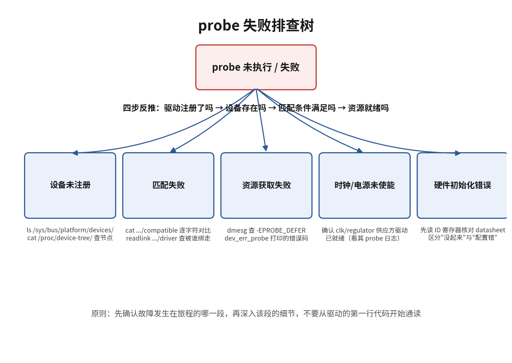

# 11.3.5 probe失败的排查

> 所属：第11章 设备模型 > 11.3 platform设备与probe流程
> 
> 难度：[E] | 预计阅读时间：18分钟

## <span class="blue"> 本节导读

11.3.1 到 11.3.4 把主线"设备树节点→platform_device→匹配→probe→资源管理"逐环讲完，11.3.3 结尾预告的"反推法"在本节展开：驱动编进内核了、设备树节点也写了，板子跑起来设备却起不来，`/dev` 下空空如也。probe 失败的现场只有五类，按"设备未注册→匹配失败→资源获取失败→时钟电源未使能→硬件初始化错误"的顺序沿主线逐环定位，基本都能破案。<BR>
本节覆盖：五类失败现场的症状与定位方法（每类配内核源码佐证）、sysfs/dmesg/打印三级排查手段、deferred probe 卡死的识别，结尾附完整排查调用链与动手练习。

---

## <span class="blue"> 五类失败现场 [E]

### 现场一：设备未注册

platform_device 根本没创建。症状：dmesg 搜不到设备名，`/sys/bus/platform/devices/` 里没有对应目录。

可能原因：

- 节点写成 `status = "disabled"`，`of_device_is_available()` 判定不可用，节点被跳过（11.3.1）
- 节点没编进 dtb：DTS 没参与编译、include 路径错、或 overlay 未应用
- 节点缺 compatible 属性，被当作纯容器节点跳过

排查：`grep status xxx.dts`；目标板上 `ls /sys/bus/platform/devices/` 与 `ls /proc/device-tree/` 对照，确认节点是否存在。以贯穿本章的 uart2 为例，正常时能看到：

```bash
ls /sys/bus/platform/devices/ | grep fe660000
fe660000.serial
```

没有这条目录，问题就锁定在设备树一侧，驱动代码不用看。

### 现场二：匹配失败

设备注册了，但没有驱动与它绑定。症状：`/sys/bus/platform/devices/fe660000.serial/` 存在，但目录下没有 `driver` 符号链接；`/sys/bus/platform/drivers/` 里能看到驱动目录，两边各不相干。**匹配失败通常是静默的**——内核不会为"没找到驱动"打印任何日志，这正是此类故障难定位的根本原因。

静默不是设计疏忽：bus 层面每注册一个设备或驱动都会尝试 `device_attach()` / `driver_attach()`（11.3.2），匹配不上只是返回 0，不构成错误，自然没有日志。

排查：逐字符对比设备树 compatible 与驱动 of_match_table。高频翻车点：连字符与下划线混用（`my-device` 与 `my_device`）、大小写不一致、厂商前缀缺失、compatible 写了多个值但最具体的那个没进驱动表。另外确认驱动本身完成了注册：在驱动 init 处加打印，或检查 `/sys/bus/platform/drivers/` 下有没有对应目录。

### 现场三：资源获取失败

匹配成功、probe 被调用了，但 `platform_get_resource()` 返回 NULL，或资源仲裁失败。

- 设备树缺 `reg` / `interrupts`，或 `reg` 的格式与父节点 `#address-cells` / `#size-cells` 不匹配，解析失败
- 两个节点声明了重叠的寄存器区间或同一中断号：后来者 `request_mem_region()` 失败，返回 `-EBUSY`

排查：dmesg 里找资源类报错；`cat /proc/iomem` 和 `cat /proc/interrupts` 看资源当前归属，定位冲突的另一方。uart2 正常时在 `/proc/iomem` 里占一行：

```bash
cat /proc/iomem | grep fe660000
fe660000-fe6600ff : fe660000.serial
```

### 现场四：时钟电源未使能

probe 卡在依赖的 provider 上：`devm_clk_get()`、`devm_regulator_get()` 返回 `-EPROBE_DEFER`，设备被挂入 deferred probe 待处理链表等待重试。挂链表是 dd.c 里的真实动作（drivers/base/dd.c，有删节）：

```c
static void driver_deferred_probe_add(struct device *dev)
{
    mutex_lock(&deferred_probe_mutex);
    if (list_empty(&dev->deferred_probe))
        list_add_tail(&dev->deferred_probe, &deferred_probe_pending_list);  /* 挂入待重试链表 */
    mutex_unlock(&deferred_probe_mutex);
}
```

provider 若永远不就绪（没编译进内核、自身 probe 失败、compatible 也没对上），设备就永远卡在这条链表上——这类故障表面上也是"什么日志都没有"。

排查：`dmesg | grep -i defer`；挂载 debugfs 后 `cat /sys/kernel/debug/devices_deferred`。这个文件的内容同样来自 dd.c：它遍历 `deferred_probe_pending_list`，逐个打印设备名和 `dev_err_probe()` 记录的原因。沿依赖链向上确认 clock/regulator/pinctrl provider 的 Kconfig 已选中、驱动已注册。

### 现场五：硬件初始化错误

前面四环都通过了，probe 内部某步返回负错误码：ioremap 失败、request_irq 失败、寄存器读回值与 datasheet 不符。dmesg 里能看到驱动自己的错误打印，或驱动核心输出的 probe 失败记录。

排查：错误码直接指示方向——`-ENOMEM` 查内存、`-EBUSY` 查资源冲突、`-EINVAL` 查参数。寄存器读写异常时，先回查时钟和电源是否真正使能（`cat /sys/kernel/debug/clk/clk_summary`、regulator 的 sysfs 接口），再怀疑映射地址。



五类现场速查：

| 现场 | 典型症状 | 关键命令 | 修复方向 |
|------|---------|---------|---------|
| 设备未注册 | sysfs 无设备目录，dmesg 无痕迹 | `ls /sys/bus/platform/devices/`、`grep status *.dts` | status 改 okay、确认节点编进 dtb |
| 匹配失败 | 设备与驱动都在，无绑定，无日志 | 逐字符对比 compatible 与 of_match_table | 统一字符串，确认驱动已注册 |
| 资源获取失败 | probe 报 `-ENODEV` / `-EBUSY` | `cat /proc/iomem`、`cat /proc/interrupts` | 修 reg/interrupts，消除重叠 |
| 时钟电源未使能 | 反复 defer 或无声等待 | `dmesg \| grep -i defer`、`cat /sys/kernel/debug/devices_deferred` | 确认 provider 已编译并注册 |
| 硬件初始化错误 | dmesg 有 probe 失败记录与错误码 | 按错误码方向查；`clk_summary` 确认时钟 | 修 probe 内具体失败点 |

> 🔴 前两类（status 与 compatible）占 probe 类故障的大多数。先花半分钟核对设备树，再进驱动代码加打印；顺序反过来，经常对着完好的 probe 调半天。

---

## <span class="blue"> 三级排查手段 [E]

### 第一级：sysfs 定位断点

```bash
ls /sys/bus/platform/devices/                    # 设备是否注册
ls /sys/bus/platform/drivers/                    # 驱动是否注册
ls /sys/bus/platform/devices/<设备名>/driver     # 是否完成绑定
```

三条命令即可把断点定位到"设备侧 / 驱动侧 / 匹配"三段中的哪一段。绑定成功时第三条的输出形如：

```bash
ls -l /sys/bus/platform/devices/fe660000.serial/driver
lrwxrwxrwx ... driver -> ../../../bus/platform/drivers/dw-apb-uart
```

符号链接指向的目录名就是完成绑定的驱动名——11.3.2 讲的"sysfs 双向视角"在这里直接变成排查工具。

### 第二级：dmesg 取证

```bash
dmesg | grep -i <设备名或驱动名>
dmesg | grep -i defer
dmesg | grep -i "probe"
```

匹配失败静默，其余四类多数会在 dmesg 留痕。debugfs 挂载后（需 CONFIG_DEBUG_FS），`/sys/kernel/debug/devices_deferred` 是 deferred probe 的专用取证点。

### 第三级：probe 内加打印

最直接也最有效的终极手段。probe 入口先放一条，之后每过一个资源获取点放一条，失败分支统一用 `dev_err_probe()`：

```c
static int my_probe(struct platform_device *pdev)
{
    pr_info("my_drv: probe entered\n");      /* 入口打印：没有它，问题在前两类 */

    res = platform_get_resource(pdev, IORESOURCE_MEM, 0);
    if (!res)
        return dev_err_probe(&pdev->dev, -ENODEV, "no memory resource\n");
    /* dev_err_probe 打印错误码+原因；错误码是 -EPROBE_DEFER 时
       同时把原因记入 devices_deferred，供第二级取证 */
    /* ... 每个失败分支同样处理 */

    pr_info("my_drv: probe done\n");         /* 走到这行说明 probe 全程通过 */
    return 0;
}
```

`dev_err_probe()` 比普通 `dev_err()` 多做一件事：错误码为 `-EPROBE_DEFER` 时把原因字符串挂到设备上，`devices_deferred` 文件因此能显示"为什么卡着"。

如果连入口打印都没有，说明 probe 根本没被调用，问题在前两类；再退一步，在驱动注册处加打印确认 `platform_driver_register()` 被执行过。注册打印也没有，检查驱动是否编进内核（`.config` 或 `/lib/modules` 下有没有对应的 .ko）。

> 💡 排查纪律：沿"设备树→设备注册→匹配→probe 执行→probe 内部"单向推进，定位到断环再深挖。五个环节同时猜、同时改，改到最后会丢失现场，比原故障更难收拾。

---

## <span class="blue"> 完整排查调用链 [E]

```
症状：/dev 下没有设备节点
│
├─ 第一级 sysfs
│   ls /sys/bus/platform/devices/fe660000.serial
│   ├─ 不存在 ──────────────→ 现场一：查 dts status / dtb 编译 / compatible
│   └─ 存在
│       ls .../fe660000.serial/driver
│       ├─ 无 driver 链接 ──→ 现场二：逐字符对比 compatible ↔ of_match_table
│       │                     （同时确认 drivers/ 下驱动目录存在）
│       └─ 有链接但 probe 失败
│
├─ 第二级 dmesg
│   dmesg | grep -i defer 有输出
│   └─ cat /sys/kernel/debug/devices_deferred
│       └─ 列出设备+原因 ───→ 现场四：沿依赖链查 provider
│           （dd.c: driver_deferred_probe_add → deferred_probe_pending_list）
│   dmesg 有错误码
│   └─ -EBUSY / -ENODEV ────→ 现场三：cat /proc/iomem、/proc/interrupts 查冲突
│   └─ 其他错误码 ──────────→ 现场五：按错误码方向深挖 probe 内部
│
└─ 第三级 probe 加打印
    入口无打印 → 回到前两类
    中途断档   → 断点即失败点，dev_err_probe() 给出错误码与原因
```

---

## <span class="blue"> 动手练习

1. **验静默**。在目标板上找一个 compatible 与任何驱动都对不上的设备树节点（或临时改乱一个），确认 `/sys/bus/platform/devices/` 里设备存在、`driver` 链接不存在，且 dmesg 无任何相关日志——亲手复现"匹配失败静默"。
2. **验 defer 链**。在 Linux 6.6 源码 drivers/base/dd.c 中找到 `driver_deferred_probe_add()` 与 `deferred_probe_pending_list`，再找到输出 `devices_deferred` 内容的函数，确认两者读写的是同一条链表。
3. **走一遍三级排查**。人为制造一次现场三（把 uart2 的 `reg` 改成与另一个节点重叠），依次用 sysfs、dmesg、`/proc/iomem` 定位到冲突，再改回来。

---

## <span class="blue"> 本节总结

| 概念 | 核心要点 | 源码佐证（Linux 6.6） |
|------|---------|----------------------|
| 五类失败现场 | 设备未注册 / 匹配失败 / 资源获取失败 / 时钟电源未使能 / 硬件初始化错误 | 按主线顺序逐环排除 |
| 匹配失败静默 | 匹配不上不构成错误，内核不打日志，靠逐字符对比 compatible | drivers/base/dd.c 的 attach 路径 |
| deferred 卡死 | `driver_deferred_probe_add()` 挂待重试链表，provider 不就绪则永远等待 | drivers/base/dd.c |
| defer 取证 | `devices_deferred` 遍历同一链表，显示 `dev_err_probe()` 记录的原因 | drivers/base/dd.c |
| sysfs 定位 | devices 目录、drivers 目录、driver 链接三步定位断点 | 三命令组合使用 |
| 打印定位 | probe 入口无打印 = 匹配阶段问题；注册处无打印 = 驱动未加载 | 分级加打印验证 |

---

## <span class="blue"> 下一步

11.3 节走完了 platform 设备从设备树节点到 probe 成功的完整链路，也收拢了它的排错视角。整条链路里 compatible 字符串是设备树与驱动之间的唯一纽带，现场二的所有翻车点都集中在它身上，值得单独深挖：多个 compatible 值怎么排列、匹配计分怎么算、绑定文档规范长什么样。下一节（11.4.1）讲 compatible 匹配原理。
