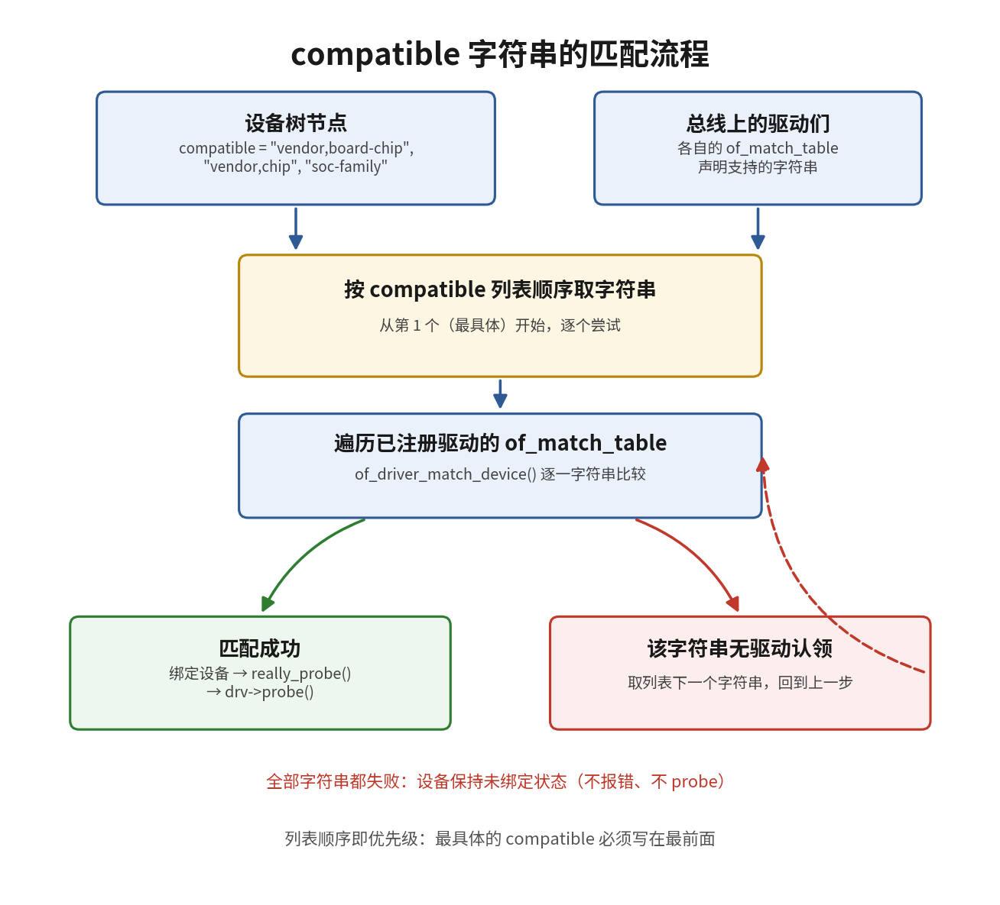

# 11.4.1 compatible匹配原理

> 所属：第11章 设备模型 > 11.4 设备树匹配机制
> 
> 难度：[E] | 预计阅读时间：12分钟

## <span class="blue"> 本节导读

11.3 节解决了主线的两端：设备树节点经 `of_platform_populate()` 变成 platform_device，驱动经 `platform_driver_register()` 挂上总线。中间缺的一环是配对——内核凭什么把某个设备节点交给某个驱动。凭据就是每个设备树节点里的 `compatible` 属性：一个字符串列表，声明该节点兼容哪些硬件型号。本节处于"设备树节点→匹配→probe"主线的匹配环节。<BR>
本节覆盖：compatible 属性的语义与列表顺序规则、驱动侧 `of_match_table` 的组织、内核匹配函数的评分机制、匹配失败的常见原因与排查手段。

---

## <span class="blue"> compatible：从特定到通用的候选名单 [E]

`compatible` 是设备树节点中声明硬件身份的属性，取值是一个或多个字符串，格式约定为 `"厂商,型号"`。一个真实的 I2C 温度传感器节点：

```dts
/* tmp102 传感器节点：compatible 是字符串列表 */
temp_sensor@48 {
    compatible = "ti,tmp102", "ti,tmp101";
    reg = <0x48>;
};
```

列表的顺序有严格语义：**从左到右是从特定到通用**。第一个字符串 `"ti,tmp102"` 精确描述当前硬件；第二个 `"ti,tmp101"` 是回退（fallback）项，表示该硬件寄存器接口与 tmp101 兼容，系统中即使没有 tmp102 的专用驱动，也可以由 tmp101 驱动以兼容模式接管。这个"most specific first"约定来自 Devicetree Specification，是内核匹配机制设计的前提，不是书写习惯。

## <span class="blue"> of_match_table：驱动登记的支持名单 [E]

驱动侧对应的数据是 `of_match_table`。内核为设备树匹配定义了结构体 `struct of_device_id`，每个条目描述驱动能支持的一种设备；驱动把若干条目组成数组，挂到 `struct device_driver` 的 `of_match_table` 字段上：

```c
/* tmp102 驱动的匹配表 */
static const struct of_device_id tmp102_of_match[] = {
    { .compatible = "ti,tmp102" },
    { .compatible = "ti,tmp101" },
    { .compatible = "ti,tmp100" },
    { },  /* 空哨兵：内核以此判定表尾，不可省略 */
};
MODULE_DEVICE_TABLE(of, tmp102_of_match);

static struct i2c_driver tmp102_driver = {
    .driver = {
        .name = "tmp102",
        .of_match_table = tmp102_of_match,
    },
    .probe = tmp102_probe,
};
```

末尾的空条目 `{}` 不是装饰。内核遍历这张表时以"全字段为零"作为终止条件，漏掉空哨兵会导致越界读取，匹配结果不可预期。

## <span class="blue"> 匹配由评分决定：节点的顺序压过驱动的顺序 [E]

匹配的核心函数是 `of_match_node()`（`drivers/of/base.c`）。它的行为常被描述成"双重循环，第一个对上的就用"，这个描述不准确。实际实现分两步：

1. 对驱动表中的每个条目，内核拿条目的 compatible 字符串去设备节点的 compatible 列表里逐项比较（`of_device_is_compatible()`），命中节点列表第 `index` 项时记一个得分，**index 越小得分越高**
2. 遍历完整个驱动表后，返回得分最高的那个条目

```c
/* of_match_node() 评分逻辑（基于内核源码简化） */
const struct of_device_id *__of_match_node(
    const struct of_device_id *matches,
    const struct device_node *node)
{
    const struct of_device_id *best_match = NULL;
    int best_score = 0;

    for (; matches->name[0] || matches->type[0] ||
           matches->compatible[0]; matches++) {
        /* 命中节点 compatible 列表第 index 项时，
           得分随 index 增大而降低 */
        int score = __of_device_is_compatible(node,
                        matches->compatible, ...);
        if (score > best_score) {
            best_match = matches;
            best_score = score;
        }
    }
    return best_match;  /* 返回最高分条目，而非第一个命中 */
}
```

这套评分规则的实际效果：**设备节点 compatible 列表的顺序主导匹配结果**。假设节点写的是 `"ti,tmp102", "ti,tmp101"`，而驱动表里 `"ti,tmp101"` 排在 `"ti,tmp102"` 前面，最终返回的仍是 tmp102 条目——因为它命中了节点列表中更靠前（更具体）的字符串。驱动表内的顺序只在两个条目命中节点同一字符串时充当平局裁决。

字符串比较本身有两点与直觉不同：

- **不区分大小写**：比较宏 `of_compat_cmp` 默认就是 `strcasecmp`（`include/linux/of.h:884`），`"TI,tmp102"` 与 `"ti,tmp102"` 在内核看来相同。但绑定规范要求 compatible 全小写，混合大小写会在 dt-schema 校验（11.4.3 节）阶段被拦下
- **通配符 `*` 已退场**：v6.6 的 `of_compat_cmp` 不含通配逻辑，ARM/RISC-V 驱动表里写 `.compatible = "*"` 不会命中任何节点；`*` 只在覆写了 `of_compat_cmp` 的架构（SPARC）上残留。`modinfo` 里别名字符串末尾的 `*`（如 `of:N*T*Cvendor,device*`）是 modprobe 层的通配，属于模块自动加载机制（11.4.2），与内核匹配层无关

> 💡 尾部空格、`-` 与 `_` 混用、厂商前缀拼错（`"ti,tmp102"` 写成 `"ti.tmp102"`）这类差异不在通配和大小写规则的覆盖范围内，逐字节不同就是匹配失败，且内核不会报任何错——设备安静地留在未绑定状态。




从设备树节点到 probe 的完整链路按序经过：DTB 解析生成 `device_node` → `of_platform_populate()` 创建 platform_device → 驱动注册后总线回调 match → `of_match_device()` 取设备节点并调用 `of_match_node()` → 返回非空则总线调 `probe()`。匹配失败时设备节点和 platform_device 依然存在，只是永远等不到 probe。

## <span class="blue"> 匹配失败的排查路径 [E]

匹配失败不 panic、不报错，这是它难查的原因。按以下顺序定位：

```bash
# 1. 确认内核实际看到的 compatible（以运行时为准，不以 dts 源文件为准）
cat /proc/device-tree/soc/i2c@*/temp_sensor@48/compatible
ti,tmp102ti,tmp101        # 多字符串以 \0 分隔，显示时连在一起

# 2. 确认设备是否已绑定驱动：有 driver 符号链接即已绑定
ls /sys/bus/i2c/devices/0-0048/driver

# 3. 确认驱动是否已注册到总线
ls /sys/bus/i2c/drivers/tmp102/
```

第 1 步读出的字符串与驱动表条目逐字节核对，能覆盖绝大多数"明明写了却匹配不上"的问题。若字符串一致仍不绑定，查驱动是否真的注册成功（模块是否加载、`module_init` 是否执行），这一步已超出匹配环节，进入 11.3.5 节的 probe 排查范围。

> ⚠️ 修改设备树的 compatible 后必须同步核对驱动 `of_match_table`。单侧修改会让原有匹配关系静默失效，且重新编译 DTB 后记得确认 bootloader 加载的确实是新文件——用第 1 步的运行时读数验证，不看源文件。

---

## <span class="blue"> 本节总结

| 概念 | 核心要点 | 自查操作 |
|------|---------|---------|
| compatible 列表 | 从特定到通用排列，首项精确、末项兜底 | `cat /proc/device-tree/.../compatible` |
| of_device_id 表 | 驱动声明的支持名单，空哨兵结尾 | 检查驱动源码表尾是否有 `{}` |
| of_match_node | 评分制：命中节点列表越靠前的字符串得分越高 | 驱动表顺序不决定结果，节点顺序决定 |
| 字符串比较 | 不区分大小写，支持 `*` 通配，不容错拼写差异 | 与绑定规范对照核对拼写 |
| 匹配失败表现 | 设备存在但无 driver 链接，无报错无 panic | `ls /sys/bus/<bus>/devices/<dev>/driver` |

---

## <span class="blue"> 下一步

匹配规则清楚了，下一个问题是匹配表本身怎么写、怎么被系统用上：`MODULE_DEVICE_TABLE` 与模块自动加载（modalias）之间是什么关系，需要同时支持 ACPI 平台时表怎么组织。下一节（11.4.2）展开 `of_match_table` 的两种组织方式。

---

## <span class="blue"> 延伸阅读

- Devicetree Specification, "compatible" 属性定义（devicetree.org）
- 内核源码 `drivers/of/base.c`：`of_match_node()`、`__of_device_is_compatible()`、`of_compat_cmp()`
- 内核文档 `Documentation/devicetree/usage-model.rst`
