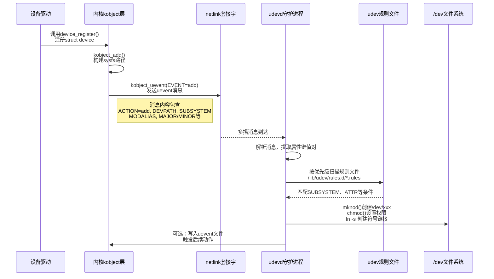

# 11.4.2 uevent生命周期

> 所属章节：第11章 设备驱动进阶话题 > 11.4 驱动与设备模型
> 难度：[I→M] | 预计阅读时间：15分钟

## 本节导读
本节带你走完一个uevent的完整生命周期——从内核里的kobject喊出"我来了"，到用户空间的udevd接到消息、翻规则手册、最终把/dev下的设备节点给你安排得明明白白。学完后，你能画出uevent的时序图，也能读懂udev规则文件里那些看似古怪的匹配语法。

---

## 知识点156：uevent全链路——从内核喊话到udev干活 [I→M] ~1200字

### 一场"内核广播→用户空间响应"的接力赛

想象你搬进一个新小区（系统启动），每家装完宽带（设备注册完成）都要去物业登记。物业有个大喇叭（netlink套接字），哪家登记完就喊一嗓子："3栋502装宽带啦！"小区里的维修队（udevd）一直在值班室守着，听到广播就翻手里的小册子（规则文件）："3栋502→电信的→给用户装光猫、贴标签、开通账号。"这套流程跑下来，你家才能正常上网。

uevent的生命周期就是这套流程的翻版。它的本质是一套**内核→用户空间的异步通知机制**，让udev（或者mdev、systemd-udevd）知道"硬件世界发生了啥"，进而在用户空间做相应动作。

### 四步走完uevent生命周期



[图1：uevent生命周期时序图]

**第一步：设备注册**——驱动调用`device_register()`，内核把`struct device`挂到总线上，同时创建对应的sysfs目录（`/sys/devices/...`）。这一步和uevent还没直接关系，但它是导火索。

**第二步：kobject_uevent发射**——`device_register()`最终会调到`kobject_uevent()`，内核通过netlink套接字向用户空间广播一条消息。消息长这样：

```
ACTION=add
DEVPATH=/devices/platform/soc/2100000.bus/2198000.serial
SUBSYSTEM=tty
MAJOR=4
MINOR=64
MODALIAS=of:NserialT<NULL>Clinux,serial
```

这里面每一行都是**键值对**，udevd拿到后就能知道"这是个新增设备、TTY子系统、主设备号4、次设备号64"。

**第三步：udevd监听与规则匹配**——udevd一开机就在后台`recvmsg()`等着。收到消息后，它会把这些键值对铺开，然后去`/lib/udev/rules.d/`和`/etc/udev/rules.d/`里翻规则文件。规则文件按数字前缀排序，数字小的先匹配。

一条典型的规则长这样：

```bash
# 代码1：udev规则示例——给串口设备创建符号链接
KERNEL=="ttyS[0-9]*", SUBSYSTEM=="tty", SYMLINK+="serial%n", MODE="0666", GROUP="dialout"
```

匹配条件在左边（`KERNEL==`、`SUBSYSTEM==`），执行动作在右边（`SYMLINK+=`、`MODE=`）。

常见的**匹配条件**：

| 匹配键 | 含义 | 示例 |
|--------|------|------|
| `KERNEL` | 设备在内核里的名字 | `KERNEL=="ttyS0"` |
| `SUBSYSTEM` | 所属子系统 | `SUBSYSTEM=="block"` |
| `ATTR{file}` | sysfs属性文件内容 | `ATTR{vendor}=="0x1234"` |
| `ENV{key}` | 环境变量/uevent消息中的键 | `ENV{DEVTYPE}=="partition"` |
| `PROGRAM` | 执行外部程序，按返回码匹配 | `PROGRAM=="/lib/udev/check-it %k"` |

常见的**执行动作**：

| 动作键 | 含义 | 示例 |
|--------|------|------|
| `SYMLINK+=` | 创建符号链接（+=表示追加） | `SYMLINK+="disk/by-id/xxx"` |
| `MODE=` | 设置设备节点权限 | `MODE="0660"` |
| `OWNER=` | 设置设备属主 | `OWNER="root"` |
| `GROUP=` | 设置设备属组 | `GROUP="disk"` |
| `RUN+=` | 执行外部程序或脚本 | `RUN+="/sbin/my-script"` |
| `NAME=` | 指定/dev下的节点名 | `NAME="mydev"` |

🔴 **陷阱**：很多新手第一次看udev规则，把`==`（匹配比较）和`=`（赋值）搞混。规则左边用`==`表示"是否等于"，右边用`=`或`+=`表示"设置值"。写成`KERNEL="ttyS0"`是赋值语法，放在匹配段里会匹配失败。

💡 **提示**：调试udev规则的神器是`udevadm`。收到设备事件但没按预期执行？跑下面这条命令看udevd到底在干啥：

```bash
# 代码2：监控uevent并查看规则匹配详情
$ udevadm monitor --kernel --udev         # 实时看内核→udev的消息流
$ udevadm test /sys/class/tty/ttyS0       # 模拟规则匹配过程，打印调试信息
$ udevadm info --attribute-walk --path=/sys/class/tty/ttyS0   # 查看设备所有可用属性
```

**第四步：执行规则**——匹配成功后，udevd按规则里的动作集干活：创建设备节点、改权限、建符号链接、跑外部脚本。全部完成后，这个uevent就算处理完毕。

⚠️ **注意**：规则是按顺序匹配的，但默认不会"匹配一条就停"——除非你用`GOTO`跳转或者`OPTIONS+="last_rule"`。所以同一个设备可能被多条规则处理，前面的`SYMLINK+=`和后面的`MODE=`可能叠加生效。

---

## 知识点157：ACTION类型与/dev节点的"真凶" [I] ~800字

### uevent的四种"情绪"

内核发uevent不是只有"设备来了"这一种。`ACTION=`字段有四种常见值，覆盖设备全生命周期：

| ACTION值 | 触发时机 | udevd的典型响应 |
|----------|---------|----------------|
| `add` | 新设备注册到内核（`device_register()`） | 创建/dev节点、建符号链接、设权限 |
| `remove` | 设备注销（`device_unregister()`） | 删除/dev节点、清理符号链接 |
| `change` | 设备状态变化（分区表重读、电池电量变化等） | 更新属性或触发扫描脚本 |
| `move` | 设备在sysfs中改名或路径变更 | 更新符号链接指向 |

`add`和`remove`对应热插拔的"来"和"走"。`change`容易被忽略——`fdisk`改完分区表后内核发`change`，udevd收到重新扫描分区，这就是`change`的实际用途。

### /dev下的设备节点，到底是谁创建的？

这里有个**很多人搞反的知识点**：/dev/下的设备节点，**不是驱动创建的**，而是**udevd创建的**。

驱动只做一件事：调用`alloc_chrdev_region()`或`register_chrdev()`向内核申请主次设备号，把`file_operations`挂到字符设备表。但`/dev/`目录下**空空如也**。驱动在运行在内核态，没有文件系统权限，不会也不能直接调用`mknod()`。

真正流程是：驱动注册→内核发`ACTION=add`的uevent（带`MAJOR=`和`MINOR=`）→udevd匹配规则→按`KERNEL=`名字在/dev下调用`mknod()`创建节点。udevd是内核设备号和用户空间之间的"翻译官"。

📌 **验证实验**：自己把udevd停掉再加载驱动，`/sys/class/`下有条目，但`/dev/`下空空如也。

```bash
# 代码3：验证/dev节点由udev创建（请在测试环境执行！）
$ systemctl stop systemd-udevd.socket systemd-udevd.service
$ modprobe dummy_driver
$ ls /sys/class/dummy_class/        # 有sysfs条目
$ ls /dev/dummy*                    # /dev下没有！
$ systemctl start systemd-udevd     # 重启udev后节点出现
```

💡 **提示**：驱动加载了但/dev下没文件？先查udevd有没有跑，再查规则匹没匹配上，最后看uevent里的设备号对不对。排查方向是`udevadm test`，不是盯着驱动的`printk`。

---

## 本节总结

| 概念 | 核心要点 | 自查操作 |
|------|---------|---------|
| uevent四步链路 | 设备注册→kobject_uevent发netlink→udevd监听→规则匹配→执行动作 | `udevadm monitor --kernel` 观察消息流 |
| udev规则匹配 | 用`SUBSYSTEM`、`ATTR`、`KERNEL`等条件筛选设备 | `udevadm info --attribute-walk` 看可用属性 |
| udev执行动作 | `SYMLINK+=`、`MODE=`、`RUN+=`等控制节点名/权限/行为 | 读`/lib/udev/rules.d/50-udev-default.rules` |
| ACTION类型 | add/remove/change/move 对应设备生命周期的不同阶段 | `udevadm monitor` 拔插设备观察ACTION值 |
| /dev节点归属 | 驱动只注册设备号，udevd根据uevent创建设备节点 | 停掉udev加载驱动，验证/dev为空 |

---

## 下一步
你已经搞懂了uevent从内核到用户空间的全流程，也知道了udev规则怎么匹配、怎么干活。下一节（11.5）我们将聊一个和uevent密切相关的话题——`sysfs`与`procfs`，看看这两个"内核信息出口"是怎么被驱动和工具链共同使用的。

---

## 配套资源

### 表格清单
- 表1：udev常见匹配条件键值表
- 表2：udev常见执行动作键值表
- 表3：uevent ACTION类型表
- 表4：本节总结自查表

### 图示清单
- 图1：uevent生命周期时序图 [mermaid sequenceDiagram]

### 代码清单
- 代码1：udev规则示例（串口设备创建符号链接）
- 代码2：`udevadm monitor`与`udevadm test`调试命令
- 代码3：停掉udev验证/dev节点归属的实验步骤
