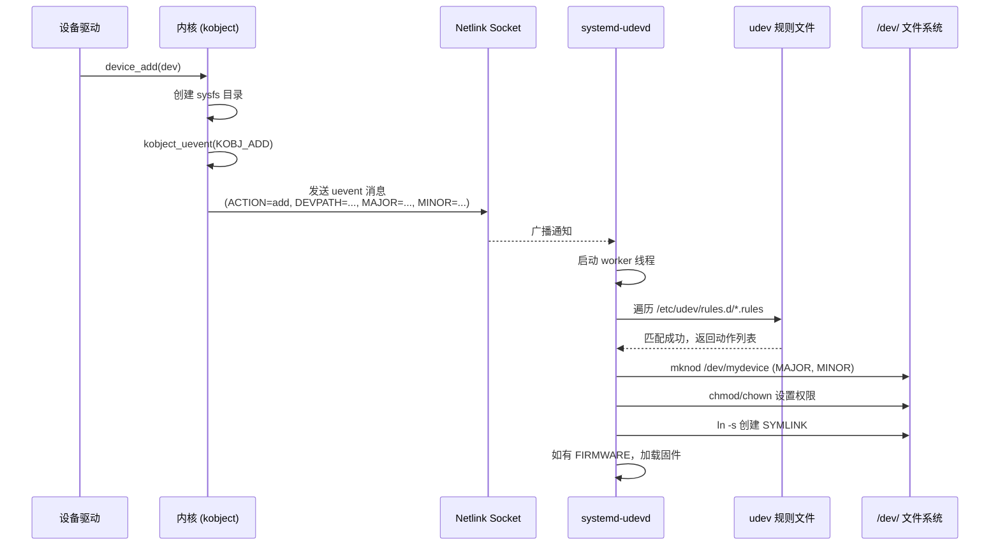

### 11.4.2 uevent 生命周期

**本节导读**：设备在内核里注册了，但 `/dev/` 下的节点是怎么冒出来的？本节我们一起追踪从 `device_add()` 到 `/dev/` 出现设备节点的完整链路。学完你将理解 uevent 的全生命周期，掌握 udev 规则的基本写法和调试手段，遇到设备节点不出现的问题知道从哪查。

---

你写好了一个字符设备驱动，`register_chrdev()` 和 `device_add()` 都成功了，`/sys/class/` 下面也能看到对应的 sysfs 目录。但跑到 `/dev/` 下一瞅——空的。设备节点呢？

这就是 uevent 机制要回答的问题。说白了，**内核只负责往 sysfs 里放东西，`/dev/` 下的节点是用户空间的 udevd 守护进程听命行事创建的**。整个流程分四步走，我们一步一步看。

---

#### 第一步：内核发出" births 通知" —— device_add() 触发 kobject_uevent()

当驱动调用 `device_add()` 把设备注册进内核时，代码路径会走到 `kobject_uevent()`（内部调 `kobject_uevent_env()`）。这个函数的干的活很简单：**往一个 netlink 广播地址发送一条消息，通知用户空间"有个新设备诞生了"**。

```c
/* drivers/base/core.c */
int device_add(struct device *dev)
{
    /* ... 前面一堆 sysfs 目录创建 ... */

    kobject_uevent(&dev->kobj, KOBJ_ADD);  /* ← 就是这一行 */

    /* ... */
}
```

`kobject_uevent()` 发送的 netlink 消息本质上是一个键值对序列，看起来像这样：

```
ACTION=add
DEVPATH=/devices/platform/mydevice
SUBSYSTEM=platform
MAJOR=240
MINOR=0
SEQNUM=1234
```

🔴 **危险**：如果你在内核里调了 `device_add()` 但设备节点没出现，第一个要排查的就是这条 netlink 消息到底发出去没有。怎么排查？后面会说。

💡 **提示**：`KOBJ_ADD` 只是其中一种 action。还有 `KOBJ_REMOVE`（设备移除）、`KOBJ_CHANGE`（设备属性变化）、`KOBJ_ONLINE`/`KOBJ_OFFLINE` 等。对应到 netlink 消息里的 `ACTION=` 字段。

---

#### 第二步：udevd 监听 —— systemd-udevd 通过 netlink socket 接收 uevent

用户空间里，`systemd-udevd`（或较老系统上的独立 `udevd`）在启动时会创建一个 netlink socket，专门监听内核发出来的这些" births 通知"。

```
┌─────────────┐     netlink (NETLINK_KOBJECT_UEVENT)     ┌───────────────┐
│   内核空间   │  ────────────────────────────────────►   │ systemd-udevd │
│             │                                          │ (用户空间守护)  │
└─────────────┘                                          └───────────────┘
```

udevd 收到消息后，会启动一个 worker 线程来处理这条 uevent。为什么要单独线程？因为规则匹配和执行动作可能很慢（比如要加载固件、跑外部脚本），不能让主监听线程阻塞。

⚠️ **陷阱**：如果系统里同时跑着两个 uevent 监听器（比如旧的 `udevd` 和新的 `systemd-udevd`），会出现竞争条件。两者都可能去创建设备节点，结果一团乱。确保只运行一个 uevent 处理守护进程。

---

#### 第三步：规则匹配 —— udevd 遍历规则文件找"对症药方"

udevd 收到 uevent 后，会按照规则目录的顺序遍历所有规则文件：

```
/etc/udev/rules.d/
├── 50-udev-default.rules      ← 系统默认规则
├── 60-input.rules
├── 70-persistent-net.rules    ← 网卡命名持久化规则
├── 80-drivers.rules
├── 99-local.rules             ← ← ← 你自己的规则放这
└── ...
```

规则文件名以数字开头，**数字小的先执行，数字大的后执行**（`xx-name.rules`，`xx` 是优先级）。

一条 udev 规则的基本格式：

```
匹配条件1, 匹配条件2, ... 动作1, 动作2, ...
```

举个例子，给某个字符设备设置权限和创建符号链接：

```
SUBSYSTEM=="platform", KERNEL=="mydevice", MODE="0666", SYMLINK+="mydev"
```

这条规则的意思很直白：

| 字段 | 含义 | 示例值 |
|:---|:---|:---|
| `SUBSYSTEM==` | 匹配子系统 | `"platform"` |
| `KERNEL==` | 匹配设备名 | `"mydevice"` |
| `MODE=` | 设置设备节点权限 | `"0666"` |
| `SYMLINK+=` | 额外创建符号链接 | `"mydev"` |

常见的匹配键和操作键：

| 匹配键 | 说明 |
|:---|:---|
| `KERNEL==` | 匹配设备名（`dev->kobject.name`） |
| `SUBSYSTEM==` | 匹配子系统 |
| `DRIVER==` | 匹配绑定的驱动 |
| `ATTR{file}==` | 匹配 sysfs 中某个属性文件的值 |
| `ENV{key}==` | 匹配环境变量 |

| 操作键 | 说明 |
|:---|:---|
| `MODE=` | 设置设备节点权限 |
| `OWNER=` / `GROUP=` | 设置属主/属组 |
| `SYMLINK+=` | 创建额外符号链接 |
| `RUN+=` | 执行外部程序 |
| `TAG+=` | 打上标签（systemd 等消费） |

💡 **提示**：`==` 是匹配，`=` 是赋值，`+=` 是追加。这三个别搞混了。`==` 用在条件部分，`=` 和 `+=` 用在动作部分。

⚠️ **陷阱**：写规则时最容易犯的错是匹配条件写太松。比如 `SUBSYSTEM=="input"` 会匹配所有输入设备，可能误伤。建议多加几个条件收窄范围，比如 `SUBSYSTEM=="input", ATTR{name}=="my touch"`。

---

#### 第四步：执行动作 —— 创建节点、设权限、加载固件

规则匹配成功之后，udevd 开始干活。具体做什么取决于规则里定义的动作：

```
┌─────────────────────────────────────────────┐
│             systemd-udevd worker             │
│                                              │
│  1. 根据 MAJOR/MINOR 创建 /dev/ 下设备节点    │
│  2. 应用 MODE/OWNER/GROUP 权限设置           │
│  3. 创建 SYMLINK 中指定的符号链接            │
│  4. 如有 FIRMWARE 请求，通过 sysfs 加载固件  │
│  5. 执行 RUN 中指定的外部命令                │
│                                              │
└─────────────────────────────────────────────┘
```

特别说一下固件加载。某些设备（WiFi 芯片、FPGA 等）需要外部固件才能工作。驱动调用 `request_firmware()` 时，内核会发一条带 `ACTION=add, FIRMWARE=xxx.bin` 的 uevent。udevd 收到后从 `/lib/firmware/` 目录找到对应的固件文件，通过 sysfs 接口写到设备里。

完整的生命周期时序图如下：



---

#### 实战调试：udevadm 是你的好伙伴

uevent 出了问题怎么查？`udevadm` 这个工具你必须会。

**实时监控 uevent**：

```bash
$ udevadm monitor
monitor will print the received events for:
UDEV - the event which udev sends out after rule processing
KERNEL - the kernel uevent

KERNEL[1234.567] add    /devices/platform/mydevice (platform)
UDEV  [1234.589] add    /devices/platform/mydevice (platform)
```

左侧 `KERNEL` 行表示内核发出的原始 uevent，右侧 `UDEV` 行表示 udevd 处理后的结果。**如果只有 KERNEL 没有 UDEV，说明 udevd 没处理这条事件**——可能是守护进程没起来，也可能是规则里写了 `OPTIONS+="ignore_device"`。

**查看某个 sysfs 设备匹配了哪些规则**：

```bash
$ udevadm info /sys/class/tty/ttyS0
P: /devices/platform/40100000.serial/tty/ttyS0
N: ttyS0
E: DEVNAME=/dev/ttyS0
E: SUBSYSTEM=tty
E: MAJOR=4
E: MINOR=64
```

这条命令会输出设备的完整 udev 属性。你写规则时不知道有哪些匹配键可用？先用 `udevadm info` 看看，它列出的 `E:`（环境变量）和 `P:`（devpath）都可以拿来当匹配条件。

**测试规则是否匹配（不实际执行）**：

```bash
$ udevadm test /sys/devices/platform/mydevice
```

这条命令会模拟 udevd 处理某个设备的完整流程，把匹配到的规则和将要执行的动作都打印出来。调试规则时这招很管用，**不用真的插拔设备**就能看到规则效果。

💡 **提示**：还有一个更狠的——`udevadm control --log-priority=debug` 可以让 udevd 进入调试模式，日志里会记录每一条规则的匹配细节。查完记得关，不然日志会刷屏。

---

#### 一个常见 bug 场景

假设你写了一个 platform 驱动，加载后 `/sys/class/myclass/mydevice` 出现了，但 `/dev/mydevice` 始终不见。

排查清单：

1. `udevadm monitor` 有输出吗？没有 → 检查 `device_add()` 是否真被调到了，或者 netlink 被谁占用了
2. `udevadm info /sys/class/myclass/mydevice` 有 `MAJOR`/`MINOR` 吗？没有 → 驱动里没调 `cdev_add()` 或 `alloc_chrdev_region()` 失败
3. 有规则文件匹配这个设备吗？`ls /etc/udev/rules.d/` 看看，或者 `udevadm test` 跑一下
4. 规则匹配了但权限不够创建节点？检查 udevd 的运行权限

说实话，90% 的"设备节点没出来"问题，排查到第二步就解决了——驱动里没有正确注册字符设备号。

---

#### 本节总结

| 编号 | 知识点 | 说明 |
|:---|:---|:---|
| **知识点145 [I][M]** | uevent 生命周期 | 从内核发通知到 `/dev/` 出现节点的完整四步链路 |
| 145.1 | 设备注册发通知 | `device_add()` → `kobject_uevent(KOBJ_ADD)` 发送 netlink 消息 |
| 145.2 | udevd 监听接收 | `systemd-udevd` 通过 netlink socket 接收 uevent，派 worker 处理 |
| 145.3 | 规则匹配 | 遍历 `/etc/udev/rules.d/` 下的规则文件，按优先级匹配条件 |
| 145.4 | 执行动作 | `mknod` 创建设备节点、`MODE` 设权限、`SYMLINK` 创建链接、`FIRMWARE` 加载固件 |
| 145.5 | 调试工具 | `udevadm monitor` 实时监控、`udevadm info` 查看属性、`udevadm test` 测试规则 |

---

#### 下一步

uevent 的生命周期我们理清楚了——内核发通知，udevd 接收并处理。但设备节点创建只是 udev 能做的冰山一角。下一节我们将深入 **11.5.1 udev 规则高级用法**，看看自定义规则、持久化命名、以及嵌入式系统中精简 udev 的实战技巧。
