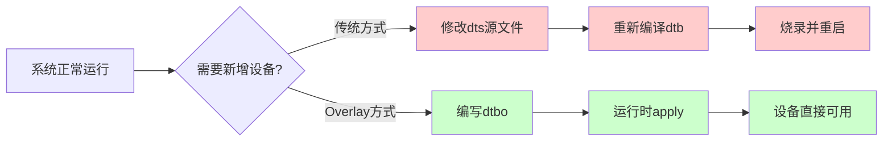

# 11.5.1 为什么需要overlay

> 所属章节：第11章 设备驱动进阶话题 > 11.5 设备树Overlay（DTO）
> 难度：[E] | 预计阅读时间：12分钟

## 本节导读
本节带你理解设备树Overlay（DTO）存在的意义——为什么已经有了完整的设备树，还需要"打补丁"式的动态修改？学完后，你能举出三个以上适合用overlay的真实场景，并搞清楚overlay和重新编译dtb的本质区别。

---

## 知识点160：overlay解决的核心痛点——"我不想为了一点改动就重启" [E] ~800字

### 一场"毕业典礼换场地"的类比

想象你在学校礼堂筹办毕业典礼（系统运行），一切都布置好了。突然校方通知："二楼小礼堂也要同步直播，你赶紧把那边也接上音响和投影。"这时候如果让你把整个毕业典礼停下来、所有人退场、重新从小礼堂开始办一遍——你肯定会疯。

设备树Overlay干的就是**在典礼进行的同时，派人去二楼小礼堂把设备接好**的事。它允许你在系统运行时，动态地向已经加载的设备树"追加"或"修改"节点，而不需要重新编译整个dtb、更不需要重启。

没有这个机制之前，Linux设备树是"一锤定音"的：启动时内核把dtb解析完，设备模型就定型了。哪怕你只是想多启用一个SPI接口、或者给某个LED多加一个gpio描述，都得重新编译dtb、重新烧录、重启——三板斧缺一不可。

### 三个真实场景：没有overlay日子有多苦

**场景一：FPGA动态重配置**

Xilinx Zynq这类芯片，PL侧（FPGA逻辑）可以在运行时加载不同的bitstream。bitstream一换，挂到PS侧的AXI外设可能就完全不同了——地址变了、中断变了、甚至外设数量都变了。没有overlay的话，你必须给每一种FPGA配置准备一个完整的dtb，每次重配FPGA都要重启Linux。overlay让你可以在bitstream加载后，动态把对应的外设节点"叠"到设备树上，驱动跟着就probe起来了。

**场景二：扩展板热插拔**

BeagleBone Black那堆Cape扩展板是典型的例子。用户可能在系统运行时插上"LCD Cape"，需要动态加载一组设备树节点（LCD控制器、触摸屏、背光PWM）。没有overlay，你只能让用户关机、拔卡、换dtb、再启动——体验跟十年前的功能机换电池似的。

**场景三：运行时启用/禁用外设**

嵌入式产品经常需要"配置化"出货：A客户要CAN总线，B客户要第二路I2C。如果这两组引脚是复用的，你就得准备两个dtb镜像。用overlay的话，uboot可以根据板级ID选择加载对应的dtbo文件，启动后再apply——甚至可以做成用户态接口，让应用层在运行时按需启用。

[图1：传统dtb修改 vs Overlay方式对比图]

💡 **提示**：overlay的本质不是"修改"设备树，而是"叠加"。内核先把基板dtb（base dtb）展开成一棵完整的设备树，然后把overlay里的节点和属性**合并**进去。合并规则遵循设备树的覆盖语义：同名节点会合并属性，同名属性会被覆盖。

🔴 **危险**：overlay虽然方便，但它有一个隐性前提——基板dtb里要有对应的`__symbols__`表。这个表记录了各个节点的标签（label）到路径的映射，overlay里的引用（比如`&i2c1`）就是靠它解析的。如果你的基板dtb编译时没有加`-@`选项，overlay apply时会报"symbol not found"，这时候别傻乎乎地改overlay，先去检查基板dtb。

⚠️ **陷阱**：很多初学者以为overlay是"万能补丁"，想怎么打就怎么打。实际上overlay只能**添加或修改**节点/属性，不能**删除**已有节点。如果你想彻底拿掉基板dtb里的某个设备，overlay无能为力——只能重新编译dtb。

---

## 知识点161：overlay的适用边界——它能干啥、不能干啥 [E] ~600字

### 一张表说清楚overlay的脾气

overlay不是银弹，它有自己的舒适区和禁区。下面这张表来自无数工程师踩坑后的血泪总结：

| 场景 | 是否适合overlay | 原因 |
|------|---------------|------|
| 运行时添加新设备（如扩展板） | ✅ 非常适合 | 不需要改动基板dtb，dtbo即插即用 |
| 动态修改引脚复用（pinctrl） | ✅ 适合 | 可以覆盖`pinctrl-0`属性，切换引脚功能 |
| 运行时禁用已有设备 | ❌ 不适合 | overlay无法删除节点，只能把`status`改成`disabled`，但节点还在 |
| 修改boot阶段就需要的参数（如内存大小） | ❌ 不适合 | overlay在运行时apply，此时内存已经初始化完了 |
| 频繁开关同一设备（每秒多次） | ❌ 不适合 | apply/ remove有开销，且驱动probe/remove不是轻量操作 |
| 多份overlay叠加的复杂依赖 | ⚠️ 谨慎使用 | 顺序错了会挂，且调试困难；建议不超过3层叠加 |

### 不能滥用overlay的三个硬理由

**第一，它解决不了启动阶段的问题。** 像`memory`节点、`chosen`里的`bootargs`这类启动早期就必须确定的信息，overlay根本来不及介入。别想着用overlay动态扩内存——那是在挑战内核启动流程的物理极限。

**第二，remove操作比apply凶险得多。** apply只是往设备树上加节点，驱动跟着probe，顺风顺水。但remove（卸载overlay）时，内核要调用驱动的`remove()`回调、释放资源、把设备节点从sysfs里拆掉。如果你的驱动写得不规范（比如`remove()`里漏了`cancel_delayed_work_sync()`），卸载overlay直接给你来个oops。所以生产环境里，很多团队只敢apply不敢remove。

**第三，调试体验一言难尽。** 设备树本身的语法错误在编译阶段就能抓出来，但overlay的问题往往要到运行时才能暴露：`symbol not found`、`fragment target not found`、驱动probe失败……这些错误信息散落在`dmesg`里，排查起来比直接改dtb麻烦一个数量级。

⚠️ **陷阱**：uboot也支持overlay（`fdt apply`命令），但uboot里的设备树overlay语法和Linux内核里的configfs接口略有不同。uboot用的是直接操作fdt binary的方式，而内核里有`configfs`（`/sys/kernel/config/device-tree/overlays/`）和`libfdt`两套机制。如果你发现同样的dtbo在uboot里能work、进系统后不行，别慌——先确认两边用的overlay加载工具是不是一回事。

💡 **提示**：有一个简单的判断原则——如果你要改的东西**启动后不会再变**，老老实实重新编译dtb；如果这个东西**可能在运行时有多种形态**，overlay才是你的菜。别把简单的静态配置搞成动态overlay，那纯粹是给自己找事。

---

## 本节总结

| 概念 | 核心要点 | 自查问题 |
|------|---------|---------|
| overlay本质 | 在基板dtb上动态叠加节点/属性，无需重启 | 能说出overlay和传统dtb修改的三步区别吗？ |
| 典型场景 | FPGA重配置、扩展板热插拔、运行时外设切换 | 你手头的项目有没有"为了一点改动就重启"的痛点？ |
| 适用边界 | 适合添加/修改，不适合删除；适合运行时，不适合启动参数 | 能判断出你遇到的场景是否该用overlay吗？ |
| 基板dtb要求 | 必须带`__symbols__`表（编译加`-@`选项） | 你的基板dtb有没有这个表？（`fdtget -l base.dtb`查看） |

---

## 下一步
你已经知道了overlay为什么存在——它本质上是在"设备树编译期确定性"和"运行时灵活性"之间做了折中。下一节（11.5.2）我们将动手写第一个dtbo文件，从语法层面搞清楚fragment、target、`__overlay__`节点到底是怎么回事。

---

## 配套资源

### 表格清单
- 表1：overlay适用/不适用场景对照表
- 表2：本节总结自查表

### 图示清单
- 图1：传统dtb修改 vs Overlay方式对比图 [mermaid流程图]

### 代码清单
- 无（本节为概念讲解，下一节提供dtbo源码）
