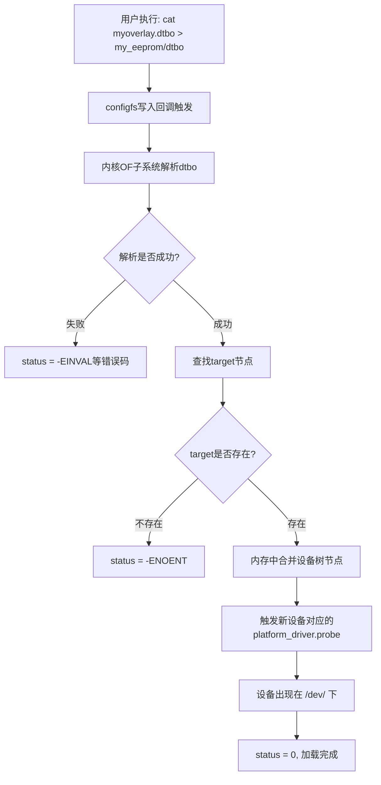

# 11.5.2 dtbo编译与加载

> 所属章节：第11章 Linux设备树深度实战 > 11.5 Overlay动态加载
> 难度：[E→M] | 预计阅读时间：15分钟

## 本节导读
前面你学会了在U-Boot里用`fdt apply`打补丁，但那是在内核启动之前。如果系统已经跑起来了，我想临时加一路SPI、多挂一个传感器，难道要重启？不用。Linux内核支持**运行时动态加载Device Tree Overlay**，不需要重启，设备树在内存里直接"热补丁"。本节就讲两件事：怎么把`.dts`编译成`.dtbo`，以及怎么在不重启的情况下把它塞进内核。

---

## 知识点162：dtbo编译与ConfigFS加载——设备树的"热补丁" [E][M] ~1200字

### 编译dtbo：那个容易忘的`-@`参数

Overlay的源码文件通常叫`.dts`（跟普通设备树一样），但编译出来的产物叫`.dtbo`（Device Tree Blob Overlay）。编译工具还是老熟人`dtc`，但**必须加`-@`参数**，这个参数允许Overlay里存在"未解析的符号引用"——说人话就是，Overlay里引用的主设备树节点（比如`&i2c1`、`&gpio`）在编译时还找不到，`dtc`不会因此报错。

```bash
# 代码1：编译dtbo（-@ 参数千万别忘！）
$ dtc -@ -O dtb -o myoverlay.dtbo myoverlay.dts
```

不加`-@`会怎样？`dtc`会直接报错，提示类似`Label i2c1 not found`这种信息。很多新手在这里卡半天，明明`.dts`语法看着没问题，就是编不过。记住：**只要Overlay里用了`&xxx`这种引用，就必须加`-@`**。

一个典型的Overlay源码长这样：

```dts
// 代码2：示例Overlay源码（myoverlay.dts）
/dts-v1/;
/plugin/;          /* 关键：声明这是一个插件式Overlay */

/ {
    fragment@0 {
        target = <&i2c1>;   /* 目标：主设备树里的i2c1节点 */
        __overlay__ {
            status = "okay";
            clock-frequency = <400000>;

            eeprom@50 {
                compatible = "atmel,24c02";
                reg = <0x50>;
            };
        };
    };
};
```

注意第2行的`/plugin/;`，这是Overlay的"身份证"，告诉内核这个dtb不是独立的设备树，而是用来叠加到已有设备树上的补丁。

### ConfigFS：内核留给你的"动态加载后门"

Linux内核从4.x版本开始，提供了一套基于**ConfigFS**的Device Tree Overlay加载机制。ConfigFS是一个虚拟文件系统，跟sysfs类似，但它不是只读的——你可以通过创建目录、写入文件来"配置"内核行为。

设备树Overlay的ConfigFS入口在这里：

```
/sys/kernel/config/device-tree/overlays/
```

这个路径只有在内核启用了`CONFIG_OF_OVERLAY`和`CONFIG_CONFIGFS`之后才会出现。如果你的系统里没有这个目录，先别慌，后面知识点163会讲怎么开配置。

### 加载Overlay：三步搞定

加载过程非常直观，跟"新建文件夹→拷文件"一样简单：

```bash
# 代码3：通过ConfigFS加载dtbo（完整命令序列）

# 第1步：确认configfs已挂载
$ mount | grep configfs
configfs on /sys/kernel/config type configfs (rw,relatime)

# 第2步：进入overlays目录
$ cd /sys/kernel/config/device-tree/overlays/

# 第3步：创建一个目录（名字随便起，建议跟Overlay功能相关）
$ mkdir my_eeprom

# 第4步：把dtbo的二进制内容写进去（关键步骤！）
$ cat /lib/firmware/myoverlay.dtbo > my_eeprom/dtbo

# 第5步：检查是否加载成功
$ ls my_eeprom/
dtbo  status

$ cat my_eeprom/status
0    # 0表示成功，负数表示失败（如-22是EINVAL，参数不对）
```

第4步是**整个流程的核心**。当你把dtbo的内容写到`dtbo`文件里时，内核的OF（Open Firmware）子系统会自动解析这个Overlay，找到它要补丁的目标节点（`fragment@0`里的`target`），然后在内存中把新节点合并进去。合并完成后，对应的platform driver会被触发probe，设备就这么"凭空"出现了。

### 卸载Overlay：rmdir就行

卸载更简单，直接把刚才创建的目录删掉：

```bash
# 代码4：卸载Overlay
$ rmdir /sys/kernel/config/device-tree/overlays/my_eeprom
```

内核会自动做反向操作：把合并进去的节点拆下来，触发对应driver的remove，释放资源。不过这里有个坑：**如果设备当前正在被占用**（比如某个进程打开了`/dev/i2c-1`上的设备文件），卸载可能会失败，`status`文件会显示一个非零的错误码。

### Overlay加载流程全景图



[图1：ConfigFS Overlay加载流程]

这个流程的妙处在于**完全在用户空间完成**。你不需要改内核源码、不需要重新编译内核，甚至不需要重启。写一个`.dts`，编一下，用几行shell命令就能让新设备活起来。做硬件原型验证的时候，这种效率就是救命稻草。

⚠️ **陷阱**：`cat`写入dtbo时，必须用重定向`>`，不能用`cp`命令。`cp`会做mmap等操作，ConfigFS的`dtbo`文件只支持简单的write接口，用`cp`可能报"Invalid argument"。

💡 **提示**：可以把加载命令写成systemd服务或者init脚本，开机自动加载固定的Overlay。有些发行版（如Raspberry Pi OS、Debian）还提供了`/boot/overlays/`目录和`config.txt`自动加载机制，底层走的也是这一套。

---

## 知识点163：内核配置与排坑——不是所有内核都能玩Overlay [E] ~600字

### 必须打开的两个内核开关

Overlay动态加载不是默认开启的，你的内核编译配置里必须同时满足两个条件：

| 配置项 | 作用 | 不开启的后果 |
|--------|------|-------------|
| `CONFIG_OF_OVERLAY=y` | 内核支持设备树Overlay的添加和移除 | `/sys/kernel/config/device-tree/` 目录根本不存在 |
| `CONFIG_CONFIGFS_FS=y` | 启用ConfigFS虚拟文件系统 | 没有configfs，就无法通过文件接口操作Overlay |

检查当前内核是否支持：

```bash
# 代码5：检查内核是否支持Overlay和ConfigFS
$ zgrep CONFIG_OF_OVERLAY /proc/config.gz
CONFIG_OF_OVERLAY=y

$ zgrep CONFIG_CONFIGFS /proc/config.gz
CONFIG_CONFIGFS_FS=y
```

如果输出是`=m`（编译成模块），你需要先`modprobe configfs`加载模块。如果是`=n`，那只能重新编译内核了，这条路绕不过去。

### 挂载configfs

即使内核编译时启用了ConfigFS，也需要在运行时挂载：

```bash
# 代码6：挂载configfs（通常加到/etc/fstab或启动脚本里）
$ mount -t configfs none /sys/kernel/config
```

很多嵌入式发行版的启动脚本已经帮你做了这一步，但如果你是自己裁剪的文件系统，可能会漏掉。挂载成功后，`/sys/kernel/config/`下面会出现一系列子目录，其中`device-tree/overlays/`就是我们操作Overlay的入口。

### 常见错误速查

🔴 **报错：`FATAL ERROR: Couldn't resolve tree node 'i2c1'`**

原因：编译dtbo时忘了加`-@`参数。`dtc`默认要求所有label必须在当前文件中定义，而Overlay引用的`i2c1`在主设备树里。
**解决**：`dtc -@ -O dtbo -o xxx.dtbo xxx.dts`

🔴 **报错：`/sys/kernel/config/device-tree/overlays/` 不存在**

原因1：configfs没挂载。`mount | grep configfs`确认一下。
原因2：内核没开`CONFIG_OF_OVERLAY`。如果是自己编译的内核，去menuconfig里打开它。

🔴 **报错：`write error: Invalid argument` 往dtbo文件写入时**

原因1：dtbo文件本身有语法错误，内核解析失败。
原因2：用了`cp`而不是`cat ... >`，ConfigFS的write接口对文件操作方式敏感。
原因3：Overlay里`target`指定的节点在主设备树中不存在（比如主设备树里`i2c1`被删除了，或者名字拼成了`i2c_1`）。

💡 **提示**：Overlay加载失败时，第一件事看`status`文件里的错误码，第二件事看`dmesg`。内核OF子系统会把详细的解析日志打到内核ring buffer里，比如`OF: overlay: find target node failed`这种信息，能直接告诉你哪一步出了问题。

---

## 本节总结

| 概念 | 核心要点 | 自查操作 |
|------|---------|---------|
| dtbo编译 | `dtc -@ -O dtb -o xxx.dtbo xxx.dts`，`-@`允许未解析引用 | `file myoverlay.dtbo` |
| ConfigFS路径 | `/sys/kernel/config/device-tree/overlays/` | `ls /sys/kernel/config/device-tree/overlays/` |
| 加载步骤 | `mkdir`创建目录 → `cat dtbo >`写入 → 自动合并 | `cat [目录]/status` 看是否为0 |
| 卸载步骤 | `rmdir`对应目录即可 | 确认对应设备节点已消失 |
| 内核依赖 | `CONFIG_OF_OVERLAY=y` + `CONFIG_CONFIGFS_FS=y` + 挂载configfs | `zgrep CONFIG_OF_OVERLAY /proc/config.gz` |
| 写入方式 | 必须用`cat`重定向，不能用`cp` | — |

---

## 下一步

你已经掌握了Overlay从编写`.dts`到编译`.dtbo`，再到通过ConfigFS动态加载的完整链路。下一节（11.5.3）我们将用一个真实案例——给树莓派风格板子动态添加一路I2C EEPROM——把整个流程跑一遍，顺便讲讲Overlay里常用的`__overlay__`、`__symbols__`等进阶语法。

---

## 配套资源

### 表格清单
- 表1：内核Overlay相关配置项说明
- 表2：本节总结自查表

### 图示清单
- 图1：ConfigFS Overlay加载流程 [mermaid图]

### 代码清单
- 代码1：编译dtbo（`dtc -@ -O dtb -o myoverlay.dtbo myoverlay.dts`）
- 代码2：示例Overlay源码（`myoverlay.dts`）
- 代码3：通过ConfigFS加载dtbo完整命令序列
- 代码4：卸载Overlay（`rmdir ...`）
- 代码5：检查内核是否支持Overlay和ConfigFS
- 代码6：挂载configfs
