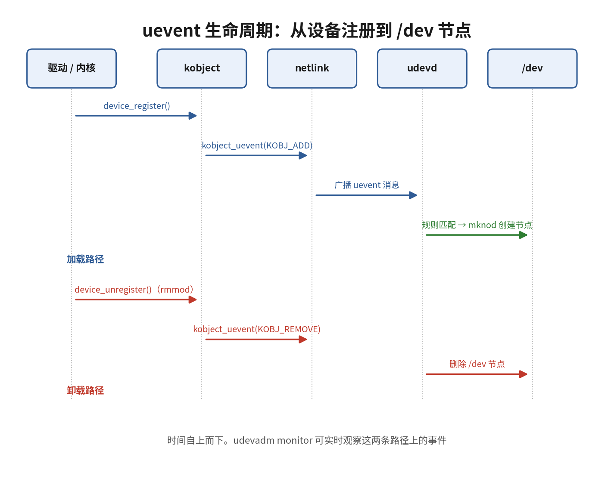

# 11.5.2 uevent生命周期

> 所属：第11章 设备模型 > 11.5 sysfs与uevent
> 
> 难度：[I→E] | 预计阅读时间：15分钟

## <span class="blue"> 本节导读

上一节解决了"设备信息在哪看"，本节进入 11.5 主线的第二步：probe 成功（或设备拔出）的瞬间，内核如何把这个变化通知到用户空间，用户空间又凭什么去创建 `/dev` 节点。承担通知任务的是 uevent——设备模型内置的内核→用户空间异步事件机制。一条 uevent 从发起到被消费，中间经过内核 kobject 层、netlink 广播、用户空间守护进程、规则匹配四段，每一段都有明确的排查手段。<BR>
本节覆盖：uevent 的触发点与消息格式、netlink 广播与 uevent helper 旧机制、ACTION 的四种取值、`/dev` 节点的实际创建者（devtmpfs 与 udev 的分工）。

---

## <span class="blue"> 一条 uevent 的四段旅程 [I→E]

设备注册和注销时，内核会发出一条 uevent，把"发生了什么、发生在哪个设备上"广播出去。整条链路涉及四个参与者，先把名字对上：

- **kobject_uevent()**：kobject 层的事件发射函数，设备注册、注销、状态变化时由驱动核心调用
- **netlink**：内核与用户空间之间的套接字通信机制，设备事件走 `NETLINK_KOBJECT_UEVENT` 这个专用协议族，以组播方式发送，任何打开对应套接字的用户进程都能收到
- **udevd**：用户空间的设备管理守护进程（systemd 体系下为 systemd-udevd），监听 netlink，按规则文件决定每个事件的处理动作
- **`/dev` 节点**：事件的最终产物之一，应用程序 `open()` 设备文件的入口




### 第一段：设备注册

驱动调用 `device_register()`（底层是 `device_add()`），内核把 `struct device` 挂到总线上、在 sysfs 建好目录。`device_add()` 收尾时调用 `kobject_uevent(&dev->kobj, KOBJ_ADD)`，事件就此发出。注销路径对称：`device_del()` 发 `KOBJ_REMOVE`。

### 第二段：组装消息并广播

`kobject_uevent()` 的实际工作在 `kobject_uevent_env()` 里：把事件信息组装成一组 `键=值` 形式的环境变量，经 netlink 组播到用户空间。一条典型的 add 事件：

```text
ACTION=add
DEVPATH=/devices/platform/soc/2198000.serial/tty/ttyS3
SUBSYSTEM=tty
MAJOR=4
MINOR=67
DEVNAME=ttyS3
SEQNUM=1847
```

几个关键字段：`ACTION` 是事件类型，`DEVPATH` 是设备在 sysfs 中的路径，`MAJOR`/`MINOR` 是主次设备号，`SEQNUM` 是全局递增的序号，用户空间可以靠它发现丢消息。事件带 `MODALIAS` 字段时，udevd 还会据此请求加载匹配的驱动模块。

### 第三段：udevd 接收与规则匹配

udevd 启动后常驻监听 netlink，收到事件先解析键值对，再按数字前缀顺序遍历 `/lib/udev/rules.d/` 和 `/etc/udev/rules.d/` 下的规则文件，用 `SUBSYSTEM`、`KERNEL`、`ATTR{}` 等条件判断每条规则是否命中这个设备。规则的完整语法是下一节的主题，先看一条有个直观认识：

```bash
# 给匹配到的串口设备追加符号链接并设置权限
KERNEL=="ttyS[0-9]*", SUBSYSTEM=="tty", SYMLINK+="serial%n", MODE="0666", GROUP="dialout"
```

规则按顺序全部过一遍，默认**命中一条不会停**：后面的规则继续生效，`SYMLINK+=` 这类追加键可以叠加。只有规则里写了 `OPTIONS+="last_rule"` 或用了 `GOTO` 才会提前结束。

### 第四段：执行动作

命中规则的动作集合被执行：创建或调整设备节点、改权限和属主、建符号链接、跑 `RUN+=` 指定的外部程序。到此这条 uevent 处理完毕，`/dev` 下出现了应用程序能打开的文件。

> 💡 整条链路在真实系统上可以直接观察：`udevadm monitor --kernel --udev --property` 同时打印内核发出的原始事件（KERNEL 行）和 udevd 处理完成的事件（UDEV 行），插拔任意 USB 设备就能看到两段各打一条。

### 旧机制：uevent helper 已经退场

netlink 不是一开始就有的通知方式。2.6 早期内核靠 `CONFIG_UEVENT_HELPER`：每产生一条 uevent，内核就 fork 一次 `call_usermodehelper()` 去执行指定程序（历史上是 `/sbin/hotplug`，嵌入式上是 `/sbin/mdev`），事件参数靠环境变量传递。一事件一进程，启动阶段设备集中枚举时，进程风暴足以把小内存系统压垮，内核 Kconfig 帮助文本明确写着"This should not be used today"。该配置项截至 6.x 主线仍然存在（busybox mdev 的热插拔路径还依赖它，见 11.5.3），但新系统不应再启用，netlink + 常驻守护进程是唯一推荐路线。

> ⚠️ 排查"事件没送到"时分清两端：内核侧发没发，`udevadm monitor --kernel` 看不到就可以怀疑驱动没走标准注册路径；用户空间收没收，看 udevd 进程是否在跑、`/proc/sys/kernel/hotplug` 是否被错误设置了 helper（udev 系统里这个文件应为空）。

---

## <span class="blue"> ACTION 的四种取值 [I]

`ACTION=` 字段标记设备处于生命周期的哪一步，常见四种：

| ACTION | 触发时机 | udevd 的典型动作 |
|--------|---------|----------------|
| `add` | 设备注册（`device_add()`） | 建节点、建符号链接、设权限 |
| `remove` | 设备注销（`device_del()`） | 删节点、清理符号链接 |
| `change` | 设备状态变化（分区表重读、电池电量变化） | 重读属性、触发扫描脚本 |
| `move` | 设备在 sysfs 中改名或换父节点 | 更新符号链接指向 |

`change` 最容易被忽略：`fdisk` 写完分区表后内核发的就是 change，udevd 收到后重新扫描分区并补齐 `/dev/sdaN` 节点。写存储相关规则时只盯 `add` 会漏掉这条路径。

---

## <span class="blue"> /dev 节点是谁创建的：devtmpfs 与 udev 的分工 [I→E]

先纠正一个流传很广的说法——"`/dev` 节点是 udevd 创建的"。这句话只在不用 devtmpfs 的系统上成立，而绝大多数现代 Linux 都开着 devtmpfs，真实情况是两层分工。

### 驱动自己只管设备号

驱动注册设备时做的是内核侧簿记：`alloc_chrdev_region()` 申请主次设备号，`cdev_add()` 把 `file_operations` 挂进字符设备表，`device_create()` 在 sysfs 建目录。到这一步 `/dev` 里还什么都没有——驱动运行在内核态，不去碰用户可见的文件系统视图。把设备号变成 `/dev` 下可 `open()` 的文件，是设备模型基础设施和用户空间接力完成的。

### 第一层：devtmpfs，内核直接建节点

devtmpfs 是内核自带的极简设备文件系统（`CONFIG_DEVTMPFS`）：驱动核心为带设备号的设备建 sysfs 目录的同时，也在 devtmpfs 里生成对应节点；`CONFIG_DEVTMPFS_MOUNT` 打开后，挂载根文件系统时 devtmpfs 自动落到 `/dev`。这层完全不需要任何用户空间进程参与，节点用内核默认名字、默认权限（通常 0600）、属主 root。

### 第二层：udev，补齐命名、权限和符号链接

devtmpfs 建的节点只有内核给的默认名字和默认权限。udevd 处理 add 事件时在既有节点上做增量修正：按规则改 `MODE`/`OWNER`/`GROUP`、建 `SYMLINK+=` 别名、执行 `RUN+=` 脚本、按 `MODALIAS` 加载模块。换句话说，**devtmpfs 保证"有节点可用"，udev 保证"节点以期望的名字、权限和别名出现"**。

### 验证实验的分寸

经典验证是停掉 udevd 再加载驱动，观察 `/dev`。开着 devtmpfs 的系统上，节点照样出现，只是规则里定义的符号链接和权限缺失——这恰好证明两层分工；要复现"`/dev` 为空"的老结论，得在没有 devtmpfs（或未自动挂载）的系统上做。动手前先看一眼配置：

```bash
# 确认 devtmpfs 是否启用并自动挂载
grep DEVTMPFS /boot/config-$(uname -r)
cat /proc/mounts | grep devtmpfs
```

> 💡 嵌入式根文件系统里常见三档配置：devtmpfs + udev（功能全）、devtmpfs + mdev（轻量，权限靠 mdev.conf）、裸 devtmpfs（节点固定、无热插拔需求的极简系统）。三档的取舍在 11.5.3 节展开。

---

## <span class="blue"> 本节总结

| 概念 | 核心要点 | 自查操作 |
|------|---------|---------|
| uevent 四段链路 | 设备注册→kobject_uevent 组包→netlink 组播→udevd 匹配执行 | `udevadm monitor --kernel --udev` |
| 消息格式 | `键=值` 环境变量：ACTION/DEVPATH/SUBSYSTEM/MAJOR/MINOR/SEQNUM | 插拔 USB 设备观察输出 |
| uevent helper | 每事件 fork 一个进程的旧机制，已被 netlink 取代，新系统禁用 | `cat /proc/sys/kernel/hotplug` 应为空 |
| ACTION | add/remove/change/move 覆盖设备全生命周期 | `udevadm monitor` 下拔插设备 |
| /dev 节点分工 | devtmpfs 建基础节点，udev 补命名、权限、符号链接 | `grep DEVTMPFS /boot/config-*` |

---

## <span class="blue"> 下一步

链路清楚了，剩下的问题是 udevd 手里的规则文件怎么写：匹配条件有哪些键、`==` 和 `=` 有什么区别、规则不生效时怎么定位。下一节（11.5.3）进入 udev 规则语法与调试实战，并给出嵌入式场景下 mdev 与 udev 的取舍。
