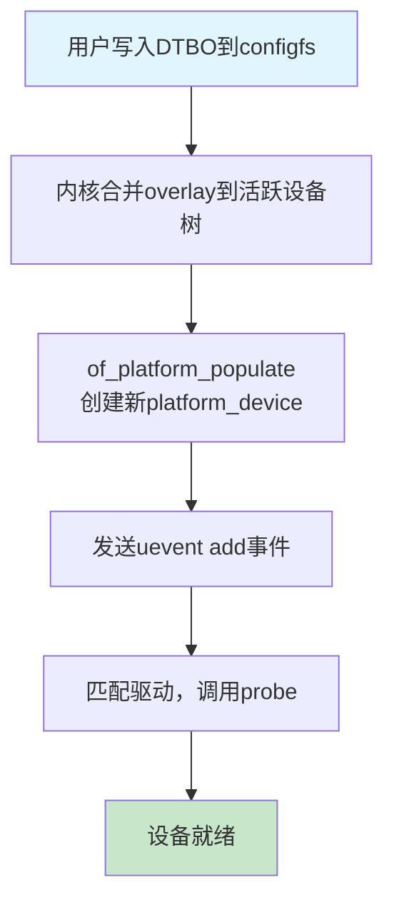

### 11.5.3 overlay的应用与限制

**知识点148 [E]**

**本节导读**

前几节我们了解了overlay的语法和编译方法，但这一机制的真正价值在于**运行时动态应用**。本节我们一起梳理overlay从"加载到生效"的完整链路，并直面它的边界——overlay能做什么、不能做什么，做到心中有数。学完后，你能独立完成overlay的加载调试，也能在遇到"为什么这个overlay没生效"的问题时有排查思路。

---

#### overlay的应用过程

当你通过`configfs`将一个overlay DTBO写入内核时，背后发生了什么呢？整个过程可以拆解为四个步骤：



**第一步：合并设备树**

内核调用`of_overlay_apply()`，将overlay中的节点和属性合并到当前活跃的设备树（live tree）中。这个过程本质上是**树节点的插入与属性覆盖**——overlay里有的节点被添加，已有的属性被新值覆盖。

💡 **提示**：合并发生在内存中的设备树表示上，不会修改原始的`dtb`固件。换句话说，重启后overlay的效果就消失了，这是设计上的选择而非缺陷。

**第二步：创建设备**

合并完成后，内核需要让新节点"活"起来。`of_platform_populate()`会扫描新添加的节点，为每个标记了`compatible`的设备创建对应的`platform_device`实例。这一步是从"静态描述"到"内核对象"的关键转折。

**第三步：触发uevent**

新设备创建后，内核通过`kobject_uevent()`发送`add`事件到用户空间。`udevd`（或`mdev`）监听到这个事件后，可能执行规则脚本、创建`/dev`节点、加载固件等操作。

**第四步：驱动probe**

总线匹配机制将新设备与已注册的驱动进行比对。一旦`compatible`字符串匹配上，驱动的`probe()`函数就被调用。到这里，overlay的使命才算真正完成——硬件被识别、驱动被加载、设备进入可用状态。

整个过程看似简单，但每一步都可能出问题。比如合并阶段语法错误会直接返回`-EINVAL`，创建设备阶段如果内存不足也会失败。

---

#### overlay的限制

overlay虽然强大，但它不是万能的。以下几个限制在实际使用中需要特别注意：

**1. 只能添加或修改，不能删除**

overlay无法删除已存在于基础设备树中的节点或属性。如果你想"禁用"某个设备，唯一的办法是通过`status = "disabled"`来标记它，而不是物理删除。

⚠️ **陷阱**：试图在overlay中用`/delete-node/`或`/delete-property/`对基础设备树生效是无效的——这些操作仅在编译同一文件内的节点时有效。

**2. 核心属性不可修改**

像`#address-cells`、`#size-cells`、`interrupt-parent`这类定义节点解析规则的核心属性，一旦在基础设备树中确定，overlay**不应该**试图修改它们。即使语法上允许，也可能导致子节点解析混乱。

**3. 内存开销**

每应用一个overlay，内核就会分配新的设备树节点和属性内存。这些内存不会被释放（直到重启），频繁加载大量overlay会逐步增加内存占用。

⚠️ **陷阱**：在内存受限的嵌入式系统中，overlay的数量应有所节制。建议将功能相关的修改合并到一个overlay中，而非拆成多个零散的文件。

**4. 没有原子回滚**

如果overlay在第四步（驱动probe）失败，前面的步骤已经不可逆——设备树已经被修改、设备可能已经创建。内核提供了`status`文件来查看状态，但没有一键回滚到加载前的机制。

---

#### 调试方法

overlay没生效时，该从哪里下手？以下几个命令和路径很有用：

```bash
# 查看已加载overlay的状态
cat /sys/kernel/config/device-tree/overlays/*/status

# 导出当前完整的活跃设备树，用dtc反编译查看
dtc -I fs /sys/firmware/devicetree/base -o current.dts

# 查看内核日志中的overlay相关报错
dmesg | grep -i overlay
```

💡 **提示**：`dtc -I fs`是一个被低估的调试利器。它直接从内核的`sysfs`设备树导出当前状态，比`fdtdump`更能反映overlay应用后的真实结果。建议养成"加载overlay后导出验证"的习惯。

如果`status`文件显示`applied`但设备没出现，问题大概率出在第二步之后——检查`dmesg`中是否有`of_platform_populate`或驱动probe相关的错误信息。

---

**本节总结**

| 项目 | 内容 |
|------|------|
| 应用四步 | 合并设备树 → 创建设备 → 触发uevent → 驱动probe |
| 核心API | `of_overlay_apply()` → `of_platform_populate()` → `kobject_uevent()` |
| 限制一 | 不能删除已有节点，只能添加或修改属性 |
| 限制二 | 不能修改`#address-cells`等核心解析属性 |
| 限制三 | 合并后的设备树占用额外内存，不可释放 |
| 限制四 | 无原子回滚，加载失败可能残留中间状态 |
| 状态查看 | `/sys/kernel/config/device-tree/overlays/*/status` |
| 导出验证 | `dtc -I fs /sys/firmware/devicetree/base` |
| 日志排查 | `dmesg \| grep overlay` |

**下一步**

设备树的知识体系我们已经走完了基础语法、编译工具、overlay机制和应用限制。接下来我们将进入实战环节——**11.6 设备树调试与最佳实践**，学习如何在真实项目中定位和解决设备树相关问题，包括启动失败的排查、常见语法错误的诊断方法等。
