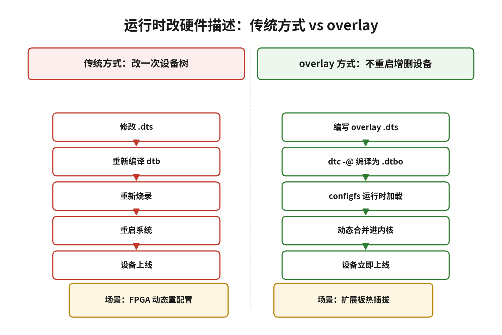

# 11.6.1 为什么需要overlay

> 所属：第11章 设备模型 > 11.6 设备树overlay
> 
> 难度：[I] | 预计阅读时间：12分钟

##  本节导读

11.6 节围绕一条主线展开：如何在不重启系统的前提下修改运行中的设备树。传统流程里，设备树的任何改动都要走"改 dts → 重新编译 dtb → 烧录 → 重启"四步，而 FPGA 动态重配置、扩展板热插拔这类场景要求设备在系统运行时上线，重启不可接受。设备树 overlay（叠加层）就是内核给出的解法：它是一份只描述"改动"的设备树片段，编译产物是 dtbo（Device Tree Blob Overlay），可以在运行时被合并进已有的设备树。本节是这条主线的第一节，回答"为什么需要 overlay"以及它能做什么、不能做什么。 
本节覆盖：传统修改设备树流程的重启代价、overlay 的叠加语义、三个典型应用场景、overlay 的能力边界与使用前提。

---

##  传统设备树是"一次定型"的 [I]

启动阶段，BootLoader 把 dtb 二进制交给内核，内核将其展开成内存中的 `device_node` 树，platform 总线再依据这棵树批量创建 `platform_device`，驱动随后完成匹配与 probe。这个过程结束后，设备树就定型了：哪怕只想多启用一路 SPI、给某个 LED 增加一个 GPIO 描述，也得回到开发机修改 dts、重新编译 dtb、重新烧录、重启板子。

"改 dts → 编译 → 烧录 → 重启"这条链路在开发期可以忍受，但在三类真实场景里走不通。

### 场景一：FPGA 动态重配置

以 Xilinx Zynq 为例，PL 侧（FPGA 逻辑）可以在 Linux 运行时加载不同的 bitstream。bitstream 一换，挂在 PS 侧 AXI 总线上的外设可能完全不同：寄存器地址变了、中断号变了、甚至外设数量都变了。没有 overlay，就得为每一种 FPGA 配置准备一份完整的 dtb，每次重配 FPGA 都要重启 Linux。有了 overlay，bitstream 加载完成后把对应的外设节点以 dtbo 形式叠加进设备树，驱动随即 probe，新外设直接上线。

### 场景二：扩展板热插拔

BeagleBone 的 Cape 扩展板是典型例子。系统运行中插上一块 LCD Cape，内核需要立刻多出一组节点：LCD 控制器、触摸控制器、背光 PWM。没有 overlay，只能关机、换 dtb、再启动，扩展板失去"即插"的意义。

### 场景三：配置化出货

同一块板子，A 客户要 CAN 总线，B 客户要第二路 I2C，而两组功能复用同一批引脚。静态方案要维护两份 dtb 镜像，产线烧录时按订单区分；overlay 方案只需一份基板 dtb，BootLoader 或用户空间按板级配置选择加载对应的 dtbo，甚至可以在运行时按需启用。

> 💡 overlay 的本质不是"修改"设备树，而是"叠加"。内核先把基板 dtb 展开成完整的设备树，再把 overlay 里的节点和属性按设备树覆盖语义合并进去：同名节点合并属性，同名属性取 overlay 中的新值，新节点直接挂到目标位置。

---

##  overlay 的能力边界 [I]

overlay 不是通用补丁机制，它有明确的适用范围：

| 场景 | 是否适合 overlay | 原因 |
|------|-----------------|------|
| 运行时添加新设备（扩展板、FPGA 外设） | ✅ 适合 | 不动基板 dtb，dtbo 即插即用 |
| 动态修改引脚复用（pinctrl） | ✅ 适合 | 覆盖 `pinctrl-0` 等属性即可切换引脚功能 |
| 运行时禁用已有设备 | ⚠️ 受限 | 只能把 `status` 改为 `"disabled"`，节点本身仍在树中 |
| 修改启动早期参数（`memory` 大小、`bootargs`） | ❌ 不适合 | 运行时合并时内存已初始化完毕，改动来不及生效 |
| 高频增删同一设备 | ❌ 不适合 | 每次合并与卸载都伴随驱动 probe/remove，开销不可忽视 |
| 多份 overlay 深度叠加 | ⚠️ 谨慎 | 叠加顺序错误会导致合并失败，调试成本高，工程上建议控制层数 |

三条边界值得单独说明。

**第一，overlay 管不到启动阶段。** `memory` 节点、`chosen` 里的 `bootargs` 这类信息在内核启动早期就被消费掉了，运行时的合并无法回溯修改。这类参数只能靠 BootLoader 阶段的设备树处理（如 U-Boot 的 `fdt` 命令）解决。

**第二，卸载比加载危险。** 加载 overlay 只是新增节点、触发驱动 probe；卸载时内核要调用驱动的 `remove()`、释放资源、从 sysfs 拆除节点。驱动 `remove()` 路径写得不规范（例如漏掉 `cancel_delayed_work_sync()`），卸载 overlay 就可能触发 oops。生产环境普遍只加载不卸载。

**第三，调试成本高于静态 dtb。** dts 的语法错误在编译期就能发现，overlay 的问题往往到运行时才暴露：符号找不到、target 路径写错、驱动 probe 失败，错误信息散落在 `dmesg` 里，排查链路更长。

> 🔴 overlay 有一个硬性前提：基板 dtb 必须带 `__symbols__` 表。这个表记录设备树中各标签（label）到节点路径的映射，overlay 里的 `&i2c1` 这类引用全靠它解析。基板 dts 编译时没加 `-@` 选项，overlay 加载就会报符号解析失败——这时问题在基板 dtb，不在 overlay。检查方法：`dtc -I dtb -O dts base.dtb | grep __symbols__`。

> ⚠️ overlay 的合并语义以"添加"和"覆盖"为主。`/delete-node/`、`/delete-property/` 这类删除指令在编译期由 dtc 处理，对运行时动态叠加的支持并不可靠，工程上不要依赖 overlay 去"拆掉"基板 dtb 里已有的节点，彻底移除应回到重编 dtb 的路线。

> ⚠️ U-Boot 也支持 overlay（`fdt apply` 命令，需开启 `CONFIG_OF_LIBFDT_OVERLAY`），与内核 configfs 接口是两条独立路径：U-Boot 在启动前直接把 overlay 合并进 dtb 再交给内核，内核 configfs 则是在系统运行后动态合并。同一份 dtbo 在 U-Boot 里能加载、进系统后失败时，先确认走的是哪条路径。

> 💡 一个判断原则：要改的东西启动后不再变化，就重编 dtb；可能在运行时呈现多种形态，才用 overlay。静态配置做成动态 overlay，只会平白增加调试面。

---

##  本节总结

| 概念 | 核心要点 | 自查操作 |
|------|---------|---------|
| overlay 本质 | 只描述"改动"的设备树片段，运行时叠加进基板设备树，无需重启 | 说出与传统"改 dts→烧录→重启"流程的区别 |
| 典型场景 | FPGA 动态重配置、扩展板热插拔、配置化出货 | 判断手头项目是否存在"为小改动重启"的痛点 |
| 能力边界 | 适合添加/覆盖，删除不可靠，管不到启动早期参数 | 逐条对照适用场景表 |
| 基板前提 | 基板 dtb 必须带 `__symbols__` 表（编译加 `-@`） | `dtc -I dtb -O dts base.dtb \| grep __symbols__` |

---

##  下一步

overlay 存在的理由已经明确：它在"编译期确定性"和"运行时灵活性"之间做了折中。下一节（11.6.2）进入实操：dtbo 怎么从 dts 编译出来，`fragment`、`target`、`__overlay__` 各是什么角色，以及如何通过 configfs 把 dtbo 加载进运行中的内核。
