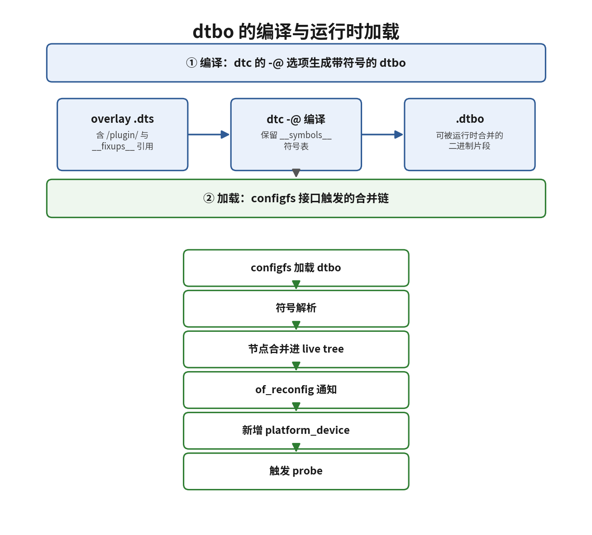

# 11.6.2 dtbo编译与加载

> 所属：第11章 设备模型 > 11.6 设备树overlay
> 
> 难度：[E] | 预计阅读时间：15分钟

## <span class="blue"> 本节导读

上一节明确了 overlay 的价值：运行时向设备树叠加改动，不重启。本节进入这条主线的第二步——动手完成一份 overlay 从源码到上线的全过程。整条链路分两段：开发机上把 overlay 源文件编译成 dtbo，目标板上通过内核的 configfs 接口把 dtbo 加载进运行中的设备树。两段各有必须满足的硬性条件，缺一个就失败。<BR>
本节覆盖：overlay 源文件的结构（fragment、target、`__overlay__`）、`dtc -@` 的作用与符号机制（`__symbols__`、`__fixups__`）、configfs 加载与卸载的完整命令序列、内核配置依赖与常见报错排查。

---

## <span class="blue"> overlay 源文件的结构 [E]

overlay 源文件和普通 dts 一样用 dtc 编译，但内容组织方式不同。先看一份完整的示例：给基板的 `i2c1` 控制器下挂一片 EEPROM。

```dts
/* myoverlay.dts：给 i2c1 挂载 at24c02 EEPROM */
/dts-v1/;
/plugin/;          /* 声明本文件是 overlay 插件，不是独立设备树 */

/ {
    fragment@0 {
        target = <&i2c1>;   /* 合并目标：基板设备树中的 i2c1 节点 */
        __overlay__ {
            status = "okay";
            clock-frequency = <400000>;

            eeprom@50 {
                compatible = "atmel,24c02";
                reg = <0x50>;
            };
        };
    };
};
```

三个关键结构逐一拆解：

- **`/plugin/;`**：overlay 的身份声明。普通 dtb 是一棵完整设备树，带 `/plugin/` 的 dtbo 只是一份补丁，内核据此走叠加逻辑而不是整体替换。
- **fragment**：fragment（片段）是 overlay 的基本单元，一份 overlay 可含多个 `fragment@N`，每个 fragment 独立指定一个合并目标。
- **target**：fragment 的落点。两种写法：`target = <&label>` 按标签定位（要求基板 dtb 有 `__symbols__` 表），`target-path = "/soc/i2c@1c2ac00"` 按绝对路径定位（不依赖符号表，但路径必须一字不差）。
- **`__overlay__`**：fragment 内的真正有效载荷。合并时这个节点本身不会出现，它里面的属性和子节点会被叠加到 target 指向的节点上。

合并规则与上一节一致：同名属性取 overlay 的新值，新子节点（如 `eeprom@50`）直接挂到 target 节点下。

---

## <span class="blue"> 编译 dtbo：`-@` 与符号机制 [E]

编译命令只比普通 dtb 多一个参数：

```bash
dtc -@ -O dtb -o myoverlay.dtbo myoverlay.dts
```

产物后缀 `.dtbo` 只是命名约定，输出格式仍是 dtb（`-O dtb`，dtc 没有 `dtbo` 这种输出格式）。真正的关键是 `-@`。

`&i2c1` 这种标签引用在编译期必须解析成 phandle——phandle 是设备树中节点的数字句柄，一个 32 位整数，节点间互相引用全靠它。问题是 `i2c1` 定义在基板 dts 里，编译 overlay 时 dtc 看不到它。不加 `-@`，dtc 会直接报错退出；加上 `-@`，dtc 允许引用"当前文件之外"的符号，并在 dtbo 里生成两张表留给合并阶段处理：

| 表 | 内容 | 消费方 |
|----|------|--------|
| `__symbols__` | 基板 dtb 中"标签 → 节点路径"的映射（由编译基板 dtb 时的 `-@` 生成） | overlay 加载器查表，把 `&i2c1` 解析成目标节点 |
| `__fixups__` | overlay 中"引用外部符号的位置"清单（编译 overlay 时由 `-@` 生成） | 加载时按 `__symbols__` 把 phandle 值回填进去 |
| `__local_fixups__` | overlay 内部节点之间的引用位置清单 | 合并时按新节点的实际 phandle 回填 |

也就是说，overlay 里的外部引用在编译产物里是"留空待填"的，真正的符号解析推迟到运行时加载那一刻完成。基板 dtb 编译时同样要加 `-@` 生成 `__symbols__`，否则 overlay 的 `__fixups__` 无从解析，加载报符号找不到——这就是上一节强调的基板前提。

---

## <span class="blue"> 通过 configfs 加载与卸载 [E]

dtbo 编译出来后，内核侧的入口是 configfs。configfs 是一个虚拟文件系统，外观类似 sysfs，但用途相反：sysfs 用于内核向用户空间导出状态，configfs 用于用户空间通过"建目录、写文件"向内核下达配置。设备树 overlay 的 configfs 入口固定为：

```
/sys/kernel/config/device-tree/overlays/
```

完整加载序列：

```bash
# 确认 configfs 已挂载（多数发行版启动脚本已完成）
mount | grep configfs
configfs on /sys/kernel/config type configfs (rw,relatime)

# 未挂载则手动挂载
mount -t configfs none /sys/kernel/config

# 每个 overlay 对应一个目录，名字自定
mkdir /sys/kernel/config/device-tree/overlays/my_eeprom

# 把 dtbo 二进制写入 dtbo 属性文件，写入动作触发内核解析与合并
cat /lib/firmware/myoverlay.dtbo > /sys/kernel/config/device-tree/overlays/my_eeprom/dtbo

# 查询合并结果
cat /sys/kernel/config/device-tree/overlays/my_eeprom/status
applied
```

`status` 文件只有两种读数：`applied`（合并成功）或 `unapplied`（未合并或已卸载）。写入 `dtbo` 的那一刻，内核 OF 子系统依次完成符号解析（查基板 `__symbols__`、回填 `__fixups__`）、节点合并、`of_reconfig` 通知链广播，新节点随即被实例化为 `platform_device`，匹配到的驱动开始 probe。

卸载是反向操作，删掉目录即可：

```bash
rmdir /sys/kernel/config/device-tree/overlays/my_eeprom
```

内核按相反顺序拆除：触发对应驱动的 `remove()`、释放资源、把叠加的节点从设备树中摘掉。




> ⚠️ 写入 `dtbo` 必须用 `cat ... >` 重定向，不要用 `cp`。configfs 的属性文件只实现简单的 write 接口，`cp` 的写路径在某些文件系统上会被拒绝，表现为 `Invalid argument`。

> 💡 需要开机自动加载的 overlay，可以把上述命令固化进启动脚本或 systemd 单元。树莓派的 `/boot/overlays/` + `config.txt`、部分发行版的固件目录自动加载机制，底层走的都是这套接口或其 U-Boot 等价物。

---

## <span class="blue"> 内核配置依赖与报错排查 [E]

configfs 加载路径不是任何内核都有，两项配置缺一不可：

| 配置项 | 作用 | 缺失的后果 |
|--------|------|-----------|
| `CONFIG_OF_OVERLAY=y` | 内核支持设备树 overlay 的合并与卸载 | `/sys/kernel/config/device-tree/` 不存在 |
| `CONFIG_CONFIGFS_FS=y` | 提供 configfs 虚拟文件系统 | 无法通过文件接口操作 overlay |

检查当前内核：

```bash
zgrep CONFIG_OF_OVERLAY /proc/config.gz
CONFIG_OF_OVERLAY=y

zgrep CONFIG_CONFIGFS_FS /proc/config.gz
CONFIG_CONFIGFS_FS=y
```

若输出为 `=m`，先 `modprobe configfs`；若为 `=n`，只能重编内核。

常见报错按出现频率排序：

**编译期：`Reference to non-existent node or label "i2c1"`**。编译 overlay 时漏加 `-@`。补上 `-@` 重新编译。

**运行期：`/sys/kernel/config/device-tree/overlays/` 不存在**。两种可能：configfs 没挂载（`mount | grep configfs` 确认），或内核没开 `CONFIG_OF_OVERLAY`（重编内核）。

**写入时报 `write error: Invalid argument`**。三种可能：dtbo 本身编译有误；用了 `cp` 而非 `cat ... >`；target 指向的节点在基板设备树中不存在（节点被删或标签拼写不一致）。

**写入成功但 `status` 不是 `applied`**。基板 dtb 缺 `__symbols__` 表，或 `__fixups__` 引用的符号在基板中找不到。先查 `dmesg`，OF 子系统的日志以 `OF: overlay:` 开头，会直接指明失败发生在哪一步。

> 💡 排查顺序固定为两步：先看 overlay 目录下 `status` 的读数，再看 `dmesg` 里 `OF: overlay:` 开头的日志。前者回答"成没成"，后者回答"卡在哪一步"。

---

## <span class="blue"> 本节总结

| 概念 | 核心要点 | 自查操作 |
|------|---------|---------|
| overlay 结构 | `/plugin/` 声明 + fragment + target + `__overlay__` | 手写一份单 fragment 的 overlay dts |
| 符号机制 | `-@` 生成 `__symbols__`（基板侧）与 `__fixups__`/`__local_fixups__`（overlay 侧），符号解析推迟到运行时 | 解释为什么基板和 overlay 编译都要加 `-@` |
| 编译命令 | `dtc -@ -O dtb -o xxx.dtbo xxx.dts` | 编译并 `file xxx.dtbo` 确认产物 |
| configfs 加载 | `mkdir` → `cat dtbo > .../dtbo` → `status` 读数为 `applied` | 完整跑通一次加载 |
| 卸载 | `rmdir` 对应目录，触发驱动 `remove()` | 确认卸载后设备节点消失 |
| 内核依赖 | `CONFIG_OF_OVERLAY=y` + `CONFIG_CONFIGFS_FS=y` + 挂载 configfs | `zgrep` 两项配置确认 |

---

## <span class="blue"> 下一步

dtbo 的编译与加载链路已经打通。下一节（11.6.3）往深处走一步：overlay 合并进内核之后，设备节点如何变成 `platform_device` 并触发 probe，overlay 在删除、核心属性修改上的硬性限制，以及如何用 `dtc -I fs` 导出合并后的设备树做实锤验证。
