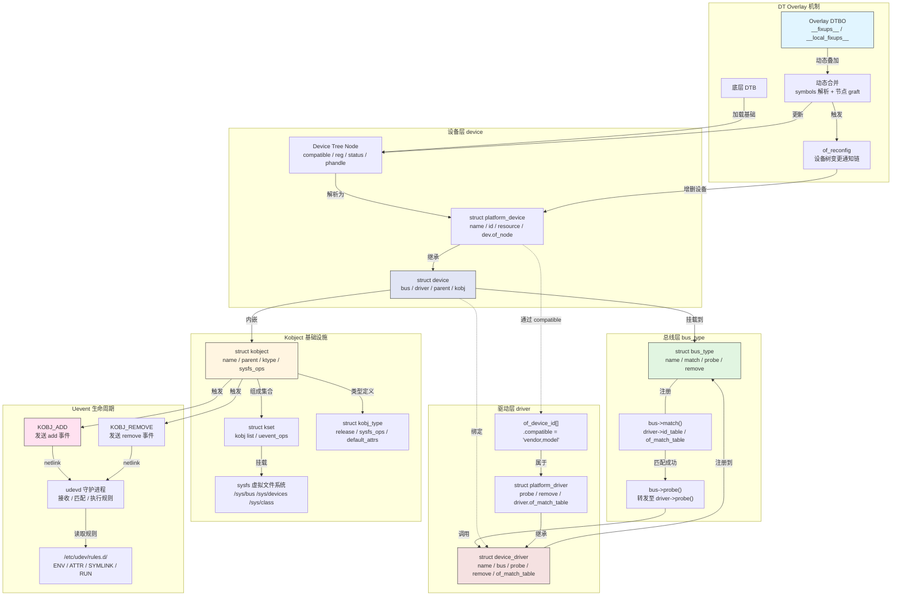
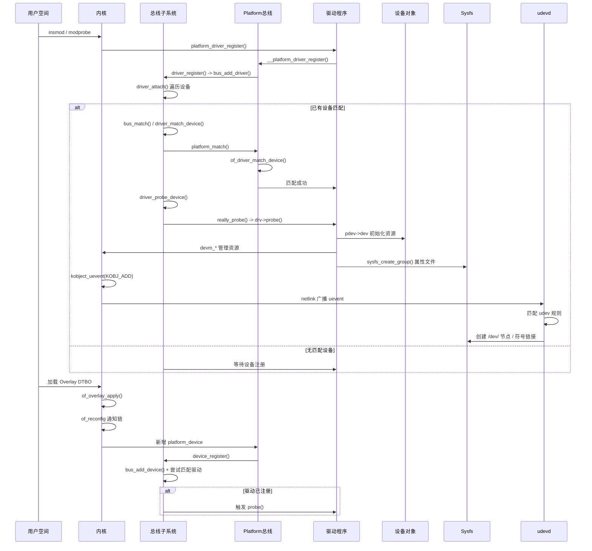

# 11.99 知识图谱与查漏补缺

---

## 一、知识图谱

### 调用链时序图

---

## 二、查漏补缺 Checklist

### 总线-设备-驱动三角关系

- [ ] 能画出 `struct bus_type`、`struct device`、`struct device_driver` 的三角关系图（★★★）
- [ ] 理解 `bus_register()` 时创建 `/sys/bus/<name>` 目录结构（★★★）
- [ ] 掌握 `devices_kset` 和 `drivers_kset` 在总线下的组织方式（★★★）
- [ ] 能解释为什么驱动注册时遍历设备、设备注册时遍历驱动（★★★）
- [ ] 理解 `driver_bound()` 将 `dev->driver` 指针绑定到具体驱动实例（★★☆）
- [ ] 掌握 `device_release_driver()` 与 `driver_unregister()` 的解绑顺序（★★☆）
- [ ] 了解 `subsys_private` 结构体如何管理总线的设备和驱动链表（★☆☆）

### match()→probe() 调用链

- [ ] 能完整复述 `driver_register()` → `bus_add_driver()` → `driver_attach()` 的调用路径（★★★）
- [ ] 掌握 `bus_match()` → `drv->match()` → `of_match_device()` 的逐级匹配逻辑（★★★）
- [ ] 理解 `really_probe()` 中先调 `bus->probe()` 再转 `drv->probe()` 的分层设计（★★★）
- [ ] 能说明 `probe()` 失败时的回滚路径：`probe() fails` → `dev->driver = NULL`（★★☆）
- [ ] 了解 `deferred probe` 机制：当依赖资源不存在时的延迟重试逻辑（★★☆）
- [ ] 掌握 `MODULE_DEVICE_TABLE(of, ...)` 宏的作用与 modalias 生成原理（★★☆）
- [ ] 理解 `dev_err_probe()` 在 probe 失败时返回 `-EPROBE_DEFER` 的用法（★★☆）

### kobject / kset / sysfs 基础设施

- [ ] 能画出 `kobject` → `kset` → `kobj_type` 的三元关系（★★★）
- [ ] 掌握 `kobject_init_and_add()` 创建 sysfs 目录的标准流程（★★★）
- [ ] 理解 `kobject_uevent()` 通过 netlink 向用户空间发送事件的机制（★★★）
- [ ] 能解释 `release()` 回调为何必须由 `kobj_type` 提供且不能直接 `kfree()`（★★★）
- [ ] 掌握 `kset_create_and_add()` 与 `kobject_create_and_add()` 的使用场景差异（★★☆）
- [ ] 了解 `sysfs_create_group()` 批量创建属性文件的方法（★★☆）
- [ ] 理解 `DEVICE_ATTR_RO / DEVICE_ATTR_RW` 宏与 `device_attribute.show/.store` 的关系（★★☆）
- [ ] 能编写自定义的 `kobj_type.sysfs_ops` 处理 show/store 调用（★☆☆）

### Platform 设备与 probe 流程

- [ ] 掌握 `platform_driver_register()` 与 `module_platform_driver()` 的等价关系（★★★）
- [ ] 能完整描述 `platform_device_register()` → `platform_device_add()` 的流程（★★★）
- [ ] 理解 `platform_match()` 中四种匹配优先级：OF > id_table > name > 通配（★★★）
- [ ] 掌握 `platform_get_resource()` 与 `devm_platform_ioremap_resource()` 的惯用法（★★★）
- [ ] 能解释 `platform_device` 与 `device` 的继承关系：`pdev->dev`（★★★）
- [ ] 了解 `platform_device_unregister()` 的卸载顺序与资源释放（★★☆）
- [ ] 理解 `ACPI` 匹配表（`acpi_device_id`）与 `of_match_table` 的并存机制（★☆☆）

### compatible 匹配机制

- [ ] 能写出标准的 `of_device_id` 表并解释 `compatible = "vendor,model"` 的命名规范（★★★）
- [ ] 掌握 `of_match_device()` 在 platform_match() 中的调用时机（★★★）
- [ ] 理解 Device Tree 节点的 `compatible` 列表按优先级从前到后匹配（★★★）
- [ ] 能解释 `of_compatible_match()` 中字符串逐一比较的源码逻辑（★★☆）
- [ ] 了解 `compatible` 字符串中 vendor 前缀的标准化要求（建议用厂商域名倒序）（★★☆）
- [ ] 掌握设备树节点中多个 compatible 的 fallback 匹配策略（★★☆）

### of_match_table 与绑定规范

- [ ] 能正确定义 `of_match_ptr()` 与 `of_device_id[]` 的配套使用（★★★）
- [ ] 掌握 `of_match_table` 被封装进 `device_driver.of_match_table` 的路径（★★★）
- [ ] 理解 `Documentation/devicetree/bindings/` 中 `.yaml` 绑定规范的验证作用（★★☆）
- [ ] 能阅读 dt-schema 验证失败的报错信息并修正设备树（★★☆）
- [ ] 了解 `dtc -I dtb -O dts` 反编译 dtb 检查 compatible 的方法（★★☆）

### sysfs 三视图

- [ ] 能解释 sysfs 三视图：`/sys/bus`（总线视图）、`/sys/devices`（物理视图）、`/sys/class`（功能视图）（★★★）
- [ ] 掌握从 `/sys/bus/platform/devices/` 找到对应驱动的软链接方法（★★★）
- [ ] 能从 `/sys/devices/` 的层级路径反推设备的物理拓扑关系（★★★）
- [ ] 理解 `/sys/class/<class>/<dev>/device` 符号链接指向物理设备目录（★★☆）
- [ ] 能使用 `udevadm info --attribute-walk /sys/...` 查看设备属性层级（★★☆）
- [ ] 了解 `/sys/kernel/debug/devices_deferred` 查看 deferred probe 设备列表（★☆☆）

### uevent 生命周期

- [ ] 能列举 `KOBJ_ADD`、`KOBJ_REMOVE`、`KOBJ_CHANGE`、`KOBJ_MOVE` 的触发场景（★★★）
- [ ] 掌握 `kobject_uevent_env()` 可携带额外环境变量发送事件（★★☆）
- [ ] 理解 uevent 通过 netlink socket 组播到用户空间的 netlink 协议细节（★★☆）
- [ ] 能使用 `uevents` 统计文件（`/sys/<path>/uevent`）手动触发事件（★★☆）
- [ ] 了解 `CONFIG_UEVENT_HELPER` 已废弃，现代内核仅用 netlink 方式（★☆☆）
- [ ] 掌握 `dev_set_uevent_suppress()` 抑制特定设备发送 uevent 的用法（★☆☆）

### udev 规则

- [ ] 能编写一条基本的 udev 规则：匹配 `SUBSYSTEM` + `ATTR{...}` 并设置 `SYMLINK+="..."`（★★★）
- [ ] 掌握 `udevadm monitor` 实时捕获 uevent 的调试方法（★★★）
- [ ] 理解 `udev` 规则匹配优先级：规则文件按字典序，文件内按行序（★★☆）
- [ ] 能使用 `RUN+="/bin/sh -c '...'"` 在设备事件时执行自定义脚本（★★☆）
- [ ] 了解 `TAG+="uaccess"` 与 systemd-logind 的集成机制（★☆☆）
- [ ] 掌握 `OWNER`、`GROUP`、`MODE` 设置设备节点权限的写法（★★☆）

### Overlay 动态叠加

- [ ] 能解释 Overlay 解决的核心问题：运行时动态修改设备树（★★★）
- [ ] 掌握 `__symbols__` 表在 Overlay 解析目标节点锚定中的作用（★★★）
- [ ] 理解 `__fixups__` 与 `__local_fixups__` 的区别与配合关系（★★☆）
- [ ] 能描述 `of_overlay_apply()` → `of_reconfig()` → 设备增删的完整链条（★★☆）
- [ ] 了解 `of_overlay_remove()` 卸载 Overlay 时的设备树回退机制（★★☆）
- [ ] 掌握 Overlay 中 `fragment@N` 的 `target` 与 `target-path` 两种定位方式（★★☆）
- [ ] 理解 Overlay 加载后触发 `platform_device` 重新 `probe` 的内核行为（★★☆）
- [ ] 了解 BeagleBone 的 cape manager 与树莓派的 `dtoverlay` 配置差异（★☆☆）

### 综合贯通

- [ ] 能从 `insmod` 到 `/dev/` 节点出现，完整描述内核各子系统的协作过程（★★★）
- [ ] 能在设备无法正常 probe 时，系统性地检查 `dmesg`、`/sys/bus/*/devices/`、`udevadm` 三个信息源（★★★）
- [ ] 理解 `device-managed`（`devm_*`）API 与 `kobject` release 生命周期的关联（★★☆）
- [ ] 能根据 `compatible` 字符串追溯到 `.yaml` 绑定规范文件（★★☆）
- [ ] 掌握通过 `sysfs` 属性文件实现用户空间与驱动双向通信的方法（★★☆）
- [ ] 理解设备树 `status = "disabled"` 与驱动 deferred probe 的交互（★★☆）
- [ ] 能独立编写包含 `of_match_table` 的完整 `platform_driver` 模块（★★★）
