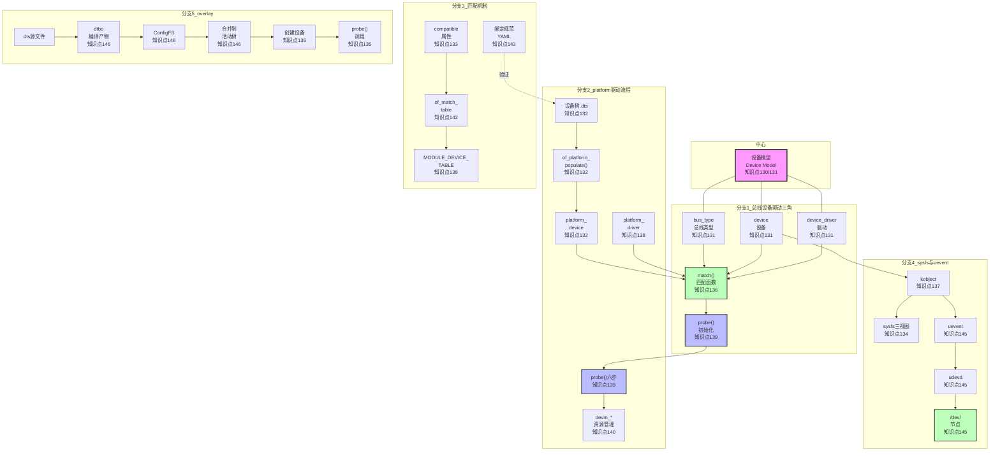

# 11.99 知识图谱与查漏补缺

## 本节导读

到这儿，第11章的知识点已经全部讲完了。但十几个知识点散落在七节里，你可能需要一个**全景图**把线索串起来。本节就做两件事：**一张知识图谱**，用流程图+速查表格帮你建立全局视角；**一份查漏补缺清单**，用40多条checklist让你快速定位自己还缺什么。如果你时间紧迫，直接把查漏补缺清单打印出来，一条一条打勾——全部打满，这一章就算真正吃透了。

---

## 第一部分：知识图谱

### 全景流程图

第11章的核心围绕一个主题：**Linux设备模型与驱动绑定机制**。下面的流程图展示了从设备树描述到驱动 `probe()` 被调用，再到用户空间可见的完整链路。五条分支对应本章的五大知识模块。

💡 **提示**：这张图的信息密度很高。实际使用时，建议把它打印出来贴在工位旁边——遇到驱动不 probe、设备节点不出现、overlay 加载失败等问题时，按图索骥，能快速定位到对应的排查分支。

---

### 知识点速查表

下面把本章涉及的所有知识点，用一句话+实操命令的方式浓缩，方便快速查阅。

| 编号 | 知识点 | 是什么（一句话） | 为什么重要 | 关键文件/命令 | 常见错误 |
|------|--------|-----------------|-----------|-------------|---------|
| **知识点130 [I]** | 为什么需要设备模型 | 2.6内核引入的统一抽象层，用总线-设备-驱动三角替代分散的驱动初始化 | 没有它，每个驱动各自为政，资源冲突、热插拔、电源管理都是噩梦 | `include/linux/device.h` | 把设备模型当纯理论跳过，结果后续看platform总线一头雾水 |
| **知识点131 [I][M]** | 总线-设备-驱动三角 | `bus_type` 做媒，`device` 描述硬件，`device_driver` 含软件逻辑，三者通过 `match()` 配对 | 这是Linux驱动架构的DNA，理解不了这个三角，后续所有框架都搭不起来 | `struct bus_type`, `struct device`, `struct device_driver` | 混淆 `device` 和 `platform_device` 的关系 |
| **知识点132 [E][M]** | 设备树到platform_device | `of_platform_populate()` 遍历设备树，为 `status="okay"` 的节点创建 `platform_device` | 这是设备树与内核驱动之间的桥梁，设备树节点不会自动变设备，靠它 | `drivers/of/platform.c` | 节点写了 `status = "disabled"` 还奇怪为什么设备没创建 |
| **知识点133 [E][M]** | compatible匹配原理 | `compatible` 是有序字符串列表，内核从前往后逐个与驱动的 `of_match_table` 比对 | 这是设备树匹配的核心机制，90%的"驱动加载了但不probe"根因在这里 | `drivers/of/base.c: __of_match_node()` | compatible拼写少一个字母，或者驱动里的compatible和设备树不一致 |
| **知识点134 [I]** | sysfs三视图 | `/sys/bus/` 按总线组织，`/sys/class/` 按功能组织，`/sys/devices/` 按物理拓扑组织 | 三个视角定位同一个设备，排查问题时不迷路 | `ls /sys/bus/platform/devices/`, `ls /sys/class/leds/` | 在 `/sys/class/` 找不到设备就去 `insmod`，其实设备可能挂在bus下 |
| **知识点135 [E]** | 为什么需要overlay | 运行时动态patch设备树的能力，用于FPGA重配置、扩展板热插拔、外设动态启用 | 没有overlay，每次硬件变化都要重新编译dtb并重启 | `Documentation/devicetree/overlay-notes.rst` | 把固定硬件也放进overlay，导致启动依赖变复杂 |
| **知识点136 [I][M]** | match()与probe()调用链 | `driver_register() → bus_add_driver() → driver_attach() → bus_for_each_dev() → match() → really_probe()` | 这是驱动绑定的全景路径，probe没被调用时要能逆着这个链排查 | `drivers/base/bus.c`, `drivers/base/dd.c` | 在驱动里打printk却发现probe没进，不知道先看match有没有成功 |
| **知识点137 [I]** | kobject/kset与sysfs映射 | `kobject` 是设备模型的原子单位，每个kobject对应sysfs一个目录；`kset` 是kobject的容器 | sysfs里的一切都是kobject，理解了这个就理解了sysfs的本质 | `include/linux/kobject.h`, `struct kobject` | 认为sysfs是独立机制，不知道它只是kobject的用户空间投影 |
| **知识点138 [E][M]** | platform_driver注册与匹配 | `platform_driver_register()` 把驱动挂到platform总线，`platform_match()` 用of_match_table/device_name/ID表三种方式匹配 | platform是嵌入式Linux中最常用的虚拟总线，这条路径必须熟 | `drivers/base/platform.c` | `id_table` 和 `of_match_table` 同时填但优先级搞混 |
| **知识点139 [E][M]** | probe()六步流程 | 解析资源→获取时钟→获取regulator→IO映射→注册子系统→初始化硬件 | 这是驱动probe的标准模板，照着填不容易漏 | `platform_get_resource()`, `devm_clk_get()`, `devm_ioremap_resource()` | 跳过某一步（如忘记`clk_prepare_enable`），导致硬件"不工作" |
| **知识点140 [E]** | devm_*资源管理 | 以 `devm_` 为前缀的API，把资源释放逻辑自动挂到设备的release链上 | 告别手动记账，probe失败 midway 退出也不会漏释放资源 | `devm_ioremap()`, `devm_request_irq()`, `devm_clk_put()` | devm和非devm API混用，导致double free或leak |
| **知识点141 [I][M]** | probe失败排查 | 五大根因：资源冲突、依赖未满足、时钟未开、设备树缺失属性、硬件故障 | probe失败是最常见的驱动调试场景，没有系统排查方法只能盲目printk | `dmesg`, `/sys/kernel/debug/devices_deferred` | 看见probe报错就直接改驱动，没先检查设备树 |
| **知识点142 [E]** | of_match_table两种组织 | 传统`of_device_id`数组；现代多总线联合匹配（`#ifdef CONFIG_OF/CONFIG_ACPI`） | 驱动要跨平台复用时，必须用第二种组织方式 | `struct of_device_id`, `MODULE_DEVICE_TABLE(of, ...)` | ACPI平台OF分支编译掉了，导致设备无法匹配 |
| **知识点143 [E]** | 设备树绑定规范 | 用YAML Schema描述设备节点的属性约束，实现编译期验证 | 提交设备树代码到社区必须过绑定规范审查 | `Documentation/devicetree/bindings/` | 写dts不查binding，用了已废弃的属性名 |
| **知识点144 [E]** | 匹配竞争与优先级 | 多个驱动匹配同一设备时，先注册的抢占绑定，后续收到`-EBUSY` | 模块化编译驱动时可能因加载顺序导致竞争 | `sysfs /sys/bus/.../drivers/` | 明明加载了驱动A，设备却被驱动B抢走 |
| **知识点145 [I][M]** | uevent生命周期 | `device_add()` → `kobject_uevent()` → netlink → udevd → 规则匹配 → 创建设备节点 | `/dev/` 下节点的出现靠这条链路，节点不出现要逆着排查 | `udevadm monitor`, `udevadm info`, `/etc/udev/rules.d/` | 内核设备注册了但 `/dev/` 没节点，不知道是udev规则问题 |
| **知识点146 [E][M]** | dtbo编译与加载 | `dtc -@` 编译dtbo，ConfigFS接口动态加载，`/kernel/debug/...` 验证 | overlay的实际落地步骤，FPGA和扩展板热插拔的核心操作 | `dtc -@ -O dtbo`, `/sys/kernel/config/device-tree/overlays/` | 内核没开 `CONFIG_OF_OVERLAY` 就去加载dtbo |

---

## 第二部分：查漏补缺

下面的checklist按模块分组，每条格式为 `[ ] 描述 —— 深度标记`。建议读完一章后自测，打勾的表示已掌握，没打勾的回去翻对应小节。

### 设备模型基础

- [ ] **知识点130 [I]**：理解2.6之前"各自为政"的驱动模型为什么会导致资源冲突和初始化顺序混乱 —— 这是设备模型存在的历史背景
- [ ] **知识点131 [I][M]**：能画出 `bus_type`、`device`、`device_driver` 三者关系图，说出谁做媒、谁描述硬件、谁包含软件逻辑 —— 这是整个驱动子系统的骨架
- [ ] **知识点131 [I][M]**：能默写 `match() → probe()` 的调用顺序，知道match失败时probe不会被执行 —— 排查"驱动加载了但不工作"的第一步
- [ ] **知识点136 [I][M]**：能说出 `driver_register()` 到 `really_probe()` 的完整调用链至少5个函数名 —— 源码级追踪能力
- [ ] **知识点137 [I]**：理解 `kobject` 是设备模型的最小原子单位，每个kobject对应sysfs一个目录 —— sysfs不是独立机制，是kobject的投影
- [ ] **知识点137 [I]**：知道 `kset` 是kobject的容器，`ktype` 定义属性和release行为 —— 理解层次结构的组织方式
- [ ] **知识点137 [I]**：能在 `/sys/` 下找到一个设备，并追溯到它的parent kobject 链路 —— 实操：`cat /sys/devices/.../uevent`

### platform驱动流程

- [ ] **知识点132 [E][M]**：理解 `of_platform_populate()` 的触发时机和遍历逻辑 —— 启动早期从dtb创建设备
- [ ] **知识点132 [E][M]**：知道 `status="disabled"` 的节点会被跳过，`status="okay"` 才会创建 `platform_device` —— 设备不出现的常见原因
- [ ] **知识点132 [E][M]**：能在 `drivers/of/platform.c` 中找到 `of_platform_device_create()` 的调用点 —— 源码阅读
- [ ] **知识点138 [E][M]**：能写出 `platform_driver` 结构体的关键字段：`probe`, `remove`, `driver.name`, `driver.of_match_table` —— 实际编码必备
- [ ] **知识点138 [E][M]**：知道 `platform_match()` 的三种匹配方式：of_match_table > id_table > name —— 优先级搞清，否则填了匹配不上
- [ ] **知识点138 [E][M]**：能写出一个最小可工作的platform_driver注册代码 —— 动手能力
- [ ] **知识点139 [E][M]**：probe六步流程按顺序说出：①解析资源 ②获取时钟 ③获取regulator ④IO映射 ⑤注册子系统 ⑥初始化硬件 —— 模板化思维
- [ ] **知识点139 [E][M]**：知道为什么 `devm_ioremap_resource()` 比 `ioremap()` 更适合在probe中使用 —— 资源管理与错误处理
- [ ] **知识点140 [E]**：列举至少5个常用的 `devm_` 前缀API：`devm_ioremap`, `devm_request_irq`, `devm_clk_get`, `devm_regulator_get`, `devm_gpio_request` —— 避免手动记账
- [ ] **知识点140 [E]**：理解 `devm_` 的释放时机：设备从系统中移除时自动回调 —— 不是probe退出时释放
- [ ] **知识点140 [E]**：知道 `devm_` 的局限场景：跨设备共享资源、需要在remove中特殊处理时不宜用 —— 不是所有场景都适用
- [ ] **知识点141 [I][M]**：probe失败的五大根因：资源冲突、依赖未满足、时钟未开、设备树缺属性、硬件故障 —— 系统性排查思维
- [ ] **知识点141 [I][M]**：知道 `/sys/kernel/debug/devices_deferred` 可以查看延迟probe的设备列表 —— 调试利器
- [ ] **知识点141 [I][M]**：能说出probe排查的基本顺序：先看dmesg → 查设备树 → 确认依赖 → 检查资源冲突 → 怀疑硬件 —— 不盲目改代码

### 匹配机制

- [ ] **知识点133 [E][M]**：理解 `compatible` 是有序字符串列表，内核从第一个开始逐个匹配 —— 顺序有含义，越具体放越前
- [ ] **知识点133 [E][M]**：能在 `drivers/of/base.c` 的 `__of_match_node()` 中找到匹配逻辑的核心代码 —— 源码级理解
- [ ] **知识点133 [E][M]**：通配符匹配（如 `"vendor,*"`）与精确匹配的优先级关系 —— 精确匹配优先
- [ ] **知识点142 [E]**：会写传统的 `of_device_id` 数组匹配表 —— 基础编码能力
- [ ] **知识点142 [E]**：知道多总线联合匹配的写法：`#ifdef CONFIG_OF` + `#ifdef CONFIG_ACPI` 组合 —— 跨平台驱动
- [ ] **知识点142 [E]**：理解 `MODULE_DEVICE_TABLE(of, ...)` 的作用：让模块加载时能匹配设备树 —— 没有它，`modprobe` 不会自动加载
- [ ] **知识点143 [E]**：知道绑定规范从txt迁移到YAML的原因：结构化、可机器验证 —— 社区趋势
- [ ] **知识点143 [E]**：会用 `dtc` 的绑定验证功能检查设备树：`make dt_binding_check` —— 提交代码前自查
- [ ] **知识点143 [E]**：能在 `Documentation/devicetree/bindings/` 中找到对应外设的YAML规范 —— 不写违规dts
- [ ] **知识点144 [E]**：理解匹配竞争场景：多个驱动同时匹配一个设备，先注册者胜 —— 加载顺序有影响
- [ ] **知识点144 [E]**：能用 `sysfs` 查看设备当前绑定的驱动：`readlink /sys/bus/.../device/driver` —— 排查驱动抢占

### sysfs与uevent

- [ ] **知识点134 [I]**：说出sysfs三视图各自的定位：`/sys/bus/`按总线、`/sys/class/`按功能、`/sys/devices/`按物理拓扑 —— 不同视角定位同一设备
- [ ] **知识点134 [I]**：知道三视图之间通过symbolic link关联，同一个设备在三处都能看到 —— 不是三套独立数据
- [ ] **知识点134 [I]**：能在 `/sys/bus/platform/devices/` 和 `/sys/devices/platform/` 之间找到对应关系 —— 实操
- [ ] **知识点145 [I][M]**：uevent四步生命周期：`device_add()`发通知 → netlink传输 → udevd接收 → 规则匹配执行动作 —— 完整链路
- [ ] **知识点145 [I][M]**：会用 `udevadm monitor` 实时查看uevent消息 —— 调试设备节点不出现
- [ ] **知识点145 [I][M]**：会用 `udevadm info /dev/xxx` 查看设备的属性和规则匹配结果 —— 排查udev规则
- [ ] **知识点145 [I][M]**：知道自定义udev规则放在 `/etc/udev/rules.d/` 目录，文件名以数字开头定优先级 —— 权限/命名定制
- [ ] **知识点145 [I][M]**：理解uevent的三种类型：`add`（设备插入）、`remove`（设备移除）、`change`（状态变化） —— 不同事件不同处理

### overlay

- [ ] **知识点135 [E]**：说出至少3个overlay的适用场景：FPGA重配置、扩展板热插拔、运行时启用外设 —— 知道什么时候用
- [ ] **知识点135 [E]**：理解overlay的边界：只用于变化的硬件，固定硬件应在主dtb中描述 —— 不滥用
- [ ] **知识点146 [E][M]**：会用 `dtc -@ -O dtbo` 编译设备树overlay —— `-@` 符号是关键
- [ ] **知识点146 [E][M]**：知道内核必须开启 `CONFIG_OF_OVERLAY=y` 和 `CONFIG_CONFIGFS_OF=y` —— 两扇大门
- [ ] **知识点146 [E][M]**：能说出ConfigFS加载dtbo的三步：挂载configfs → mkdir创建overlay目录 → cat dtbo到dtbo文件 —— 实操流程
- [ ] **知识点146 [E][M]**：知道在 `/sys/kernel/debug/device-tree/` 下验证overlay是否合并成功 —— 验证手段
- [ ] **知识点146 [E][M]**：理解overlay卸载的正确方式：向overlay目录的`status`写`0`或直接rmdir —— 不是重启
- [ ] **知识点135 [E]**：知道overlay的限制：不能overlay已存在的节点（需要特殊处理）、内存布局变化需谨慎 —— 不是万能的

---

## 本节总结

| 模块 | 知识点编号 | 核心速记 |
|------|-----------|---------|
| 设备模型基础 | 知识点130 [I], 131 [I][M], 136 [I][M], 137 [I] | 总线-设备-驱动三角是骨架，kobject是原子单位，match→probe是绑定路径 |
| platform驱动流程 | 知识点132 [E][M], 138 [E][M], 139 [E][M], 140 [E], 141 [I][M] | of_platform_populate创建设备 → platform_match匹配 → probe六步 → devm自动释放 |
| 匹配机制 | 知识点133 [E][M], 142 [E], 143 [E], 144 [E] | compatible有序匹配 → of_match_table定义规则 → YAML绑定规范验证 → 竞争先注册胜 |
| sysfs与uevent | 知识点134 [I], 145 [I][M] | 三视图定位设备，uevent四步链路到/dev节点 |
| overlay | 知识点135 [E], 146 [E][M] | dtc -@编译dtbo → ConfigFS动态加载 → 运行时patch设备树 |

---

## 下一步

第11章到这里就全部结束了。接下来的第12章，我们将进入**块设备与存储子系统**，一起看看SD卡、eMMC、NAND Flash这些嵌入式存储设备是怎么工作的——从物理接口到MTD子系统，从分区表到文件系统挂载，那又是另一个精彩的战场。

如果你能把上面的查漏补缺清单全部打满勾，第12章的学习会非常顺畅。如果有几条还模棱两可，建议花一小时回头补一下——地基扎实了，上面盖楼才稳。
