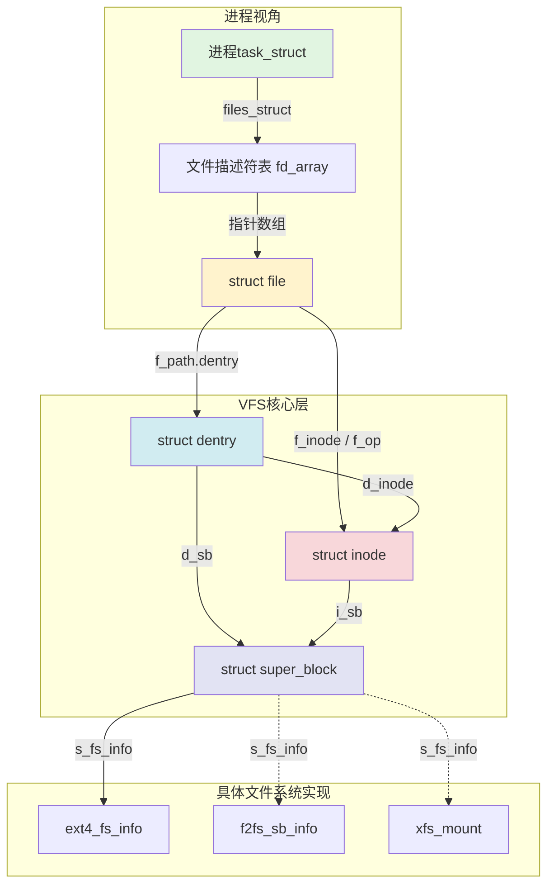
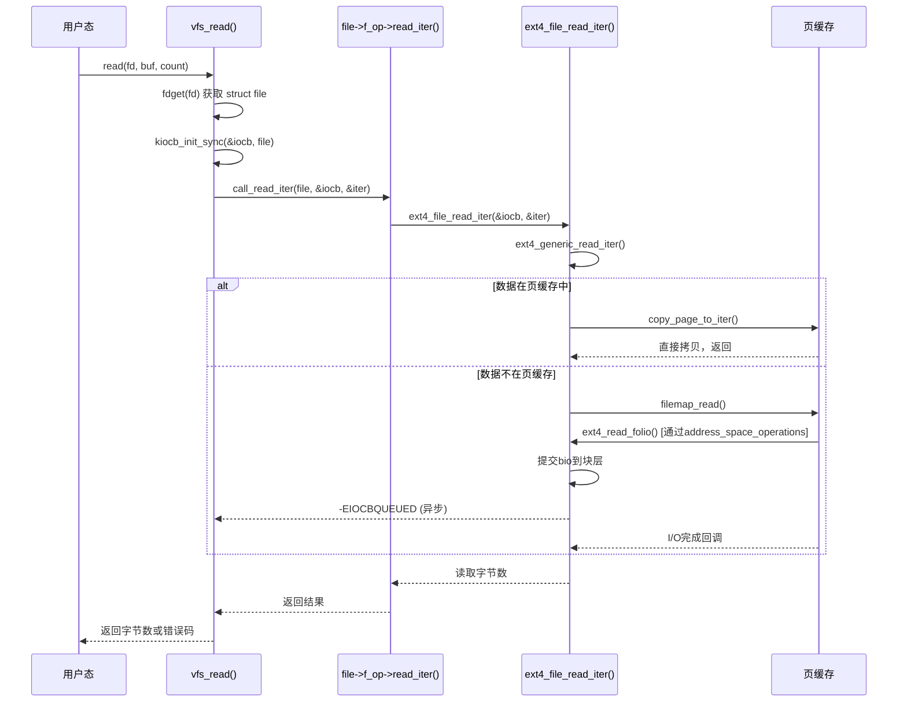

为什么ext4和f2fs的`open`/`read`/`write` API完全一样？无论你mount什么文件系统，应用程序的代码不用改——谁在背后做这个统一？答案就是VFS。

VFS（Virtual File System，虚拟文件系统）是Linux内核中的一个软件抽象层，它定义了一组通用的文件系统接口和数据结构，让上层的应用程序和系统调用能够以统一的方式访问底层完全不同的文件系统实现。ext4的块组、inode表，f2fs的多流日志、冷热分离，xfs的B+树分配组——这些千差万别的内部机制，到了VFS这一层，全部收敛成同一套`super_block`→`inode`→`dentry`→`file`的模型。VFS的职责就是：**把"不同的实现"翻译成"统一的接口"**。

**本节导读**

本节先建立VFS的核心数据模型——四个对象与它们之间的层次关系。理解这四对象，就拿到了阅读任何文件系统实现的"通用钥匙"。然后我们把视角切换到操作表，以`read()`为例追踪系统调用如何从用户态一路穿透到具体文件系统的读取函数，揭示VFS"统一接口"背后的调用链机制。两个知识点，一个是静态结构，一个是动态行为，合在一起构成VFS的完整骨架。

---

**知识点166 [I][M] VFS四对象：文件系统的统一抽象**

VFS用四个核心对象描述一个文件系统的全貌。这四个对象不是随意设计的，它们分别对应文件系统使用中四个不同层面的问题：文件系统怎么挂载（super_block）、文件在磁盘上怎么标识（inode）、路径怎么解析（dentry）、打开的文件怎么读写（file）。

**super_block——文件系统实例**

`struct super_block`代表一个**已挂载的文件系统实例**。每次`mount`操作，内核都会创建一个`super_block`，它保存了整个文件系统的全局信息：块大小、inode总数、空闲空间、魔数（magic）、根目录dentry指针，以及指向`s_op`（`super_operations`）的函数指针表。一个文件系统类型（如ext4）可以被挂载到多个挂载点（如`/`和`/home`），每个挂载点对应一个独立的`super_block`，但它们共享同一个文件系统驱动。

```c
struct super_block {
    struct list_head    s_list;          /* 全局sb链表 */
    dev_t               s_dev;           /* 设备标识 */
    unsigned long       s_blocksize;     /* 块大小 */
    struct file_system_type *s_type;     /* 文件系统类型 */
    struct super_operations *s_op;       /* 超级块操作表 */
    struct dentry        *s_root;        /* 根目录dentry */
    struct list_head     s_inodes;       /* 该sb下所有inode链表 */
    void                *s_fs_info;      /* 具体FS私有数据（如ext4_sb_info） */
    /* ... */
};
```

**inode——文件的元数据**

`struct inode`描述一个**文件在磁盘上的存在**，与进程无关。它保存文件的元数据：权限、所有者、大小、时间戳、链接数，以及最关键的信息——文件数据在磁盘上的位置（通过`i_mapping`指向的address_space管理页缓存映射）。每个物理文件（包括目录、设备文件、socket等）对应一个inode，内核以`（super_block, inode号）`二元组全局唯一标识它。

```c
struct inode {
    umode_t              i_mode;         /* 文件类型+权限 */
    kuid_t               i_uid;          /* 所有者UID */
    kgid_t               i_gid;          /* 所属组GID */
    loff_t               i_size;         /* 文件字节大小 */
    struct timespec64    i_atime;        /* 最后访问时间 */
    struct timespec64    i_mtime;        /* 最后修改时间 */
    struct block_device *i_bdev;         /* 块设备指针（若是设备文件） */
    struct address_space *i_mapping;     /* 页缓存/address_space */
    const struct inode_operations *i_op; /* inode操作表 */
    const struct file_operations  *i_fop;/* 默认文件操作（打开时复制到file） */
    struct super_block   *i_sb;          /* 所属超级块 */
    unsigned long        i_ino;          /* inode号 */
    /* ... */
};
```

⚠️ **常见误解**：`inode`不等于"磁盘上的inode结构"。VFS的`struct inode`是内存中的对象，是内核从磁盘inode记录（如ext4的`struct ext4_inode`）加载并转换而来的内存表示。不同文件系统的磁盘inode格式差异很大，但都被统一转换成VFS inode。

**dentry——目录缓存**

`struct dentry`代表**目录项**，是VFS路径解析的核心优化机制。它的核心作用不是"存储"，而是"缓存"。内核把路径解析的中间结果（如`/usr/bin/gcc`中的`/`、`usr`、`bin`、`gcc`）每个分量缓存为一个dentry，建立从文件名到inode的映射关系。dentry被组织成一棵树，通过`d_parent`和`d_child`链表连接，构成整个文件系统的目录树视图。

```c
struct dentry {
    unsigned int         d_flags;        /* dentry标志 */
    struct inode        *d_inode;        /* 关联的inode（可能为NULL，负dentry） */
    struct dentry       *d_parent;       /* 父目录 */
    struct qstr          d_name;         /* 文件名 */
    struct list_head     d_child;        /* 父目录的子项链表 */
    struct list_head     d_subdirs;      /* 子目录/文件链表 */
    const struct dentry_operations *d_op;/* dentry操作表 */
    struct super_block  *d_sb;           /* 所属超级块 */
    /* ... */
};
```

💡 **关键洞察**：dentry缓存（dcache）是VFS最重要的性能优化之一。路径名解析是文件系统操作中最频繁的操作之一，没有dentry缓存，每次`open("/usr/bin/gcc")`都要从根目录开始逐个读取磁盘块解析路径。dentry缓存让解析结果驻留内存，相同路径的重复访问直接从内存中获取。负dentry（negative dentry）记录"这个文件不存在"的查询结果，避免对同一不存在路径的重复磁盘查找。

**file——打开的文件实例**

`struct file`代表**一个进程对文件的打开实例**。与inode的"进程无关"不同，file是进程相关的——同一个文件被两个进程打开，内核会创建两个`struct file`，但它们指向同一个inode。file保存了文件的读写位置（`f_pos`）、打开模式（`f_mode`）、文件状态标志（`f_flags`），以及指向`f_op`（`file_operations`）的操作表。

```c
struct file {
    union {
        struct llist_node   fu_llist;    /* 文件对象链表 */
        struct rcu_head      fu_rcuhead;
    } f_u;
    struct path          f_path;         /* (dentry, vfsmount)路径 */
    struct inode        *f_inode;        /* 缓存的inode指针 */
    const struct file_operations *f_op;  /* 文件操作表 */
    spinlock_t           f_lock;         /* 保护f_pos等字段 */
    atomic_long_t        f_count;        /* 引用计数 */
    unsigned int         f_flags;        /* O_RDONLY/O_NONBLOCK等 */
    fmode_t              f_mode;         /* 访问模式 */
    struct mutex         f_pos_lock;     /* 保护f_pos */
    loff_t               f_pos;          /* 当前读写偏移 */
    /* ... */
};
```

🔴 **关键区别**：inode描述"文件是什么"（元数据），file描述"进程怎么用这个文件"（会话状态）。`f_pos`是file级别的——两个进程打开同一文件，各自有独立的读写位置，这正是file对象存在的意义。

**四对象的层次关系**

这四个对象不是平行关系，而是有清晰的层次和引用方向：



上层的进程通过文件描述符找到`file`，`file`指向`dentry`（路径缓存）和`inode`（文件元数据），`inode`和`dentry`都归属于某个`super_block`（文件系统实例），而`super_block`的`s_fs_info`指向具体文件系统的私有数据结构（如ext4_sb_info）。这是一个从"通用接口"到"具体实现"的清晰分层。

**四对象职责对比**

| 对象 | 代表什么 | 生命周期 | 核心字段 | 与进程的关系 |
|:---|:---|:---|:---|:---|
| `super_block` | 已挂载的文件系统实例 | `mount`创建，`umount`销毁 | `s_op`, `s_root`, `s_fs_info` | 无关，全局存在 |
| `inode` | 磁盘上的文件存在 | 被引用时驻内存，可回收 | `i_op`, `i_mapping`, `i_ino` | 无关，多进程共享 |
| `dentry` | 路径名解析缓存 | dcache LRU管理 | `d_inode`, `d_parent`, `d_name` | 无关，全局缓存 |
| `file` | 打开的文件实例 | `open`创建，`close`释放 | `f_op`, `f_pos`, `f_flags` | **进程相关**，每open一次一个实例 |

这个表格是关键。很多内核开发的困惑都源于混淆了这四个对象的边界。记住一条口诀：**open创建file，lookup创建dentry，iget创建inode，mount创建super_block**。四个不同的生命周期，四个不同的管理策略。

---

**知识点167 [I] VFS操作表：统一接口背后的函数指针**

四对象定义了"数据结构"，但VFS的统一能力真正体现在**操作表**（operations）上。每个对象都带有一个函数指针表，VFS上层代码只调用这些接口函数，具体指向谁由底层文件系统决定。

三个核心操作表：

- **`super_operations`**（`s_op`）：文件系统级别的元操作。如分配/释放inode（`alloc_inode`/`destroy_inode`）、同步脏数据（`sync_fs`）、获取文件系统统计信息（`statfs`）。这些是"管理文件系统本身"的操作。

- **`inode_operations`**（`i_op`）：inode级别的操作。如创建文件（`create`）、查找目录项（`lookup`）、创建链接（`link`/`symlink`）、修改权限（`setattr`）。这些操作改变的是"文件在目录树中的存在方式"和元数据。

- **`file_operations`**（`f_op`）：文件打开实例的操作。读（`read`/`read_iter`）、写（`write`/`write_iter`）、位置跳转（`llseek`）、内存映射（`mmap`）、`ioctl`。这些操作针对的是"已打开的文件内容"。

**以`read()`为例的完整调用链**

VFS统一性的最好证明就是系统调用的穿透过程。以用户态调用`read(fd, buf, count)`为例：



代码层面，`vfs_read`（内核源码`fs/read_write.c`）的核心逻辑是这样的：

```c
ssize_t vfs_read(struct file *file, char __user *buf, size_t count, loff_t *pos)
{
    /* 权限检查 */
    if (!(file->f_mode & FMODE_READ))
        return -EBADF;
    if (!file->f_op->read && !file->f_op->read_iter)
        return -EINVAL;

    /* 旧接口：直接调用 file->f_op->read */
    if (file->f_op->read)
        return file->f_op->read(file, buf, count, pos);

    /* 新接口：使用 read_iter（支持异步I/O） */
    return do_iter_read(file, buf, count, pos, 0);
}
```

关键点：`vfs_read`本身不碰任何文件系统的具体细节。它只是检查权限、准备`kiocb`和`iov_iter`两个迭代器结构，然后调用`file->f_op->read_iter()`。这个函数指针指向谁？取决于打开的文件所属的文件系统。

以ext4为例，`ext4_file_operations`的定义在`fs/ext4/file.c`中：

```c
const struct file_operations ext4_file_operations = {
    .read_iter  = ext4_file_read_iter,
    .write_iter = ext4_file_write_iter,
    .llseek     = ext4_llseek,
    .mmap       = ext4_file_mmap,
    .open       = ext4_file_open,
    .release    = ext4_release_file,
    .fsync      = ext4_sync_file,
    .splice_read = generic_file_splice_read,
    /* ... */
};
```

当用户打开一个ext4文件时，内核在`ext4_lookup`或`ext4_create`中设置inode的`i_fop`指向`ext4_file_operations`，随后`dentry_open`在创建`struct file`时把`inode->i_fop`复制到`file->f_op`。从此，`file->f_op->read_iter`就是`ext4_file_read_iter`。对f2fs而言，同样的位置指向`f2fs_file_read_iter`；对xfs而言，指向`xfs_file_read_iter`。VFS层的代码完全不用关心这些差异。

**三个操作表职责对比**

| 操作表 | 挂在哪个对象 | 典型操作 | 操作的粒度 | 类比 |
|:---|:---|:---|:---|:---|
| `super_operations` | `super_block->s_op` | `alloc_inode`, `destroy_inode`, `sync_fs`, `statfs` | 整个文件系统 | 数据库的DBA操作 |
| `inode_operations` | `inode->i_op` | `lookup`, `create`, `link`, `mkdir`, `setattr` | 单个文件的元数据/目录关系 | 文件管理器操作 |
| `file_operations` | `file->f_op` | `read_iter`, `write_iter`, `llseek`, `mmap`, `ioctl` | 打开的文件实例的内容读写 | 应用程序对文件的操作 |

💡 **设计洞察**：VFS操作表的设计是经典"面向对象中的多态"在内核C代码中的实现。C没有虚函数表（vtable），VFS用显式的函数指针表达成了同样的效果。每个文件系统驱动本质上就是填充这些操作表的具体实现，"注册"自己到VFS框架中。这种设计让Linux能在不修改上层代码的情况下支持超过100种不同的文件系统。

🔴 **Trade-off**：VFS抽象层的性能开销 vs 文件系统可替换性

VFS的统一不是免费的。每次文件操作都要经过多层函数指针跳转（`vfs_read` → `file->f_op->read_iter` → `ext4_file_read_iter`），这比直接调用有轻微的开销。四对象模型的内存占用也不小——一个dentry缓存可能吃掉几百MB内存。路径解析中dentry到inode的多层查找增加了CPU缓存未命中的概率。

但这笔账在工程上是划算的。没有VFS，每个文件系统都要自己实现路径解析、页缓存交互、权限检查、并发控制——这不仅是重复造轮子，更会导致用户空间API的分裂（想想如果ext4和xfs的open语义不同，应用程序该怎么写？）。VFS用一层可控的开销，换来了文件系统的可替换性、代码复用和API统一。在绝大多数场景下，VFS层的开销相比磁盘I/O的延迟可以忽略不计。

---

**本节总结**

VFS四对象构成了Linux文件系统的统一抽象框架：`super_block`描述挂载的文件系统实例，`inode`描述文件的磁盘存在和元数据，`dentry`缓存路径解析结果，`file`维护进程打开文件的状态。四对象通过指针引用形成从进程到具体文件系统实现的清晰层次。三个操作表（`super_operations`、`inode_operations`、`file_operations`）以函数指针的方式实现多态，让系统调用层能够以完全统一的代码路径调用不同文件系统的具体实现。以`read()`为例，`vfs_read()` → `file->f_op->read_iter()` → `ext4_file_read_iter()` 的调用链展示了VFS"统一接口、分层穿透"的核心机制。

**下一步**

12.1.2节将深入`open()`系统调用的完整路径——从用户态的`open()`到VFS的`do_sys_open()`，再到具体文件系统的`lookup`和`create`，展示VFS四对象如何在一次文件打开过程中被逐层创建和关联。

**配套资源**

- 内核源码：`include/linux/fs.h`（四对象结构体定义），`fs/read_write.c`（`vfs_read`实现），`fs/ext4/file.c`（`ext4_file_operations`）
- 实验：通过`/proc/meminfo`观察`dentry`和`inode`的缓存数量；使用`tracepoint`追踪`vfs_read` → `ext4_file_read_iter`的完整调用链
- 延伸阅读：LWN "The Linux VFS"系列文章，Documentation/filesystems/vfs.rst
