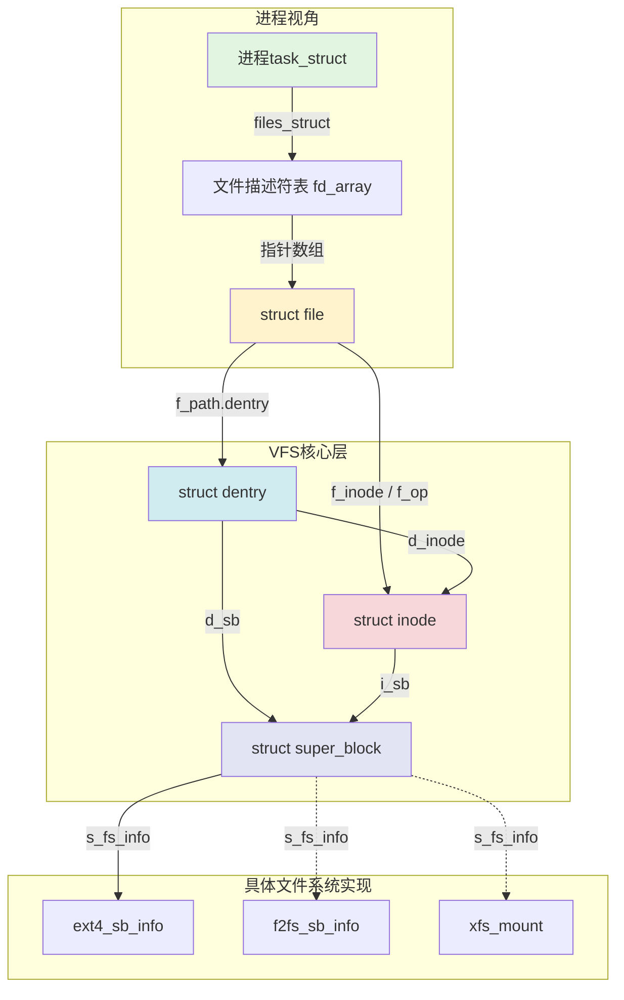
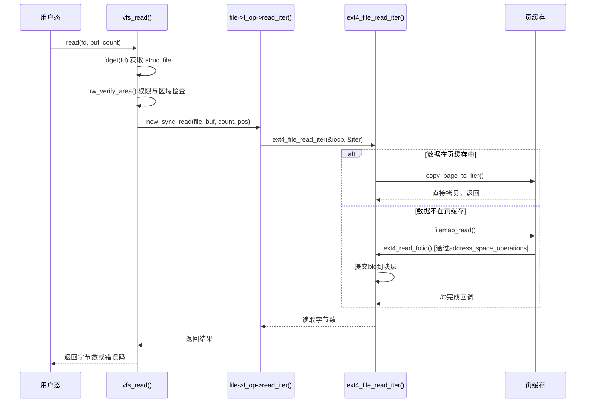

# 12.1.1 VFS概览与核心结构

> 所属章节：第12章 文件系统 > 12.1 VFS统一接口
>
> 难度：[I→M] | 预计阅读时间：25分钟

## <span class="blue"> 本节导读

无论 mount 的是 ext4 还是 f2fs，应用程序的 `open`/`read`/`write` 代码不用改——做这个统一的就是 VFS（Virtual File System）。<br>
本节覆盖：

- VFS 四个核心对象（super_block/inode/dentry/file）的职责、字段与层次关系
- 三个操作表（super_operations/inode_operations/file_operations）如何实现"统一接口"
- 以 `read()` 为例的完整调用链，对照 v6.6 内核真实代码

---

## <span class="blue"> VFS四对象：文件系统的统一抽象 [I→M]

VFS 用四个核心对象描述一个文件系统的全貌。它们分别对应四个不同层面的问题：文件系统怎么挂载（super_block）、文件在磁盘上怎么标识（inode）、路径怎么解析（dentry）、打开的文件怎么读写（file）。

### super_block——文件系统实例

`struct super_block` 代表一个**已挂载的文件系统实例**。每次 `mount` 操作，内核都会创建一个 `super_block`，保存整个文件系统的全局信息：块大小、inode 总数、空闲空间、魔数、根目录 dentry 指针，以及指向 `s_op`（`super_operations`）的函数指针表。一个文件系统类型（如 ext4）可以挂载到多个挂载点，每个挂载点对应一个独立的 `super_block`，但共享同一个文件系统驱动。

```c
struct super_block {
    struct list_head    s_list;          /* 全局sb链表 */
    dev_t               s_dev;           /* 设备标识 */
    unsigned long       s_blocksize;     /* 块大小 */
    struct file_system_type *s_type;     /* 文件系统类型 */
    struct super_operations *s_op;       /* 超级块操作表 */
    struct dentry        *s_root;        /* 根目录dentry */
    struct list_head     s_inodes;       /* 该sb下所有inode链表 */
    void                *s_fs_info;      /* 具体FS私有数据（如ext4_sb_info） */
    /* ... */
};
```

### inode——文件的元数据

`struct inode` 描述一个**文件在磁盘上的存在**，与进程无关。它保存文件的元数据：权限、所有者、大小、时间戳、链接数，以及文件数据的位置索引（通过 `i_mapping` 指向的 address_space 管理页缓存映射）。每个物理文件（包括目录、设备文件、socket 等）对应一个 inode，内核以 `(super_block, inode号)` 二元组全局唯一标识它。

```c
struct inode {
    umode_t              i_mode;         /* 文件类型+权限 */
    kuid_t               i_uid;          /* 所有者UID */
    kgid_t               i_gid;          /* 所属组GID */
    loff_t               i_size;         /* 文件字节大小 */
    struct timespec64    i_atime;        /* 最后访问时间 */
    struct timespec64    i_mtime;        /* 最后修改时间 */
    struct block_device *i_bdev;         /* 块设备指针（若是块设备文件） */
    struct address_space *i_mapping;     /* 页缓存/address_space */
    const struct inode_operations *i_op; /* inode操作表 */
    const struct file_operations  *i_fop;/* 默认文件操作（打开时复制到file） */
    struct super_block   *i_sb;          /* 所属超级块 */
    unsigned long        i_ino;          /* inode号 */
    /* ... */
};
```

> ⚠️ VFS 的 `struct inode` 不等于磁盘上的 inode 结构。它是内核从磁盘 inode 记录（如 ext4 的 `struct ext4_inode`）加载并转换而来的**内存对象**。不同文件系统的磁盘 inode 格式差异很大，但都被统一转换成 VFS inode。

### dentry——目录缓存

`struct dentry` 代表**目录项**，核心作用不是"存储"，而是"缓存"。内核把路径解析的中间结果（如 `/usr/bin/gcc` 中的 `/`、`usr`、`bin`、`gcc`）每个分量缓存为一个 dentry，建立文件名到 inode 的映射。dentry 通过 `d_parent` 和 `d_child` 组织成一棵树，构成整个文件系统的目录树视图。

```c
struct dentry {
    unsigned int         d_flags;        /* dentry标志 */
    struct inode        *d_inode;        /* 关联的inode（可能为NULL，负dentry） */
    struct dentry       *d_parent;       /* 父目录 */
    struct qstr          d_name;         /* 文件名 */
    struct list_head     d_child;        /* 父目录的子项链表 */
    struct list_head     d_subdirs;      /* 子目录/文件链表 */
    const struct dentry_operations *d_op;/* dentry操作表 */
    struct super_block  *d_sb;           /* 所属超级块 */
    unsigned char        d_iname[DNAME_INLINE_LEN]; /* 短文件名内联存储 */
    /* ... */
};
```

> 💡 dentry 缓存（dcache）是 VFS 最重要的性能优化之一。没有它，每次 `open("/usr/bin/gcc")` 都要从根目录开始逐个读取磁盘块解析路径。负 dentry（negative dentry）记录"这个文件不存在"的查询结果，避免对同一不存在路径的重复磁盘查找。

### file——打开的文件实例

`struct file` 代表**一个进程对文件的打开实例**。与 inode 的"进程无关"不同，file 是进程相关的——同一个文件被两个进程打开，内核会创建两个 `struct file`，但它们指向同一个 inode。file 保存读写位置（`f_pos`）、打开模式（`f_mode`）、状态标志（`f_flags`），以及指向 `f_op` 的操作表。

```c
struct file {
    union {
        struct llist_node   f_llist;     /* 文件对象链表 */
        struct rcu_head     f_rcuhead;
        unsigned int        f_iocb_flags;/* iocb 状态标志 */
    };
    struct path          f_path;         /* (dentry, vfsmount)路径 */
    struct inode        *f_inode;        /* 缓存的inode指针 */
    const struct file_operations *f_op;  /* 文件操作表 */
    spinlock_t           f_lock;         /* 保护f_ep、f_flags */
    atomic_long_t        f_count;        /* 引用计数 */
    unsigned int         f_flags;        /* O_RDONLY/O_NONBLOCK等 */
    fmode_t              f_mode;         /* 访问模式 */
    struct mutex         f_pos_lock;     /* 保护f_pos */
    loff_t               f_pos;          /* 当前读写偏移 */
    /* ... */
};
```

> 🔴 inode 描述"文件是什么"（元数据），file 描述"进程怎么用这个文件"（会话状态）。`f_pos` 是 file 级别的——两个进程打开同一文件，各自有独立的读写位置，这正是 file 对象存在的意义。

### 四对象的层次关系



进程通过文件描述符找到 `file`，`file` 指向 `dentry`（路径缓存）和 `inode`（文件元数据），`inode` 和 `dentry` 都归属于某个 `super_block`（文件系统实例），`super_block` 的 `s_fs_info` 指向具体文件系统的私有数据。这是一个从"通用接口"到"具体实现"的清晰分层。

### 四对象职责对比

| 对象 | 代表什么 | 生命周期 | 核心字段 | 与进程的关系 |
|:---|:---|:---|:---|:---|
| `super_block` | 已挂载的文件系统实例 | `mount`创建，`umount`销毁 | `s_op`, `s_root`, `s_fs_info` | 无关，全局存在 |
| `inode` | 磁盘上的文件存在 | 被引用时驻内存，可回收 | `i_op`, `i_mapping`, `i_ino` | 无关，多进程共享 |
| `dentry` | 路径名解析缓存 | dcache LRU管理 | `d_inode`, `d_parent`, `d_name` | 无关，全局缓存 |
| `file` | 打开的文件实例 | `open`创建，`close`释放 | `f_op`, `f_pos`, `f_flags` | **进程相关**，每open一次一个实例 |

很多内核开发的困惑源于混淆这四个对象的边界。记住一条口诀：**open 创建 file，lookup 创建 dentry，iget 创建 inode，mount 创建 super_block**。四个不同的生命周期，四个不同的管理策略。

---

## <span class="blue"> VFS操作表：统一接口背后的函数指针 [I]

四对象定义了数据结构，VFS 的统一能力真正体现在**操作表**上。每个对象带一个函数指针表，VFS 上层代码只调用接口函数，具体指向谁由底层文件系统决定。

三个核心操作表：

- **`super_operations`**（`s_op`）：文件系统级别的元操作。分配/释放 inode（`alloc_inode`/`destroy_inode`）、同步脏数据（`sync_fs`）、统计信息（`statfs`）。
- **`inode_operations`**（`i_op`）：inode 级别的操作。创建文件（`create`）、查找目录项（`lookup`）、链接（`link`/`symlink`）、修改属性（`setattr`）。改变的是"文件在目录树中的存在方式"和元数据。
- **`file_operations`**（`f_op`）：文件打开实例的操作。读（`read`/`read_iter`）、写（`write`/`write_iter`）、位置跳转（`llseek`）、内存映射（`mmap`）、`ioctl`。针对"已打开的文件内容"。

### 以 read() 为例的完整调用链



代码层面，`vfs_read()` 的真实实现（v6.6 `fs/read_write.c`:450，有删节）：

```c
ssize_t vfs_read(struct file *file, char __user *buf, size_t count, loff_t *pos)
{
    ssize_t ret;

    if (!(file->f_mode & FMODE_READ))
        return -EBADF;
    if (!(file->f_mode & FMODE_CAN_READ))
        return -EINVAL;
    if (unlikely(!access_ok(buf, count)))
        return -EFAULT;

    ret = rw_verify_area(READ, file, pos, count);   /* 访问权限与区域检查 */
    if (ret)
        return ret;
    if (count > MAX_RW_COUNT)
        count = MAX_RW_COUNT;

    if (file->f_op->read)
        ret = file->f_op->read(file, buf, count, pos);      /* 旧式同步接口 */
    else if (file->f_op->read_iter)
        ret = new_sync_read(file, buf, count, pos);         /* iov_iter 接口 */
    else
        ret = -EINVAL;
    /* ... */
    return ret;
}
```

关键点：`vfs_read` 本身不碰任何文件系统的具体细节。它做权限检查、用户指针校验、区域验证，然后按操作表里填的是 `read` 还是 `read_iter` 分派——现代文件系统填的都是 `read_iter`，由 `new_sync_read()` 包一层同步调用。这个函数指针指向谁，取决于打开的文件属于哪个文件系统。

以 ext4 为例，`ext4_file_operations` 的定义在 `fs/ext4/file.c` 中：

```c
const struct file_operations ext4_file_operations = {
    .read_iter  = ext4_file_read_iter,
    .write_iter = ext4_file_write_iter,
    .llseek     = ext4_llseek,
    .mmap       = ext4_file_mmap,
    .open       = ext4_file_open,
    .release    = ext4_release_file,
    .fsync      = ext4_sync_file,
    .splice_read = ext4_file_splice_read,
    /* ... */
};
```

打开一个 ext4 文件时，内核在 `ext4_lookup` 或 `ext4_create` 中把 inode 的 `i_fop` 指向 `ext4_file_operations`，随后 `dentry_open` 创建 `struct file` 时把 `inode->i_fop` 复制到 `file->f_op`。从此 `file->f_op->read_iter` 就是 `ext4_file_read_iter`。换成 f2fs，同一个位置指向 `f2fs_file_read_iter`——VFS 层代码完全不关心差异。

### 三个操作表职责对比

| 操作表 | 挂在哪个对象 | 典型操作 | 操作的粒度 |
|:---|:---|:---|:---|
| `super_operations` | `super_block->s_op` | `alloc_inode`, `destroy_inode`, `sync_fs`, `statfs` | 整个文件系统 |
| `inode_operations` | `inode->i_op` | `lookup`, `create`, `link`, `mkdir`, `setattr` | 单个文件的元数据/目录关系 |
| `file_operations` | `file->f_op` | `read_iter`, `write_iter`, `llseek`, `mmap`, `ioctl` | 打开的文件实例的内容读写 |

> 💡 VFS 操作表是面向对象多态在内核 C 代码中的实现：C 没有虚函数表，VFS 用显式函数指针表达同样的效果。每个文件系统驱动本质上就是填充这些操作表"注册"到 VFS 框架中，这让 Linux 能在不修改上层代码的情况下支持上百种文件系统。

### VFS抽象的代价与收益

VFS 的统一不是免费的。每次文件操作都要经过多层函数指针跳转（`vfs_read` → `f_op->read_iter` → `ext4_file_read_iter`），四对象模型本身也有内存占用——dentry 缓存可以吃掉几百 MB 内存。

但这笔账在工程上是划算的。没有 VFS，每个文件系统都要自己实现路径解析、页缓存交互、权限检查、并发控制——不仅是重复造轮子，更会导致用户空间 API 的分裂。VFS 用一层可控的开销，换来文件系统的可替换性、代码复用和 API 统一；相比磁盘 I/O 的延迟，这层开销可以忽略不计。

---

## <span class="blue"> 本节总结

| 维度 | 要点 |
|------|------|
| **四对象** | super_block=挂载实例（mount 创建）、inode=文件元数据（iget 创建）、dentry=路径缓存（lookup 创建）、file=打开实例（open 创建，进程相关） |
| **三操作表** | s_op 管文件系统本身、i_op 管元数据与目录关系、f_op 管打开实例的内容读写 |
| **read() 调用链** | `vfs_read()` → 权限/区域检查 → `new_sync_read()` → `ext4_file_read_iter()` → 页缓存命中或提交 bio |
| **多态机制** | `inode->i_fop` 在 open 时复制到 `file->f_op`，VFS 层对文件系统差异零感知 |
| **Trade-off** | 一层函数指针开销 + dentry/inode 缓存内存，换文件系统可替换性与 API 统一 |

---

## <span class="blue"> 下一步

四对象的静态结构建立了，下一节跟着一次 `open()` 走完整路径：路径解析如何逐分量消耗、dentry 和 inode 在什么时候被创建、nameidata 在解析中扮演什么角色。

> **12.1.2 文件操作路径**

---

## <span class="blue"> 配套资源

| 资源类型 | 内容 |
|----------|------|
| **内核源码** | `include/linux/fs.h`（四对象结构体定义）、`fs/read_write.c`（vfs_read/new_sync_read）、`fs/ext4/file.c`（ext4_file_operations） |
| **实验** | 读 `/proc/slabinfo` 观察 dentry 和 inode 缓存数量；用 ftrace function_graph 追踪 `vfs_read` → `ext4_file_read_iter` 调用链 |
| **延伸阅读** | `Documentation/filesystems/vfs.rst`；LWN "The Linux VFS" 系列 |
