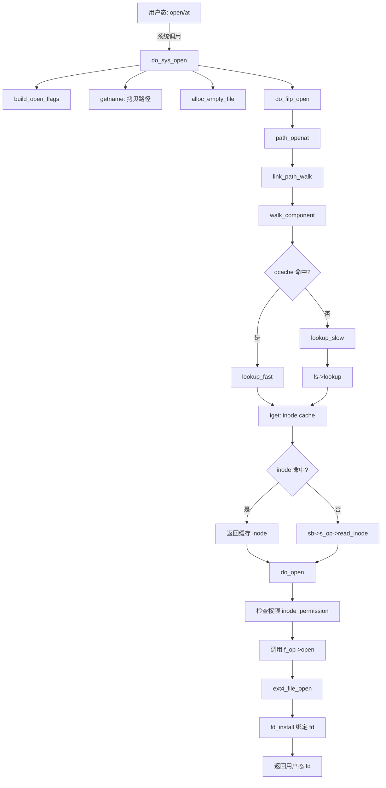

# 12.1.2 文件操作路径

## 本节导读

你调用 `open("/etc/fstab")` 时，内核内部发生了什么？不是简单地打开文件——它要解析路径、查找 inode、创建 file 对象，这一套流程就是 VFS 的职责。本节追踪 `open()`、`read()` 和 `write()` 三个核心文件操作的完整内核路径，揭示 VFS 如何将用户层的系统调用路由到具体文件系统的实现。理解这些路径是分析文件 I/O 性能瓶颈和调试文件系统问题的关键基础。

---

## 知识点 168：`open()` 的完整调用路径 [I][M]

### 从用户态到 VFS 入口

当用户程序调用 C 库的 `open()` 函数时，glibc 通过封装将请求转换为 `openat` 系统调用。进入内核后，执行流到达 `do_sys_open()`，这是 VFS 层处理文件打开的统一入口。该函数承担三项核心职责：解析文件路径、查找或创建目标对象的 dentry 与 inode，以及分配并初始化 `struct file` 对象。

```
do_sys_open()
├── build_open_flags()       // 解析 O_RDONLY / O_CREAT / O_DIRECT 等标志位
├── getname()                // 将用户态路径名拷贝到内核空间
├── alloc_empty_file()       // 分配 struct file 对象
├── do_filp_open()           // 核心：路径解析与文件打开
│   └── path_openat()        // 使用 nameidata 进行路径遍历
├── fsnotify_open()          // 文件打开事件通知
└── fd_install()             // 将 file 对象绑定到文件描述符表
```

### `nameidata`：路径解析的核心数据结构

🔴 **关键结构**：`nameidata` 是内核路径解析机制的核心载体，定义在 `fs/namei.c` 中。它记录了路径遍历的完整状态，包括当前搜索位置（`struct path path`）、根目录（`struct path root`）、最后一个分量的类型（`last_type`），以及用于跟踪符号链接嵌套深度的 `link_count` 等字段。

`link_count` 的存在至关重要——内核通过它防止符号链接循环攻击（如 `a` 指向 `b`、`b` 又指回 `a`）。当 `link_count` 超过 `MAX_NESTED_LINKS`（通常为 8）时，内核返回 `ELOOP` 错误。

路径解析由 `link_path_walk()` 函数主导。它以 `/` 为起点逐分量遍历：对每个路径分量调用 `walk_component()`，通过 `lookup_fast()` 优先在 dentry cache 中查找，未命中则回退到 `lookup_slow()` 进行实时解析。

⚠️ **路径解析的安全约束**：`nameidata` 中的 `mnt` 字段指向当前挂载点（`struct vfsmount`），用于处理跨越挂载点的路径遍历——当路径穿越 `/proc`、`/sys` 或 mount namespace 边界时，内核需要更新挂载上下文。嵌套符号链接的深度限制则防止了拒绝服务攻击。

### Dentry Cache：避免重复路径解析的加速器

⚠️ **性能关键**：dentry cache（简称 dcache）是 VFS 最核心的性能优化机制之一。它缓存了从文件名到 `struct dentry` 的映射关系，使得重复访问相同路径时无需重新执行耗时的磁盘查找。

dcache 采用哈希表组织，以父 dentry 指针和文件名为键。`lookup_fast()` 首先计算哈希值并在 dcache 中匹配：命中时直接返回已缓存的 dentry，整个路径解析可在微秒级完成；未命中时触发 `lookup_slow()`，调用具体文件系统的 `lookup` 方法从磁盘读取目录项。

💡 **设计要点**：dcache 使用 LRU（Least Recently Used）回收策略，并受 `sysctl vfs_cache_pressure` 参数调控。当系统内存紧张时，dcache 条目可能被回收——这意味着后续访问需要重新执行完整的磁盘 I/O 路径。

dentry 与 inode 的关系值得厘清：dentry 代表"目录项"，即路径中的一个命名节点；inode 代表"文件本身"，包含元数据与数据块指针。一个 inode 可被多个 dentry 引用（硬链接场景），但每个 dentry 只指向一个 inode。

### Inode 的查找与缓存

当 dcache 未命中或需要访问文件元数据时，内核通过 `iget()` 系列函数获取 `struct inode`。流程如下：

1. 首先查询 inode cache（以超级块指针和 inode 号为键的哈希表）
2. 命中则返回已缓存的 inode，同时增加引用计数
3. 未命中则分配新 inode 结构，调用文件系统的 `iget()` 或 `read_inode()` 从磁盘读取

🔴 `struct inode` 包含文件的完整元数据：模式位（mode）、UID/GID、大小、时间戳、数据块映射（`i_blocks`/`i_mapping`）等。`i_mapping` 指向的 `address_space` 对象是 page cache 管理的核心，后续 `read()`/`write()` 操作将围绕它展开。

💡 **inode 生命周期管理**：每个 inode 维护 `i_count`（引用计数）和 `i_nlink`（硬链接计数）。当 `i_count` 降为零且 `i_nlink` 为零时，文件系统触发 inode 回收。打开的文件描述符持有对 inode 的引用，因此在文件描述符关闭前，即使磁盘上的目录项已被删除，inode 仍然存活——这就是 Unix "文件删除后仍可读写" 的机制。

### `open()` 调用链 Mermaid 图



### 文件操作 API 与 VFS 层对应关系

| 用户态 API | 系统调用 | VFS 入口 | 核心处理函数 | 文件系统回调 |
|-----------|---------|---------|------------|------------|
| `open()` | `sys_openat` | `do_sys_open()` | `do_filp_open()` → `path_openat()` | `f_op->open()` |
| `close()` | `sys_close` | `close_fd()` | `fput()` → `__fput()` | `f_op->release()` |
| `read()` | `sys_read` | `ksys_read()` | `vfs_read()` | `f_op->read_iter()` |
| `write()` | `sys_write` | `ksys_write()` | `vfs_write()` | `f_op->write_iter()` |
| `lseek()` | `sys_lseek` | `ksys_lseek()` | `vfs_llseek()` | `f_op->llseek()` |
| `fsync()` | `sys_fsync` | `do_fsync()` | `vfs_fsync()` | `f_op->fsync()` |
| `mmap()` | `sys_mmap` | `do_mmap()` | `mmap_region()` | `f_op->mmap()` |

⚠️ **注意**：上表中 `read()` 和 `write()` 在较新内核中默认走 `read_iter`/`write_iter` 路径（基于 `struct kiocb` 的异步 I/O 框架），而非传统的 `read`/`write` 回调。这是 Linux 内核为支持异步 I/O 和优化批量传输所做的演进。

---

## 知识点 169：`read()` 和 `write()` 的完整路径 [I]

### 从系统调用到 VFS 读层

用户程序调用 `read(fd, buf, count)` 后，内核通过 `ksys_read()` 进入 VFS 层。该函数根据文件描述符找到对应的 `struct file`，然后调用 `vfs_read()`——这是所有文件读取操作的统一抽象入口。

`vfs_read()` 依次检查 `FMODE_READ` 标志、验证用户缓冲区地址，然后调用 `file->f_op->read_iter()`。对于 ext4 等常规文件系统，`read_iter` 指向 `generic_file_read_iter()`。

### 缓冲 I/O 的执行流

`generic_file_read_iter()` 是缓冲 I/O 的核心枢纽，其调用结构如下：

```
generic_file_read_iter()
├── O_DIRECT? → 跳转 direct_IO 路径
└── filemap_read()              // page cache 层
    ├── find_get_pages()        // 查已缓存页面
    ├── copy_page_to_iter()     // 拷贝到用户空间（命中快速路径）
    └── 未命中：
        ├── page_cache_sync_readahead()  // 预读
        └── ext4_read_folio() → submit_bio()  // 磁盘 I/O
```

当数据已在 page cache 中时，直接通过 `copy_page_to_iter()` 拷贝到用户空间，无磁盘 I/O。未命中时触发 readahead 批量读取相邻页面，最终由 `ext4_read_folio()` 构建 bio 下发块设备层。

### 直接 I/O（`O_DIRECT`）

💡 **核心概念**：`O_DIRECT` 标志打开的文件，其 I/O 请求走 `direct_IO` 路径：

```
vfs_read() → call_read_iter() → generic_file_direct_read() → ext4_direct_IO()
```

内核验证缓冲区地址、偏移和长度均按逻辑块大小对齐后，直接构建 bio 提交块设备，数据在用户缓冲区与磁盘间 DMA 传输，完全不经过 page cache。

🔴 **适用场景**：数据库（MySQL、PostgreSQL）使用 `O_DIRECT` 自管理缓冲，避免内核 page cache 与自身缓冲层的双重拷贝。

⚠️ **约束**：未对齐访问返回 `EINVAL`；丧失预读和延迟写优化，小 I/O 性能差。

### Buffered I/O vs Direct I/O 对比

| 维度 | Buffered I/O | Direct I/O (O_DIRECT) |
|-----|-------------|----------------------|
| 数据路径 | 磁盘→page cache→用户空间 | 磁盘↔用户空间（DMA） |
| Page Cache | 使用 | 绕过 |
| 内存拷贝 | 2 次 | 1 次（无 CPU 拷贝） |
| 对齐要求 | 无 | 地址、偏移、长度按块对齐 |
| 预读 | 自动预读 | 无 |
| 延迟写 | 支持（writeback） | 不支持 |
| 适用场景 | 通用访问、热点数据 | 数据库自管理缓存 |
| 一致性 | 需 fsync 刷盘 | 直接落盘 |

💡 **选型指导**：无自管理缓冲层的应用默认使用缓冲 I/O；数据库等场景按需启用 `O_DIRECT`。

---

## 本节总结

本节追踪了文件操作的完整内核路径。`open()` 经过 `do_sys_open()` → `path_openat()` → `do_open()` 的调用链，核心挑战是路径解析——`nameidata` 驱动逐分量遍历，dcache 和 inode cache 则显著加速重复访问。`read()` 和 `write()` 通过 `vfs_read()`/`vfs_write()` 进入 VFS，缓冲 I/O 走 `generic_file_read_iter()` 利用 page cache 优化热点访问，而 `O_DIRECT` 通过 `ext4_direct_IO()` 绕过页缓存实现用户空间与磁盘的直接传输。

理解这些路径的实战意义在于：当 `open()` 变慢时，检查 dcache 命中率和目录项数量；当 `read()` 吞吐不达标时，分析 page cache 命中率和预读策略；当数据库使用 `O_DIRECT` 出现问题时，首先检查内存对齐是否符合块设备要求。

---

## 下一步

下一节（12.1.3）将深入 Page Cache 的内部机制，分析 `address_space` 结构、页回写（writeback）策略、`radix_tree` 到 `xarray` 的演进，以及 `fsync()` 和 `sync()` 如何保证数据持久性——这是对本节 `read()`/`write()` 路径中 page cache 环节的深度展开。

---

## 配套资源

- **内核源码**：`fs/open.c`（`do_sys_open`）、`fs/namei.c`（`link_path_walk`）、`mm/filemap.c`（`generic_file_read_iter`）、`fs/ext4/file.c`（`ext4_file_read_iter`）
- **跟踪工具**：`ftrace -p function_graph -l do_sys_open -l vfs_read -l generic_file_read_iter` 实时追踪调用链
- **性能计数器**：`perf stat -e dTLB-load-misses,page-faults,block:block_rq_issue dd if=/dev/zero of=/tmp/test bs=1M count=100`
- **/proc 接口**：`/proc/sys/vm/vfs_cache_pressure` 调控 dcache 回收压力，`/proc/meminfo` 中的 `Cached` 字段显示 page cache 大小
