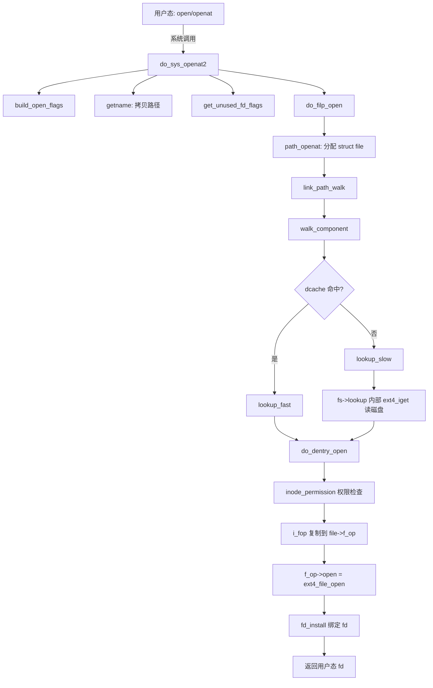

# 12.1.2 文件操作路径

> 所属章节：第12章 文件系统 > 12.1 VFS统一接口
>
> 难度：[I→M] | 预计阅读时间：25分钟

## <span class="blue"> 本节导读

上一节建立了 VFS 四对象的静态结构，本节让它们动起来：追踪 `open()`、`read()`/`write()` 三个操作在内核里的完整路径。<br>
本节覆盖：

- `open()` 的调用链：do_sys_open → path_openat → do_open，对照 v6.6 真实代码
- 路径解析三要素：nameidata、dentry cache、inode cache
- 缓冲 I/O 与 O_DIRECT 两条读路径的分叉点与选型判据

---

## <span class="blue"> open() 的完整调用路径 [I→M]

### 从用户态到 VFS 入口

glibc 的 `open()` 封装转换为 `openat` 系统调用。进入内核后，执行流到达 `do_sys_open()`，它转发给真正干活的 `do_sys_openat2()`（v6.6 `fs/open.c`:1406）：

```
do_sys_open() → do_sys_openat2()
├── build_open_flags()       // 解析 O_RDONLY / O_CREAT / O_DIRECT 等标志位
├── getname()                // 将用户态路径名拷贝到内核空间
├── get_unused_fd_flags()    // 在文件描述符表中预留一个 fd 槽位
├── do_filp_open()           // 核心：路径解析与文件打开
│   └── path_openat()        // 分配 struct file，用 nameidata 遍历路径
│       └── do_dentry_open() // f_op 复制、权限检查、fsnotify_open、调 f_op->open
└── fd_install()             // 把 file 对象绑进预留的 fd 槽位
```

> 💡 fd 槽位是**先预留后绑定**的：`get_unused_fd_flags()` 先占位，`do_filp_open()` 失败就 `put_unused_fd()` 归还，成功才 `fd_install()`。这个顺序保证了多线程下 fd 分配不会撞车。

### nameidata：路径解析的核心数据结构

`nameidata` 定义在 `fs/namei.c` 中，是路径遍历的完整状态载体：当前位置（`struct path path`）、根目录（`struct path root`）、最后一个分量的类型（`last_type`）、符号链接嵌套深度（`link_count`）等。

`link_count` 用于防符号链接循环（`a` 指向 `b`、`b` 指回 `a`）：嵌套深度超过 `MAX_NESTED_LINKS`（v6.6 `include/linux/namei.h`:11，值为 **8**）时返回 `ELOOP`。

路径解析由 `link_path_walk()` 主导，逐分量调用 `walk_component()`：`lookup_fast()` 优先查 dentry cache，未命中回退 `lookup_slow()` 实时解析。

> ⚠️ `nameidata` 中的挂载点字段处理跨挂载点遍历——路径穿越 `/proc`、`/sys` 或 mount namespace 边界时，内核需要切换挂载上下文。符号链接深度限制同时防住了利用循环链接的拒绝服务攻击。

### Dentry Cache：路径解析的加速器

dcache 缓存文件名到 `struct dentry` 的映射，以父 dentry 指针和文件名为哈希键。`lookup_fast()` 命中时整个解析在微秒级完成；未命中时 `lookup_slow()` 调用具体文件系统的 `lookup` 方法从磁盘读目录项。

dcache 用 LRU 回收，受 `sysctl vfs_cache_pressure` 调控：内存紧张时条目被回收，后续访问重新走磁盘 I/O。

dentry 与 inode 的关系：dentry 是"路径中的一个命名节点"，inode 是"文件本身"。一个 inode 可被多个 dentry 引用（硬链接），每个 dentry 只指向一个 inode。

### Inode 的查找与缓存

inode 的获取走 `iget_locked()` 系列：先查 inode cache（以超级块指针 + inode 号为键的哈希表），命中直接返回；未命中则分配新的内存 inode 并置 I_NEW 标志。

> ⚠️ 一个常见的过时说法：inode 由 `s_op->read_inode` 从磁盘读入。这个回调在内核 2.6 时代就被移除了。v6.6 里读磁盘 inode 发生在**文件系统自己的 lookup 内部**——`ext4_lookup()` 调用 `ext4_iget()` 完成磁盘 inode 的读取和转换，VFS 层不参与。

inode 的 `i_count`（引用计数）和 `i_nlink`（硬链接计数）决定其生命周期：`i_count` 为零且 `i_nlink` 为零时触发回收。打开的文件描述符持有引用，所以文件被 `rm` 删除后，只要还有进程开着它，inode 就仍然存活——这就是 Unix "文件删除后仍可读写"的机制。

### open() 调用链流程图



### 文件操作 API 与 VFS 层对应关系

| 用户态 API | 系统调用 | VFS 入口 | 核心处理函数 | 文件系统回调 |
|-----------|---------|---------|------------|------------|
| `open()` | `openat` | `do_sys_open()` | `do_filp_open()` → `path_openat()` | `f_op->open()` |
| `close()` | `close` | `close_fd()` | `fput()` → `__fput()` | `f_op->release()` |
| `read()` | `read` | `ksys_read()` | `vfs_read()` | `f_op->read_iter()` |
| `write()` | `write` | `ksys_write()` | `vfs_write()` | `f_op->write_iter()` |
| `lseek()` | `lseek` | `ksys_lseek()` | `vfs_llseek()` | `f_op->llseek()` |
| `fsync()` | `fsync` | `do_fsync()` | `vfs_fsync()` | `f_op->fsync()` |
| `mmap()` | `mmap` | `ksys_mmap_pgoff()` | `do_mmap()` → `mmap_region()` | `f_op->mmap()` |

---

## <span class="blue"> read()/write() 的完整路径 [I]

### 从系统调用到 VFS 读层

`read(fd, buf, count)` 经 `ksys_read()` 进入 VFS，按 fd 找到 `struct file` 后调用 `vfs_read()`——真实实现已在 12.1.1 展开（权限检查 → `new_sync_read()` → `f_op->read_iter()`）。

对 ext4，`read_iter` 指向 **`ext4_file_read_iter()`**——它是 ext4 自己的包装（处理 DAX、verity 等 ext4 特有条件），主路径再调用 `generic_file_read_iter()`。

> ⚠️ "ext4 的 read_iter 就是 generic_file_read_iter"是不准确的：ext4 的 fops 里填的是 `ext4_file_read_iter`，generic 版本是它的内层。调试时断点打错位置会漏掉 ext4 的包装逻辑。

### 缓冲 I/O 的执行流

`generic_file_read_iter()`（v6.6 `mm/filemap.c`:2790）是缓冲 I/O 的核心枢纽：

```
generic_file_read_iter()
├── IOCB_DIRECT? → direct_IO 路径（见下）
└── filemap_read()                   // page cache 层
    ├── find_get_page()              // 查已缓存页面
    ├── copy_page_to_iter()          // 命中：拷贝到用户空间
    └── 未命中：
        ├── page_cache_sync_readahead()  // 同步预读
        └── ext4_read_folio() → submit_bio()  // 磁盘 I/O
```

数据已在 page cache 时直接 `copy_page_to_iter()` 拷贝，无磁盘 I/O；未命中时预读批量读入相邻页面，由 `ext4_read_folio()` 构建 bio 下发块层。

### 直接 I/O（O_DIRECT）

`O_DIRECT` 打开的文件在 `generic_file_read_iter()` 入口就分叉（v6.6 `mm/filemap.c`:2798）：

```
generic_file_read_iter()
└── IOCB_DIRECT 分支:
    ├── kiocb_write_and_wait()       // 先把该区域脏页刷下去，保证一致性
    └── mapping->a_ops->direct_IO()  // = ext4_direct_IO，直接构建 bio
```

数据在用户缓冲区与磁盘间 DMA 传输，不经过 page cache。注意第一个动作是**先把该区域的脏页写回**——防止页缓存里的脏数据与直读结果不一致。

> 🔴 数据库（MySQL、PostgreSQL）用 `O_DIRECT` 自管理缓冲，避免内核 page cache 与自身缓冲层的双重缓存。代价是失去预读和延迟写优化，且缓冲区地址、偏移、长度都必须按逻辑块大小对齐，否则 `EINVAL`。

### Buffered I/O vs Direct I/O 对比

| 维度 | Buffered I/O | Direct I/O (O_DIRECT) |
|-----|-------------|----------------------|
| 数据路径 | 磁盘→page cache→用户空间 | 磁盘↔用户空间（DMA） |
| Page Cache | 使用 | 绕过（但先回写该区域脏页） |
| 内存拷贝 | 2 次 | 1 次（无 CPU 拷贝） |
| 对齐要求 | 无 | 地址、偏移、长度按块对齐 |
| 预读 | 自动预读 | 无 |
| 延迟写 | 支持（writeback） | 不支持 |
| 适用场景 | 通用访问、热点数据 | 数据库自管理缓存 |

> 💡 无自管理缓冲层的应用默认用缓冲 I/O；只有明确知道自己在做什么的场景（数据库、专用存储引擎）才启用 `O_DIRECT`。

---

## <span class="blue"> 本节总结

| 维度 | 要点 |
|------|------|
| **open() 调用链** | `do_sys_openat2()` → 预留 fd → `do_filp_open()`/`path_openat()` → `do_dentry_open()`（f_op 复制+权限检查）→ `fd_install()` |
| **路径解析三要素** | nameidata 携带状态（链接深度上限 8）、dcache 加速命名查找、inode cache 加速元数据获取 |
| **过时说法修正** | 磁盘 inode 读取在 fs->lookup 内部完成（ext4_iget），无 s_op->read_inode |
| **read() 路径** | ext4_file_read_iter → generic_file_read_iter → filemap_read（缓冲）或 a_ops->direct_IO（O_DIRECT，先回写脏页） |
| **实战指引** | open 慢查 dcache 命中率；read 吞吐低查 page cache 命中与预读；O_DIRECT 报错先查对齐 |

---

## <span class="blue"> 下一步

open 的路径走完了，但文件系统是怎么挂到目录树上的？下一节看 mount 系统调用的完整流程，以及 /proc/mounts 里每一列对应内核的什么状态。

> **12.1.3 挂载流程与proc_mounts**

---

## <span class="blue"> 配套资源

| 资源类型 | 内容 |
|----------|------|
| **内核源码** | `fs/open.c`（do_sys_openat2）、`fs/namei.c`（link_path_walk）、`mm/filemap.c`（generic_file_read_iter）、`fs/ext4/file.c`（ext4_file_read_iter） |
| **跟踪工具** | ftrace function_graph 过滤 `do_sys_openat2`、`vfs_read`、`generic_file_read_iter` 实时追踪调用链 |
| **/proc 接口** | `/proc/sys/vm/vfs_cache_pressure` 调控 dcache 回收压力；`/proc/meminfo` 的 `Cached` 字段显示 page cache 大小 |
