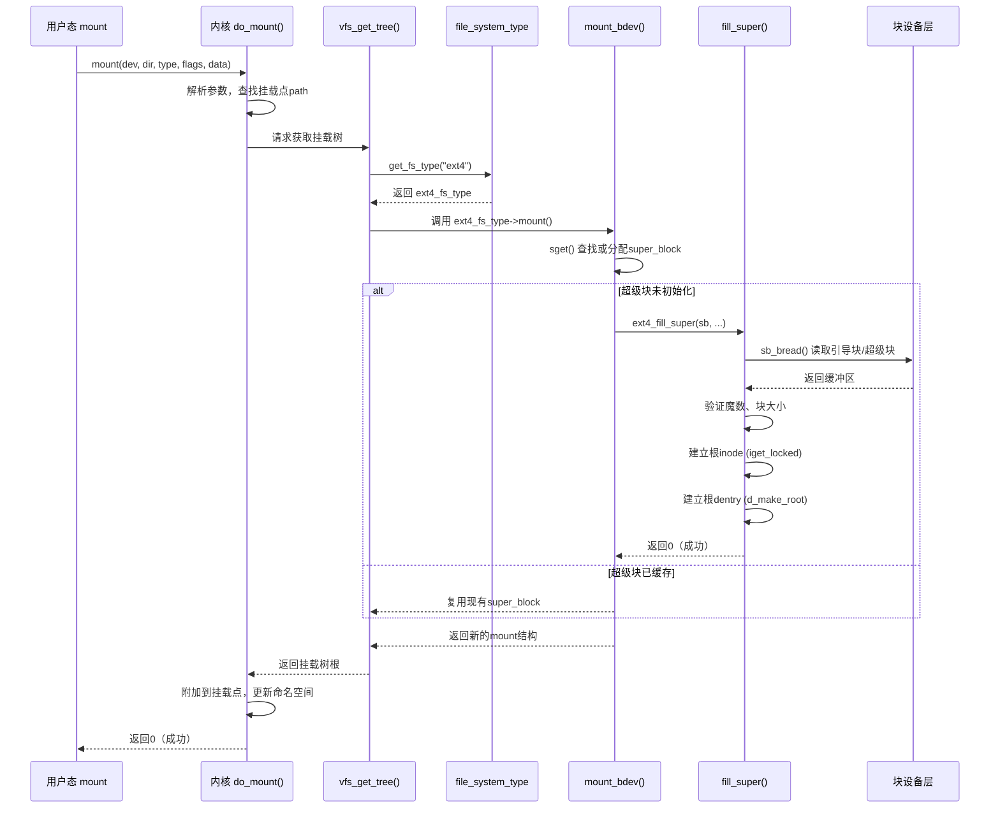

# 12.1.3 挂载流程与 /proc/mounts

**本节导读**

`mount /dev/mmcblk0p1 /mnt` 做了什么？不只是把设备和目录连起来——它要初始化文件系统、读取超级块、建立根目录的 dentry，整个流程就是文件系统的"启动过程"。理解挂载流程，是掌握文件系统子系统如何从无到有构建访问路径的关键。本节将拆解内核中的完整挂载调用链，并介绍如何通过 `/proc/mounts` 查看已挂载文件系统的状态信息。

---

## 知识点 170：挂载流程 —— 从 mount 系统调用到 fill_super() [I][M]

### mount 系统调用的入口

用户态执行 `mount` 命令时，最终触发 `mount()` 系统调用，进入内核的 `do_mount()` 函数。`do_mount()` 接收五个核心参数：设备路径 `dev_name`、挂载点 `dir_name`、文件系统类型 `type`、挂载标志 `flags` 以及选项字符串 `data`。这些参数共同定义了"用什么文件系统、把什么设备、以什么选项、挂到哪里"。

参数解析阶段，`do_mount()` 首先调用 `copy_mount_string()` 和 `copy_mount_options()` 将用户态字符串安全复制到内核空间。随后通过 `kern_path()` 解析挂载点路径，获取挂载点目录的 `path` 结构（包含 dentry 与 vfsmount 信息）。如果指定了设备路径，同样通过 `kern_path()` 解析设备文件。接下来进入关键的挂载分发逻辑。

### 为什么需要 vfs_get_tree() 抽象层

`vfs_get_tree()` 是 VFS 层设计的精妙之处。它的核心职责是：**统一协调文件系统类型的查找、超级块的获取与初始化，同时处理共享挂载和子挂载的引用计数**。没有这个抽象层，`do_mount()` 将直接与数十种文件系统的私有挂载逻辑耦合。

`vfs_get_tree()` 的工作流程如下：首先通过 `get_fs_type()` 在已注册的文件系统中查找匹配的 `file_system_type`；然后调用该类型的 `mount` 成员函数——对于大多数磁盘文件系统，这个函数是 `mount_bdev()`（块设备挂载），它会分配一个超级块（`alloc_super()`）并调用文件系统特有的 `fill_super()` 方法完成初始化；对于网络或虚拟文件系统，则使用 `mount_single()` 或自定义挂载函数。

这种分层设计带来三个关键收益：第一，`do_mount()` 无需关心底层是 Ext4、XFS 还是 tmpfs；第二，超级块的缓存与复用逻辑集中在 VFS 层，同一设备多次挂载可共享 super_block；第三，新的文件系统类型只需注册自己的 `mount` 回调即可接入内核，完全符合内核的开放封闭原则。

### 完整挂载调用序列

以下序列图展示了从 mount 系统调用到具体文件系统初始化的完整流程：



### mount 常用选项速查

| 选项类别 | 常用选项 | 说明 |
|---------|---------|------|
| 访问模式 | `ro` / `rw` | 只读或读写挂载 |
| 访问时间 | `noatime` / `relatime` / `strictatime` | 控制 inode 访问时间更新策略 |
| 同步模式 | `sync` / `async` | 所有 I/O 同步完成或异步进行 |
| 执行权限 | `noexec` / `exec` | 允许或禁止执行二进制文件 |
| 设备文件 | `nodev` / `dev` | 允许或禁止访问设备文件 |
| SUID 位 | `nosuid` / `suid` | 忽略或启用 SUID/SGID 特殊权限 |
| Ext4 专用 | `data=ordered` / `data=journal` / `data=writeback` | 日志数据写入模式 |
| Ext4 专用 | `barrier` / `nobarrier` | 启用或禁用写屏障保证持久性 |

> **注意**：`MS_REMOUNT` 标志可在不卸载的情况下重新挂载并修改部分选项，常用于将只读分区临时切换为读写。

---

## 知识点 171：解读 /proc/mounts 与 /proc/filesystems [I]

### /proc/mounts 各字段含义

`/proc/mounts` 是当前进程挂载命名空间的实时视图，由内核的 `mnt` 命名空间数据结构直接导出。每行代表一个挂载点，包含六个字段：

```text
/dev/mmcblk0p1 /mnt ext4 ro,noatime,data=ordered 0 0
tmpfs /run tmpfs rw,nosuid,nodev,size=50M 0 0
proc /proc proc rw,relatime 0 0
sysfs /sys sysfs rw,seclabel,nosuid,nodev 0 0
```

| 字段序号 | 字段内容 | 说明 |
|---------|---------|------|
| 1 | 设备路径 | 挂载的设备（如 `/dev/mmcblk0p1`），伪文件系统显示为 `proc`、`sysfs` 等 |
| 2 | 挂载点 | 文件系统附加到的目录路径 |
| 3 | 文件系统类型 | `ext4`、`tmpfs`、`proc`、`nfs` 等 |
| 4 | 挂载选项 | 逗号分隔的选项列表，如 `ro,noatime` |
| 5 | dump 标记 | `dump` 备份工具使用，`0` 表示忽略 |
| 6 | fsck 顺序 | 开机时 `fsck` 检查顺序，`0` 表示不检查，`1` 为根分区，`2` 为其他分区 |

### mount 选项深度说明

- **`ro` / `rw`**：只读挂载保护数据不被意外修改，常用于系统恢复或共享只读镜像；`rw` 是默认模式。
- **`noatime`**：禁用 inode 访问时间更新，显著减少闪存设备的写入次数，延长 SSD/eMMC 寿命。`relatime` 是折中方案，仅在修改时间晚于访问时间时才更新。
- **`data=ordered`**（Ext4 默认）：保证数据在元数据提交之前落盘，防止崩溃后暴露陈旧数据。`data=journal` 提供最严格的一致性但性能最低；`data=writeback` 性能最高但崩溃后可能泄露旧数据块内容。

### /proc/filesystems：查看内核支持的文件系统

`/proc/filesystems` 列出当前内核已注册的所有文件系统类型：

```text
nodev   sysfs
nodev   tmpfs
nodev   bdev
        ext3
        ext4
nodev   proc
nodev   cgroup
```

标记为 `nodev` 的文件系统不需要块设备，通常用于伪文件系统（proc、sysfs、tmpfs）或网络文件系统。没有 `nodev` 标记的则需要实际的块设备支持。

---

**本节总结**

挂载操作是文件系统"生命周期的起点"。`do_mount()` 负责参数解析与挂载点验证，`vfs_get_tree()` 提供统一的文件系统类型分派与超级块管理抽象，最终由具体文件系统的 `fill_super()` 完成超级块读取、魔数验证、根 inode 与根 dentry 的建立。理解这一调用链后，阅读文件系统驱动代码时就能快速定位挂载入口。`/proc/mounts` 则提供了检查系统挂载状态的权威接口，五个字段分别描述设备、挂载点、类型、选项和维护标记；配合 `/proc/filesystems` 可全面了解内核的文件系统支持能力。

**下一步**：超级块读入内存后，文件系统需要管理大量的 inode 与块分配元数据—— Ext 系列文件系统使用块组（Block Group）与位图（Bitmap）机制来跟踪资源，12.2 节将深入解析 Ext4 磁盘布局与块组设计。

**配套资源**

- 内核源码：`fs/namespace.c`（`do_mount()`）、`fs/super.c`（`vfs_get_tree()`、`mount_bdev()`）
- Ext4 挂载入口：`fs/ext4/super.c`（`ext4_fill_super()`）
- 实验：`cat /proc/mounts`、`cat /proc/filesystems`、`strace -e mount mount /dev/xxx /mnt`
- 推荐参数组合：闪存设备建议 `noatime,data=ordered,barrier`；调试时可加 `errors=remount-ro`
