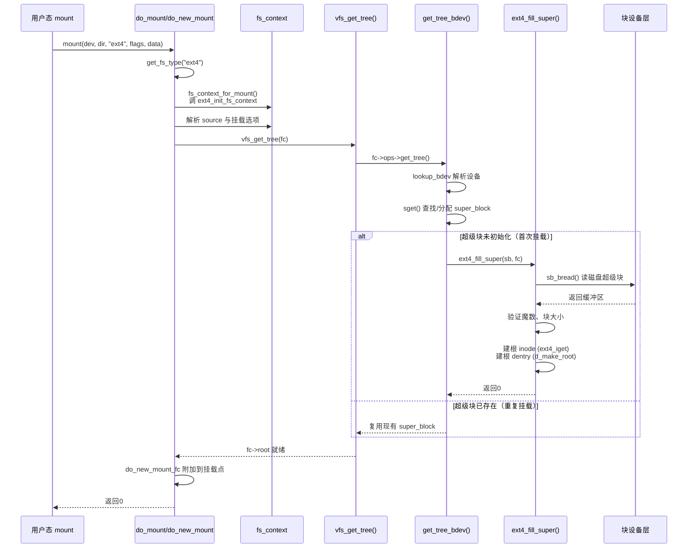

# 12.1.3 挂载流程与proc_mounts

> 所属章节：第12章 文件系统 > 12.1 VFS统一接口
>
> 难度：[I→M] | 预计阅读时间：20分钟

## <span class="blue"> 本节导读

`mount /dev/mmcblk0p1 /mnt` 不只是把设备和目录连起来——它要初始化文件系统、读取超级块、建立根目录 dentry，这是文件系统从无到有的"启动过程"。<br>
本节覆盖：

- v6.6 挂载调用链：do_mount → do_new_mount → fs_context → vfs_get_tree → get_tree_bdev → fill_super
- fs_context 机制为什么存在（5.2 之后的新挂载框架）
- `/proc/mounts` 与 `/proc/filesystems` 各字段对应内核的什么状态

---

## <span class="blue"> 挂载流程：从 mount 系统调用到 fill_super [I→M]

### 调用链总览

用户态执行 `mount` 命令触发 `mount()` 系统调用，v6.6 内核中的完整链路（`fs/namespace.c`、`fs/super.c`）：

```
SYSCALL mount
└── do_mount()                          // namespace.c:3666，拷贝选项字符串
    └── path_mount()
        └── do_new_mount()              // namespace.c:3294
            ├── get_fs_type("ext4")     // 按名字找 file_system_type
            ├── fs_context_for_mount()  // 创建 fs_context，调 ext4_init_fs_context
            ├── vfs_parse_fs_string()   // 解析 source（设备路径）等参数
            ├── vfs_get_tree(fc)        // super.c:1739
            │   └── fc->ops->get_tree() // = ext4_get_tree → get_tree_bdev
            │       ├── sget()          // 查找或分配 super_block
            │       └── ext4_fill_super()  // 读磁盘超级块、建根 inode/dentry
            └── do_new_mount_fc()       // 挂到挂载点，更新命名空间
```

### fs_context：5.2 之后的新挂载框架

旧版内核里，`file_system_type->mount()` 一个回调包办参数解析、超级块获取、根节点建立三件事，参数只能在回调内部用私有的 `parse_options` 逐个字符串抠。5.2 引入的 **fs_context** 把挂载拆成三个阶段：

1. **创建上下文**：`fs_context_for_mount()` 分配 `struct fs_context`，调用文件系统的 `init_fs_context`（ext4 是 `ext4_init_fs_context`）挂好操作表
2. **解析参数**：`vfs_parse_fs_string()` 把 source、挂载选项逐个喂给文件系统的 `parse_param` 回调，参数在挂之前就完成校验
3. **获取挂载树**：`vfs_get_tree(fc)` 调 `fc->ops->get_tree()` 真正干活——对块设备文件系统就是 `get_tree_bdev()`

> 💡 老代码里 `->mount()` 回调仍然存在（如 `mount_bdev`），但只服务于遗留包装路径。v6.6 的 do_new_mount 一律走 fs_context——看新文件系统代码时，入口找 `init_fs_context` 而不是 `->mount`。

### get_tree_bdev：超级块的获取与复用

`get_tree_bdev()`（`fs/super.c`:1537）做三件事：解析设备路径（`lookup_bdev`）、调 `sget()` 查找或分配 `super_block`、对新分配的超级块调用 `fill_super`。

`sget()` 是超级块复用的关键：同一设备重复挂载（如 bind mount）时直接返回已存在的 `super_block` 并加引用计数，`fill_super` 不会执行第二次。只有首次挂载才走到 `ext4_fill_super()`：读取磁盘超级块、验证魔数、建立根 inode（`ext4_iget`）和根 dentry（`d_make_root`）。

### 完整挂载序列图



### mount 常用选项速查

| 选项类别 | 常用选项 | 说明 |
|---------|---------|------|
| 访问模式 | `ro` / `rw` | 只读或读写挂载 |
| 访问时间 | `noatime` / `relatime` / `strictatime` | 控制 inode 访问时间更新策略 |
| 同步模式 | `sync` / `async` | 所有 I/O 同步完成或异步进行 |
| 执行权限 | `noexec` / `exec` | 允许或禁止执行二进制文件 |
| 设备文件 | `nodev` / `dev` | 允许或禁止访问设备文件 |
| SUID 位 | `nosuid` / `suid` | 忽略或启用 SUID/SGID 特殊权限 |
| Ext4 专用 | `data=ordered` / `data=journal` / `data=writeback` | 日志数据写入模式 |
| Ext4 专用 | `barrier` / `nobarrier` | 启用或禁用写屏障保证持久性 |

> 💡 `mount -o remount,rw /` 可在不卸载的情况下重挂修改部分选项，常用于把只读分区临时切读写。系统启动脚本里根文件系统从 ro 切 rw 走的就是这条路。

---

## <span class="blue"> 解读 /proc/mounts 与 /proc/filesystems [I]

### /proc/mounts 各字段含义

`/proc/mounts` 是当前进程挂载命名空间的实时视图，由内核的挂载命名空间数据结构直接导出。每行一个挂载点，六个字段：

```text
/dev/mmcblk0p1 /mnt ext4 ro,noatime,data=ordered 0 0
tmpfs /run tmpfs rw,nosuid,nodev,size=50M 0 0
proc /proc proc rw,relatime 0 0
sysfs /sys sysfs rw,seclabel,nosuid,nodev 0 0
```

| 字段 | 内容 | 说明 |
|---------|---------|------|
| 1 | 设备路径 | 挂载的设备（如 `/dev/mmcblk0p1`），伪文件系统显示为 `proc`、`sysfs` 等 |
| 2 | 挂载点 | 文件系统附加到的目录路径 |
| 3 | 文件系统类型 | `ext4`、`tmpfs`、`proc`、`nfs` 等 |
| 4 | 挂载选项 | 逗号分隔的选项列表，如 `ro,noatime` |
| 5 | dump 标记 | `dump` 备份工具使用，`0` 表示忽略 |
| 6 | fsck 顺序 | 开机 `fsck` 检查顺序：`0` 不检查，`1` 根分区，`2` 其他分区 |

### 关键选项的实战含义

- **`ro` / `rw`**：只读挂载保护数据不被意外修改，常用于系统恢复或共享只读镜像
- **`noatime`**：禁用 inode 访问时间更新，显著减少闪存写入次数，延长 SSD/eMMC 寿命；`relatime` 是折中——仅在 mtime 晚于 atime 时才更新 atime
- **`data=ordered`**（ext4 默认）：保证数据在元数据提交前落盘，防止崩溃后暴露陈旧数据。`data=journal` 一致性最强但性能最低；`data=writeback` 性能最高但崩溃后可能暴露旧数据块内容（三种模式的断电语义对比见 12.5.2）

### /proc/filesystems：内核支持的文件系统

```text
nodev   sysfs
nodev   tmpfs
nodev   bdev
        ext4
nodev   proc
nodev   cgroup
```

`nodev` 标记的文件系统不需要块设备（伪文件系统或网络文件系统）；无标记的需要实际块设备。这个清单来自全局的 `file_systems` 注册链表——`register_filesystem()` 把类型挂上去，`get_fs_type()` 挂载时按名字查找。

---

## <span class="blue"> 本节总结

| 维度 | 要点 |
|------|------|
| **挂载调用链** | do_mount → do_new_mount → get_fs_type → fs_context_for_mount → vfs_get_tree → get_tree_bdev → sget/fill_super → do_new_mount_fc |
| **fs_context 三阶段** | 创建上下文（init_fs_context）→ 解析参数（parse_param）→ 获取挂载树（get_tree）；5.2 后新代码入口找 init_fs_context |
| **超级块复用** | sget() 按设备去重，重复挂载复用 super_block，fill_super 只执行一次 |
| **/proc/mounts** | 六字段：设备、挂载点、类型、选项、dump、fsck 顺序；来自当前命名空间的挂载树 |
| **实战参数** | 闪存设备建议 `noatime,data=ordered,barrier`；调试可加 `errors=remount-ro` |

---

## <span class="blue"> 下一步

挂载完成、文件能打开了，数据旅程进入第二站：write() 的数据并没有直接落盘，而是先进入页缓存。下一节看页缓存的组织结构 address_space，以及数据在内存里到底"住"在哪。

> **12.2.1 页缓存与address_space**

---

## <span class="blue"> 配套资源

| 资源类型 | 内容 |
|----------|------|
| **内核源码** | `fs/namespace.c`（do_mount、do_new_mount）、`fs/super.c`（vfs_get_tree、get_tree_bdev、sget）、`fs/ext4/super.c`（ext4_init_fs_context、ext4_fill_super） |
| **实验** | `cat /proc/mounts`、`cat /proc/filesystems`、`strace -e mount mount /dev/xxx /mnt` |
| **延伸阅读** | `Documentation/filesystems/mount_api.txt`（新挂载 API 设计文档） |
