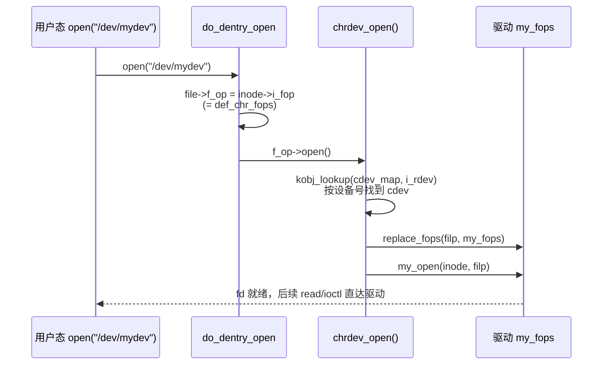

# 12.1.4 字符设备与file_operations：从 /dev 节点到驱动

> 所属章节：第12章 文件系统 > 12.1 VFS统一接口
>
> 难度：[I→E] | 预计阅读时间：25分钟

## <span class="blue"> 本节导读

12.1 前三节讲的是正规文件的 VFS 路径，本节补另一半：**设备文件**。"一切皆是文件"的完整含义是——正规文件的 fops 由文件系统实现，设备文件的 fops 由驱动实现。本节是 VFS 专题，数据旅程主线从 12.2 继续。<br>
本节覆盖：

- /dev 节点与设备号，cdev 注册的三层 API（含 misc 特化）
- `chrdev_open()` 的 fops 替换机制（v6.6 真实源码）
- `file_operations` 各方法语义、ioctl 命令编码、poll 机制与 mmap 入门

---

## <span class="blue"> 设备文件与设备号 [I]

`ls -l /dev` 里字符设备长这样：

```text
crw------- 1 root root 240, 0 /dev/mydev
crw-rw---- 1 root dialout 4, 64 /dev/ttyS0
```

首字母 `c` 表示字符设备（`b` 是块设备），`240, 0` 是**主设备号:次设备号**。主设备号标识"哪类设备/哪个驱动"，次设备号标识"这类设备中的第几个"。节点本身由 devtmpfs 自动创建（机制见 5.4.x）或手动 `mknod`，内核只认设备号，不认文件名。

打开设备文件时，VFS 通过 `inode->i_rdev` 拿到设备号。关键在于：设备文件的 `inode->i_fop` **不是**驱动填的操作表，而是内核统一的 `def_chr_fops`——驱动的 fops 要等到 open 那一刻才换上来，这是下一节的机制。

---

## <span class="blue"> cdev 注册：三层 API [I→E]

驱动把字符设备注册进内核分两步，对应三层 API：

```c
// 第一层：设备号分配（二选一）
register_chrdev_region(MKDEV(240, 0), 1, "mydev");  // 静态指定主设备号
alloc_chrdev_region(&devno, 0, 1, "mydev");          // 动态分配（推荐）

// 第二层：字符设备注册
cdev_init(&my_cdev, &my_fops);   // 绑定操作表
cdev_add(&my_cdev, devno, 1);    // 注册进全局 cdev_map，设备此刻"活"了
```

第三层是老式的一把梭：`register_chrdev()`（内部 = 分配设备号 + cdev 注册，`fs/char_dev.c`:268 的 `__register_chrdev`），新代码不建议用。

**misc 是特化**：`misc_register()` 把设备挂到固定的主设备号 **10** 下，自动分配次设备号、自动在 /dev 下创建节点，省掉上面所有步骤。判据很简单：驱动只服务一两个小功能、不需要主设备号语义时用 misc；需要管理多个同类设备、或要精确控制设备号时用 cdev 全套。

> ⚠️ `cdev_add()` 返回后设备对系统可见，因此它必须放在驱动初始化的**最后一步**——硬件、数据结构全部就绪之后。反过来，卸载时 `cdev_del()` 之后不能再有任何访问设备的路径。

---

## <span class="blue"> open 时发生了什么：fops 替换 [E]

设备文件被 open 时走的是 `chrdev_open()`（v6.6 `fs/char_dev.c`:373，有删节）：

```c
static int chrdev_open(struct inode *inode, struct file *filp)
{
    const struct file_operations *fops;
    struct cdev *p;
    /* ... */
    p = inode->i_cdev;
    if (!p) {
        kobj = kobj_lookup(cdev_map, inode->i_rdev, &idx);  /* 按设备号查 cdev_map */
        if (!kobj)
            return -ENXIO;
        new = container_of(kobj, struct cdev, kobj);
        /* ... */
        inode->i_cdev = p = new;    /* 缓存进 inode，下次免查 */
    }
    /* ... */
    fops = fops_get(p->ops);        /* 取驱动注册的操作表 */
    if (!fops)
        goto out_cdev_put;

    replace_fops(filp, fops);       /* ← 关键：换掉 file->f_op */
    if (filp->f_op->open) {
        ret = filp->f_op->open(inode, filp);   /* 调驱动的 open */
        /* ... */
    }
    return 0;
}
```

而它替换掉的是这个几乎空的默认表（`fs/char_dev.c`:452）：

```c
const struct file_operations def_chr_fops = {
    .open   = chrdev_open,
    .llseek = noop_llseek,
};
```

整条链：设备文件的 `i_fop` = `def_chr_fops` → open 时 VFS 照例把 `i_fop` 复制到 `file->f_op`（12.1.1 的机制）→ `f_op->open` 就是 `chrdev_open` → 它按设备号从 `cdev_map` 找到驱动注册的 cdev → `replace_fops()` 把 `file->f_op` **换成驱动的操作表** → 再调驱动的 `open()`。从此这个 fd 上的 read/write/ioctl 全部直达驱动。



> 💡 这就是"一切皆是文件"在设备侧的落地：对 VFS 来说设备文件和正规文件没有区别，路由差异全部收敛在 `chrdev_open` 的一次 fops 替换里。块设备同理（`def_blk_fops`），只是换成块设备层的注册表。

---

## <span class="blue"> file_operations 各方法语义 [I]

驱动要填的就是这张表。常用方法的语义与约束：

| 方法 | 触发时机 | 语义要点 |
|------|---------|---------|
| `.open` | open() | 初始化设备私有状态；可借 `inode->i_cdev` 或 `container_of` 找回自己的结构 |
| `.release` | 最后一次 close() | 与 open 配对清理；注意是"最后一次"close 才触发 |
| `.read` / `.write` | read()/write() | 用 `copy_to_user`/`copy_from_user` 搬运数据——**会睡眠**，调用上下文受限（见 13.7.1 的原子上下文陷阱） |
| `.llseek` | lseek() | 设备无位置概念时用 `noop_llseek` 或 `no_llseek` |
| `.unlocked_ioctl` | ioctl() | 设备私有命令通道，见下节 |
| `.compat_ioctl` | 32 位应用调 64 位内核 | 结构与指针布局兼容处理 |
| `.poll` | select/poll/epoll | 查询就绪状态，见下节 |
| `.mmap` | mmap() | 把设备内存映射进用户地址空间，见末节 |
| `.fasync` | fcntl(F_SETOWN) | 信号驱动 I/O（SIGIO），较少用 |

最小骨架：

```c
static const struct file_operations my_fops = {
    .owner          = THIS_MODULE,
    .open           = my_open,
    .release        = my_release,
    .read           = my_read,
    .write          = my_write,
    .unlocked_ioctl = my_ioctl,
    .poll           = my_poll,
    .llseek         = noop_llseek,
};
```

`.owner = THIS_MODULE` 不能省：它让 `fops_get()` 增加模块引用计数，防止设备正被使用时模块被 rmmod。

---

## <span class="blue"> ioctl 命令编码 [E]

ioctl 是"读写语义装不下"的设备私有操作通道。命令号不是随便定的整数，内核约定了位布局（`include/uapi/asm-generic/ioctl.h`）：

| 字段 | 位数 | 含义 |
|------|------|------|
| `_IOC_DIR` | 2 | 数据传输方向：读/写/双向 |
| `_IOC_TYPE` | 8 | 幻数（magic），标识属于哪个驱动 |
| `_IOC_NR` | 8 | 命令序号 |
| `_IOC_SIZE` | 14 | 参数结构体大小 |

定义命令用四个宏，**不要手拼数字**：

```c
#define MYDEV_MAGIC     'm'
#define MYDEV_GET_TEMP  _IOR(MYDEV_MAGIC, 0, int)          /* 驱动→用户 */
#define MYDEV_SET_MODE  _IOW(MYDEV_MAGIC, 1, int)          /* 用户→驱动 */
#define MYDEV_RW_REG    _IOWR(MYDEV_MAGIC, 2, struct reg)  /* 双向 */
#define MYDEV_RESET     _IO(MYDEV_MAGIC, 3)                /* 无参数 */
```

`_IOR/_IOW` 里的方向是**从用户态视角**说的：`_IOR` 表示用户读（驱动 copy_to_user）。`SIZE` 字段由宏自动取 `sizeof(参数类型)`，内核可借此做兼容性检查。

驱动侧实现：

```c
static long my_ioctl(struct file *filp, unsigned int cmd, unsigned long arg)
{
    int val;

    if (_IOC_TYPE(cmd) != MYDEV_MAGIC)
        return -ENOTTY;              /* 不是我的命令，按惯例返回 */

    switch (cmd) {
    case MYDEV_GET_TEMP:
        val = read_temperature();
        if (copy_to_user((int __user *)arg, &val, sizeof(val)))
            return -EFAULT;
        return 0;
    case MYDEV_SET_MODE:
        if (copy_from_user(&val, (int __user *)arg, sizeof(val)))
            return -EFAULT;
        return set_mode(val);
    default:
        return -ENOTTY;
    }
}
```

> ⚠️ 幻数选值先查 `Documentation/userspace-api/ioctl/ioctl-number.rst`——主线的幻数分配表，撞了别人的幻数，两个驱动装同一系统就会互相误收命令。

---

## <span class="blue"> poll：驱动怎么告诉业务"有数据了" [E]

业务用 `select/poll/epoll` 阻塞等设备事件，内核链路的两半：

**驱动侧**实现 `.poll`，不阻塞、只报告当前状态：

```c
static DECLARE_WAIT_QUEUE_HEAD(my_wq);   /* 等待队列头 */

static __poll_t my_poll(struct file *filp, poll_table *wait)
{
    __poll_t mask = 0;

    poll_wait(filp, &my_wq, wait);       /* 挂到等待队列，立即返回 */
    if (data_ready())
        mask |= EPOLLIN | EPOLLRDNORM;   /* 有数据可读 */
    return mask;
}

/* 中断底半部或数据到达处： */
wake_up_interruptible(&my_wq);           /* 唤醒等待者（见 13.5.4） */
```

**内核侧**：`do_poll()`（`fs/select.c`:885）循环调用各 fd 的 `.poll`，用 `__pollwait`（:222）把进程挂进驱动给的等待队列；`wake_up` 后重新查询，直到 mask 非零或超时。业务侧的 epoll 只是这套机制的批量优化版，驱动完全不用关心业务用 select 还是 epoll。

> 💡 旋钮编码器、按键这类输入设备的业务侧标准做法就是 epoll 监听事件节点（实战见 D.1 input 子系统扩展）。驱动只要把 `.poll` 和 `wake_up` 配对写对，业务侧选型是自由的。

---

## <span class="blue"> mmap：把设备内存映射给业务 [I→E]

数据量大、逐字节 read 太慢的场景（帧缓冲、采样环形缓冲、硬件寄存器面板），用 `.mmap` 把设备内存直接映射进用户地址空间：

```c
static int my_mmap(struct file *filp, struct vm_area_struct *vma)
{
    unsigned long pfn = virt_to_phys(my_buffer) >> PAGE_SHIFT;
    size_t size = vma->vm_end - vma->vm_start;

    if (size > MY_BUF_SIZE)
        return -EINVAL;
    return remap_pfn_range(vma, vma->vm_start, pfn, size,
                           vma->vm_page_prot);
}
```

之后业务像访问普通内存一样读写设备缓冲，零拷贝。页表、缺页、映射一致性属于内存管理子系统的地盘，深入机制见第 9 章。

---

## <span class="blue"> 本节总结

| 维度 | 要点 |
|------|------|
| **设备号** | 主设备号定驱动、次设备号定实例；内核只认号不认文件名 |
| **注册三层** | 设备号分配（推荐动态）→ cdev_init+cdev_add（放初始化最后一步）→ misc 是 major=10 特化 |
| **fops 替换** | 设备文件 `i_fop` = def_chr_fops；`chrdev_open()` 按 i_rdev 查 cdev_map，`replace_fops()` 换上驱动操作表 |
| **方法语义** | read/write 用 copy_*_user（会睡眠）；`.owner=THIS_MODULE` 防卸载竞态 |
| **ioctl** | `_IO/_IOR/_IOW/_IOWR` 宏定义命令，幻数查 ioctl-number.rst 防冲突，错误惯例返回 `-ENOTTY` |
| **poll** | 驱动 `.poll` 只报告状态不睡眠；poll_wait + wake_up 配对；业务侧 epoll 自由选 |
| **mmap** | remap_pfn_range 映射设备内存，零拷贝大吞吐场景用，深读第 9 章 |

---

## <span class="blue"> 下一步

VFS 这一层到此完整了——正规文件和设备文件两条路径都打通。数据旅程主线继续：write() 的数据进入页缓存后怎么组织、什么时候离开内存。

> **12.2.1 页缓存与address_space**

---

## <span class="blue"> 配套资源

| 资源类型 | 内容 |
|----------|------|
| **内核源码** | `fs/char_dev.c`（chrdev_open、def_chr_fops、cdev_add）、`fs/select.c`（do_poll）、`drivers/char/misc.c`（misc_register）、`include/uapi/asm-generic/ioctl.h`（命令编码宏） |
| **交叉引用** | /dev 节点创建见 5.4.x；等待队列机制见 13.5.4；原子上下文睡眠陷阱见 13.7.1；input 子系统实战见 D.1 扩展 |
| **官方文档** | `Documentation/userspace-api/ioctl/ioctl-number.rst`（幻数分配表） |
| **实验** | 写一个带 read/ioctl/poll 的 misc 字符设备，`evtest` 风格的 epoll 业务侧读取对照实验 |
