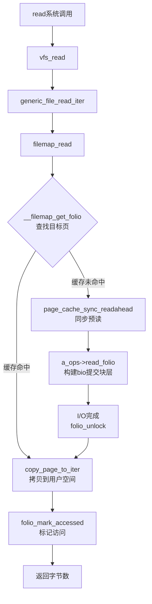

# 12.2.1 页缓存与address_space

> 所属章节：第12章 文件系统 > 12.2 页缓存与回写
>
> 难度：[E→M] | 预计阅读时间：25分钟

## <span class="blue"> 本节导读

`write()` 立刻返回，不代表数据到了磁盘——它躺在页缓存里，等 flusher 线程来收拾。这是数据旅程的第二站。<br>
本节覆盖：
- 页缓存的定位与 `address_space` 的桥梁作用（含 v6.6 的 `read_folio`/`writepages` 操作表）
- XArray 页帧索引与 `__filemap_get_folio()` 查找链（v6.6 真实代码）
- `write()` 写入页缓存的完整路径：`generic_file_write_iter()` → `generic_perform_write()`
- 一个断电丢配置的实战案例

---

## <span class="blue"> 页缓存工作机制 [E→M]

### 页缓存的本质与定位

页缓存是内核在内存中维护的磁盘数据缓存层：读文件时数据先加载到内存，后续读取直接命中；写文件时数据先写进缓存，由后台线程异步刷回磁盘。慢速块设备 I/O 由此被转换成内存访问速度。

页缓存以页（通常 4KB，大页场景为 folio）为基本单位，每个被缓存的磁盘页面对应一个 `struct folio`/`struct page` 实例。`read()` 发起时内核先查缓存——命中直接复制到用户空间，未命中才触发磁盘读取。

### address_space：inode 到页缓存的桥梁

`struct address_space` 连接 inode 与其页缓存（定义在 `include/linux/fs.h`）。每个 inode 通过 `i_mapping` 指向它，`address_space.host` 回指 inode。关键字段：

- `i_pages`：XArray 根节点，存所有缓存页的索引
- `nrpages`：当前缓存页总数
- `a_ops`：指向 `address_space_operations`，定义底层数据传输回调

`a_ops` 的方法表在 v6.6 里是这样的（`include/linux/fs.h`:404 起）：

```c
struct address_space_operations {
    int (*writepage)(struct page *page, struct writeback_control *wbc);
    int (*read_folio)(struct file *, struct folio *);            /* 读一页进缓存 */
    int (*writepages)(struct address_space *, struct writeback_control *); /* 批量回写 */
    ...
    void (*readahead)(struct readahead_control *);               /* 预读 */
};
```

> ⚠️ 两个过时的方法名要更新认知：`readpage` 已在 folio 化改造中被 `read_folio` 取代；单页 `writepage` 只剩少数文件系统用，批量回写走 `writepages`。看新代码认 `read_folio`，读旧资料知道它们是一回事。

这种设计的关键在解耦：VFS 只关心"某文件的第 N 页是否在缓存中"，不关心底层是 ext4 还是 f2fs。

### XArray：页帧索引结构

从文件偏移量查对应页帧，早期内核用 Radix Tree，4.20 起逐步替换为 **XArray**：接口更简洁、RCU 读端无锁、原生支持多索引条目（multi-index entries，大页必备）。`address_space->i_pages` 就是 XArray 的根，通过 `xa_load()`、`xa_store()` 管理。给定页索引 `pgoff_t index`，查找复杂度 O(log₆₄N)，树高通常不超过 3~4 层，实际接近 O(1)。

### 页缓存查找：__filemap_get_folio()

读路径和写路径都靠这个函数定位或创建缓存页（v6.6 `mm/filemap.c`:1863，有删节）：

```c
struct folio *__filemap_get_folio(struct address_space *mapping, pgoff_t index,
                                  fgf_t fgp_flags, gfp_t gfp)
{
    struct folio *folio;

repeat:
    folio = filemap_get_entry(mapping, index);   /* 1. XArray 查找 */
    if (xa_is_value(folio))
        folio = NULL;
    if (!folio)
        goto no_page;                            /* 2. 未命中，视 fgp_flags 创建 */

    if (fgp_flags & FGP_LOCK) {
        folio_lock(folio);
        if (unlikely(folio->mapping != mapping)) {  /* 页被并发截断 */
            folio_unlock(folio);
            folio_put(folio);
            goto repeat;                          /* 竞争条件，重试 */
        }
    }
    /* ... FGP_ACCESSED → folio_mark_accessed ... */
    return folio;

no_page:
    if (fgp_flags & FGP_CREAT) {
        /* 分配新 folio，add_to_page_cache_lru 插入 XArray 并加入 LRU */
        /* -EEXIST 说明别的线程抢先插入，goto repeat 重试 */
    }
}
```

> 💡 `pagecache_get_page()` 这个老接口在 folio 化中已删除，查找入口统一为 `__filemap_get_folio()`。返回的是 folio 而不是 page——一个 folio 可以承载多个连续页，这是 v6.6 页缓存子系统的基本单位。

### read() 路径：命中与未命中



---

## <span class="blue"> write() 如何写入页缓存 [E]

### 写路径的真实结构

`write()` 的核心是找到（或创建）目标区域的缓存页，把用户数据复制进去，再打上标记。v6.6 的调用链（`mm/filemap.c`）：

```
generic_file_write_iter()              // :4081
├── inode_lock(inode)                  // 写路径互斥
├── generic_write_checks()             // O_APPEND 归位、大小限制、suid 处理
├── __generic_file_write_iter()
│   ├── file_remove_privs()            // 写后清除 suid/sgid
│   ├── file_update_time()             // 更新 mtime/ctime
│   └── generic_perform_write()        // :3932，逐页核心循环
│       ├── __filemap_get_folio(FGP_CREAT)  // 查找/创建缓存页
│       ├── copy_page_from_iter_atomic()    // :3977，用户数据拷进页
│       ├── flush_dcache_folio()
│       └── balance_dirty_pages_ratelimited()  // 脏页反压（见12.2.2）
└── generic_write_sync()               // O_SYNC 文件顺带同步
```

> ⚠️ 两个常见的过时描述：写路径的用户拷贝函数是 `copy_page_from_iter_atomic()`（旧的 `iov_iter_copy_from_user_atomic` 已删除）；O_APPEND 和文件大小更新在 `generic_write_checks()` 里完成，不在写循环内部。

### 写入后的两个标记

数据进页缓存后，内核打两个标记：

1. **`folio_mark_accessed()`**：更新 LRU 状态，刚写的页在内存回收时留存优先级更高
2. **`folio_mark_dirty()`**：置脏标志——页数据与磁盘不一致，等待回写。脏页会被关联到所属 bdi 的脏链表，进入 flusher 的管辖范围（回写触发机制是 12.2.2 的主题）

### 为什么 write() 不直接写磁盘

- **性能聚合**：多个小写合并成大 I/O，吃满顺序写带宽
- **避免阻塞**：write() 立刻返回，进程吞吐量提升两个数量级
- **覆盖写消除**：同一页多次写只保留最终结果，中间状态不刷盘
- **写取消**：短命文件（编译中间产物）可能在回写前就被删除，磁盘 I/O 整个省掉

代价同样明确：崩溃或断电时，未回写的脏数据丢失。关键数据必须 `fsync()`——这是 12.2.3 的主题。

### 实践案例：设备断电导致配置丢失

某嵌入式设备偶发断电重启后，最近一次保存的配置全部丢失，回退到更早版本。根因定位：保存配置的代码只调用了 `write()`，从未 `fsync()`——数据仍在页缓存中，flusher 尚未回写时设备断电。

修复：关键配置写入路径后增加 `fsync(fd)`；性能敏感场景改用 `fdatasync()`（只刷数据不刷元数据）或批量写入后统一 `fsync`。这个案例是嵌入式开发必须内化的基本事实：**`write()` 返回 ≠ 数据落盘**。

---

## <span class="blue"> 本节总结

| 维度 | 要点 |
|------|------|
| **页缓存定位** | VFS 与块设备之间的内存缓存层，读写都先经过它 |
| **address_space** | inode 的缓存管家：i_pages（XArray 根）、host、a_ops（v6.6 用 read_folio/writepages） |
| **页查找** | `__filemap_get_folio()` 统一入口，返回 folio；pagecache_get_page 已删除 |
| **写路径** | generic_file_write_iter → generic_perform_write → copy_page_from_iter_atomic → 标记 accessed+dirty |
| **延迟写** | 聚合/非阻塞/覆盖消除/写取消四大收益，代价是断电丢脏页 |

---

## <span class="blue"> 下一步

脏页标记完了，它们什么时候离开内存？下一节看 dirty page 的完整生命周期、回写的时间/空间双轨触发条件，以及 flusher 线程的 per-device 架构。

> **12.2.2 脏页回写机制**

---

## <span class="blue"> 配套资源

| 资源类型 | 内容 |
|----------|------|
| **内核源码** | `mm/filemap.c`（__filemap_get_folio、generic_file_write_iter、generic_perform_write）、`include/linux/fs.h`（address_space_operations） |
| **/proc 接口** | `/proc/meminfo` 的 `Cached`（页缓存总量）与 `Dirty`（待回写脏页）字段 |
| **延伸阅读** | `Documentation/core-api/xarray.rst`；LWN folio 系列文章 |
