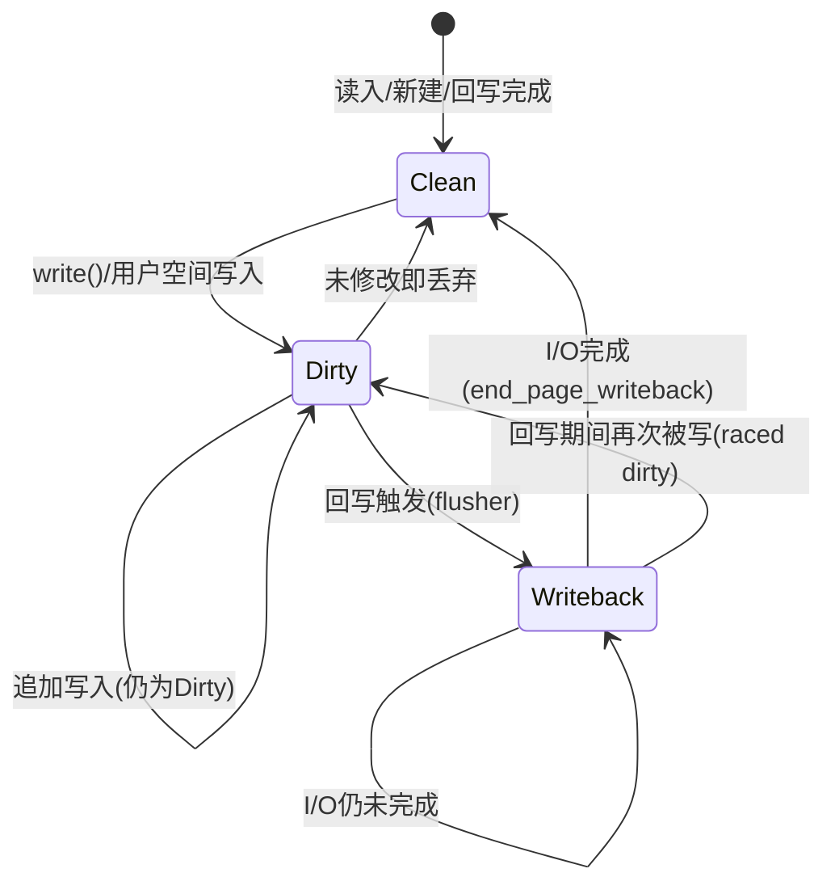

## 12.2.2 dirty page生命周期与回写触发

> Linux的写回机制经历了一次重要演化：早期内核用一个全局pdflush线程处理所有设备的回写，但这导致设备间互相阻塞。2.6.32引入了per-device flusher——每个块设备有自己的回写线程，互不干扰。

### 知识点174 dirty page完整生命周期与回写触发 [E][M]

#### 1. 四态生命周期状态机

从page cache的回写视角观察，每一页在存续期间都沿着一条清晰的状态迁移路径演化，形成完整的闭环状态机：



- **Clean**：页内容与后备存储设备上的数据完全一致，可被内核安全回收或丢弃。刚通过`read()`从磁盘读入的页即处于此状态。
- **Dirty**：用户进程通过`write()`、`mmap`写访问修改了页内容，导致页数据与磁盘不一致。内核通过`set_page_dirty()`或`__set_page_dirty()`标记`PG_dirty`标志位，同时将页关联到所属address_space的radix树dirty标签，并将inode挂入对应bdi的dirty链表。
- **Writeback**：当flusher线程选中该页进行回写时，通过`clear_page_dirty_for_io()`原子地清除`PG_dirty`并设置`PG_writeback`，将页从dirty链表移至io链表。页在此状态下等待块层完成I/O。
- 回到**Clean**：块设备I/O完成中断处理函数调用`end_page_writeback()`，清除`PG_writeback`标志。若回写期间页未被再次写入，则页回归clean状态，可回收。

**raced dirty**是值得关注的状态回退场景：当页处于writeback期间，若用户进程再次写入该页，`set_page_dirty()`会重新置位`PG_dirty`，导致页在I/O完成后并不回归clean，而是回到dirty状态，等待下一轮回写。这种竞态通过原子位操作和`clear_page_dirty_for_io()`的 carefully-ordered 语义正确管理。

#### 2. 回写触发的双轨条件

内核不会立即回写每一个dirty页，而是通过**时间**与**空间**两个独立维度决定何时启动回写。核心参数定义于`mm/page-writeback.c`，通过proc/sysctl暴露给用户空间：

| sysctl参数 | 默认值 | 单位 | 含义 |
|------------|--------|------|------|
| `vm.dirty_expire_centisecs` | 3000 | 百分之一秒 | dirty页在内存中最长允许停留时间，超过此期限的页被视为"超期"，必须回写 |
| `vm.dirty_writeback_centisecs` | 500 | 百分之一秒 | flusher线程的周期性唤醒间隔，每次唤醒扫描并回写超期页 |
| `vm.dirty_ratio` | 20 | 百分比 | dirty页占总可用内存（dirtyable memory）的比例上限。超过此阈值后，执行`write()`的进程将**同步阻塞**回写，直到比例下降 |
| `vm.dirty_background_ratio` | 10 | 百分比 | 后台异步回写触发阈值。超过后flusher线程被唤醒，在后台**异步**写回，不阻塞用户进程 |
| `vm.dirty_bytes` / `vm.dirty_background_bytes` | 0 | 字节 | 与ratio参数互斥，允许按绝对字节数而非百分比设定阈值 |

回写触发的两条路径在实际系统中并行运作：

1. **时间驱动**：`wb_workfn()`按`dirty_writeback_centisecs`周期被唤醒，调用`wb_writeback()`时设置`for_kupdate = 1`，进而调用`writeback_sb_inodes()`扫描`b_dirty`链表中超过`dirty_expire_centisecs`的inode，将其页下刷。

2. **空间驱动**：每次`set_page_dirty()`后，`balance_dirty_pages()`检查当前dirty页占可用内存的比例。若超过`dirty_background_ratio`，通过`bdi_wakeup_thread()`异步唤醒对应bdi的flusher；若超过`dirty_ratio`，当前进程直接在`balance_dirty_pages()`中**同步**调用回写逻辑，阻塞直到dirty比例降至阈值以下。这种"以阻塞反压写速率"的机制防止了dirty页无节制增长导致OOM。

#### 3. flusher线程wb_workfn()工作机制

每个bdi拥有一个`bdi_writeback`结构，内含flusher工作项。核心入口`wb_workfn()`在`fs/fs-writeback.c`中定义：

```c
static void wb_workfn(struct work_struct *work)
{
    struct bdi_writeback *wb = container_of(to_delayed_work(work),
                                             struct bdi_writeback, dwork);
    struct wb_writeback_args args = {
        .nr_pages = LONG_MAX,
        .sync_mode = WB_SYNC_NONE,
        .for_kupdate = 1,
        .range_cyclic = 1,
    };
    unsigned long nr_pages;

    set_worker_desc("flush-%s", bdi_dev_name(wb->bdi));
    current->flags |= PF_SWAPWRITE;

    wb_lock_bh(wb);
    wb_writeback(wb, &args);
    wb_unlock_bh(wb);

    /* 若系统中仍有dirty页，重新调度下一轮 */
    nr_pages = global_node_page_state(NR_FILE_DIRTY) +
               global_node_page_state(NR_UNSTABLE_NFS);
    if (nr_pages) {
        unsigned long delay;
        delay = msecs_to_jiffies(dirty_writeback_interval * 10);
        queue_delayed_work(bdi_wq, &wb->dwork, delay);
    } else {
        /* 所有页已写回，flusher进入睡眠等待被显式唤醒 */
        wb->wb_running = 0;
    }
    current->flags &= ~PF_SWAPWRITE;
}
```

`wb_writeback()`内部按三类优先级递减的工作进行处理：
1. **kupdate风格**：由`for_kupdate`启用，处理超过`dirty_expire_centisecs`的inode，保证数据不会无限期滞留内存；
2. **sync同步回写**：响应`sync()`、`fsync()`等显式同步请求，确保数据在系统调用返回前落盘；
3. **background后台回写**：由dirty比例触发的均衡写回，目标是让dirty页回归`dirty_background_ratio`以下。

#### 4. 回写队列组织与页迁移

每个`bdi_writeback`维护四条关键链表，构成页在回写子系统中的完整流转管道：

- `b_dirty`：新近被弄脏的inode聚集于此，等待flusher扫描；
- `b_io`：已被选中回写的inode迁移至此，对应的页正在被构建成bio；
- `b_more_io`：上一轮因配额限制（`nr_to_write`耗尽）未写完的inode暂存于此，优先处理；
- `b_dirty_time`：仅文件时间戳被更新、内容未变的inode，采用轻量级回写策略。

`move_expired_inodes()`将超期inode从`b_dirty`移到`b_io`，随后`writeback_sb_inodes()`遍历`b_io`，逐个调用文件系统的`writepages`方法。`write_cache_pages()`是`writepages`的通用实现，核心职责是扫描address_space的radix树，将标记为dirty的页批量推入块层。

#### 5. 回写为何必须是异步的

回写采用异步设计并非偶然，而是**内存与磁盘数量级性能差异**的必然选择：

- **速度鸿沟**：DDR内存写带宽可达50GB/s以上，而SATA机械硬盘仅约150MB/s，NVMe SSD也只有数GB/s。若每次`write()`同步刷盘，进程吞吐量将暴跌两个数量级；
- **写合并优化**：异步回写允许内核积攒相邻dirty页，合并为更大的顺序I/O。`write_cache_pages()`通过radix树的`PAGECACHE_TAG_TOWRITE`标签批量收集页，单次bio可覆盖数百个连续页；
- **写取消**：短生命周期文件（如编译中间产物、临时缓存）可能在被回写前就已被删除，异步机制避免了大量无意义的磁盘写；
- **I/O调度重排**：块层电梯调度器与NVMe多队列机制能优化bio的物理提交顺序，降低磁盘寻道或充分利用并行通道。

`write_cache_pages()`的核心逻辑展现了批量异步回写的工程实践：

```c
static int write_cache_pages(struct address_space *mapping,
                             struct writeback_control *wbc,
                             writepage_t writepage, void *data)
{
    int ret = 0;
    int done = 0;
    int nr_to_write = wbc->nr_to_write;
    pgoff_t index;
    pgoff_t end;
    struct pagevec pvec;

    pagevec_init(&pvec);
    index = wbc->range_cyclic ? mapping->writeback_index
                              : wbc->range_start >> PAGE_SHIFT;
    end = wbc->range_end >> PAGE_SHIFT;

    while (!done && (index <= end)) {
        int i;
        unsigned nr_pages = pagevec_lookup_range_tag(&pvec, mapping, &index,
                                end, PAGECACHE_TAG_TOWRITE);
        if (!nr_pages)
            break;

        for (i = 0; i < nr_pages; i++) {
            struct page *page = pvec.pages[i];

            lock_page(page);
            if (PageWriteback(page)) {
                if (wbc->sync_mode != WB_SYNC_NONE)
                    wait_on_page_writeback(page);
                else {
                    unlock_page(page);
                    continue;
                }
            }
            if (!clear_page_dirty_for_io(page)) {
                unlock_page(page);
                continue;   /* dirty位被并发清除 */
            }
            ret = (*writepage)(page, wbc, data);
            if (ret || (--nr_to_write <= 0))
                done = 1;
        }
        pagevec_release(&pvec);
        cond_resched();
    }
    if (wbc->range_cyclic || (wbc->nr_to_write > nr_to_write))
        mapping->writeback_index = index;
    return ret;
}
```

`pagevec_lookup_range_tag()`高效地从radix树中批量获取带`PAGECACHE_TAG_TOWRITE`标签的页，`clear_page_dirty_for_io()`完成`PG_dirty`到`PG_writeback`的原子状态转换，随后调用文件系统注册的`writepage`将页映射为bio并提交给块层。

---

### 知识点175 从pdflush到flusher_threads的架构演化 [E]

#### 1. 演化背景与pdflush的瓶颈

Linux 2.4至2.6.31长期采用**pdflush**（page dirty flush）内核线程架构。系统中存在2至8个固定pdflush线程（数量由`nr_pdflush_threads`根据负载动态调整），这些线程从全局dirty页链表中获取待写回页，向随机块设备下发I/O请求。

pdflush的设计在单块设备或同构存储环境下尚可工作，但在多设备混合场景中暴露结构性缺陷：由于每个pdflush线程可被调度到任意设备上执行I/O，当某个设备响应迟缓时——例如USB 2.0外置硬盘、网络存储NFS超时、或老旧机械磁盘繁忙——占用该设备的pdflush线程长时间阻塞等待I/O完成。与此同时，其他快速设备（如NVMe SSD）上堆积的dirty页因pdflush线程被耗尽而无法及时回写，形成**全局性回写饥饿**。本质上，pdflush将"计算资源（线程）"与"I/O资源（设备）"错误地解耦，导致慢设备拖垮整个系统的回写进度。

2.6.32内核彻底重构回写架构，引入**per-BDI flusher threads**：每个块设备拥有专属的回写线程，设备间完全隔离，互不干扰。

#### 2. BDI概念与bdi_writeback结构

**BDI（Backing Device Information，后备设备信息）** 是内核中对"具有持久存储能力的后端设备"的抽象。它不仅包括物理块设备（如SATA盘、NVMe SSD），也涵盖网络文件系统（NFS）、loop设备等任何需要回写dirty页的目标存储。每个BDI对应一个`struct backing_dev_info`，内含一个或多个`struct bdi_writeback`：

```c
struct bdi_writeback {
    struct backing_dev_info *bdi;
    unsigned long state;
    unsigned long last_old_flush;
    struct list_head dwork;         /* 延迟工作项，挂入bdi_wq */
    struct list_head b_dirty;       /* dirty inode链表 */
    struct list_head b_io;          /* 已选中回写的inode */
    struct list_head b_more_io;     /* 上一轮未完成，需继续 */
    struct list_head b_dirty_time;  /* 仅时间戳脏的inode */
    spinlock_t list_lock;           /* 保护以上链表 */
    struct percpu_counter stat[NR_WB_STAT_ITEMS];
    unsigned long bw_written;       /* 用于带宽估算 */
    unsigned long bw_dirtied;
    ...
};
```

对于标准块设备，通常只配置一个`bdi_writeback`；高端多队列SSD、RAID阵列或分 cgroup 隔离场景下，BDI可拥有多个wb结构以实现更细粒度的并发回写。

#### 3. per-device flusher的架构优势

| 对比维度 | pdflush（全局共享） | flusher_threads（per-BDI） |
|----------|--------------------|---------------------------|
| 线程归属 | 全局统一线程池，所有设备竞争 | 每个BDI独占工作项，按设备隔离 |
| 跨设备阻塞 | 一设备慢导致全局回写停滞 | 设备间零干扰，慢设备不影响快设备 |
| 并发模型 | 并发度受限于pdflush线程总数 | 天然按设备并行，扩展性无上限 |
| 调度复杂度 | 需复杂逻辑将线程分配给设备 | 各设备自主在自己的wb上调度 |
| 锁竞争 | 全局dirty链表锁争用严重 | 锁按bdi分片，粒度细，竞争少 |
| OOM压力 | 回写不及时导致全局dirty膨胀 | 慢设备脏页独立积累，问题隔离 |

#### 4. flusher thread初始化路径

块设备注册时，`bdi_register()`负责创建并初始化flusher机制：

```c
int bdi_register(struct backing_dev_info *bdi, const char *fmt, ...)
{
    int ret;
    va_list args;
    struct device *dev;

    va_start(args, fmt);
    dev = device_create_vargs(bdi_class, NULL, MKDEV(0, 0), bdi, fmt, args);
    va_end(args);
    if (IS_ERR(dev))
        return PTR_ERR(dev);

    bdi->dev = dev;
    ret = wb_init(&bdi->wb, bdi, 0, GFP_KERNEL);
    if (!ret) {
        bdi->wb_running = 1;
        /* 将wb_workfn挂入bdi_wq工作队列 */
        queue_delayed_work(bdi_wq, &bdi->wb.dwork, 0);
    }
    return ret;
}
```

`wb_init()`完成`bdi_writeback`结构的字段初始化与链表设置：

```c
static int wb_init(struct bdi_writeback *wb, struct backing_dev_info *bdi,
                   int blkcg_id, gfp_t gfp)
{
    memset(wb, 0, sizeof(*wb));
    wb->bdi = bdi;
    wb->last_old_flush = jiffies;
    INIT_LIST_HEAD(&wb->b_dirty);
    INIT_LIST_HEAD(&wb->b_io);
    INIT_LIST_HEAD(&wb->b_more_io);
    INIT_LIST_HEAD(&wb->b_dirty_time);
    spin_lock_init(&wb->list_lock);
    INIT_DELAYED_WORK(&wb->dwork, wb_workfn);
    wb->bw_written = 0;
    wb->bw_dirtied = 0;
    return 0;
}
```

从2.6.32开始，flusher不再使用传统`kthread_create()`创建长期运行的内核线程，而是基于**工作队列**机制：`wb_workfn`被封装为`delayed_work`，挂入全局的`bdi_wq`并发工作队列。这种设计兼具轻量级调度（无需维护空闲线程）与per-BDI隔离（每个wb的工作项独立排队）的双重优势。

#### 5. flusher thread整体架构

```mermaid
graph TD
    subgraph 全局触发层
        A[用户进程 write()] -->|set_page_dirty| B{balance_dirty_pages}
        B -->|超过dirty_background_ratio| C[bdi_wakeup_thread]
        B -->|超过dirty_ratio| D[进程同步阻塞回写]
        E[sync/fsync 系统调用] --> C
        F[周期性定时器<br/>dirty_writeback_centisecs] -->|超时唤醒| C
    end

    subgraph BDI层（per-device隔离）
        C --> G[bdi_writeback.delayed_work]
        G --> H[bdi_wq 工作队列]
        H --> I[wb_workfn 执行]
        I --> J[wb_writeback]
        J --> K[回写策略选择]
        K --> L[kupdate: 超期页回写]
        K --> M[background: 比例触发回写]
        K --> N[sync: 显式同步请求]
    end

    subgraph 块设备I/O层
        L --> O[write_cache_pages]
        M --> O
        N --> O
        O --> P[radix树扫描dirty页]
        P --> Q[clear_page_dirty_for_io]
        Q --> R[writepage → bio]
        R --> S[submit_bio → 块层]
    end

    subgraph 多设备隔离示意
        T[sda 机械硬盘] --- U[bdi_writeback.sda]
        V[sdb NVMe SSD] --- W[bdi_writeback.sdb]
        X[nfs 挂载] --- Y[bdi_writeback.nfs]
    end
    U --> G
    W --> G2[bdi_writeback.delayed_work]
    Y --> G3[bdi_writeback.delayed_work]
    G2 --> H
    G3 --> H
```

当`dirty_background_ratio`被突破时，`balance_dirty_pages()`通过页的`page->mapping->host->i_sb->s_bdi`找到其归属bdi，调用`bdi_wakeup_thread()`将该bdi的`wb_workfn`加入`bdi_wq`。各设备的flusher在`bdi_wq`上独立执行——即使`sda`的机械磁盘繁忙导致其flusher延迟，`sdb`的NVMe设备flusher仍能全速推进回写。这种"故障域隔离"正是per-device fluster架构相较pdflush的本质进步。
