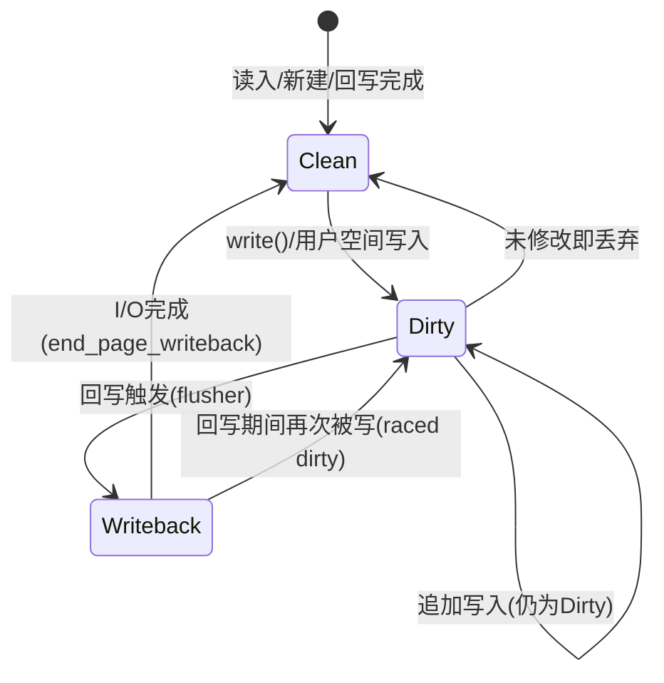

# 12.2.2 脏页回写机制

> 所属章节：第12章 文件系统 > 12.2 页缓存与回写
>
> 难度：[E→M] | 预计阅读时间：30分钟

## <span class="blue"> 本节导读

脏页不会永远留在内存里——内核用时间与空间双轨条件决定何时回写，由 per-device 的 flusher 机制执行。<br>
本节覆盖：
- dirty page 的四态生命周期与 raced dirty 竞态
- 回写触发：时间轨（dirty_expire/writeback_centisecs）与空间轨（dirty_ratio/background_ratio）
- flusher 的 per-BDI 架构：从 pdflush 到 workqueue 化 flusher 的演化
- `write_cache_pages()` 批量回写的 v6.6 真实实现（folio_batch）

---

## <span class="blue"> dirty page 完整生命周期与回写触发 [E→M]

### 四态生命周期状态机



- **Clean**：页内容与后备存储一致，可被安全回收。刚从磁盘读入的页即此状态
- **Dirty**：被 `write()` 或 mmap 写修改，与磁盘不一致。`folio_mark_dirty()` 置脏标志，同时把 inode 挂入所属 bdi 的脏链表
- **Writeback**：flusher 选中回写时，`folio_clear_dirty_for_io()` 原子地清除脏标志并置 writeback 标志，页进入 I/O 等待
- 回到 **Clean**：块层 I/O 完成回调 `end_page_writeback()` 清除 writeback 标志

**raced dirty** 是值得注意的回退：页处于 writeback 期间被再次写入，脏标志重新置位，I/O 完成后页不回归 clean 而是回到 dirty，等待下一轮回写。这个竞态靠原子位操作与 `folio_clear_dirty_for_io()` 的顺序语义正确管理。

### 回写触发的双轨条件

内核用**时间**与**空间**两个独立维度决定何时回写，参数定义在 `mm/page-writeback.c`，经 sysctl 暴露：

| sysctl参数 | 默认值 | 单位 | 含义 |
|------------|--------|------|------|
| `vm.dirty_expire_centisecs` | 3000 | 百分之一秒 | 脏页在内存中最长停留时间，超期必须回写 |
| `vm.dirty_writeback_centisecs` | 500 | 百分之一秒 | flusher 周期性唤醒间隔，每次唤醒扫描超期页 |
| `vm.dirty_ratio` | 20 | 百分比 | 脏页占可用内存上限，超过后写进程**同步阻塞**参与回写 |
| `vm.dirty_background_ratio` | 10 | 百分比 | 后台回写触发阈值，超过后唤醒 flusher **异步**回写 |
| `vm.dirty_bytes` / `vm.dirty_background_bytes` | 0 | 字节 | 与 ratio 互斥，按绝对字节数设阈值 |

两条路径并行运作：

1. **时间驱动**：flusher 按 `dirty_writeback_centisecs` 周期唤醒，以 `for_kupdate` 模式扫描超期 inode 下刷
2. **空间驱动**：写路径上的 `balance_dirty_pages_ratelimited()` 检查脏页比例——超 `dirty_background_ratio` 异步唤醒 flusher；超 `dirty_ratio` 当前进程**同步**参与回写，阻塞到比例回落。这种"以阻塞反压写速率"的机制防止脏页无节制增长

> 💡 嵌入式调优直觉：电池/小内存设备把 `dirty_expire_centisecs` 调小（如 1500 = 15 秒）能缩小断电数据丢失窗口，代价是更频繁的磁盘唤醒与耗电。先想清楚你的首要矛盾是丢数据还是省电。

---

## <span class="blue"> flusher：从 pdflush 到 per-BDI 架构 [E]

### pdflush 的瓶颈

Linux 2.4 至 2.6.31 采用 **pdflush** 全局线程池：2~8 个线程服务所有块设备。多设备混合场景下，慢设备（USB 外置盘、NFS 超时）会占住 pdflush 线程阻塞等 I/O，快设备上堆积的脏页因此无人回写，形成**全局性回写饥饿**。

2.6.32 重构为 **per-BDI flusher**：每个块设备拥有专属的回写工作，设备间完全隔离。

### BDI 与 bdi_writeback

**BDI（Backing Device Information）** 是"具有持久存储能力的后端设备"的抽象——物理块设备、NFS、loop 设备都算。每个 BDI 的 `struct backing_dev_info` 内含一个或多个 `struct bdi_writeback`：

```c
struct bdi_writeback {
    struct backing_dev_info *bdi;
    unsigned long state;
    struct list_head dwork;         /* 延迟工作项，挂入 bdi_wq */
    struct list_head b_dirty;       /* 脏 inode 链表 */
    struct list_head b_io;          /* 已选中回写的 inode */
    struct list_head b_more_io;     /* 上一轮未写完的 inode */
    struct list_head b_dirty_time;  /* 仅时间戳脏的 inode（lazytime） */
    spinlock_t list_lock;
    /* ... */
};
```

四条链表构成回写流水线：脏 inode 先入 `b_dirty`；`move_expired_inodes()` 把超期者移入 `b_io`；配额耗尽的暂存 `b_more_io` 优先处理；仅时间戳变化的走 `b_dirty_time` 轻量回写。

### v6.6 的 flusher：workqueue 化的 wb_workfn

现代 flusher 不再是长期驻留的内核线程，而是 `delayed_work` 挂进全局 `bdi_wq` 并发工作队列。设备注册时 `bdi_register()`（`mm/backing-dev.c`:1031）完成 bdi 注册并置 `WB_registered`，首次有脏数据时经 `wb_wakeup()` 把工作项排入队列。真实入口（`fs/fs-writeback.c`:2245，有删节）：

```c
void wb_workfn(struct work_struct *work)
{
    struct bdi_writeback *wb = container_of(to_delayed_work(work),
                                            struct bdi_writeback, dwork);
    long pages_written;

    set_worker_desc("flush-%s", bdi_dev_name(wb->bdi));   /* ps 里看到的 flush-8:0 */

    /* 正常路径：循环回写直到本 wb 的工作清单排空 */
    do {
        pages_written = wb_do_writeback(wb);
    } while (!list_empty(&wb->work_list));

    if (!list_empty(&wb->work_list))
        wb_wakeup(wb);                       /* 还有活，立即重排 */
    else if (wb_has_dirty_io(wb) && dirty_writeback_interval)
        wb_wakeup_delayed(wb);               /* 还有脏页，延时重排下一轮 */
}
```

三类工作按优先级处理：**kupdate**（超期页兜底）、**sync 显式同步**（sync/fsync 触发）、**background**（比例触发的均衡回写）。

> ⚠️ 旧资料里 wb_workfn 的"加 wb_lock、设 PF_SWAPWRITE、查全局脏页数再决定是否重排"描述是更早版本的实现。v6.6 的循环退出条件是本 wb 的 `work_list` 排空，重排依据是本 wb 是否还有脏 I/O——判定全部 per-device 化。

### per-device 隔离的价值

| 对比维度 | pdflush（全局共享） | flusher（per-BDI） |
|----------|--------------------|---------------------------|
| 线程归属 | 全局线程池，所有设备竞争 | 每个 BDI 独占工作项 |
| 跨设备阻塞 | 一设备慢拖累全局 | 设备间零干扰 |
| 并发模型 | 受限于线程总数 | 天然按设备并行 |
| 锁竞争 | 全局脏链表锁争用 | 锁按 bdi 分片，粒度细 |

即使 `sda` 机械盘繁忙导致其 flusher 延迟，`sdb` NVMe 的回写仍全速推进——这就是故障域隔离。

---

## <span class="blue"> write_cache_pages：批量回写 [E]

回写的最后一环：扫描 address_space 中带回写标签的页，批量推入块层。v6.6 实现（`mm/page-writeback.c`:2394，有删节）：

```c
int write_cache_pages(struct address_space *mapping,
                      struct writeback_control *wbc, writepage_t writepage,
                      void *data)
{
    struct folio_batch fbatch;
    xa_mark_t tag;

    folio_batch_init(&fbatch);
    /* ... 确定扫描范围与标签：WB_SYNC_ALL 时先 tag_pages_for_writeback，
       用 PAGECACHE_TAG_TOWRITE；否则用 PAGECACHE_TAG_DIRTY ... */

    while (!done && (index <= end)) {
        nr_folios = filemap_get_folios_tag(mapping, &index, end,
                                           tag, &fbatch);   /* XArray 批量取页 */
        if (nr_folios == 0)
            break;

        for (i = 0; i < nr_folios; i++) {
            struct folio *folio = fbatch.folios[i];

            folio_lock(folio);
            if (unlikely(folio->mapping != mapping)) {
                folio_unlock(folio);
                continue;              /* 页被并发截断，跳过 */
            }
            if (folio_test_writeback(folio)) {
                if (wbc->sync_mode != WB_SYNC_NONE)
                    folio_wait_writeback(folio);   /* sync 模式等 I/O 完成 */
                else {
                    folio_unlock(folio);
                    continue;                      /* 否则跳过正在回写的页 */
                }
            }
            if (!folio_clear_dirty_for_io(folio)) {
                folio_unlock(folio);
                continue;              /* 脏位被并发清除 */
            }
            ret = writepage(&folio->page, wbc, data);  /* 文件系统的 writepage → bio */
            /* ... 配额耗尽则 done ... */
        }
        folio_batch_release(&fbatch);
        cond_resched();
    }
    return ret;
}
```

> ⚠️ 旧资料里这段代码用 `pagevec_lookup_range_tag()` 批量取页——pagevec 已全面替换为 **folio_batch**，取页函数换成 `filemap_get_folios_tag()`，锁页/判脏操作全部 folio 化（`folio_lock`/`folio_test_writeback`/`folio_clear_dirty_for_io`）。机制没变，接口全换。

工程价值：单次批量收集数十个带标签的页构建 bio，配合 `PAGECACHE_TAG_TOWRITE` 的标记机制，让 sync 模式的回写可以只扫一遍 XArray；`range_cyclic` 时用 `mapping->writeback_index` 记住上次扫描位置，避免冷启动全树扫描。

---

## <span class="blue"> 本节总结

| 维度 | 要点 |
|------|------|
| **生命周期** | Clean→Dirty→Writeback→Clean；raced dirty 时回写中的页被再写会退回 Dirty |
| **双轨触发** | 时间轨 expire/writeback_centisecs（3000/500）；空间轨 dirty_ratio 20% 同步反压、background 10% 异步唤醒 |
| **flusher 架构** | pdflush 全局池 → 2.6.32 per-BDI；v6.6 为 bdi_wq 上的 delayed_work，线程名 flush-8:0 |
| **批量回写** | write_cache_pages 用 folio_batch + filemap_get_folios_tag 批量取页，clear_dirty_for_io 原子换态 |
| **调优直觉** | 缩小丢失窗口调 dirty_expire_centisecs，缓解突发写卡顿调 dirty_ratio/background_ratio |

---

## <span class="blue"> 下一步

回写是内核按自己的节奏进行的，但关键数据等不起。下一节看应用层怎么主动出手：fsync/fdatasync/syncfs 各自的语义边界，以及双写+rename 的原子落盘范式。

> **12.2.3 fsync与掉电保护**

---

## <span class="blue"> 配套资源

| 资源类型 | 内容 |
|----------|------|
| **内核源码** | `fs/fs-writeback.c`（wb_workfn、wb_writeback）、`mm/page-writeback.c`（write_cache_pages、balance_dirty_pages）、`mm/backing-dev.c`（bdi_register） |
| **sysctl** | `/proc/sys/vm/dirty_*` 五个参数；`echo 1 > /proc/sys/vm/block_dump` 观察回写来源（排错见 12.3.5） |
| **延伸阅读** | `Documentation/admin-guide/sysctl/vm.rst`（dirty 参数官方说明） |
