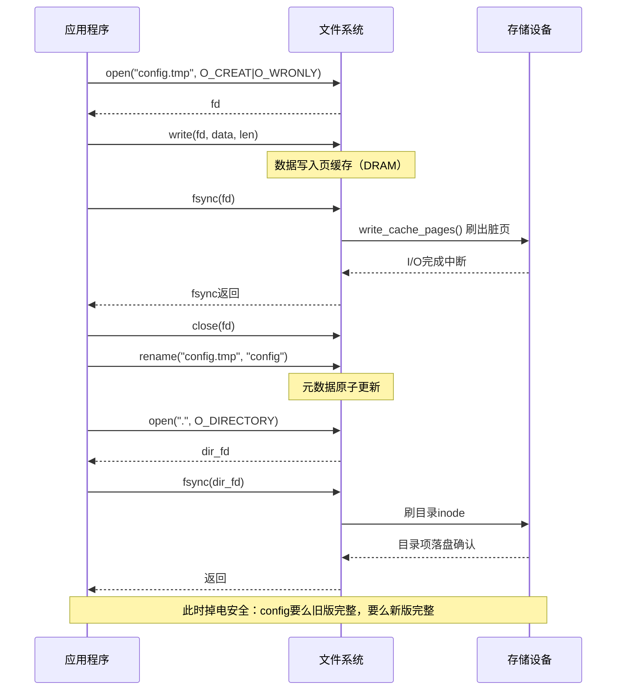

## 12.2.3 fsync、sync与掉电保护

> fsync()是嵌入式工程师的救命稻草——当你写入关键配置文件后，不加fsync就祈祷吧。sync()更不靠谱，它只是发起回写请求，不等待完成。

---

### 知识点176 fsync()完整调用链与三种sync操作辨析 [E][M]

#### 1. fsync()调用链全景

当用户空间调用`fsync(fd)`时，数据从用户态缓冲区出发，经过层层递进的内核调用链，最终抵达物理存储介质。完整的调用路径如下：

```
fsync(fd)                     // 用户空间系统调用
  └→ vfs_fsync()              // VFS层统一入口
       └→ ext4_fsync()        // 具体文件系统的fsync实现（以ext4为例）
            ├→ sync_inode()   // 同步inode元数据
            │    └→ write_inode_now()
            │         └→ ext4_write_inode()
            └→ filemap_write_and_wait_range()  // 同步文件数据页
                 └→ write_cache_pages()         // 遍历脏页，逐页下发write_bio
                      └→ submit_bio()           // 构造并提交I/O请求到块层
                           └→ 块层 → SCSI/NVMe驱动 → 硬件控制器 → NAND/磁盘
```

**关键代码路径**（内核5.x版本）：

```c
// fs/sync.c - VFS入口
int vfs_fsync(struct file *file, int datasync)
{
    struct inode *inode = file->f_mapping->host;
    return inode->i_sb->s_op->fsync(inode, datasync);  // 分发到具体FS
}

// fs/ext4/fsync.c - ext4实现
int ext4_fsync(struct file *file, int datasync)
{
    struct inode *inode = file->f_mapping->host;
    // 1. 强制回写数据页
    ret = filemap_write_and_wait_range(inode->i_mapping,
                                        start, end);
    // 2. 回写inode元数据（修改时间、大小等）
    if (!datasync)  // 只有完整fsync才刷元数据
        ret = sync_inode_metadata(inode, 1);
    // 3. 等待journal提交（ext4有journal时）
    if (ext4_should_journal_data(inode))
        ext4_force_commit(inode->i_sb);
    return ret;
}
```

#### 2. 为什么fsync()只回写指定文件

`fsync()`的核心语义是**文件级精准打击**。它只刷回与传入`fd`相关联的`address_space`（页缓存对象）中的脏页，而不会波及系统中其他文件的脏数据。这种设计基于以下考量：

- **I/O效率**：全局回写会制造大量不必要的磁盘I/O，严重影响系统性能；
- **语义精确性**：调用者通常只关心自己刚写入的数据，而非整个系统的脏页；
- **延迟控制**：单文件回写可以在毫秒级完成，而全系统回写可能需要数秒。

内核通过`file->f_mapping`指针精确定位到该文件的页缓存结构，再调用`write_cache_pages()`仅遍历该`address_space`下的脏页链表（`i_pages`中的标记为`PG_dirty`的页），实现靶向回写。

#### 3. sync()与syncfs()的本质区别

| 特性 | fsync(fd) | sync() | syncfs(fd) |
|:---:|:---:|:---:|:---:|
| 作用范围 | 单个指定文件 | 全局所有文件系统 | 单个文件系统（fd所在FS） |
| 等待完成 | 是，阻塞到数据落盘 | 否，仅发起请求 | 是，阻塞到落盘 |
| 元数据刷回 | 是（默认）/可选datasync | 是 | 是 |
| 调用语义 | 精准、同步、可靠 | 粗粒度、异步、不可靠 | 中等粒度、同步 |
| 性能开销 | 低（仅一个文件） | 极高（全系统） | 中（整个FS） |
| 典型用途 | 关键配置保存 | 关机前/定时同步 | 容器/多FS环境 |

#### 4. 为什么sync()不能保证所有数据落盘

这是嵌入式设备掉电数据丢失的**头号陷阱**。`sync()`的实现内核代码如下：

```c
// fs/sync.c
SYSCALL_DEFINE0(sync)
{
    wakeup_flusher_threads(0, WB_REASON_SYNC);  // 唤醒回写线程
    iterate_supers(sync_inodes_one_sb, NULL);    // 遍历superblock标记inode
    return 0;  // 立即返回！不等待任何I/O完成！
}
```

`sync()`的致命缺陷在于它的**异步语义**：它只是唤醒`flusher`内核线程、将系统中的脏页标记为需要回写，然后**立即返回用户态**。真正的磁盘I/O还在后台排队或传输中，此时如果发生掉电，数据必然丢失。

此外，`sync()`还存在以下隐性风险：
- **元数据滞后**：即使数据块已写入，inode中的文件长度、修改时间等元数据可能仍在journal中未提交；
- **硬件缓存**：磁盘控制器或SSD的DRAM缓存可能尚未将数据刷入非易失性存储；
- **并行写入干扰**：`sync()`执行期间，其他进程产生的新脏页不会被此次调用覆盖。

#### 5. fsync vs sync vs syncfs 调用关系图

```mermaid
graph TD
    A[用户空间] -->|fsync(fd)| B[VFS层]
    A -->|sync()| C[全局回写]
    A -->|syncfs(fd)| D[单FS回写]

    B -->|vfs_fsync| E[ext4/xfs/btrfs_fsync]
    E --> F[filemap_write_and_wait_range]
    F --> G[write_cache_pages]
    G --> H[submit_bio]
    H --> I[块层 → 驱动 → 硬件]
    F -.->|等待I/O完成| I

    C --> J[wakeup_flusher_threads]
    J --> K[异步回写所有脏页]
    K -.->|不等待| L[立即返回用户态]

    D --> M[遍历指定superblock]
    M --> N[sync_inodes_sb]
    N --> O[等待该FS所有I/O完成]

    style B fill:#4a90d9,fill-opacity:0.2
    style C fill:#e74c3c,fill-opacity:0.2
    style D fill:#2ecc71,fill-opacity:0.2
```

---

### 知识点177 掉电保护实战：双写+fsync+rename [E]

#### 1. 嵌入式掉电保护第一步：关键写操作后加fsync()

在工业控制、车载电子、IoT网关等场景下，配置参数、校准数据、运行日志的持久化是生死线。最基础的防护就是在关键写入后立即调用`fsync()`：

```c
int safe_write_v1(int fd, const void *buf, size_t len)
{
    if (write(fd, buf, len) != len)
        return -1;
    if (fsync(fd) < 0)   // 强制数据落盘
        return -1;
    return 0;
}
```

但仅有`fsync()`还不够——如果在写入过程中掉电，文件可能处于**半写状态**（部分新数据、部分旧数据，甚至全0填充），这就是**数据截断风险**。

#### 2. 双写策略：临时文件 → fsync → rename

业界标准的原子写文件方案是**双写+原子替换**：

```c
int safe_write_file(const char *path, const void *buf, size_t len)
{
    char tmp_path[256];
    int fd;

    snprintf(tmp_path, sizeof(tmp_path), "%s.tmp.%d", path, getpid());

    /* 1. 写临时文件 */
    fd = open(tmp_path, O_WRONLY | O_CREAT | O_TRUNC, 0644);
    if (fd < 0) return -1;

    if (write(fd, buf, len) != len) {
        close(fd); unlink(tmp_path); return -1;
    }

    /* 2. fsync确保数据真正落盘 */
    if (fsync(fd) < 0) {
        close(fd); unlink(tmp_path); return -1;
    }
    close(fd);

    /* 3. 原子rename替换目标文件 */
    if (rename(tmp_path, path) < 0) {
        unlink(tmp_path); return -1;
    }

    /* 4. fsync目录确保rename元数据落盘 */
    int dir_fd = open(dirname(path), O_RDONLY | O_DIRECTORY);
    if (dir_fd >= 0) {
        fsync(dir_fd);  // 确保目录项持久化
        close(dir_fd);
    }
    return 0;
}
```

#### 3. 为什么rename是原子的

`rename()`在Linux内核中由VFS层保证**元数据层面的原子性**。其内核实现（以ext4为例）将`rename`操作封装为一个完整的journal事务：要么旧目录项删除+新目录项创建+inode链接数更新全部完成，要么全部回滚。从用户视角看，任何时刻文件`path`要么指向旧内容，要么指向新内容，**不存在中间态**。

这是双写策略的安全基石：即使`rename()`执行瞬间掉电，journal重放后文件系统仍然保持一致——`path`要么还是旧文件，要么已经是完整的新文件。

#### 4. 配置文件双副本策略

对于极高可靠性场景（如飞行器黑匣子参数、医疗设备校准值），采用**双副本+校验和**策略：

```c
#define CFG_PATH_A  "/etc/device.cfg.a"
#define CFG_PATH_B  "/etc/device.cfg.b"

int double_write_config(const config_t *cfg)
{
    uint32_t crc = crc32(cfg, sizeof(*cfg));
    config_with_crc_t buf = { .cfg = *cfg, .crc = crc };

    /* 交替写入两个副本，确保至少一个完整 */
    static int toggle = 0;
    const char *path = toggle ? CFG_PATH_A : CFG_PATH_B;
    toggle ^= 1;

    return safe_write_file(path, &buf, sizeof(buf));
}
```

#### 5. 实际案例：设备掉电后数据丢失排查

某工业PLC设备现场频繁出现重启后配置归零。排查日志发现：

1. 配置更新流程：`open()` → `write()` → `close()`，**无fsync**；
2. 掉电时间点分析：通过RTC时钟和日志时间戳交叉比对，掉电发生在`write()`后30~200ms内；
3. 脏页状态：`/proc/meminfo`中`Dirty`字段在测试环境下平均滞留时间约5秒；
4. 根因定位：数据仍在页缓存中未回写，掉电后新配置丢失，重启读取到旧版本；
5. 修复方案：引入`safe_write_file()`双写策略，加电自检时加载CRC校验通过的副本。

修复后现场运行18个月，零配置丢失事件。

#### 6. 安全写文件流程



#### 7. 不同写策略安全性对比

| 策略 | 掉电时风险 | 数据完整性 | 实现复杂度 | 适用场景 |
|:---|:---|:---:|:---:|:---|
| 直接write+close | 大概率丢失最后写入 | 无保障 | 极低 | 临时缓存、非关键日志 |
| write+fsync | 可能截断（半写文件） | 中 | 低 | 单文件追加写 |
| **双写+fsync+rename** | **无截断，旧版或新版完整** | **高** | **中** | **配置文件、关键数据** |
| 双副本+CRC校验 | 可自动恢复损坏副本 | 极高 | 高 | 航空、医疗、金融 |
| 裸分区直接I/O | 绕过页缓存，自行管理 | 可控 | 极高 | 数据库、实时系统 |

---

### 本节速查表

| 函数 | 安全写关键数据？ | 等待落盘？ | 原子性？ | 推荐场景 |
|:---:|:---:|:---:|:---:|:---|
| `write()` | 否 | 否 | 否 | 普通缓冲写 |
| `write()+fsync()` | 中 | 是 | 否 | 追加日志 |
| `sync()` | 否 | 否 | 否 | 关机前辅助调用 |
| **双写+fsync+rename** | **是** | **是** | **是** | **配置文件、关键数据持久化** |

**核心口诀**：关键数据走双写，临时文件先fsync，rename原子做替换，目录再刷一道保险。
